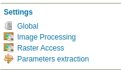

.. _params_extractor_install:

Installing the Parameter Extractor extension
============================================

The Parameter Extractor extension is listed among the other extension downloads on the GeoServer download page.

The installation process is similar to other GeoServer extensions:

#. Login, and navigate to :menuselection:`About & Status > About GeoServer` and check **Build Information**
   to determine the exact version of GeoServer you are running.

#. Visit the :website:`website download <download>` page, change the **Archive** tab,
   and locate your release.
   
   From the list of **Miscellaneous** extensions download **Request parameters extractor**.

   * |release| example: :download_extension:`params-extractor`
   * |version| example: :nightly_extension:`params-extractor`

   Verify that the version number in the filename corresponds to the version of GeoServer you are running (for example |release| above).

#. Extract the contents of the archive into the :file:`WEB-INF/lib` directory in GeoServer.
   Make sure you do not create any sub-directories during the extraction process.

#. Restart GeoServer.

If installation was successful, you will see a new Params-Extractor entry in the left menu, under "Settings". 

   The Parameter Extractor menu entry

