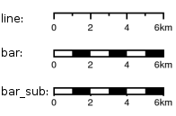

Configuration
*************

The server side uses a `YAML <http://www.yaml.org/>`_ configuration file that defines the page layouts and allowed values. This file is usually called config.yaml.

Here is the general structure:

.. code-block:: yaml

  dpis:
    - 254
    - 190
    {...}

  ?maxSvgWidth: 2048 # set the maximum dimensions to 2048 points, this is useful when using MapServer and a maximum dimension is there
  ?maxSvgHeight: 2048
  ?integerSvg: false # the library in MapServer <= 5.6 does not support floating point values in the SVG coordinate space, set this to true if using a WMS that does not support floating point values in SVG coordinates

  ?ignoreCapabilities: false # assume client is correct and do not load capabilities.  This is not recommended to be used unless you it fails when false (false is default)
  ?maxPrintTimeBeforeWarningInSeconds: 30 # if print jobs take longer than this then a warning in the logs will be written along with the spec.
  ?printTimeoutMinutes: 5 # The maximum time to allow a print job to take before cancelling the print job.  The default is 5 (minutes)
  ?formats:
    - pdf
    - png
    {...}

  scales:
    - 25000
    - 50000
    {...}

  hosts:
    - {HOST_WHITELIST_DEFINITION}
    {...}

  ?localHostForward: # For request on map.example.com we build an http request on localhost with the header Host=map.example.com, this is to don't pass throw the proxy.
  ?  from:
  ?    - map.example.com
  ?  https2http: True # For above hosts on request on https we build a request on http

  ?headers: ['Cookie', 'Referer'] # The header that will be copyed to the tiles http requests

  ?keys:
  ?  - !key
  ?    host: !dnsMatch
  ?      host: maps.google.com
  ?      port: 80
  ?    domain: !dnsMatch
  ?      host: localhost
  ?    key: 1234456
  ?    id: gmd-xyz

  ?fonts:
  ? - {PATH}

  ?globalParallelFetches: 5
  ?perHostParallelFetches: 5
  ?tilecacheMerging: false
  ?connectionTimeout: 30000           MF_V1.2
  ?socketTimeout: 180000              MF_V1.2
  ?outputFilename: Mapfish-print      MF_V1.2
  ?disableScaleLocking: false
  ?brokenUrlPlaceholder: default      MF_V2.0
  ?proxyBaseUrl: http://mapfishprint.org  MF_V2.0
  ?tmsDefaultOriginX: 0.0f   MF_V2.0
  ?tmsDefaultOriginY: 0.0f   MF_V2.0

  ?security:
  ?  - !basicAuth
  ?      matcher: !dnsMatch
  ?        host: www.camptocamp.com
  ?        post: 443
  ?      username: xyz
  ?      password: zyx
  ?      preemptive: true
  ?  - !basicAuth
  ?    username: abc
  ?    password: bca

  layouts:
     {LAYOUT_NAME}:
  ?   : Mapfish-print.pdf  MF_V1.2
  ?   metaData:
  ?     {METADATA_DEFINITION}
  ?   titlePage:
  ?     {PAGE_DEFINITION}
      mainPage:
  ?     rotation: false
        {PAGE_DEFINITION}
  ?   lastPage:
  ?     {PAGE_DEFINITION}
    {...}

Optional parts are shown with a question mark in the left margin. The question marks must not be put in the configuration file. Their default values is shown.

Note: Sets of values like DPI can be entered in one of two forms:

.. code-block:: yaml

  dpi: [1,2,3,...]

or

.. code-block:: yaml

  dpis:
    - 254
    - 190

A chosen DPI value from the above configuration is used in WMS GetMap requests as an added format_options (GeoServer) or map_resolution (MapServer) parameter. This is used for symbol/label-rescaling suitable for high resolution printouts, see :ref:`GeoServer format_options specification <wms_vendor_parameters>` (GeoServer 2.1) and `MapServer defresolution keyword <http://mapserver.org/development/rfc/ms-rfc-55.html>`_ (MapServer 5.6) for more information.

In general, PDF dimensions and positions are specified in points. 72 points == 1 inch == 25.4 mm.

The list of ``{HOST_WHITELIST_DEFINITION}`` defines the allowed URLs for getting maps. Its format will be defined in `the next sub-section <configuration.html#host-whitelist-definition>`_.

The formats element lists the values formats that the server permits.  If omitted only 'pdf' is permitted.  If the single element '*' (quotes are required) is present then all formats that the server can produce can be requested.  The formats the server can produce depends to a large degree on how the Java is configured.  PDF is supported on all systems but for image output formats JAI and ImageIO is used which means both must be on the server for them to be available.  You can get the list of supported formats by running the standalone client with the --clientConfig flag enabled (you will need to supply a yaml config file as well).  If you are using the servlet then do a get info request to see the list of formats (with the '*' as the outputFormats parameter in the config file).

You can have as many layouts as you want. Their name must be unique and will be used on the client side. A layout can have a ``titlePage`` that will be added at the beginning of the generated document. It cannot contain any map. Same for the ``lastPage``, but for the end of the document. The ``mainPage`` section is mandatory and will be used once for each page requested. The details of a ``{PAGE_DEFINITION}`` section can be found `in another sub-section of this document <configuration.html#page-definition>`_.

If you want to let the user rotate the map (for a given layout), you have to set the ``rotate`` field to ``true`` in the corresponding ``mainPage`` section.

``globalParallelFetches`` and ``perHostParallelFetches`` are used to tune the parallel loading of the map tiles/images. If you want to disable the parallel loading, set ``globalParallelFetches`` to 1.

New versions of tilecache added the support for merging multiple layers in a single WMS request. If you want to use this functionality, set the ``tilecacheMerging`` attribute to true.

``connectionTimeout`` and ``socketTimeout`` (only since MapFish v1.2) can be used to tune the timeouts for reading tiles from map servers.

If the ``outputFilename`` parameter is defined in the main body then that name will be used by the MapPrintServlet when sending the pdf to the client.  It will be the name of the file that the client downloads.  If the 'outputFilename' parameter is defined in a layout then that value will override the default name.  In both cases the .pdf is optional; if not present the server will append .pdf to the name.  In all cases the json request can override the filename defined in the configuration file by posting a 'outputFilename' attribute in the posted JSON. If the outputFilename has ${date}, ${time} or ${dateTime} in it, it will be replaced with the current date using the related DateFormat.get*Instance().format() method.  If a pattern is provided it will be passed to SimpleDataFormat for processing.  A few examples follow:

* outputFilename: ``host-${yyyyMMdd}.pdf``   # results in host-20111213.pdf
* outputFilename: ``host-${date}``           # results in host-Dec_13_2011.pdf (actual output depends on locale of server)
* outputFilename: ``host-${dateTime}``       # results in host-Dec_13_2011_1:10:50_PM.pdf (actual output depends on locale of server)
* outputFilename: ``host-${time}.pdf``       # results in host-1:11:14_PM.pdf (actual output depends on locale of server)
* outputFilename: ``host-${yyMMdd-hhmmss}``  # results in host-111213-011154.pdf (actual output depends on locale of server)

``disableScaleLocking`` allows you to bypass the choosing of scale from the available factors, and simply use the suggested value produced inside MapBlock.java.

``brokenUrlPlaceholder`` the placeholder image to use in the case of a broken url.  By default, when a url request fails, an error is thrown and the pdf process terminates.  However if this parameter is set then instead a placeholder image is returned.
Non-null values are:

* ``default`` - use the system default image.
* ``throw`` - throw an exception.
* <url> - obtain the image from the supplied url.  If this url is broken then an exception will be thrown.  This can be anytype of valid url from a file url to https url.

``proxyBaseUrl`` the optional url of the proxy between mapfish-print and the internet.  This is the url base that will be in the info.json response.  On occasion the url or port of the web server containing mapfish-print is not the server that is public to the internet and the requests are proxied to the mapfish-print webserver.  In this case it is important for the info.json request to return the public URL instead of the url of the webserver.

``tmsDefaultOriginX`` By default this is null.  If non-null then TmsMapReader will use this as the origin x value if null then the origin will be derived from the maxExtent parameter.

``tmsDefaultOriginY`` By default this is null.  If non-null then TmsMapReader will use this as the origin y value if null then the origin will be derived from the maxExtent parameter.

Security
--------
Both Keys and Security are options for accessing protected services.  Keys are currently for Google maps premium accounts and Security is for other types and is more general  Currently only BasicAuth is supported but other strategies can easily be added

.. code-block:: yaml

    security:
        - !basicAuth
            matcher: !dnsMatch
              host: www.camptocamp.com
              post: 443
            username: xyz
            password: zyx
            preemptive: true
        - !basicAuth
          username: abc
          password: cba

The above example has 2 security configuration.  Each option is tested (in order) to see if it can be used for the given URI and if it applies it is used to configure requests for the URI.  In the above example the first configuration will be used if the URI matches the hostmatcher provided if not then the second configuration will be applied.  The last configuration has no host matcher so it is applied to all URIs.

A basicAuth security configuration consists of 4 options

* matcher - a host matcher for determining which requests need the security to be applied
* username - username for basicauth
* password - password for basicauth
* preemptive - optional, but for cases where the credentials need to be sent without the challenge

Keys
----
Google maps currently requires a private key to be used (we only support users Google maps premium accounts).

The keys section allows a key to be mapped to hosts.  The hosts are identified with host matchers that are described in the <configuration.html#host-whitelist-definition> sub-section.

In addition a domain hostmatcher can be used to select a key based on the domain of the local server.  This can be useful if the same configuration is used in a test environment and a production environment with differing domains.  For example mapfish.org and mapfish.net.

Finally google maps (for example) requires a client id as well that is associated with the private key.  There for in the case of google premium services a legal key would be:

.. code-block:: yaml

  keys:
    - !key
      key: yxcvyxvcyxvyx
      id: gme-xxxcs

Thanks to the hosts and domain matcher it is possible to have a key for google maps and (for future proofing) a different key for a different service.

Fonts definition
-----------------

The ``fonts`` section is optional. It contains the path of the fonts you want to use. The entries can point to files (TTF, OTF, TTC, AFM, PFM) or directories. Don't point to directories containing too many files since it will slow down the start time. By default, PDF gives you access to the following fonts (Cp1252 encoding only):

* Courrier (-Bold, -Oblique, -BoldOblique)
* Helvetica (-Bold, -Oblique, -BoldOblique)
* Times (-Roman, -Bold, -Oblique, -BoldOblique)
* Symbol
* ZapfDingbats

Host whitelist definition
-------------------------

In this section, you can put as many entries as you want, even for the same type of filter. If at least one matches, the Map server can be used.

This section is not for defining which client can request maps. It is just here to avoid having the print module used as a proxy to access documents from computers behind firewalls.

There are 3 ways to whitelist a host.

Allowing every local services:
~~~~~~~~~~~~~~~~~~~~~~~~~~~~~~

.. code-block:: yaml

    - !localMatch
      dummy: true

The ``dummy`` parameter is ignored, but mandatory to avoid a limitation in the YAML format.

Allowing by DNS name:
~~~~~~~~~~~~~~~~~~~~~

.. code-block:: yaml

    - !dnsMatch
      host: labs.metacarta.com

Allowing by IP address:
~~~~~~~~~~~~~~~~~~~~~~~

.. code-block:: yaml

      - !ipMatch
        ip: www.camptocamp.org
    ?   mask: 255.255.255.255

The ``ip`` parameter can be a DNS name that will be resolved or directly an IP address.

All the methods accept the following optional parameters:

* port: to limit to a certain TCP port
* pathRegexp: a regexp that must match the path part of the URL (before the '?').

Metadata definition
-------------------

Allow to add some metadata to the generated PDF. They are visible in acroread in the File->Properties menu.

The structure is like that:

.. code-block:: yaml

        metaData:
    ?     title: ''
    ?     author: ''
    ?     subject: ''
    ?     keywords: ''
    ?     creator: ''
    ?     supportLegacyReader: false

All fields are optional and can use global variables, as defined in the `Block definition <configuration.html#block-definition>`_ chapter. Page specific variables are not accessible.

Page definition
---------------

The structure is like that:

.. code-block:: yaml

          pageSize: A4
    ?     landscape: false
    ?     marginLeft: 40
    ?     marginRight: 40
    ?     marginTop: 20
    ?     marginBottom: 20
    ?     backgroundPdf: template.pdf
    ?     condition: null
    ?     header:
            height: 50
            items:
              - {BLOCK_DEFINITION}
              {...}
          items:
            - {BLOCK_DEFINITION}
            {...}
    ?     footer:
            height: 50
            items:
              - {BLOCK_DEFINITION}
              {...}

With the ``condition`` we can completely hide a page, same behavior than in block.

If ``backgroundPdf`` is specified, the first page of the given PDF file will be added as background of every page.

The ``header`` and ``footer`` sections are optional. If the ``items`` that are in the main section are too big, more pages are generated. The header and footer will be drawn on those pages as well.

Here is a short list of supported **pageSizes**:

+--------+-------+--------+
+ name   + width + height +
+========+=======+========+
+ LETTER + 612   + 792    +
+--------+-------+--------+
+ LEGAL  + 612   + 1008   +
+--------+-------+--------+
+ A4     + 595   + 842    +
+--------+-------+--------+
+ A3     + 842   + 1191   +
+--------+-------+--------+

The complete list can be found in http://api.itextpdf.com/itext/com/itextpdf/text/PageSize.html. If you want to use a custom page size, you can set **pageSize** to the width and the height separated by a space.

Block definition
----------------

The next sub-sections document the possible types of blocks.

In general, text values or URLs can contain values taken from the **spec** structure coming with the client's request. A syntax similar to shell is used: ${variableName}. If the current page is a **titlePage**, only the root values are taken. If it's a **mainPage**, the service will first look in the current **page** section then in the root values. Here is how to use this functionality::

    text: 'The value of mapTitle is: ${mapTitle}'

Some virtual variables can be used:

* ${pageNum}: The current page number.
* ${pageTot}: The total number of pages. Can be used only in text blocks.
* ${now}: The current date and time as defined by the machine's locale.
* ${now FORMAT}: The current date and time as defined by the FORMAT string. The syntax is here: http://java.sun.com/j2se/1.5.0/docs/api/java/text/SimpleDateFormat.html.
* ${configDir}: The absolute path to the directory of the configuration file.
* ${format PRINTF VAR}: Format the value of VAR using the provided `PRINTF format <http://java.sun.com/j2se/1.5.0/docs/api/java/util/Formatter.html#syntax>`_ (for example: %,d).

All the blocks can have a condition attribute that takes a spec attribute name. If the attribute name exists and is not equal to ``false`` or ``0``, the block is drawn. Otherwise, it is ignored. An exclamation mark may precede the condition to invert it, exclamation mark is part of yaml syntax, than the expression should be in quotes.

Example: show text block only if in the spec the attribute name ``showText`` is given, is not equal to ``false`` and not equal to ``0``:

.. code-block:: yaml

        - !text
          text: 'mytext'
          condition: showText

Text block
----------

.. code-block:: yaml

          - !text
  ?         font: Helvetica
  ?         fontSize: 12
  ?         fontEncoding: Cp1252
  ?         fontColor: black
  ?         spacingAfter: 0
  ?         align: left
  ?         vertAlign: middle
  ?         backgroundColor: #FFFFFF
            text: 'Blahblah'

Typical ``fontEncoding`` values are:

* Cp1250
* Cp1252
* Cp1257
* Identity-H (horizontal UTF-8)
* Identity-V (vertical UTF-8)
* MacRoman

The ``font`` must refer to a standard PDF font or a `declared font <configuration.html#fonts-definition>`_.

Image block
-----------

.. code-block:: yaml

          - !image
            maxWidth: 200
            maxHeight: 100
  ?         spacingAfter: 0
  ?         align: left
  ?         vertAlign: middle
            url: http://trac.mapfish.org/trac/mapfish/chrome/site/img/mapfish.png

Supported formats are PNG, GIF, Jpeg, Jpeg2000, BMP, WMF (vector), SVG and TIFF.

The original aspect ratio will be respected. The url can contain ``${}`` variables.

Columns block
-------------
.. code-block:: yaml

          - !columns
  ?         config: {TABLE_CONFIG}
  ?         widths: [25,25,25,25]
  ?         backgroundColor: #FFFFFF
  ?         absoluteX: null
  ?         absoluteY: null
  ?         width: {PAGE_WIDTH}
  ?         spacingAfter: 0
  ?         nbColumns: -1
            items:
              - {BLOCK_DEFINITION}
              {...}

Can be called **!table** as well.

By default, the width of the columns will be equal.

Each item will be in its own column.

If the **absoluteX**, **absoluteY** and **width** are given, the columns block will be floating on top of the page at the specified position.

The **widths** attribute can be used to change the width of the columns (by default, they have the same width). It must contain one integer for each column. The width of a given column is `tableWidth*columnWeight/sum(columnWeight)`.

Every block type is allowed except for **map** if the column has an absolute position.

Look at
<http://trac.mapfish.org/trac/mapfish/wiki/PrintModuleServer#Tableconfiguration
to know how to specify the **config** field.

Map block
---------

Allowed only within a **mainPage**.

.. code-block:: yaml

          - !map
            width: {WIDTH}
            height: {HEIGHT}
  ?         name: map
  ?         spacingAfter: 0
  ?         align: left
  ?         vertAlign: middle
  ?         absoluteX: null
  ?         absoluteY: null
  ?         overviewMap: null
  ?         backgroundColor: #FFFFFF

**width** and **height** are mandatory. You can use variable substitution in this part, but if you do so, the browser won't receive the map size when it calls **info.json**. You'll have to **override mapfish.widgets.print.Base.configReceived** and set the map width and height of your layouts.

If the **absoluteX** and **absoluteY** are given, the map block will be floating on top of the page at the specified position.

The **name** is what will be displayed in the Acrobat's reader layer panel. The map layers will be displayed bellow it.

If **overviewMap** is specified, the map will be an overview of the extent augmented by the given factor. There are few cases to consider with map overviews:

1. If there is no overview overrides and no OL.Control.MapOverview, then all the layers will figure in the PDF map overview.
2. If there are overview overrides, the OL map overview control is ignored.
3. If there are no overview overrides and there is an OL.Control.MapOverview (takes the first one), then the layers defined in the control are taken into account. By default it is the current base layer.

Scalebar block
--------------

Display a scalebar.

Allowed only within a **mainPage**.

.. code-block:: yaml

          - !scalebar
            maxSize: 150
  ?         type: line
  ?         intervals: 3
  ?         subIntervals: false
  ?         units: m
  ?         barSize: 5
  ?         lineWidth: 1
  ?         barDirection: up
  ?         textDirection: up
  ?         labelDistance: 3
  ?         font: Helvetica
  ?         fontSize: 12
  ?         fontColor: black
  ?         color: #000000
  ?         barBgColor: null
  ?         spacingAfter: 0
  ?         align: left
  ?         vertAlign: middle
  ?         backgroundColor: #FFFFFF
  ?         lockUnits: true

The scalebar, will adapt its width up to `maxSize` (includes the labels) in order to have a multiple of 1, 2 or 5 values at each graduation. For example:

* 0, 1, 2, ...
* 0, 2, 4, ...
* 0, 5, 10, ...
* 0, 10, 20, ...

The `barSize` is the thickness of the bar or the height of the tick marks on the line. The `lineWith` is for the thickness of the lines (or bar border).

Units can be any of:

* m (mm, cm, m or km)
* ft (in, ft, yd, mi)
* degrees (min, sec, °)

If the value is too big or too small, the module will switch to one of the unit in parenthesis (the same unit is used for every intervals).  If this behaviour is not desired, the lockUnits parameter will force the declared unit (or map unit if no unit is declared) to be used for the scalebar.

The number of `intervals` can be set to anything >=2. Labels are drawn only at main intervals. If there is no space to display a label at a certain interval, this label won't be displayed. If `subIntervals` are enabled, their number will depend on the length of an interval.

The type can be:

* line: A simple line with graduations
* bar: A thick bar with a suite of color and barBgColor blocks.
* bar_sub: Like bar, but with little lines for labels.

The bar and/or text orientation can be set to ``up``, ``down``, ``left`` or ``right``.

The `align` attribute is for placing the whole scalebar withing the surrounding column or page. The `vertAlign` attribute is used only when placed in a column.

Labels are always centered on the graduation, at a distance specified by labelDistance.

Attributes block
----------------

Allows to display a table of the displayed feature's attributes.

Allowed only within a *mainPage*.

.. code-block:: yaml

          - !attributes
            source: results
  ?         tableConfig: {TABLE_CONFIG}
            columnDefs:
              {COLUMN_NAME}:
  ?             columnWeight: 0        MF_V1.2
                header: {BLOCK_DEFINITION}
                cell: {BLOCK_DEFINITION}
              {...}

Look `here <configuration.html#table-configuration>`_ for how to specify the *tableConfig* field.

The *columnWeigth* (MF_V1.2 only) allows to define a weight for the column width. If you specify it for one column, you have to specify it for all of them. The width of a given column is tableWidth*columnWeight/sum(columnWeight).

The **source** value defines the name of the entry in the root of the client's **spec**. For example, it would look like that:

.. code-block:: yaml

    {
      ...
      pages: [
        {
          ...
          results: {
            data: [
              {id:1, name: 'blah', icon: 'icon_pan'},
              ...
            ],
            columns: ['id', 'name', 'icon']
          }
        }
      ]
      ...
    }

With this spec you would have to define 3 columnDefs with the names **id**, **name** and **icon**. Each cell definition blocks have access to all the values of the current row.

The spec part is filled automatically by the 2 MapFish widgets when their `grids <http://www.mapfish.org/apidoc/trunk/files/mapfish/widgets/print/Base-js.html#mapfish.widgets.print.Base.grids>`_ parameter is set.

Here is a crazy example of columnDef that will show the name of the icon and it's bitmap side-by-side inside a single column:

.. code-block:: yaml

          columnDefs:
            icon:
              header: !text
                text: Symbol
                backgroundColor: #A0A0A0
              cell: !columns
                items:
                  - !text
                    text: '${icon}'
                  - !image
                    align: center
                    maxWidth: 15
                    maxHeight: 15
                    url: 'http://www.mapfish.org/svn/mapfish/trunk/MapFish/client/mfbase/mapfish/img/${icon}.png'

A more complex example can be found in SVN: `config.yaml <http://trac.mapfish.org/trac/mapfish/browser/trunk/MapFish/server/java/print/print-standalone/samples/config.yaml>`_ `spec.json <http://trac.mapfish.org/trac/mapfish/browser/trunk/MapFish/server/java/print/print-standalone/samples/spec.json>`_

The print widgets are able to fill the spec for you based on a dictionary of **Ext.grid.GridPanel**. Just pass them through the grids parameter.

Legends block
-------------

Display each layers along with its classes (icons and labels).

.. code-block:: yaml

          - !legends
  ?         backgroundColor: #FFFFFF
  ?         borders: false
  ?         horizontalAlignment: center
  ?         maxWidth: 0
  ?         maxHeight: 0
  ?         iconMaxWidth: 0
  ?         iconMaxHeight: 8
  ?         iconPadding: 8 7 6 5
  ?         textMaxWidth: 8
  ?         textMaxHeight: 8
  ?         textPadding: 8 7 6 5
  ?         defaultScale: 1.0
  ?         inline: true
  ?         classIndentation: 20
  ?         layerSpaceBefore: 5
  ?         layerSpace: 5
  ?         classSpace: 2
  ?         layerFont: Helvetica
  ?         layerFontSize: 10
  ?         classFont: Helvetica
  ?         classFontSize: 8
  ?         fontEncoding: Cp1252
  ?         columnMargin: 3

**borders** is mainly for debugging purpouses and shows all borders in the legend tables. This can be either 'true' or 'false'.

**horizontalAlignment** can be left, right or center (default) and aligns all items left, right or in the center.

**iconMaxWidth**, **iconMaxHeight**, **defaultScale** with value of 0 indicate that the value will be ignored, i.e. the values are automatically set to the equivalent of Infinity, Infinity and 1 respectively. If the legends URL passed to MapFish (see http://mapfish.org/doc/print/protocol.html#print-pdf) are obtained from a WMS GetLegendGraphic request, the width/height are only indicative (even more when a label text is included with :ref:`LEGEND_OPTIONS/forceLabels parameter <get_legend_graphic_options>`) and it would be safer, in order to preserve scale coherence between legends and map, to set **iconMaxWidth** and **iconMaxHeight** to zero.

**textMaxWidth/Height** and **iconMaxWidth/Height** define how wide/high the text/icon cells of a legend item can be. At this point textMaxHeight is ignored.

**textPadding** and **iconPadding** can be used like standard CSS padding. In the above example 8 is the padding top, 7 padding right, 6 padding bottom and 5 padding left.

if **inline** is true icons and text are rendered on the same line, BUT multicolumn is still enabled.

if **maxWidth** is set the whole legend gets a maximum width, just like other blocks. Note that **maxWidth** does not have any impact on icons size, thus icons may overflow outside the legends block.

if **maxHeight** is set the whole legend gets a maximum height. This forces more than one column to appear if the legend is higher than the specified value. This can be used to enable the multi-column layout. 0 makes the maxHeight= max value, i.e. the equivalent of infinity.

if **defaultScale** is non null it means that the legend image will be scaled so it doesn't take the full space. This can be overriden for individual classes in the spec JSON sent to the print module by adding an attribute called 'scale' and giving it a number. In conjunction with iconMaxWidth/Height this can be used to control average and also maximum width/height. If **defaultScale** equals 1, one pixel is scaled to one point (1/72 inch) in generated PDF. By default, as GeoServer legends are generated with ~90 dpi resolution (exactly 25.4/0.28), setting **defaultScale** value to 0.7937 (72*0.28/25.4) produces legend icons of same size as corresponding map icons. As the :ref:`LEGEND_OPTIONS/dpi GeoServer parameter <get_legend_graphic_options>` is not handled by MapFish, the resolution will necessary be ~91 dpi, which may cause visual quality difference with the map.

For this to work, you need to set the **layerTree** config option on MF print widgets,
more precisely the legends should be present in the print.pdf JSON request.

**layerSpaceBefore** is to specify the space before the second and consecutive layers.

**layerSpace** and **classSpace** is to specify the line space to add after layers and classes.

**columnMaxWidth** maximum width of a column in multi-column layout. Not tested (at time of writing).

**classIndentation** amount of points to indent classes by.

**layerSpaceBefore** if a layer is after another one, this defines the amount of space to have before it. This will not be applied if the layer is the first item in its column in multi-column layout.

**layerFont** font of layer name legend items.

**layerFontSize** font size of layer name.

**classFont** font of class legend items.

**classFontSize** font size of class.

**fontEncoding** (see below)

Table configuration
-------------------

The `columns block <#columns-block>`_ and the `attributes block <#attributes-block>`_ can take a table configuration object like that:

.. code-block:: yaml

      config:
  ?     borderWidth: 0
  ?     borderWidthLeft: 0
  ?     borderWidthRight: 0
  ?     borderWidthTop: 0
  ?     borderWidthBottom: 0
  ?     borderColor: black
  ?     borderColorLeft: black
  ?     borderColorRight: black
  ?     borderColorTop: black
  ?     borderColorBottom: black
  ?     cells:
  ?       - {CELL_CONFIGURATION}

A cell configuration looks like that:

.. code-block:: yaml

  ?     row: {...}
  ?     col: {...}
  ?     borderWidth: 0
  ?     borderWidthLeft: 0
  ?     borderWidthRight: 0
  ?     borderWidthTop: 0
  ?     borderWidthBottom: 0
  ?     borderColor: black
  ?     borderColorLeft: black
  ?     borderColorRight: black
  ?     borderColorTop: black
  ?     borderColorBottom: black
  ?     padding: 0
  ?     paddingLeft: 0
  ?     paddingRight: 0
  ?     paddingTop: 0
  ?     paddingBottom: 0
  ?     backgroundColor: white
  ?     align: LEFT
  ?     vertAlign: TOP

The stuff configured at table level is for the table border, not every cell.

The **cells** list defines overrides for some cells. The cells an override is applied to is defined by the **row** and **col** attribute. Those attributes can have several formats:

* **0**: apply only to row or column 0 (the first)
* **0-10**: applies only the row or columns from 0 to 10
* or you can use any regular expression

Every matching overrides is applied in order and will override the values defined in the previous ones.

For example, if you want to draw an attribute block like that:

.. image:: images/tableConfig.png

You define that:

.. code-block:: yaml

        - !attributes
          tableConfig:
            borderWidth: 1
            cells:
              # match every cell (default cell formatting)
              - borderWidthBottom: 0.5
                borderWidthLeft: 0.5
                padding: 4
                paddingTop: 0
              # match every even cell (yellowish background)
              - row: '\d*[02468]'
                backgroundColor: #FFFFCC
              # for the header
              - row: 0
                borderWidthBottom: 1
                backgroundColor: #FA0002
                align: center
          {...}

Warranty disclaimer and license
-------------------------------

The authors provide these documents "AS-IS", without warranty of any kind
either expressed or implied.

Document under `Creative Common License Attribution-Share Alike 2.5 Generic
<http://creativecommons.org/licenses/by-sa/2.5/>`_.

Authors: MapFish developers.
