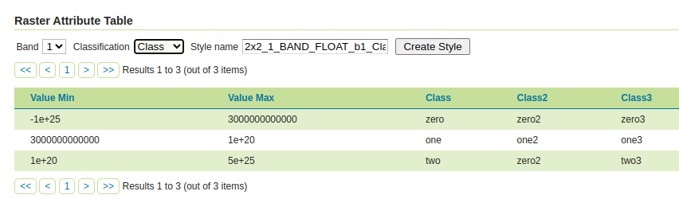

.. _rat_using:

Using the RAT Module
====================

The RAT modules adds facilities to explore a Raster Attribute Table, and generate styles 
based on a classification column of choice.

If the source raster contains a RAT, a new panel will appear in the :guilabel:`Publishing` tab of the layer.

The table allows for exploration of the attribute table, while the toolbar at the top
allows to generate styles based on the table contents:

* The :guilabel:`Band` dropdown allows to select a raster band.
* The :guilabel:`Classification` dropdown allows to select a column to use for classification.
* The :guilabel:`Style name` controls the name of the style to be generated. It's automatically filled
  with a naming convention of ``<layer>_b<band>_<classification>``, but can be customized.
* The :guilabel:`Create style` button generates the style based on the chosen classification, eventually using colors if available in the table, otherwise generating random colors. The generated style will also be included among the "alternate styles" of the layer.

The generated style will match all the values in the raster attribute table, and ensure the chosen classification column is used for both styling, legend generation, and ``GetFeatureInfo`` output.

Here is an example style:

.. code-block:: xml 
   :linenos: 

    <?xml version="1.0" encoding="UTF-8"?><sld:StyledLayerDescriptor xmlns:sld="http://www.opengis.net/sld" xmlns:gml="http://www.opengis.net/gml" xmlns:ogc="http://www.opengis.net/ogc" xmlns="http://www.opengis.net/sld" version="1.0.0">
      <sld:NamedLayer>
        <sld:Name>Class</sld:Name>
        <sld:UserStyle>
          <sld:Name>Class</sld:Name>
          <sld:FeatureTypeStyle>
            <sld:Rule>
              <sld:Name>Class</sld:Name>
              <sld:RasterSymbolizer>
                <sld:ColorMap type="intervals">
                  <sld:ColorMapEntry color="#000A64" opacity="1.0" quantity="-1.0E25" label="zero"/>
                  <sld:ColorMapEntry color="#641400" opacity="1.0" quantity="3.0E12" label="one"/>
                  <sld:ColorMapEntry color="#C81E32" opacity="1.0" quantity="1.0E20" label="two"/>
                  <sld:ColorMapEntry color="#FFFFFF" opacity="0.0" quantity="5.0E25"/>
                </sld:ColorMap>
                <sld:VendorOption name="addAttributeTable">true</sld:VendorOption>
              </sld:RasterSymbolizer>
            </sld:Rule>
          </sld:FeatureTypeStyle>
        </sld:UserStyle>
      </sld:NamedLayer>
    </sld:StyledLayerDescriptor>

This is a map generated using the style, with the GetFeatureInfo containing the classification
as an extra attribute:

.. image:: images/rat_map.png

REST API
--------

A REST API is available, to fetch the full PAM dataset attached to a raster, and to create
styles out of RAT classification fields:

* :api:`/rat <rat.yaml>`
