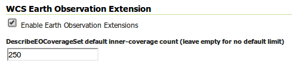

.. _wcs20_eo:

Web Coverage Service 2.0 Earth Observation extensions
=====================================================

The WCS 2.0 Earth Observation application profile (EO-WCS, OGC 10-140r1) extends the base WCS 2.0 protocol by adding temporal support and complex coverage structural description to the base WCS 2.0 protocol, in addition to requiring that a number of other extensions are supported - the base GeoServer WCS 2.0 module already supports all of those, such as subsetting and reprojection for example). The full specification can be downloaded from the `OGC web site <https://portal.opengeospatial.org/files/42722>`_.

In the WCS 2.0 EO data model we not only have coverages, but also stitched mosaics (sets of coverages making up a mosaic of images, all granules having the same time and elevation) and dataset series, groups of coverages having different times and/or other attributes (elevation, custom dimensions). A dataset series is exposed in the capabilities document (inside the extension section) and its internal structure can be retrieved calling the new DescribeEOCoverageSet call.
At the time of writing the EO extension adds support for dataset series, but does not provide direct support for stitched mosaic description.

Each grid layer exposing its inner structure will then expose a flag to enable its exposure as a dataset series. At the time of writing, the only grid readers capable of exposing their internal structure are image mosaic and netCDF.

Installing the WCS 2.0 EO extension
-----------------------------------

The steps to install the EO extension as the same as most other extensions:

  * Go to the download page and look among the extensions
  * Download the WCS 2.0 EO extension package (it's a zip file)
  * Stop GeoServer (or the web container hosting it)
  * Unpack the contents of the zip file in the geoserver/WEB-INF/lib folder
  * Restart GeoServer

Exposing dataset series
-----------------------

The first step to work with EO is to go into the WCS service panel and enable the EO extensions:

   *Enabling the WCS 2.0 EO extensions*

The second step is finding and activating the EO extensions for a suitable grid layer, which needs to be one with time dimension support and ability to describe its inner structure. At the time of writing, this means a image mosaic with time support or a netCDF data layer with time dimension.
Once the layer is located, the EO extensions for it can be enabled by ticking a checkbox in the publishing tab:

.. figure:: images/layerConfig.png
   :align: center

   *Exposing a layer as a dataset*

Once that is done the capabilities document (e.g. ``http://localhost:8080/geoserver/ows?service=WCS&version=2.0.1&request=GetCapabilities`` for WCS 2.0 will contain an indication that a coverage set is present:

.. code-block:: xml

    <wcs:Extension>
      <wcseo:DatasetSeriesSummary>
        <ows:WGS84BoundingBox>
          <ows:LowerCorner>0.2372206885127698 40.562080748421806</ows:LowerCorner>
          <ows:UpperCorner>14.592757149389236 44.55808294568743</ows:UpperCorner>
        </ows:WGS84BoundingBox>
        <wcseo:DatasetSeriesId>nurc__watertemp_dss</wcseo:DatasetSeriesId>
        <gml:TimePeriod gml:id="nurc__watertemp_dss__timeperiod">
          <gml:beginPosition>2008-10-31T00:00:00.000Z</gml:beginPosition>
          <gml:endPosition>2008-11-01T00:00:00.000Z</gml:endPosition>
       </gml:TimePeriod>
      </wcseo:DatasetSeriesSummary>
    </wcs:Extension>

And issuing a DescribeEOCoverageSet (e.g. ``http://localhost:8080/geoserver/ows?service=WCS&version=2.0.1&request=DescribeEOCoverageSet&eoId=nurc__watertemp_dss``) on it will return the following:

.. code-block:: xml

    <?xml version="1.0" encoding="UTF-8"?>
    <wcseo:EOCoverageSetDescription xmlns:eop="http://www.opengis.net/eop/2.0" xmlns:gml="http://www.opengis.net/gml/3.2" xmlns:wcsgs="http://www.geoserver.org/wcsgs/2.0" xmlns:gmlcov="http://www.opengis.net/gmlcov/1.0" xmlns:om="http://www.opengis.net/om/2.0" xmlns:swe="http://www.opengis.net/swe/2.0" xmlns:wcs="http://www.opengis.net/wcs/2.0" xmlns:wcseo="http://www.opengis.net/wcseo/1.0" xmlns:xlink="http://www.w3.org/1999/xlink" xmlns:xsi="http://www.w3.org/2001/XMLSchema-instance" numberMatched="4" numberReturned="4" xsi:schemaLocation="http://www.opengis.net/wcseo/1.0 http://localhost:8080/geoserver/schemas/wcseo/1.0/wcsEOAll.xsd">
      <wcs:CoverageDescriptions>
        <wcs:CoverageDescription gml:id="nurc__watertemp_granule_watertemp.1">
          <gml:boundedBy>
            <gml:EnvelopeWithTimePeriod srsName="http://www.opengis.net/def/crs/EPSG/0/4326" axisLabels="Lat Long time" uomLabels="Deg Deg s" srsDimension="2">
              <gml:lowerCorner>40.562080748421806 0.23722068851276978</gml:lowerCorner>
              <gml:upperCorner>44.55808294568743 14.592757149389236</gml:upperCorner>
              <gml:beginPosition>2008-11-01T00:00:00.000Z</gml:beginPosition>
              <gml:endPosition>2008-11-01T00:00:00.000Z</gml:endPosition>
            </gml:EnvelopeWithTimePeriod>
          </gml:boundedBy>
          <wcs:CoverageId>nurc__watertemp_granule_watertemp.1</wcs:CoverageId>
          <gml:coverageFunction>
            <gml:GridFunction>
              <gml:sequenceRule axisOrder="+2 +1">Linear</gml:sequenceRule>
              <gml:startPoint>0 0</gml:startPoint>
            </gml:GridFunction>
          </gml:coverageFunction>
          <gmlcov:metadata>
            <gmlcov:Extension>
              <wcsgs:TimeDomain default="2008-11-01T00:00:00.000Z">
                <gml:TimeInstant gml:id="nurc__watertemp_granule_watertemp.1_td_0">
                  <gml:timePosition>2008-11-01T00:00:00.000Z</gml:timePosition>
                </gml:TimeInstant>
              </wcsgs:TimeDomain>
              <wcseo:EOMetadata>
                <eop:EarthObservation gml:id="nurc__watertemp_metadata">
                  <om:phenomenonTime>
                    <gml:TimePeriod gml:id="nurc__watertemp_tp">
                      <gml:beginPosition>2008-11-01T00:00:00.000Z</gml:beginPosition>
                      <gml:endPosition>2008-11-01T00:00:00.000Z</gml:endPosition>
                    </gml:TimePeriod>
                  </om:phenomenonTime>
                  <om:resultTime>
                    <gml:TimeInstant gml:id="nurc__watertemp_rt">
                      <gml:timePosition>2008-11-01T00:00:00.000Z</gml:timePosition>
                    </gml:TimeInstant>
                  </om:resultTime>
                  <om:procedure/>
                  <om:observedProperty/>
                  <om:FeatureOfInterest>
                    <eop:Footprint gml:id="nurc__watertemp_fp">
                      <eop:multiExtentOf>
                        <gml:MultiSurface gml:id="nurc__watertemp_ms" srsName="http://www.opengis.net/def/crs/EPSG/0/4326">
                          <gml:surfaceMembers>
                            <gml:Polygon gml:id="nurc__watertemp_msp">
                              <gml:exterior>
                                <gml:LinearRing>
                                  <gml:posList>40.562080748421806 0.23722068851276978 40.562080748421806 14.592757149389236 44.55808294568743 14.592757149389236 44.55808294568743 0.23722068851276978 40.562080748421806 0.23722068851276978</gml:posList>
                                </gml:LinearRing>
                              </gml:exterior>
                            </gml:Polygon>
                          </gml:surfaceMembers>
                        </gml:MultiSurface>
                      </eop:multiExtentOf>
                      <eop:centerOf>
                        <gml:Point gml:id="nurc__watertemp_co" srsName="http://www.opengis.net/def/crs/EPSG/0/4326">
                          <gml:pos>42.56008184705462 7.4149889189510025</gml:pos>
                        </gml:Point>
                      </eop:centerOf>
                    </eop:Footprint>
                  </om:FeatureOfInterest>
                  <eop:metaDataProperty>
                    <eop:EarthObservationMetaData>
                      <eop:identifier>nurc__watertemp</eop:identifier>
                      <eop:acquisitionType>NOMINAL</eop:acquisitionType>
                      <eop:status>ARCHIVED</eop:status>
                    </eop:EarthObservationMetaData>
                  </eop:metaDataProperty>
                </eop:EarthObservation>
              </wcseo:EOMetadata>
            </gmlcov:Extension>
          </gmlcov:metadata>
          <gml:domainSet>
            <gml:RectifiedGrid gml:id="grid00__nurc__watertemp_granule_watertemp.1" dimension="2">
              <gml:limits>
                <gml:GridEnvelope>
                  <gml:low>0 0</gml:low>
                  <gml:high>24 24</gml:high>
                </gml:GridEnvelope>
              </gml:limits>
              <gml:axisLabels>i j</gml:axisLabels>
              <gml:origin>
                <gml:Point gml:id="p00_nurc__watertemp_granule_watertemp.1" srsName="http://www.opengis.net/def/crs/EPSG/0/4326">
                  <gml:pos>44.47816290174212 0.5243314177302991</gml:pos>
                </gml:Point>
              </gml:origin>
              <gml:offsetVector srsName="http://www.opengis.net/def/crs/EPSG/0/4326">0.0 0.5742214584350587</gml:offsetVector>
              <gml:offsetVector srsName="http://www.opengis.net/def/crs/EPSG/0/4326">-0.159840087890625 0.0</gml:offsetVector>
            </gml:RectifiedGrid>
          </gml:domainSet>
          <gmlcov:rangeType>
            <swe:DataRecord>
              <swe:field name="GRAY_INDEX">
                <swe:Quantity>
                  <swe:description>GRAY_INDEX</swe:description>
                  <swe:uom code="W.m-2.Sr-1"/>
                  <swe:constraint>
                    <swe:AllowedValues>
                      <swe:interval>-1.7976931348623157E308 1.7976931348623157E308</swe:interval>
                    </swe:AllowedValues>
                  </swe:constraint>
                </swe:Quantity>
              </swe:field>
            </swe:DataRecord>
          </gmlcov:rangeType>
          <wcs:ServiceParameters>
            <wcs:CoverageSubtype>RectifiedGridCoverage</wcs:CoverageSubtype>
            <wcs:nativeFormat>image/tiff</wcs:nativeFormat>
          </wcs:ServiceParameters>
        </wcs:CoverageDescription>
        <wcs:CoverageDescription gml:id="nurc__watertemp_granule_watertemp.2">
          <gml:boundedBy>
            <gml:EnvelopeWithTimePeriod srsName="http://www.opengis.net/def/crs/EPSG/0/4326" axisLabels="Lat Long time" uomLabels="Deg Deg s" srsDimension="2">
              <gml:lowerCorner>40.562080748421806 0.23722068851276978</gml:lowerCorner>
              <gml:upperCorner>44.55808294568743 14.592757149389236</gml:upperCorner>
              <gml:beginPosition>2008-11-01T00:00:00.000Z</gml:beginPosition>
              <gml:endPosition>2008-11-01T00:00:00.000Z</gml:endPosition>
            </gml:EnvelopeWithTimePeriod>
          </gml:boundedBy>
          <wcs:CoverageId>nurc__watertemp_granule_watertemp.2</wcs:CoverageId>
          <gml:coverageFunction>
            <gml:GridFunction>
              <gml:sequenceRule axisOrder="+2 +1">Linear</gml:sequenceRule>
              <gml:startPoint>0 0</gml:startPoint>
            </gml:GridFunction>
          </gml:coverageFunction>
          <gmlcov:metadata>
            <gmlcov:Extension>
              <wcsgs:TimeDomain default="2008-11-01T00:00:00.000Z">
                <gml:TimeInstant gml:id="nurc__watertemp_granule_watertemp.2_td_0">
                  <gml:timePosition>2008-11-01T00:00:00.000Z</gml:timePosition>
                </gml:TimeInstant>
              </wcsgs:TimeDomain>
              <wcseo:EOMetadata>
                <eop:EarthObservation gml:id="nurc__watertemp_metadata">
                  <om:phenomenonTime>
                    <gml:TimePeriod gml:id="nurc__watertemp_tp">
                      <gml:beginPosition>2008-11-01T00:00:00.000Z</gml:beginPosition>
                      <gml:endPosition>2008-11-01T00:00:00.000Z</gml:endPosition>
                    </gml:TimePeriod>
                  </om:phenomenonTime>
                  <om:resultTime>
                    <gml:TimeInstant gml:id="nurc__watertemp_rt">
                      <gml:timePosition>2008-11-01T00:00:00.000Z</gml:timePosition>
                    </gml:TimeInstant>
                  </om:resultTime>
                  <om:procedure/>
                  <om:observedProperty/>
                  <om:FeatureOfInterest>
                    <eop:Footprint gml:id="nurc__watertemp_fp">
                      <eop:multiExtentOf>
                        <gml:MultiSurface gml:id="nurc__watertemp_ms" srsName="http://www.opengis.net/def/crs/EPSG/0/4326">
                          <gml:surfaceMembers>
                            <gml:Polygon gml:id="nurc__watertemp_msp">
                              <gml:exterior>
                                <gml:LinearRing>
                                  <gml:posList>40.562080748421806 0.23722068851276978 40.562080748421806 14.592757149389236 44.55808294568743 14.592757149389236 44.55808294568743 0.23722068851276978 40.562080748421806 0.23722068851276978</gml:posList>
                                </gml:LinearRing>
                              </gml:exterior>
                            </gml:Polygon>
                          </gml:surfaceMembers>
                        </gml:MultiSurface>
                      </eop:multiExtentOf>
                      <eop:centerOf>
                        <gml:Point gml:id="nurc__watertemp_co" srsName="http://www.opengis.net/def/crs/EPSG/0/4326">
                          <gml:pos>42.56008184705462 7.4149889189510025</gml:pos>
                        </gml:Point>
                      </eop:centerOf>
                    </eop:Footprint>
                  </om:FeatureOfInterest>
                  <eop:metaDataProperty>
                    <eop:EarthObservationMetaData>
                      <eop:identifier>nurc__watertemp</eop:identifier>
                      <eop:acquisitionType>NOMINAL</eop:acquisitionType>
                      <eop:status>ARCHIVED</eop:status>
                    </eop:EarthObservationMetaData>
                  </eop:metaDataProperty>
                </eop:EarthObservation>
              </wcseo:EOMetadata>
            </gmlcov:Extension>
          </gmlcov:metadata>
          <gml:domainSet>
            <gml:RectifiedGrid gml:id="grid00__nurc__watertemp_granule_watertemp.2" dimension="2">
              <gml:limits>
                <gml:GridEnvelope>
                  <gml:low>0 0</gml:low>
                  <gml:high>24 24</gml:high>
                </gml:GridEnvelope>
              </gml:limits>
              <gml:axisLabels>i j</gml:axisLabels>
              <gml:origin>
                <gml:Point gml:id="p00_nurc__watertemp_granule_watertemp.2" srsName="http://www.opengis.net/def/crs/EPSG/0/4326">
                  <gml:pos>44.47816290174212 0.5243314177302991</gml:pos>
                </gml:Point>
              </gml:origin>
              <gml:offsetVector srsName="http://www.opengis.net/def/crs/EPSG/0/4326">0.0 0.5742214584350587</gml:offsetVector>
              <gml:offsetVector srsName="http://www.opengis.net/def/crs/EPSG/0/4326">-0.159840087890625 0.0</gml:offsetVector>
            </gml:RectifiedGrid>
          </gml:domainSet>
          <gmlcov:rangeType>
            <swe:DataRecord>
              <swe:field name="GRAY_INDEX">
                <swe:Quantity>
                  <swe:description>GRAY_INDEX</swe:description>
                  <swe:uom code="W.m-2.Sr-1"/>
                  <swe:constraint>
                    <swe:AllowedValues>
                      <swe:interval>-1.7976931348623157E308 1.7976931348623157E308</swe:interval>
                    </swe:AllowedValues>
                  </swe:constraint>
                </swe:Quantity>
              </swe:field>
            </swe:DataRecord>
          </gmlcov:rangeType>
          <wcs:ServiceParameters>
            <wcs:CoverageSubtype>RectifiedGridCoverage</wcs:CoverageSubtype>
            <wcs:nativeFormat>image/tiff</wcs:nativeFormat>
          </wcs:ServiceParameters>
        </wcs:CoverageDescription>
        <wcs:CoverageDescription gml:id="nurc__watertemp_granule_watertemp.3">
          <gml:boundedBy>
            <gml:EnvelopeWithTimePeriod srsName="http://www.opengis.net/def/crs/EPSG/0/4326" axisLabels="Lat Long time" uomLabels="Deg Deg s" srsDimension="2">
              <gml:lowerCorner>40.562080748421806 0.23722068851276978</gml:lowerCorner>
              <gml:upperCorner>44.55808294568743 14.592757149389236</gml:upperCorner>
              <gml:beginPosition>2008-10-31T00:00:00.000Z</gml:beginPosition>
              <gml:endPosition>2008-10-31T00:00:00.000Z</gml:endPosition>
            </gml:EnvelopeWithTimePeriod>
          </gml:boundedBy>
          <wcs:CoverageId>nurc__watertemp_granule_watertemp.3</wcs:CoverageId>
          <gml:coverageFunction>
            <gml:GridFunction>
              <gml:sequenceRule axisOrder="+2 +1">Linear</gml:sequenceRule>
              <gml:startPoint>0 0</gml:startPoint>
            </gml:GridFunction>
          </gml:coverageFunction>
          <gmlcov:metadata>
            <gmlcov:Extension>
              <wcsgs:TimeDomain default="2008-10-31T00:00:00.000Z">
                <gml:TimeInstant gml:id="nurc__watertemp_granule_watertemp.3_td_0">
                  <gml:timePosition>2008-10-31T00:00:00.000Z</gml:timePosition>
                </gml:TimeInstant>
              </wcsgs:TimeDomain>
              <wcseo:EOMetadata>
                <eop:EarthObservation gml:id="nurc__watertemp_metadata">
                  <om:phenomenonTime>
                    <gml:TimePeriod gml:id="nurc__watertemp_tp">
                      <gml:beginPosition>2008-10-31T00:00:00.000Z</gml:beginPosition>
                      <gml:endPosition>2008-10-31T00:00:00.000Z</gml:endPosition>
                    </gml:TimePeriod>
                  </om:phenomenonTime>
                  <om:resultTime>
                    <gml:TimeInstant gml:id="nurc__watertemp_rt">
                      <gml:timePosition>2008-10-31T00:00:00.000Z</gml:timePosition>
                    </gml:TimeInstant>
                  </om:resultTime>
                  <om:procedure/>
                  <om:observedProperty/>
                  <om:FeatureOfInterest>
                    <eop:Footprint gml:id="nurc__watertemp_fp">
                      <eop:multiExtentOf>
                        <gml:MultiSurface gml:id="nurc__watertemp_ms" srsName="http://www.opengis.net/def/crs/EPSG/0/4326">
                          <gml:surfaceMembers>
                            <gml:Polygon gml:id="nurc__watertemp_msp">
                              <gml:exterior>
                                <gml:LinearRing>
                                  <gml:posList>40.562080748421806 0.23722068851276978 40.562080748421806 14.592757149389236 44.55808294568743 14.592757149389236 44.55808294568743 0.23722068851276978 40.562080748421806 0.23722068851276978</gml:posList>
                                </gml:LinearRing>
                              </gml:exterior>
                            </gml:Polygon>
                          </gml:surfaceMembers>
                        </gml:MultiSurface>
                      </eop:multiExtentOf>
                      <eop:centerOf>
                        <gml:Point gml:id="nurc__watertemp_co" srsName="http://www.opengis.net/def/crs/EPSG/0/4326">
                          <gml:pos>42.56008184705462 7.4149889189510025</gml:pos>
                        </gml:Point>
                      </eop:centerOf>
                    </eop:Footprint>
                  </om:FeatureOfInterest>
                  <eop:metaDataProperty>
                    <eop:EarthObservationMetaData>
                      <eop:identifier>nurc__watertemp</eop:identifier>
                      <eop:acquisitionType>NOMINAL</eop:acquisitionType>
                      <eop:status>ARCHIVED</eop:status>
                    </eop:EarthObservationMetaData>
                  </eop:metaDataProperty>
                </eop:EarthObservation>
              </wcseo:EOMetadata>
            </gmlcov:Extension>
          </gmlcov:metadata>
          <gml:domainSet>
            <gml:RectifiedGrid gml:id="grid00__nurc__watertemp_granule_watertemp.3" dimension="2">
              <gml:limits>
                <gml:GridEnvelope>
                  <gml:low>0 0</gml:low>
                  <gml:high>24 24</gml:high>
                </gml:GridEnvelope>
              </gml:limits>
              <gml:axisLabels>i j</gml:axisLabels>
              <gml:origin>
                <gml:Point gml:id="p00_nurc__watertemp_granule_watertemp.3" srsName="http://www.opengis.net/def/crs/EPSG/0/4326">
                  <gml:pos>44.47816290174212 0.5243314177302991</gml:pos>
                </gml:Point>
              </gml:origin>
              <gml:offsetVector srsName="http://www.opengis.net/def/crs/EPSG/0/4326">0.0 0.5742214584350587</gml:offsetVector>
              <gml:offsetVector srsName="http://www.opengis.net/def/crs/EPSG/0/4326">-0.159840087890625 0.0</gml:offsetVector>
            </gml:RectifiedGrid>
          </gml:domainSet>
          <gmlcov:rangeType>
            <swe:DataRecord>
              <swe:field name="GRAY_INDEX">
                <swe:Quantity>
                  <swe:description>GRAY_INDEX</swe:description>
                  <swe:uom code="W.m-2.Sr-1"/>
                  <swe:constraint>
                    <swe:AllowedValues>
                      <swe:interval>-1.7976931348623157E308 1.7976931348623157E308</swe:interval>
                    </swe:AllowedValues>
                  </swe:constraint>
                </swe:Quantity>
              </swe:field>
            </swe:DataRecord>
          </gmlcov:rangeType>
          <wcs:ServiceParameters>
            <wcs:CoverageSubtype>RectifiedGridCoverage</wcs:CoverageSubtype>
            <wcs:nativeFormat>image/tiff</wcs:nativeFormat>
          </wcs:ServiceParameters>
        </wcs:CoverageDescription>
        <wcs:CoverageDescription gml:id="nurc__watertemp_granule_watertemp.4">
          <gml:boundedBy>
            <gml:EnvelopeWithTimePeriod srsName="http://www.opengis.net/def/crs/EPSG/0/4326" axisLabels="Lat Long time" uomLabels="Deg Deg s" srsDimension="2">
              <gml:lowerCorner>40.562080748421806 0.23722068851276978</gml:lowerCorner>
              <gml:upperCorner>44.55808294568743 14.592757149389236</gml:upperCorner>
              <gml:beginPosition>2008-10-31T00:00:00.000Z</gml:beginPosition>
              <gml:endPosition>2008-10-31T00:00:00.000Z</gml:endPosition>
            </gml:EnvelopeWithTimePeriod>
          </gml:boundedBy>
          <wcs:CoverageId>nurc__watertemp_granule_watertemp.4</wcs:CoverageId>
          <gml:coverageFunction>
            <gml:GridFunction>
              <gml:sequenceRule axisOrder="+2 +1">Linear</gml:sequenceRule>
              <gml:startPoint>0 0</gml:startPoint>
            </gml:GridFunction>
          </gml:coverageFunction>
          <gmlcov:metadata>
            <gmlcov:Extension>
              <wcsgs:TimeDomain default="2008-10-31T00:00:00.000Z">
                <gml:TimeInstant gml:id="nurc__watertemp_granule_watertemp.4_td_0">
                  <gml:timePosition>2008-10-31T00:00:00.000Z</gml:timePosition>
                </gml:TimeInstant>
              </wcsgs:TimeDomain>
              <wcseo:EOMetadata>
                <eop:EarthObservation gml:id="nurc__watertemp_metadata">
                  <om:phenomenonTime>
                    <gml:TimePeriod gml:id="nurc__watertemp_tp">
                      <gml:beginPosition>2008-10-31T00:00:00.000Z</gml:beginPosition>
                      <gml:endPosition>2008-10-31T00:00:00.000Z</gml:endPosition>
                    </gml:TimePeriod>
                  </om:phenomenonTime>
                  <om:resultTime>
                    <gml:TimeInstant gml:id="nurc__watertemp_rt">
                      <gml:timePosition>2008-10-31T00:00:00.000Z</gml:timePosition>
                    </gml:TimeInstant>
                  </om:resultTime>
                  <om:procedure/>
                  <om:observedProperty/>
                  <om:FeatureOfInterest>
                    <eop:Footprint gml:id="nurc__watertemp_fp">
                      <eop:multiExtentOf>
                        <gml:MultiSurface gml:id="nurc__watertemp_ms" srsName="http://www.opengis.net/def/crs/EPSG/0/4326">
                          <gml:surfaceMembers>
                            <gml:Polygon gml:id="nurc__watertemp_msp">
                              <gml:exterior>
                                <gml:LinearRing>
                                  <gml:posList>40.562080748421806 0.23722068851276978 40.562080748421806 14.592757149389236 44.55808294568743 14.592757149389236 44.55808294568743 0.23722068851276978 40.562080748421806 0.23722068851276978</gml:posList>
                                </gml:LinearRing>
                              </gml:exterior>
                            </gml:Polygon>
                          </gml:surfaceMembers>
                        </gml:MultiSurface>
                      </eop:multiExtentOf>
                      <eop:centerOf>
                        <gml:Point gml:id="nurc__watertemp_co" srsName="http://www.opengis.net/def/crs/EPSG/0/4326">
                          <gml:pos>42.56008184705462 7.4149889189510025</gml:pos>
                        </gml:Point>
                      </eop:centerOf>
                    </eop:Footprint>
                  </om:FeatureOfInterest>
                  <eop:metaDataProperty>
                    <eop:EarthObservationMetaData>
                      <eop:identifier>nurc__watertemp</eop:identifier>
                      <eop:acquisitionType>NOMINAL</eop:acquisitionType>
                      <eop:status>ARCHIVED</eop:status>
                    </eop:EarthObservationMetaData>
                  </eop:metaDataProperty>
                </eop:EarthObservation>
              </wcseo:EOMetadata>
            </gmlcov:Extension>
          </gmlcov:metadata>
          <gml:domainSet>
            <gml:RectifiedGrid gml:id="grid00__nurc__watertemp_granule_watertemp.4" dimension="2">
              <gml:limits>
                <gml:GridEnvelope>
                  <gml:low>0 0</gml:low>
                  <gml:high>24 24</gml:high>
                </gml:GridEnvelope>
              </gml:limits>
              <gml:axisLabels>i j</gml:axisLabels>
              <gml:origin>
                <gml:Point gml:id="p00_nurc__watertemp_granule_watertemp.4" srsName="http://www.opengis.net/def/crs/EPSG/0/4326">
                  <gml:pos>44.47816290174212 0.5243314177302991</gml:pos>
                </gml:Point>
              </gml:origin>
              <gml:offsetVector srsName="http://www.opengis.net/def/crs/EPSG/0/4326">0.0 0.5742214584350587</gml:offsetVector>
              <gml:offsetVector srsName="http://www.opengis.net/def/crs/EPSG/0/4326">-0.159840087890625 0.0</gml:offsetVector>
            </gml:RectifiedGrid>
          </gml:domainSet>
          <gmlcov:rangeType>
            <swe:DataRecord>
              <swe:field name="GRAY_INDEX">
                <swe:Quantity>
                  <swe:description>GRAY_INDEX</swe:description>
                  <swe:uom code="W.m-2.Sr-1"/>
                  <swe:constraint>
                    <swe:AllowedValues>
                      <swe:interval>-1.7976931348623157E308 1.7976931348623157E308</swe:interval>
                    </swe:AllowedValues>
                  </swe:constraint>
                </swe:Quantity>
              </swe:field>
            </swe:DataRecord>
          </gmlcov:rangeType>
          <wcs:ServiceParameters>
            <wcs:CoverageSubtype>RectifiedGridCoverage</wcs:CoverageSubtype>
            <wcs:nativeFormat>image/tiff</wcs:nativeFormat>
          </wcs:ServiceParameters>
        </wcs:CoverageDescription>
      </wcs:CoverageDescriptions>
      <wcseo:DatasetSeriesDescriptions>
        <wcseo:DatasetSeriesDescription gml:id="nurc__watertemp_dss">
          <gml:boundedBy>
            <gml:Envelope srsName="http://www.opengis.net/def/crs/EPSG/0/4326" axisLabels="Lat Long" uomLabels="Deg Deg" srsDimension="2">
              <gml:lowerCorner>40.562080748421806 0.23722068851276978</gml:lowerCorner>
              <gml:upperCorner>44.55808294568743 14.592757149389236</gml:upperCorner>
            </gml:Envelope>
          </gml:boundedBy>
          <wcseo:DatasetSeriesId>nurc__watertemp_dss</wcseo:DatasetSeriesId>
          <gml:TimePeriod gml:id="nurc__watertemp_dss_timeperiod">
            <gml:beginPosition>2008-10-31T00:00:00.000Z</gml:beginPosition>
            <gml:endPosition>2008-11-01T00:00:00.000Z</gml:endPosition>
          </gml:TimePeriod>
        </wcseo:DatasetSeriesDescription>
      </wcseo:DatasetSeriesDescriptions>
    </wcseo:EOCoverageSetDescription>

Any of the inner coverages can be then retrieved via a standard GetCoverage, even if it's not directly part of the capabilities document, for example, to retrieve the first granule in the watertemp layer the request would be::

   http://localhost:8080/geoserver/ows?service=WCS&version=2.0.1&request=GetCoverage&coverageId=nurc__watertemp_granule_watertemp.1

  

