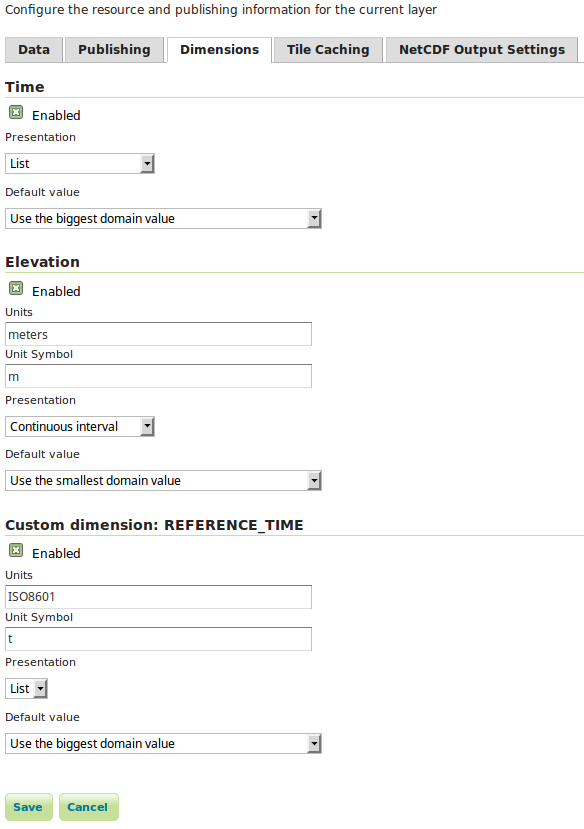

.. _wmts_multidminensional_usage:

WMTS Multidimensional usage
===========================

All described operations including is optional parameters and other extensions were implemented, only the REST interfaces for the domain discovery operations were not implemented. 

The ``GetFeature`` operation only supports the profile GML 3.1 as feature info format ("application/gml+xml; version=3.1") and the ``GetHistogram`` operation only supports ``text/xml`` as output format.

This module support well defined dimensions like elevation and time, but also custom dimensions. 

GetCapabilities
---------------

The default behavior of WMTS is to list in the capabilities document all the values available in a certain dimension, something like this:

.. code-block:: xml

  <Dimension>
    <ows:Identifier>elevation</ows:Identifier>
    <Default>0.0</Default>
    <Value>0.0</Value>
    <Value>200.0</Value>
    <Value>400.0</Value>
    <Value>600.0</Value>
    <Value>800.0</Value>
    <Value>1000.0</Value>
    <Value>1200.0</Value>
    <Value>1400.0</Value>
    <Value>1600.0</Value>
    <Value>1800.0</Value>
    <Value>2000.0</Value>
    <Value>3000.0</Value>
    <Value>4000.0</Value>
    <Value>5000.0</Value>
    <Value>6000.0</Value>
    <Value>7000.0</Value>
    <Value>8000.0</Value>
    <Value>9000.0</Value>
  </Dimension>

This module will instead take into account the presentation mode selected by the user:

   *Configuration of a layer dimensions.*

With the presentation mode select to ``Continuous interval`` or ``Resolution and interval`` we will instead see something like this:

.. code-block:: xml

  <Dimension>
    <ows:Identifier>elevation</ows:Identifier>
    <Default>0.0</Default>
    <Value>0.0--9000.0</Value>
  </Dimension>

Descriptions for the new introduced operations and associated formats will also be added to the capabilities document.

Operations
----------

This module adds three new operations to the WMTS service that are described in detail in this `document <http://demo.geo-solutions.it/share/wmts-multidim/wmts_multidim_geosolutions.html>`_:

.. list-table::
   :widths: 20 80
   :header-rows: 1

   * - Operation
     - Description
   * - DescribeDomains
     - Describes all the dimension domains in a compact document, along with the restricted bounding box of the two dimensional space intercepted by the request.
   * - GetDomainValues
     - Allows to page through domain values (supplements DescribeDomains in case the domain has too many values, and the client still wants to get all of them, one page at a time)
   * - GetHistogram
     - Given a scattered domain description and an interval, this operation divides the interval in regular buckets, and provides an item count for each bucket.
   * - GetFeature
     - Enumerate the actual dimension possible values combinations, returns a list of features along with dimension values using the same formats as the feature info operation ("application/gml+xml; version=3.1").

Note that currently there is no restful implementations of this operations.

DescribeDomains
^^^^^^^^^^^^^^^

This operation is useful to understand which domains are available in our layer dimensions and how they relate to each other. The parameters available for this operation are:

.. list-table::
   :widths: 20 10 70
   :header-rows: 1

   * - Name
     - Mandatory
     - Description
   * - Service=WMTS
     - Yes
     - Service type identifier
   * - Request=DescribeDomains
     - Yes
     - Operation name
   * - Version=1.0.0
     - Yes
     - Standard and schema version for this operation
   * - Layer
     - Yes
     - Layer identifier
   * - TileMatrixSet
     - Yes
     - Tile matrix set identifier
   * - bbox=minx,miny,maxx,maxy
     - No
     - Bounding box corners (lower left, upper right) in CRS units
   * - DimensionIdentifier
     - No
     - At most one per dimension, a range described as min/max, restricting the domain of this dimension
   * - Domains
     - No
     - A comma separated list of domain names to be returned, in case only a subset is required. The space domain is identified by "bbox".
   * - ExpandLimit
     - No
     - A numerical value, greater or equal to zero. If the number of unique domain values is below ``ExpandLimit`` then the domain with be represented in full, as 
       a comma separated list of values, otherwise in compact form, as ``start--end``. The server assumes a built-in limit of 200 in case not specified,
       and allows client to specify a value up to 10000, values can be tuned via the user interface, in the WMTS panel (server defaults) and on a layer
       by layer basis.

.. figure:: images/expandLimitConfig.png
   :align: center

   *Configuration domain expansion limits.*

The ``bbox`` parameter allows the client to restrict the ``DescribeDomains`` operation to a certain spatial area, by default the layer extent will be used.

The ``DimensionIdentifier`` parameter can be used to restrict the domain values of a certain dimension, this is useful to answer questions like which elevations values are available in a specific day.

A simple ``DescribeDomains`` request will look like this:

.. code-block:: guess

  http://localhost:8080/geoserver/gwc/service/wmts?REQUEST=DescribeDomains&Version=1.0.0&Layer=some_layer&TileMatrixSet=EPSG:4326

and the result will be similar to this:

.. code-block:: xml

  <Domains xmlns="http://demo.geo-solutions.it/share/wmts-multidim/wmts_multi_dimensional.xsd" xmlns:ows="http://www.opengis.net/ows/1.1">
    <SpaceDomain>
      <BoundingBox CRS="EPSG:4326" 
       maxx="179.875" maxy="89.9375" minx="-180.125" miny="-90.125"/>
    </SpaceDomain>
    <DimensionDomain>
      <ows:Identifier>elevation</ows:Identifier>
      <Domain>0.0,200.0,400.0,600.0,800.0,1000.0</Domain>
      <Size>6</Size>
    </DimensionDomain>
    <DimensionDomain>
      <ows:Identifier>REFERENCE_TIME</ows:Identifier>
      <Domain>2016-02-23T00:00:00.000Z,2016-02-24T00:00:00.000Z</Domain>
      <Size>2</Size>
    </DimensionDomain>
    <DimensionDomain>
      <ows:Identifier>time</ows:Identifier>
      <Domain>2016-02-23T03:00:00.000Z,2016-02-23T06:00:00.000Z</Domain>
      <Size>2</Size>
    </DimensionDomain>
  </Domains>

Note that if an end attribute has been defined in the layer dimension configuration page, the result will show ranges in place of single values. The result in this case will look like the following:

.. code-block:: xml

  <Domains xmlns="http://demo.geo-solutions.it/share/wmts-multidim/wmts_multi_dimensional.xsd" xmlns:ows="http://www.opengis.net/ows/1.1">
    <SpaceDomain>
      <BoundingBox CRS="EPSG:4326" 
       maxx="179.875" maxy="89.9375" minx="-180.125" miny="-90.125"/>
    </SpaceDomain>
    <DimensionDomain>
      <ows:Identifier>elevation</ows:Identifier>
      <Domain>0.0/50.0,200.0/300.0,400.0/500.0</Domain>
      <Size>6</Size>
    </DimensionDomain>
    <DimensionDomain>
      <ows:Identifier>REFERENCE_TIME</ows:Identifier>
      <Domain>2016-02-23T00:00:00.000Z/2016-02-23T23:00:00.000Z,2016-02-24T00:00:00.000Z/2016-02-24T12:00:00.000Z</Domain>
      <Size>2</Size>
    </DimensionDomain>
    <DimensionDomain>
      <ows:Identifier>time</ows:Identifier>
      <Domain>2016-02-23T03:00:00.000Z/2016-02-23T06:00:00.000Z,2016-02-23T06:00:00.000Z/2016-02-23T12:00:00.000Z</Domain>
      <Size>2</Size>
    </DimensionDomain>
  </Domains>

From the information above we can see that we have three dimensions ``time``, ``elevation`` and ``REFERENCE_TIME`` and the respective domains values.

Now let's see how elevations relate to time dimension by asking which elevations under 500.0 meters are available at time 2016-02-23T03:00:00.000Z:

.. code-block:: guess

  http://localhost:8080/geoserver/gwc/service/wmts?REQUEST=DescribeDomains&Version=1.0.0&Layer=some_layer&TileMatrixSet=EPSG:4326&elevation=0/500&time=2016-02-23T03:00:00.000Z

the result will be similar to this:

.. code-block:: xml

  <Domains xmlns="http://demo.geo-solutions.it/share/wmts-multidim/wmts_multi_dimensional.xsd" xmlns:ows="http://www.opengis.net/ows/1.1">
    <SpaceDomain>
      <BoundingBox CRS="EPSG:4326" 
       maxx="179.875" maxy="89.9375" minx="-180.125" miny="-90.125"/>
    </SpaceDomain>
    <DimensionDomain>
      <ows:Identifier>elevation</ows:Identifier>
      <Domain>200.0</Domain>
      <Size>1</Size>
    </DimensionDomain>
    <DimensionDomain>
      <ows:Identifier>REFERENCE_TIME</ows:Identifier>
      <Domain>2016-02-23T00:00:00.000Z</Domain>
      <Size>1</Size>
    </DimensionDomain>
    <DimensionDomain>
      <ows:Identifier>time</ows:Identifier>
      <Domain>2016-02-23T03:00:00.000Z</Domain>
      <Size>1</Size>
    </DimensionDomain>
  </Domains>

So for time 2016-02-23T03:00:00.000Z there is only values measured at 200.0 meters.

In case only the space domain is of interest, the following request will do:

.. code-block:: guess

  http://localhost:8080/geoserver/gwc/service/wmts?REQUEST=DescribeDomains&Version=1.0.0&Layer=some_layer&TileMatrixSet=EPSG:4326&elevation=0/500&time=2016-02-23T03:00:00.000Z&domains=bbox

and the result will be similar to this:

.. code-block:: xml

  <Domains xmlns="http://demo.geo-solutions.it/share/wmts-multidim/wmts_multi_dimensional.xsd" xmlns:ows="http://www.opengis.net/ows/1.1">
    <SpaceDomain>
      <BoundingBox CRS="EPSG:4326" 
       maxx="179.875" maxy="89.9375" minx="-180.125" miny="-90.125"/>
    </SpaceDomain>
  </Domains>

GetDomainValues
^^^^^^^^^^^^^^^

This operation is useful to page through the values of a given domain, in case the "multidimensional" area of interest
is too large for DescribeDomain to return them in a single shot.

.. list-table::
   :widths: 20 10 70
   :header-rows: 1

   * - Name
     - Mandatory
     - Description
   * - Service=WMTS
     - Yes
     - Service type identifier
   * - Request=GetDomainValues
     - Yes
     - Operation name
   * - Version=1.0.0
     - Yes
     - Standard and schema version for this operation
   * - Layer
     - Yes
     - Layer identifier
   * - bbox=minx,miny,maxx,maxy
     - No
     - Bounding box corners (lower left, upper right) in CRS units
   * - DimensionIdentifier
     - No
     - At most one per dimension, a range described as min/max, restricting the domain of this dimension
   * - Domain
     - Yes
     - Name of the domain whose values will be returned (one cannot use "bbox", only single value dimensions can be enumerated by GetDomainValues, e.g., time, elevation).
   * - FromValue
     - No
     - Sets the beginning of domain enumeration, for paging purposes. It's not included in the result
   * - FromEnd
     - No
     - If equals to true specifies that the beginning of domain enumeration, set by the FromValue, should be applied to the end attribute. When set to true results will be sorted by end attribute.
   * - Sort
     - No
     - Can be "asc" or "desc", determines if the enumeration is from low to high, or from high to low
   * - Limit
     - No
     - Maximum number of values returned by this call. The server assumes a built-in limit of 1000 in case not specified,
       and allows client to specify a value up to 10000.

For example, let's say a "elevation" domain has values 1,2,3 and 5, and that we are paging through
it by pages of 2 elements. The client will start without providing a "fromValue", and will then continue
using the last value of the previous page as a reference:

.. code-block:: guess

  http://localhost:8080/geoserver/gwc/service/wmts?request=GetDomainValues&Version=1.0.0&Layer=sampleLayer&domain=elevation&limit=2

.. code-block:: xml

    <DomainValues xmlns="http://demo.geo-solutions.it/share/wmts-multidim/wmts_multi_dimensional.xsd" xmlns:ows="http://www.opengis.net/ows/1.1">
      <ows:Identifier>elevation</ows:Identifier>
      <Limit>2</Limit>
      <Sort>asc</Sort>
      <Domain>1.0,2.0</Domain>
      <Size>2</Size>
    </DomainValues>

.. code-block:: guess

  http://localhost:8080/geoserver/gwc/service/wmts?request=GetDomainValues&Version=1.0.0&Layer=sampleLayer&domain=elevation&limit=2&fromValue=2
          
.. code-block:: xml

    <DomainValues xmlns="http://demo.geo-solutions.it/share/wmts-multidim/wmts_multi_dimensional.xsd" xmlns:ows="http://www.opengis.net/ows/1.1">
      <ows:Identifier>elevation</ows:Identifier>
      <Limit>2</Limit>
      <Sort>asc</Sort>
      <FromValue>2.0</FromValue>
      <Domain>3.0,5.0</Domain>
      <Size>2</Size>
    </DomainValues>

.. code-block:: guess

  http://localhost:8080/geoserver/gwc/service/wmts?request=GetDomainValues&Version=1.0.0&Layer=sampleLayer&domain=elevation&limit=2&fromValue=5
          
.. code-block:: xml

    <DomainValues xmlns="http://demo.geo-solutions.it/share/wmts-multidim/wmts_multi_dimensional.xsd" xmlns:ows="http://www.opengis.net/ows/1.1">
      <ows:Identifier>elevation</ows:Identifier>
      <Limit>2</Limit>
      <Sort>asc</Sort>
      <FromValue>5.0</FromValue>
      <Domain></Domain>
      <Size>0</Size>
    </DomainValues>

For elevations it might not be uncommon to iterate backwards, from the top-most elevation down to the lowest value. The interaction
between client and server might then look as follows:

.. code-block:: guess

  http://localhost:8080/geoserver/gwc/service/wmts?request=GetDomainValues&Version=1.0.0&Layer=sampleLayer&domain=elevation&limit=2&sort=desc

.. code-block:: xml

    <DomainValues xmlns="http://demo.geo-solutions.it/share/wmts-multidim/wmts_multi_dimensional.xsd" xmlns:ows="http://www.opengis.net/ows/1.1">
      <ows:Identifier>elevation</ows:Identifier>
      <Limit>2</Limit>
      <Sort>asc</Sort>
      <Domain>5.0,3.0</Domain>
      <Size>2</Size>
    </DomainValues>

.. code-block:: guess

  http://localhost:8080/geoserver/gwc/service/wmts?request=GetDomainValues&Version=1.0.0&Layer=sampleLayer&domain=elevation&limit=2&fromValue=3&sort=desc
          
.. code-block:: xml

    <DomainValues xmlns="http://demo.geo-solutions.it/share/wmts-multidim/wmts_multi_dimensional.xsd" xmlns:ows="http://www.opengis.net/ows/1.1">
      <ows:Identifier>elevation</ows:Identifier>
      <Limit>2</Limit>
      <Sort>asc</Sort>
      <FromValue>3.0</FromValue>
      <Domain>2.0,1.0</Domain>
      <Size>2</Size>
    </DomainValues>

.. code-block:: guess

  http://localhost:8080/geoserver/gwc/service/wmts?request=GetDomainValues&Version=1.0.0&Layer=sampleLayer&domain=elevation&limit=2&fromValue=1&sort=desc
          
.. code-block:: xml

    <DomainValues xmlns="http://demo.geo-solutions.it/share/wmts-multidim/wmts_multi_dimensional.xsd" xmlns:ows="http://www.opengis.net/ows/1.1">
      <ows:Identifier>elevation</ows:Identifier>
      <Limit>2</Limit>
      <Sort>asc</Sort>
      <FromValue>1.0</FromValue>
      <Domain></Domain>
      <Size>0</Size>
    </DomainValues>

Assume now that along with the values 1,2,3,5 we have end attribute values respectively equal to 5,3,4,6.

The following request:

.. code-block:: guess

  http://localhost:8080/geoserver/gwc/service/wmts?request=GetDomainValues&Version=1.0.0&Layer=sampleLayer&domain=elevation&limit=2&fromValue=3.5&fromEnd=true
          

will return

.. code-block:: xml

    <DomainValues xmlns="http://demo.geo-solutions.it/share/wmts-multidim/wmts_multi_dimensional.xsd" xmlns:ows="http://www.opengis.net/ows/1.1">
      <ows:Identifier>elevation</ows:Identifier>
      <Limit>2</Limit>
      <Sort>asc</Sort>
      <Domain>3.0/4.0,1.0/5.0,5.0/6.0</Domain>
      <Size>2</Size>
    </DomainValues>

The paging approach might seem odd for those used to using "limit" and "offset". The main reason it's done
this way it's performance, paging through unique values via limit and offset means that the data source
has to compute and collect the unique values that are not needed (the ones in previous pages) in order to
find the ones in the current page. With large domains (typical of time series) this quickly becomes too
slow for interactive usage, as one moves forward in the domain.

By giving a starting point, the unneeded data points can be skipped via index and the distinct value
computation can be performed only on the current page data, stopping it as soon as the desired number
of results has been computed. With an index on the dimension being queries, this results in nearly
constant response times, regardless of the page being requested.

GetHistogram
^^^^^^^^^^^^

This operation can be used to provide information about the data distribution between the minimum and maximum values of a certain dimension.

The parameters available for this operation are:

.. list-table::
   :widths: 20 10 70
   :header-rows: 1

   * - Name
     - Mandatory
     - Description
   * - Service=WMTS
     - Yes
     - Service type identifier
   * - Request=GetHistogram
     - Yes
     - Operation name
   * - Version=1.0.0
     - Yes
     - Standard and schema version for this operation
   * - Layer
     - Yes
     - Layer identifier
   * - TileMatrixSet
     - Yes
     - Tile matrix set identifier
   * - BBOX=minx,miny,maxx,maxy
     - No
     - Bounding box corners (lower left, upper right) in CRS units
   * - DimensionIdentifier
     - No
     - At most one per dimension, a range described as min/max, restricting the domain of this dimension
   * - Histogram
     - Yes
     - Name of the dimension for which the histogram will be computed
   * - Resolution
     - No
     - Suggested size of the histogram bucket. Cannot be provided for enumerated dimensions, will use the period syntax for time (e.g. PT1H), a number for numeric dimensions, or auto to leave the decision to the server
   * - Format
     - No
     - The desired output format, default is text/html.

The parameters common to the ``DescribeDomains`` operation work as already described above. Currently only the ``text/xml`` output format is supported.

The following example request the histogram for time dimension with a resolution of 8 hours restricting elevations between 500.0 and 1000.0 meters:

.. code-block:: guess

  http://localhost:8080/geoserver/gwc/service/wmts?REQUEST=GetHistogram&Version=1.0.0&Layer=some_layer&TileMatrixSet=EPSG:4326&histogram=time&resolution=PT8H&elevation=500.0/1000.0

and the result will be similar to this:

.. code-block:: xml

  <Histogram xmlns="http://demo.geo-solutions.it/share/wmts-multidim/wmts_multi_dimensional.xsd" xmlns:ows="http://www.opengis.net/ows/1.1">
    <ows:Identifier>time</ows:Identifier>
    <Domain>2016-02-23T00:00:00.000Z/2016-02-25T00:00:00.000Z/PT8H</Domain>
    <Values>240,0,240,0,0,240</Values>
  </Histogram>

Looking at the result we can conclude that measurements between 500.0 and 1000.0 meters are typically done during the night. 

The bucket matching is setup so that each one contains its first value, but not its last value (which is contained in the next bucket instead).
This is important to understand the results. Say we have a dataset with regular elevations, from 0 to 100 with a step of 10, and the
request calls for elevations between 0 and 20. Then the results will look something like follows:

.. code-block:: xml

  <Histogram xmlns="http://demo.geo-solutions.it/share/wmts-multidim/wmts_multi_dimensional.xsd" xmlns:ows="http://www.opengis.net/ows/1.1">
    <ows:Identifier>elevation</ows:Identifier>
    <Domain>0/30/10</Domain>
    <Values>5,3,8</Values>
  </Histogram>

That is, there values catch the intervals [0,10[, [10, 20[, and [20, 30[ (to have a bucket for the images/features
having elevation exactly matching 20). This will happen only if an extreme value if found, the same request
filtering on elevations between 0 and 15 will return this instead:

.. code-block:: xml

  <Histogram xmlns="http://demo.geo-solutions.it/share/wmts-multidim/wmts_multi_dimensional.xsd" xmlns:ows="http://www.opengis.net/ows/1.1">
    <ows:Identifier>elevation</ows:Identifier>
    <Domain>0/20/10</Domain>
    <Values>5,3</Values>
  </Histogram>

Note that if an end attribute is specified the bucket matching will be applied on ranges rather than on single values. In this case, buckets are filled by the intersection of ranges' values with bucket limits and not by containment. This is done in order to avoid some range values falling outside every bucket, but as a side effect, the same range can match more than one bucket.

GetFeature
^^^^^^^^^^

This operation is capable to enumerate the actual possible values combinations. The output of this operation is similar to the output of the ``WFS 2.0 GetFeature`` operation which is a list of features along with dimension values using the same formats as the feature info operation. This output can be used to draw the features on a map for example.

The parameters available for this operation are:

.. list-table::
   :widths: 20 10 70
   :header-rows: 1

   * - Name
     - Mandatory
     - Description
   * - Service=WMTS
     - Yes
     - Service type identifier
   * - Request=GetFeature
     - Yes
     - Operation name
   * - Version=1.0.0
     - Yes
     - Standard and schema version for this operation
   * - Layer
     - Yes
     - Layer identifier
   * - TileMatrixSet
     - Yes
     - Tile matrix set identifier
   * - BBOX=minx,miny,maxx,maxy
     - No
     - Bounding box corners (lower left, upper right) in CRS units
   * - DimensionIdentifier
     - No
     - At most one per dimension, a range described as min/max, restricting the domain of this dimension
   * - Format
     - Yes
     - The desired output format

The parameters common to the ``DescribeDomains`` operation work as already described above. Currently only the ``application/gml+xml; version=3.1`` output format is supported.

Using the same restrictions parameters we used for the second request used as an example for the ``DescribeDomains`` operation a ``GetFeature`` request will look like this:

.. code-block:: guess

  http://localhost:8080/geoserver/gwc/service/wmts?REQUEST=GetFeature&Version=1.0.0&Layer=some_layer&TileMatrixSet=EPSG:4326&elevation=0/500&time=2016-02-23T03:00:00.000Z

and the result will be similar to this:

.. code-block:: xml

  <?xml version="1.0" encoding="UTF-8"?><wmts:FeatureCollection xmlns:xs="http://www.w3.org/2001/XMLSchema" xmlns:gml="http://www.opengis.net/gml" xmlns:wmts="http://www.opengis.net/wmts/1.0">
    <wmts:feature gml:id="FID.1681">
      <wmts:footprint>
        <gml:Polygon xmlns:xs="http://www.w3.org/2001/XMLSchema" xmlns:gml="http://www.opengis.net/gml" xmlns:sch="http://www.ascc.net/xml/schematron" xmlns:xlink="http://www.w3.org/1999/xlink" srsDimension="2" srsName="http://www.opengis.net/gml/srs/epsg.xml#4326">
          <gml:exterior>
            <gml:LinearRing srsDimension="2">
              <gml:posList>-180.125 -90.125 -180.125 89.875 179.875 89.875 179.875 -90.125 -180.125 -90.125</gml:posList>
            </gml:LinearRing>
          </gml:exterior>
        </gml:Polygon>
      </wmts:footprint>
      <wmts:dimension name="elevation">200.0</wmts:dimension>
      <wmts:dimension name="time">2016-02-23T03:00:00.000Z</wmts:dimension>
      <wmts:dimension name="REFERENCE_TIME">2016-02-23T00:00:00.000Z</wmts:dimension>
    </wmts:feature>
  </wmts:FeatureCollection>

Note how this result correlate with the correspondent ``DescribeDomains`` operation result.
