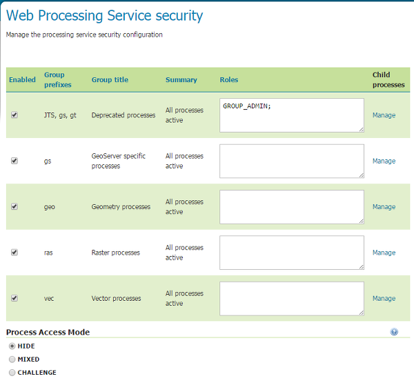
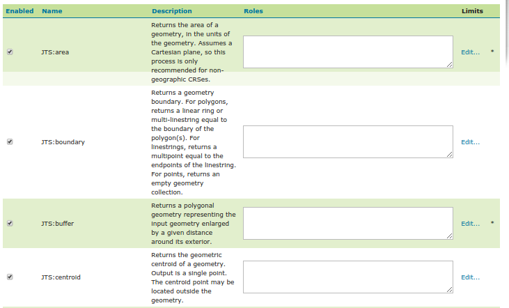

.. _security_wps:

WPS Security and input limits
=============================

Geoserver service security is normally based on the generic <OGC security configuration `_sec_service`>_, however, when it
comes to WPS there is also a need to restrict single process availability. 
WPS security allows access to be determined on a per process group or per single process, similarly
to how data security restricts access to layers.

Each process and process group can be either disabled entirely, or subject to access control based on the
user roles.

The WPS security configurations can be changed using the Web Administration Interface. 
The "Security"/"WPS security" page contains list of WPS groups with ability to enable/disable them, 
limit their access to specific roles, and links to process list and process access mode configuration.

   
   *The WPS security page*
   
The process access mode configuration specifies how GeoServer will advertise 
secured processes and behave when a secured processes is accessed without the necessary privileges.
The parameter can assume the values: HIDE (default), CHALLENGE, MIXED:

* In **HIDE** mode the processes not available to the current user will simply be removed, denying their existence to the clients,
  in particular they will not be listed to GetCapabilities output and a direct access will result in GeoServer claiming the process does not exists
* In **CHALLENGE** mode all the processes will be available in the GetCapabilities output, but a authentication 
  request will be raised if a secured process is requested via any other service call by a user that does not have sufficient access rights
* In **MIXED** mode the secured processes will be hidden from the GetCapabilities document to the users not having sufficient access rights, 
  but an authentication request will be raised if a secured process is requested anyways via any other WPS request 
  
The list of roles attached to each group or process will determine which users can access the
processes, if the list is empty the group/process will be available to all users (unless it has
been disabled, in which case it won't be available to anyone).
The role editor provide auto-completion to ease up filling values, and allowing quick copy and paste of 
role lists from one process definition to the other. 
The roles string must be a simple semicolon separated list:

.. figure:: images/security-process.png
   :align: center

   *The role editor inside the process list page*
   
Input limits
------------

The amount of resources used by a process is normally directly related to the inputs of the process itself.
The WPS specification is conscious of that, and allows to declare three different type of limits on each process inputs:

* The maximum size of complex inputs, in megabytes
* The range of acceptable values for numeric values
* The max multiplicity of repeatable inputs (think of contour extraction, where the number of levels affects the execution time)

Starting with GeoServer 2.7.0, GeoServer allows the administrator to configure said limits, and fail requests that 
are not respecting them.

The maximum size can be given a global default in the "WPS security" page (see screenshot above).
It is otherwise possible to define limits on a process by process basis getting in the process list
and getting in the process limits editor (processes having a "*" besides the link have a defined
set of limits):

   *The process selector, with access constraints and links to the limits configuration*
   
The process limits configurator shows all inputs for which a limit can be provided, and
sets a "emtpy" set of limits for it: if empty or unmodified, the limits won't be applied to 
the input (e..g, a max input with a 0 value means no limit, and so on).

.. figure:: images/process_limits.png
   :align: center

   *The process limit page, with a variety of input limits configured in it*

.. warning:: In order for the limits to be actually saved, the process list page needs to be "applied", and then the main WPS security page needs to be saved