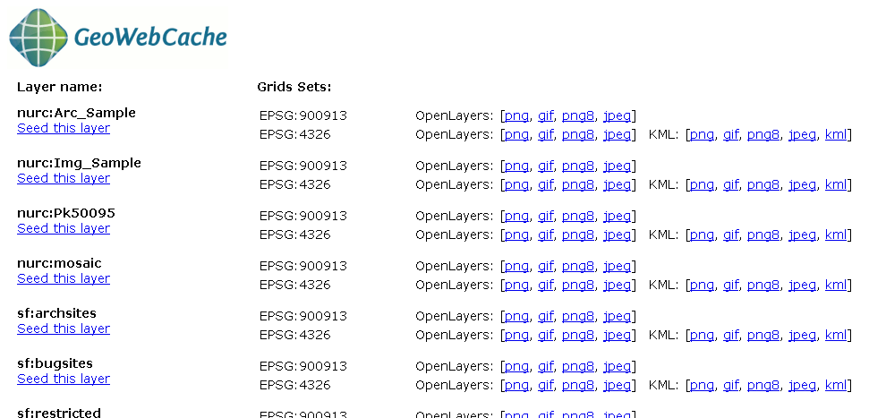
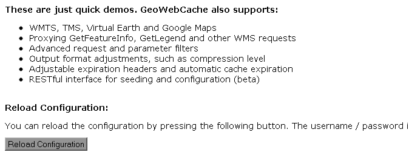

.. _gwc_demo:

GeoWebCache Demo page
=====================

GeoWebCache comes with a demo page where you can view configured layers, reload the configuration (when changing settings or adding new layers), and seed/refresh the existing cache on a per-layer basis.

Viewing
-------

To view the GeoWebCache demo page, append ``/gwc/demo`` to the address of your GeoServer instance.  For example, if your GeoServer is at the following address::

   http://localhost:8080/geoserver
   
The GeoWebCache demo page is accessible here::

   http://localhost:8080/geoserver/gwc/demo

If there is a problem loading this page, GeoWebCache may be set up incorrectly.  Verify the steps on the :ref:`gwc_using` page have been carried out successfully.

Reload configuration
--------------------

The demo page contains a list of every layer that GeoWebCache is aware of.  This is typically (though not necessarily) identical to the list of layers as published in the GeoServer WMS capabilities document.  If configuration changes are made to GeoServer, GeoWebCache will not automatically become aware of them.  To ensure that GeoWebCache is using the latest configuration information, click the **Reload Configuration** button.  Reloading the configuration will trigger authentication to GeoServer, and will require an administration username and password.  Use the same username and password that you would use to log in to the :ref:`web_admin`.  (See :ref:`webadmin_basics` for more information.)  After a successful login, the number of layers found and loaded will be displayed.

Layers and output formats
-------------------------

For each layer that GeoWebCache serves, links are typically available for a number of different projections and output formats.  By default, **OpenLayers** applications are available using image formats of PNG, PNG8, GIF, and JPEG in both **EPSG:4326** (standard lat/lon) and **EPSG:900913** (used in Google Maps) projections.  In addition, **KML output** is available (EPSG:4326 only) using the same image formats, plus vector data ("kml").

Also on the list is an option to seed the layers (:guilabel:`Seed this layer`).  More on this option can be found on the :ref:`gwc_seeding` page.