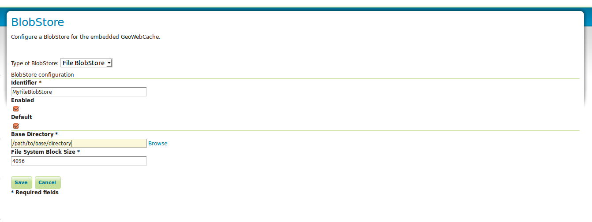

.. _gwc_webadmin_blobstores:

BlobStores
==========

BlobStores allow us to configure how and where GeoWebCache will store its cashed data on a per-layer basis. This page allows us to define the different BlobStores present in the system. BlobStores can be created, modified and removed from here. 

.. figure:: img/blobstores.png

General
-------

Identifier
~~~~~~~~~~
Each BlobStore has a unique identifier.

BlobStore Type
~~~~~~~~~~~~~~
There can be different BlobStore types to use different ways of storage. There is only standard support for File BlobStores. Plugins may add additional types.

Enabled
~~~~~~~
Disabled BlobStores will not be loaded. Disabling a BlobStore will disable cashing for all layers and layergroups assigned to that BlobStore.

Default
~~~~~~~
There should always be one default BlobStore, which cannot be removed. The default BlobStore will be used by all layers not assigned to a specific BlobStore. Removing a BlobStore will cause all layers assigned to this BlobStore to use the default BlobStore until specified otherwise.

File BlobStore
---------------
These store data on a disk in a specified directory.

Base Directory
~~~~~~~~~~~~~~
The directory where the cashed data is stored.

Disk block size
~~~~~~~~~~~~~~~
This setting determines how the tile cache calculates disk usage. The value for this setting should be equivalent to the disk block size of the storage medium where the cache is located. The default block size is **4096 bytes**.

