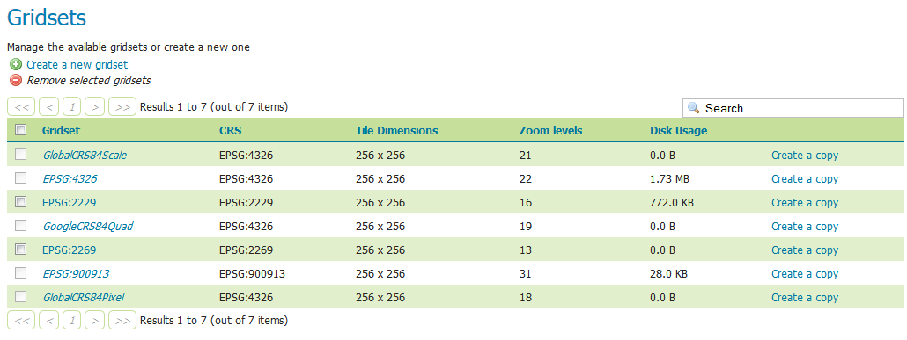
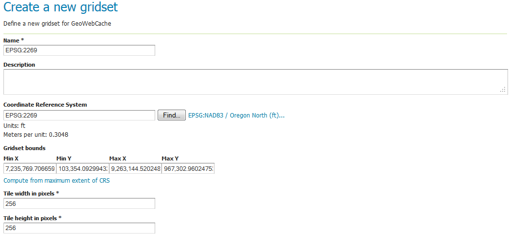
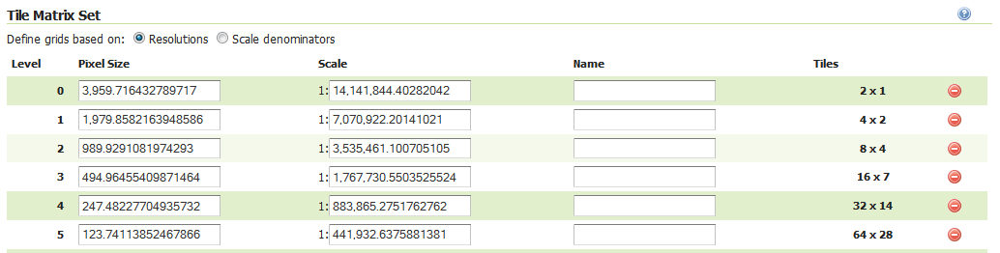
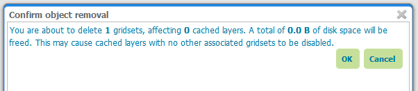

.. _gwc_webadmin_gridsets:

Gridsets
========

A gridset defines a spatial reference system, bounding box (extent), a list of zoom levels (resolutions or scale denominators), and tile dimensions. Tile requests must conform to the gridset matrix, otherwise caching will not occur.

This page allows you to edit existing saved gridsets or create new ones. There are five preconfuigred gridsets, all in one of two coordinate reference systems: EPSG:4326 and EPSG:900913. For additional CRS support, new gridsets can be created. Another reason to create a new gridset would be to set a different tile size or different number of zoom levels.

   Gridsets menu

Creating a new gridset
----------------------

To create a new gridset, click :guilabel:`Create new gridset`. You will then be asked to enter a range of parameters.

   Creating a new gridset

Name
~~~~

The short name of the new gridset.

Description
~~~~~~~~~~~

Metadata on the gridset.

Coordinate Reference System
~~~~~~~~~~~~~~~~~~~~~~~~~~~

The Coordinate Reference System (CRS) to use in the gridset. You can select from any CRS that GeoServer recognizes. After selection, both the units (meters, feet, degrees, etc.) and the number of meters per unit will be displayed.

Gridset bounds
~~~~~~~~~~~~~~

Sets the maximum extent for the gridset. Typically this is set to be the maximum extent of the CRS used, but a smaller value can be substituted if desired. To populate the max extent in the fields, click :guilabel:`Compute from maximum extent of CRS`.

Tile width and height
~~~~~~~~~~~~~~~~~~~~~

Sets the tile dimensions. Default is **256x256 pixels**. The tile dimensions can be anything from 16 to 2048 pixels. In addition, the tiles need not be square.

Tile matrix set
~~~~~~~~~~~~~~~

The tile matrix set (or tile pyramid) is a list of zoom levels containing ever increasing amounts of tiles. This three dimensional collection of tile "slots" creates the framework where actual image tiles will be saved. You can define the tile matrix based on resolutions or scale denominators.

Click :guilabel:`Add zoom level` to generate the first zoom level. The parameters will be automatically configured such that the full extent of will be contained by a single pixel's height. The number of pixels in a given zoom level will be displayed, along with the Pixel Size, Scale, and an optional Name, where you can give a name to each zoom level if desired.

Typically each additional zoom level is twice as large in each dimension, and so contains four times as many tiles as the previous zoom level. The actual values will be populated automatically during subsequent clicking of the :guilabel:`Add zoom level` link. These defaults are usually sufficient, and you need only determine the maximum number of zoom levels desired for this gridset.

When finished, click :guilabel:`Save`. Before you will be able to use this new gridset with a layer, you will need to add this gridset to the layer's list of available gridsets. This is done on an individual layer's :ref:`properties <data_webadmin_layers>` page. You can also add this gridset to the default list on the :ref:`gwc_webadmin_defaults` page.

   Tile matrix set

Editing a gridset
-----------------

Click an existing gridset to open it for editing. Please note that the built-in gridsets cannot be edited. They can, however, be copied.

.. figure:: img/editgridset.png

   Editing a gridset

.. figure:: img/readonlygridset.png

   This gridset is read-only

Copying a gridset
-----------------

As there are many configuration options for a gridset, it is often more convenient to copy an existing gridset. For any of the existing gridsets, click the :guilabel:`Create a copy` link to copy the gridset information to a new gridset.

Removing a gridset
------------------

To remove a gridset, select the check box next to the gridset or gridsets, and click :guilabel:`Remove selected gridsets`.

.. warning:: Removing a gridset definition will remove not only the gridset definition, but also any tiles on any layers generated with this gridset.

   Removing a gridset
