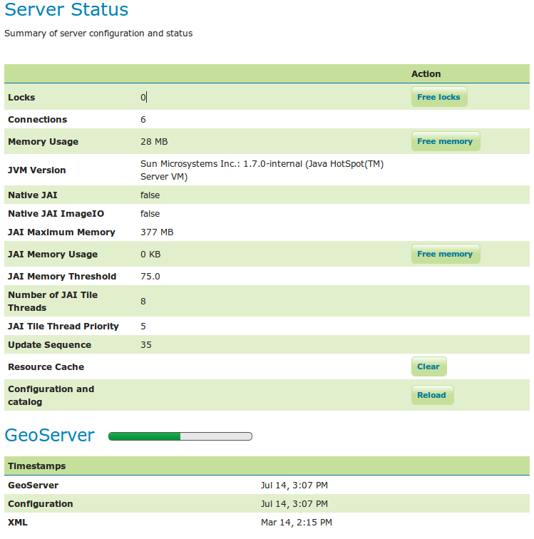
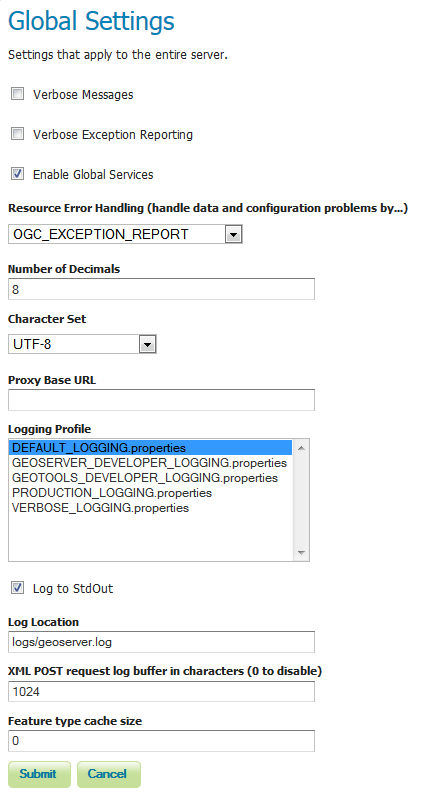
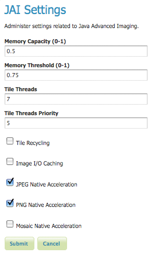
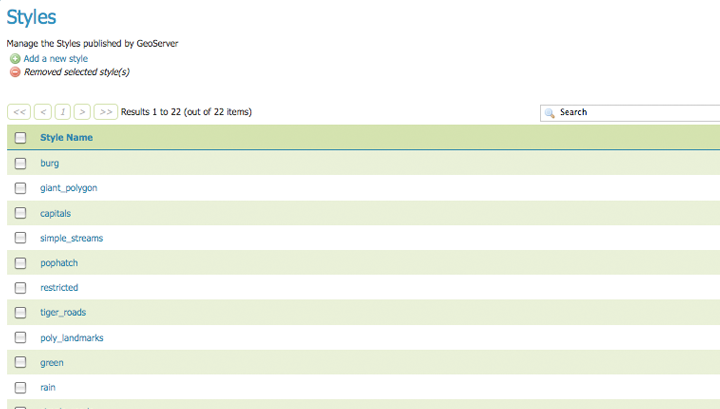
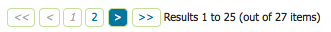

.. _web_admin_quickstart:

Web Administration Interface Quickstart
=======================================

The *Web Administration Tool* is a web-based application used to configure all aspects of GeoServer, 
from adding and publishing data to changing service settings. 

The web admin tool is accessed via a web browser at ``http://<host>:<port>/geoserver`` 
(for a default installation on the local host the link is http://localhost:8080/geoserver/web ).
When the app starts it displays the public Welcome page.

.. figure:: web-admin.png
   :align: center
   
   *Welcome Page*

.. _logging_in:

Logging In
----------

In order to change any server settings or configure data a user must first be authenticated. Navigate to the upper right hand corner to log into GeoServer. The default username and password is ``admin`` and ``geoserver``.  These can be changed by editing the :file:`security/users.properties` file in the :ref:`data_directory`.  

.. figure:: login-page.png
   :align: center

   *Login*
   
Once logged in, the Welcome screen changes to show the available admin functions. 
These are available from links under the sections on the left-hand menu.

Server
------

The :guilabel:`Server` section provides access to GeoServer environment information. It is a combination of diagnostic and configuration tools, and can be particularly useful for debugging.  

The :guilabel:`Server Status` page shows a summary of server configuration parameters and run-time status.  

   
   *Status Page*

The :guilabel:`Contact Information` page sets the public contact information in the Capabilities document of the WMS server.

.. figure:: ../../webadmin/images/server_contact.png
   :align: center
   
   *Contact Page*

The :guilabel:`Global Settings` page configures messaging, logging, character and proxy settings for the entire server.

   
   *Global Settings Page*

The :guilabel:`JAI Settings` page is used to configure several JAI parameters, used by both WMS and WCS operations.

   *JAI Settings*

The :guilabel:`About GeoServer` section provides links to the GeoServer documentation, homepage and bug tracker. 

.. figure:: about-geoserver.png
   :align: center

   *About Section*

Services
--------

The :guilabel:`Services` section is for advanced users needing to configure the request protocols used by GeoServer. The Web Coverage Service (:guilabel:`WCS`) page manages metadata information, common to WCS, WFS and WMS requests.  The Web Feature Service (:guilabel:`WFS`) page permits configuration of features, service levels, and GML output.  The Web Map Service (:guilabel:`WMS`) page sets raster and SVG options.

Data
----

The :guilabel:`Data` links directly to a data type page with edit, add, and delete functionality. All data types subsections follow a similar workflow. As seen in the :guilabel:`Styles` example below, the first page of each data type displays a view page with an indexed table of data. 

   
   *Styles View page*

Each data type name links to a corresponding configuration page.  For example, all items listed below Workspace, Store and Layer Name on the :guilabel:`Layers` view page, link to its respective configuration page.  

.. figure:: ../../webadmin/images/data_layers.png
   :align: center
   
   *Layers View*

In the data type view panel, there are three different ways to locate a data type--sorting, searching, and scrolling .  

To alphabetically sort a data type, click on the column header. 

.. figure:: ../../webadmin/images/data_sort.png
   :align: center
   
   *On the left an unsorted column; on the right a sorted column.*

For simple searching, enter the search criteria in the search box and hit Enter. 

.. figure:: ../../webadmin/images/data_search_results.png
   :align: center

   *Search results for the query "top".*

To scroll through data type pages, use the arrow button located on the bottom and top of the view table. 

   *Page scroll for data types.*

As seen in the :guilabel:`Stores` example below, the buttons for adding and removing a data type can be found at the top of the view page.

.. figure:: ../../webadmin/images/data_stores_add_remove.png
   :align: center
   
   *Buttons to add and remove Stores*

To add a new data, select the :guilabel:`Add` button, and follow the data type specific prompts.  To delete a data type   In order to remove a data type, click on the data type's corresponding check box and select the :guilabel:`Remove` button.  (Multiple data types, of the same kind, can be checked for batch removal.)

.. figure:: ../../webadmin/images/data_stores_delete.png
   :align: center

   *Stores checked for deletion*

Demos
-----

The :guilabel:`Demos` page contains links to example WMS, WCS and WFS requests for GeoServer as well as a link listing all SRS info known to GeoServer.  You do not need to be logged into GeoServer to access this page.

.. figure:: ../../webadmin/images/demos_view.png
   :align: center
   
   *Demos page*

Layer Preview
--------------

The :guilabel:`Layer Preview` page provides layer previews in various output formats, including the common OpenLayers and KML formats. This page helps to visually verify and explore the configuration of a particular layer.  

.. figure:: ../../webadmin/images/preview_list.png
   :align: center
   
   *Layer Preview page*

Each layer row consists of a :guilabel:`Type`, :guilabel:`Name`, :guilabel:`Title`, and available formats for viewing.  The :guilabel:`Type` column shows an icon indicating the layer datatype.  :guilabel:`Name` displays the Workspace and Layer Name of a layer, while :guilabel:`Title` displays the brief description configured in the :ref:`webadmin_layers_edit_data` panel. :guilabel:`Common Formats` include OpenLayers, KML, and GML where applicable, while the :guilabel:`All Formats` include additional output formats for further use or data sharing.

.. figure:: ../../webadmin/images/preview_row.png
   :align: center
   
   *Single Layer preview row*

