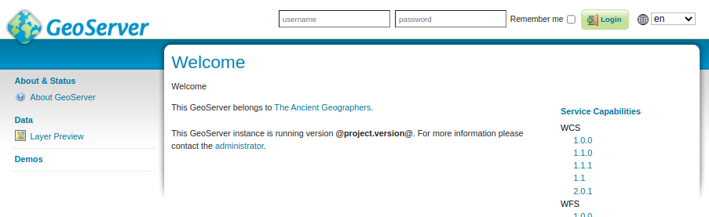

.. _web_admin_quickstart:

Using the web administration interface
======================================

GeoServer has a browser-based web administration interface application used to configure all aspects of GeoServer, from adding and publishing data to changing service settings. 

The web admin interface is accessed via a web browser at::

  http://<host>:<port>/geoserver

For a default installation on a server the link is::

  http://localhost:8080/geoserver

When the application starts, it displays the Welcome page.

   
   Welcome Page

.. _logging_in:

Logging In
----------

In order to change any server settings or configure data, a user must first be authenticated.

#. Navigate to the upper right of the web interface to log into GeoServer. The default administration credentials are:

   * User name: ``admin``
   * Password: ``geoserver``

   .. note:: These can be changed in the :ref:`security` section.

   .. figure:: login-page.png

      Login
   
#. Once logged in, the Welcome screen changes to show the available admin functions. These are primarily shown in the menus on the left side of the page.

   .. figure:: logged_in.png
   
      Additional options when logged in

Layer Preview
-------------

The :ref:`layerpreview` page allows you to quickly view the output of published layers.

#. Click the :guilabel:`Layer Preview` link on the menu to go to this page.

   .. figure:: ../../data/webadmin/img/preview_list.png

#. From here, you can find the layer you'd like to preview and click a link for an output format. Click the :guilabel:`OpenLayers` link for a given layer and the view will display.

#. To sort a column alphabetically, click the column header. 

   .. figure:: ../../data/webadmin/img/data_sort.png

      Unsorted (left) and sorted (right) columns

#. Searching can be used to filter the number of items displayed. This is useful for working with data types that contain a large number of items. To search data type items, enter the search string in the search box and click Enter. GeoServer will search the data type for items that match your query, and display a list view showing the search results.

   .. figure:: ../../data/webadmin/img/data_search_results.png
   
      Search results for the query "top" on the Workspace page

   .. note:: Sorting and searching apply to all data configuration pages.

.. note:: For more information, please see the :ref:`layerpreview` section.

