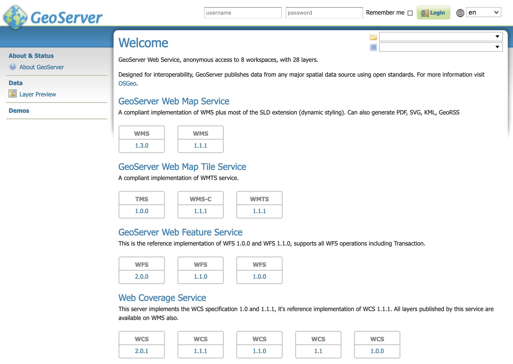

.. _installation_war:

Web archive
===========

GeoServer is packaged as a standalone servlet for use with existing application servers such as `Apache Tomcat <http://tomcat.apache.org/>`_ and `Jetty <http://eclipse.org/jetty/>`_.

.. note:: GeoServer has been mostly tested using Tomcat, and so is the recommended application server. GeoServer requires a newer version of Tomcat (7.0.65 or later) that implements Servlet 3 and annotation processing. Other application servers have been known to work, but are not guaranteed.
 
Installation
------------

#. Make sure you have a Java Runtime Environment (JRE) installed on your system. GeoServer requires a **Java 11** or **Java 17** environment,available from `OpenJDK <https://openjdk.java.net>`__, `Adoptium <https://adoptium.net>`__, or provided by your OS distribution.

   .. note:: For more information about Java and GeoServer compatibility, please see the section on :ref:`production_java`.

#. Navigate to the :website:`GeoServer Download page <download>`.

#. Select the version of GeoServer that you wish to download.  If you're not sure, select :website:`Stable <release/stable>` release.

   .. only:: snapshot
      
      These instructions are for GeoServer |version|-SNAPSHOT which is provided as a :website:`Nightly <release/2.23.x>` release.
      Testing a Nightly release is a great way to try out new features, and test community modules. Nightly releases
      change on an ongoing basis and are not suitable for a production environment.
      
   .. only:: not snapshot

      These instructions are for GeoServer |release|.

#. Select :guilabel:`Web Archive` on the download page: :download_release:`war`

#. Download and unpack the archive.

#. Deploy the web archive as you would normally. Often, all that is necessary is to copy the :file:`geoserver.war` file to the application server's ``webapps`` directory, and the application will be deployed.

   .. note:: A restart of your application server may be necessary.

Tomcat Hardening
----------------
Hide the Tomcat version in error responses and its error details.

To remove the Tomcat version, create following file with empty parameters
::

 cd $CATALINA_HOME (where Tomcat binaries are installed)
 mkdir -p ./lib/org/apache/catalina/util/
 cat > ./lib/org/apache/catalina/util/ServerInfo.properties <<EOF
 server.info=
 server.number=
 server.built=
 EOF

Additionally add to :file:`server.xml` the ErrorReportValve to disable showReport and showServerInfo. This is used to hide errors handled globally by tomcat in host section.

``vi ./conf/server.xml``

Add to ``<Host name=...`` section this new ErrorReportValve entry:
::

 ...
      <Host name="localhost"  appBase="webapps"
            unpackWARs="true" autoDeploy="true">
		
        ...

        <Valve className="org.apache.catalina.valves.ErrorReportValve" showReport="false" showServerInfo="false" />

      </Host>
    </Engine>
  </Service>
 </Server>

Why, if security by obscurity does not work?

Even though this is not the final solution, it at least mitigates the visible eye-catcher of outdated software packages.

Let's take the attackers point of view.

Response with just HTTP status:
::

 HTTP Status 400 – Bad Request

Ok, it looks like a Tomcat is installed.

Default full response:
::

 HTTP Status 400 – Bad Request
 Type Status Report
 Message Invalid URI
 Description The server cannot or will not process the request due to something that is perceived to be a client error (e.g., malformed request syntax, invalid request message framing, or deceptive request routing).
 Apache Tomcat/7.0.67

Ahh, great, the software is not really maintained. Tomcat is far outdated from Dec. 2015 (6 years old as of today Jan. 2022) with a lot of unfixed vulnerabilities.

Notice: For support reason, the local output of version.sh still outputs the current version
::

 $CATALINA_HOME/bin/version.sh
  ...
  Server number:  7.0.67
  ...

Running
-------

Use your container application's method of starting and stopping webapps to run GeoServer.

To access the :ref:`web_admin`, open a browser and navigate to ``http://SERVER/geoserver`` . For example, with Tomcat running on port 8080 on localhost, the URL would be ``http://localhost:8080/geoserver``.

If you see the GeoServer Welcome page, then GeoServer is successfully installed.

   GeoServer Welcome Page

Update
------

Update regularly at least the container application! And repeat the hardening process.

There are a lot of geoserver installations visible with outdated Tomcat versions.

Uninstallation
--------------

#. Stop the container application.

#. Remove the GeoServer webapp from the container application's ``webapps`` directory. This will usually include the :file:`geoserver.war` file as well as a :file:`geoserver` directory.
