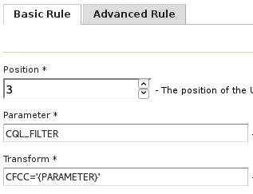

.. _community_params_extractor:

Parameters Extractor
===============

This module allow us to entering specific request parameters as url path fragments instead of using the query string.
For example, we want to be able to apply a cql_filter using a URL in the following form::

    /geoserver/<workspace>/<layer>/<filter>/ows?service=WMS&version=1.3.0&request=GetMap

As a simple example of usage, if the <filter> is something like::

    K_140M

the URL would become::

    /geoserver/<workspace>/<layer>/K_140M/ows?service=WMS&version=1.3.0&request=GetMap

and this module will translate the URL to this new one::

    /geoserver/<workspace>/<layer>/ows?service=WMS&version=1.3.0&request=GetMap&cql_filter=seq='K140M'

This module is configuraed by a set of rules that will be applied to the incoming URLs. In a user perspective there is two types of rules: the basic rules and the advanced rules.

Basic Rules
-----------------------------------

Basic rules allow us to handle simple uses cases where we only want to extract a parameter from the URL. 

A basic rule is defined by three mandatory attributes:

.. list-table::
   :widths: 20 80

   * - **Attribute**
     - **Description**
   * - ``Position``
     - The position of the URL base path element to be selected
   * - ``Parameter``
     - The name of the parameter produced by this rule
   * - ``Transform``
     - Expression that defines the value of the parameter, use {PARAMETER} as a placeholder for the selected path element

Example of a basic rule:

   *Example of a basic rule defined in the UI*

This rule will transform the URL::

    /geoserver/tiger/wms/H11?SERVICE=WMS&VERSION=1.1.1&REQUEST=GetMap

in::

    /geoserver/tiger/wms?SERVICE=WMS&VERSION=1.1.1&REQUEST=GetMap&CQL_FILTER=CFCC%3D%27H11%27

Advanced Rules
-----------------------------------

Advanced rules allow us to handle more complex uses cases where more flexibility is required. 

An advanced rule is defined by three mandatory attributes and four optional ones:

.. list-table::
   :widths: 10 80 10

   * - **Attribute**
     - **Description**
     - **Mandatory**
   * - ``Match``
     - Regex match expression with groups, for example ^(?:/[^/]*){3}(/([^/]+)).*$ selects the URL base path third element
     - Yes
   * - ``Activation``
     - If defined this rule will only be applied to URLs that match this regex expression
     - No
   * - ``Parameter``
     - The name of the parameter produced by this rule
     - Yes
   * - ``Transform``
     - Expression that defines the value of the parameter, use $1 ... $n as placeholders for groups defined in the match expression
     - Yes
   * - ``Remove``
     - The match expression group to be removed from URL, by default 1
     - No
   * - ``Combine``
     - Defines how to combine parameter existing value ($1 existing value, $2 new value), by default the value is overridden
     - No

Example of an advanced rule:

.. figure:: images/advanced_rule.png
   :align: center

   *Example of an advanced rule defined in the UI*

This rule will transform the URL::

    /geoserver/tiger/wms/H11?SERVICE=WMS&VERSION=1.1.1&REQUEST=GetMap&CQL_FILTER=CFCC%3D%27D68%27

in::

    /geoserver/tiger/wms?SERVICE=WMS&VERSION=1.1.1&REQUEST=GetMap&CQL_FILTER=CFCC%3D%27D68%27+or+CFCC%3D%27H11%27