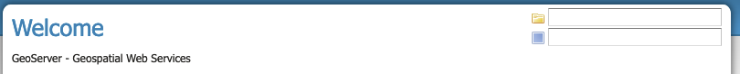

.. _production_config:

Configuration Considerations
============================

Use production logging
----------------------

Logging may visibly affect the performance of your server. High logging levels are often necessary to track down issues, but by default you should run with low levels.  (You can switch the logging levels while GeoServer is running.)

You can change the logging level in the :ref:`config_globalsettings_log_profile`.  You will want to choose the ``PRODUCTION`` logging configuration, where only problems are written to the log files.

Logging configuration hardening
-------------------------------

For production systems, it is advised to set ``GEOSERVER_LOG_LOCATION`` parameter during startup. The value may be defined as either an environment variable, java system property, or servlet context parameter.

The location set for ``GEOSERVER_LOG_LOCATION`` has priority, causing the value provided using the Admin Console GUI or REST API to be ignored. This approach establishes a separation of responsibility between those setting up and controlling the actual machine, and those configuring the GeoServer application.

See :ref:`logging` for more information.

Set a service strategy
----------------------

A service strategy is the method in which output is served to the client.  This is a balance between proper form (being absolutely sure of reporting errors with the proper OGC codes, etc) and speed (serving output as quickly as possible).  This is a decision to be made based on the function that GeoServer is providing.  You can configure the service strategy by modifying the :file:`web.xml` file of your GeoServer instance.

The possible strategies are:

.. list-table::
   :widths: 20 80

   * - **Strategy**
     - **Description**
   * - ``SPEED``
     - Serves output right away. This is the fastest strategy, but proper OGC errors are usually omitted.
   * - ``BUFFER``
     - Stores the whole result in memory, and then serves it after the output is complete.  This ensures proper OGC error reporting, but delays the response quite a bit and can exhaust memory if the response is large.
   * - ``FILE``
     - Similar to ``BUFFER``, but stores the whole result in a file instead of in memory. Slower than ``BUFFER``, but ensures there won't be memory issues.
   * - ``PARTIAL-BUFFER`` 
     - A balance between ``BUFFER`` and ``SPEED``, this strategy tries to buffer in memory a few KB of response, then serves the full output.

Personalize your server
-----------------------

This is isn't a performance consideration, but is just as important.  In order to make GeoServer as useful as possible, you should customize the server's metadata to your organization.  It may be tempting to skip some of the configuration steps, and leave in the same keywords and abstract as the sample, but this will only confuse potential users.

Suggestions:

* Fill out the WFS, WMS, and WCS :ref:`service_metadata` sections (this info will be broadcast as part of the capabilities documents)
* Serve your data with your own namespace (and provide a correct URI)
* Remove default layers (such as ``topp:states``)

Configure service limits
------------------------

Make sure clients cannot request an inordinate amount of resources from your server.

In particular:

* Set the :ref:`maximum amount of features <services_webadmin_wfs>` returned by each WFS GetFeature request (this can also be set on a per featuretype basis by modifying the :ref:`layer publishing wfs settings <data_webadmin_layers>`).
* Set the :ref:`WMS request limits <wms_configuration>` so that no request will consume too much memory or too much time
* Set :ref:`WPS limits <webadmin_wps>`, so no process will consume too much memory or too much time. You may also limit the :ref:`size input parameters <wps_security>` for further control.

Set security for data modification
----------------------------------

GeoServer includes support for WFS-T (transactions) by default, which lets users modify your data.

If you don't want your database modified, you can turn off transactions in the :ref:`services_webadmin_wfs`. Set the :guilabel:`Service Level` to ``Basic``. For extra security, we recommend any database access use datastore credentials providing read-only permissions. This will eliminate the possibility of a SQL injection (though GeoServer is generally not vulnerable to that sort of attack).

If you would like some users to be able to modify data, set the service level :guilabel:`Service Level` to ``Transactional`` (or ``Complete``) and use :ref:`security_service` to limit access to the `WFS.Transaction` operation.

If you would like some users to be able to modify some but not all of your data, set the :guilabel:`Service Level` to ``Transactional`` (or ``Complete``), and use :ref:`security_layer` to limit write access to specific layers. Data security can be used to allow write access based on workspace, datastore, or layer security.

Cache your data
---------------

Server-side caching of WMS tiles is the best way to increase performance.  In caching, pre-rendered tiles will be saved, eliminating the need for redundant WMS calls.  There are several ways to set up WMS caching for GeoServer.  GeoWebCache is the simplest method, as it comes bundled with GeoServer.  (See the section on :ref:`gwc` for more details.)  Another option is `TileCache <http://tilecache.org>`__.

You can also use a more generic non-spatial caching system, such as `OSCache <http://www.opensymphony.com/oscache/>`__ (an embedded cache service) or `Squid <http://www.squid-cache.org>`__ (a web cache proxy).

Caching is also possible for WFS layers, in a very limited fashion. For DataStores that don't have a quick way to determine feature counts (e.g. shapefiles), enabling caching can prevent querying a store twice during a single request. To enable caching, set the Java system property ``org.geoserver.wfs.getfeature.cachelimit`` to a positive integer. Any data sets that are smaller than the cache limit will be cached for the duration of a request, which will prevent the dataset from being queried a second time for the feature count. Note that this may adversely affect some types of DataStores, as it bypasses any feature count optimizations that may exist.

Welcome page selectors
----------------------

The workspace and layer selectors migth take a lot of time to fill up against large catalogs. Because of this, GeoServer tries to limit the time taken to fill them (by default, 5 seconds), and the amount of items in them (by default, ``1000``), and will fall back on simple text fields if the time limit is reached.

In some situations, that won't be enough and the page might get stuck anyways. The following properties can be used to tweak the behavior:

*  ``GeoServerHomePage.selectionMode`` : can be set to ``text`` to always use simple text fields, ``dropdown`` to always use dropdowns, or ``auto`` to use the default automatic behavior.
* ``GeoServerHomePage.selectionTimeout`` : the time limit in milliseconds, defaults to ``5000``.
* ``GeoServerHomePage.selectionMaxItems`` : the maximum number of items to show in the dropdowns, defaults to ``1000``.

When using ``text`` selection mode the page description is static, no longer offering of available workspace and layers.

   
   Welcome page text selection mode

Disable the GeoServer web administration interface
--------------------------------------------------

In some circumstances, you might want to completely disable the web administration interface.  There are two ways of doing this:

* Set the Java system property ``GEOSERVER_CONSOLE_DISABLED`` to true by adding ``-DGEOSERVER_CONSOLE_DISABLED=true`` to your container's JVM options
* Remove all of the :file:`gs-web*-.jar` files from :file:`WEB-INF/lib`

Disable the Auto-complete on web administration interface login 
---------------------------------------------------------------

To disable the Auto Complete on Web Admin login form:

* Set the Java system property ``geoserver.login.autocomplete`` to off by adding ``-Dgeoserver.login.autocomplete=off`` to your container's JVM options
* If the browser has already cached the credentials, please consider clearing the cache or form data after setting the JVM option.

X-Frame-Options Policy
----------------------

In order to prevent clickjacking attacks GeoServer defaults to setting the X-Frame-Options HTTP 
header to SAMEORIGIN. This prevents GeoServer from being embedded into an iFrame, which prevents certain
kinds of security vulnerabilities. See the `OWASP Clickjacking entry <https://www.owasp.org/index.php/Clickjacking_Defense_Cheat_Sheet>`_ for details.

If you wish to change this behavior you can do so through the following properties:

* ``geoserver.xframe.shouldSetPolicy``: controls whether the X-Frame-Options filter should be set at all. Default is true.
* ``geoserver.xframe.policy``: controls what the set the X-Frame-Options header to. Default is ``SAMEORIGIN`` valid options are ``DENY``, ``SAMEORIGIN`` and ``ALLOW-FROM`` [uri]

These properties can be set either via Java system property, command line argument (-D), environment
variable or web.xml init parameter.

X-Content-Type-Options Policy
-----------------------------

In order to mitigate MIME confusion attacks (which often results in Cross-Site Scripting), GeoServer defaults to setting the ``X-Content-Type-Options: nosniff`` HTTP header.
See the `OWASP X-Content-Type-Options entry <https://cheatsheetseries.owasp.org/cheatsheets/HTTP_Headers_Cheat_Sheet.html#x-content-type-options>`_ for details.

If you wish to change this behavior you can do so through the following property:

* ``geoserver.xContentType.shouldSetPolicy``: controls whether the X-Content-Type-Options header should be set. Default is true.

This property can be set either via Java system property, command line argument (-D), environment
variable or web.xml init parameter.

OWS ServiceException XML mimeType
--------------------------------------------------

By default, OWS Service Exception XML responses have content-type set to ``application/xml``.

In case you want it set to ``text/xml`` instead, you need to setup the Java System properties:

* ``-Dows10.exception.xml.responsetype=text/xml`` for OWS 1.0.0 version
* ``-Dows11.exception.xml.responsetype=text/xml`` for OWS 1.1.0 version

.. _production_config_external_entities:

External Entities Resolution
----------------------------

When processing XML documents from service requests (POST requests, and GET requests with FILTER and SLD_BODY parameters) XML entity resolution is used to obtain any referenced documents. This is most commonly seen when the XML request provides the location of an XSD schema location for validation).

GeoServer provides a number of facilities to control external entity resolution:

* By default `http` and `https` entity resolution is unrestricted, with access to local `file` references prevented.
  
* To restrict `http` and `https` entity resolution::

     -DENTITY_RESOLUTION_ALLOWLIST
  
  The built-in allow list includes w3c, ogc, and inspire schema locations::
  
     www.w3.org|schemas.opengis.net|www.opengis.net|inspire.ec.europa.eu/schemas
     
  In addition the proxy base url is included, if available from global settings.
  
  Access to local `file` references remains restricted. 
  
* To allow additional external entity `http` and `https` locations use a comma or bar separated list::

     -DENTITY_RESOLUTION_ALLOWLIST=server1|server2|server3/schemas

* To turn off all restrictions (allowing ``http``, ``https``, and ``file`` references) use the global setting :ref:`config_globalsettings_external_entities`.
  
  This setting prevents ``ENTITY_RESOLUTION_ALLOWLIST`` from being used.
