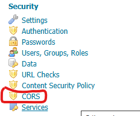
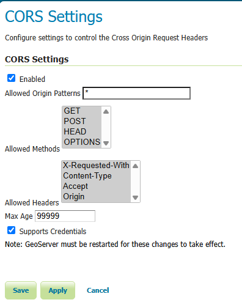

.. _production_container:

Container Considerations
========================

Java web containers such as `Tomcat <http://tomcat.apache.org>`_ or `Jetty <https://www.eclipse.org/jetty/>`_ ship with configurations that allow for fast startup, but don't always deliver the best performance.

Optimize your JVM
-----------------

Set the following performance settings in the Java virtual machine (JVM) for your container.  These settings are not specific to any container.

.. list-table::
   :widths: 40 60

   * - **Option**
     - **Description**
   * - ``-Xms128m``
     - By starting with a larger heap GeoServer will not need to pause and ask the operating system for more memory during heavy load. The setting ``-Xms128m`` will tell the virtual machine to acquire grab a 128m heap memory on initial startup.
   * - ``-Xmx756M``
     - Defines an upper limit on how much heap memory Java will request from the operating system  (use more if you have excess memory). By default, the JVM will use 1/4 of available system memory. The setting ``-Xms756m`` allocates 756MB of memory to GeoServer.
   * - ``-XX:SoftRefLRUPolicyMSPerMB=36000``
     - Increases the lifetime of "soft references" in GeoServer.  GeoServer uses soft references to cache datastore, spatial reference systems, and other data structures. By increasing this value to ``36000`` (which is 36 seconds) these values will stay in memory longer increasing the effectiveness of the cache.
   * - ``-XX:+UseParallelGC``
     - This garbage collector **pauses the application while using several threads to recover memory**. Recommended if your GeoServer will be under light load and can tolerate pauses to clean up memory.
   * - ``-XX:+UseParNewGC``
     - Enables use of the concurrent mark sweep (CMS) garbage collector **uses multiple threads to recover memory while the application is running**. Recommended for GeoServer under continuous use, with heap sizes of less than 6GB.
   * - ``–XX:+UseG1GC``
     - The default garbage collector since Java 9. Enables use of the `Garbage First Garbage Collector (G1) <http://www.oracle.com/technetwork/java/javase/tech/g1-intro-jsp-135488.html>`_ using **background threads to scan memory while the application is running** prior to cleanup. Recommended for GeoServer under continuous load and heap sizes of 6GB or more. Additionally you may experiment with ``-XX:+UseStringDeduplicationJVM`` to ask G1 to better manage common text strings in memory.

For more information about JVM configuration, see the article `Performance tuning garbage collection in Java <http://www.petefreitag.com/articles/gctuning/>`_ and `The 4 Java Garbage Collectors <http://blog.takipi.com/garbage-collectors-serial-vs-parallel-vs-cms-vs-the-g1-and-whats-new-in-java-8/>`_.

.. note::

   You can only use one garbage collector at a time. Please refrain from combining garbage collectors at runtime.

.. note:: 
   
   If you're serving just vector data, you'll be streaming, so having more memory won't increase performance.  If you're serving coverages, however, image processing will use a tile cache and benefit from more memory. As an administrator you can configure the portion of memory available as a tile cache (see the Server Config page in the :ref:`web_admin` section) - for example to use ``0.75`` to allocate ``75%`` of the heap as a tile cache.

.. note::
   
   You can try out memory settings on the command line to check settings/defaults prior to use.
   
   To check settings use ``java -Xms128m -Xmx756m -XX:+PrintFlagsFinal -version | grep HeapSize``::
   
      uintx InitialHeapSize   := 134217728     {product}
      uintx MaxHeapSize       := 792723456     {product}

   Which when converted from bytes matches ``128`` MB initial heap size, and ``756`` MB max heap size.
   
   Check defaults for your hardware using ``java -XX:+PrintFlagsFinal -version | grep HeapSize``::

      uintx InitialHeapSize   := 268435456     {product}
      uintx MaxHeapSize       := 4294967296    {product}
    
   The above results (from a 16 GB laptop) amount to initial heap size of 256m, and a max heap size of around 4 GB (or around 1/4 of system memory).

.. _production_container.marlin:

Use newer Marlin rasterizer
----------------------------

To use a newer version of Marlin than that provided by your JVM, add the following to the JVM startup options::

     -Xbootclasspath/a:$MARLIN_JAR
     -Dsun.java2d.renderer=org.marlin.pisces.MarlinRenderingEngine

where ``$MARLIN_JAR`` is the location of the ``marlin*.jar`` file located in the geoserver/WEB-INF/lib directory or downloaded from the `Marlin project <https://github.com/bourgesl/marlin-renderer/>`_.

The server status page shows which renderer is being used.

.. _production_container.enable_cors:

Enable CORS
-----------

`Enable Cross-Origin Resource Sharing (CORS) <https://enable-cors.org/>`_ allows JavaScript applications (such as OpenLayers or Leaflet) running on different domains to make requests to your GeoServer.

GeoServer provides a built-in configuration interface to enable CORS. This is the preferred method for both the standalone (embedded Jetty) and WAR (Tomcat) distributions, as it eliminates the need to manually edit configuration files.

Using the GeoServer Web Administration Interface
''''''''''''''''''''''''''''''''''''''''''''''''

1. Log in to the GeoServer Web Admin interface as an administrator.
2. Navigate to :menuselection:`Settings --> Global`.
3. Locate the **CORS Settings** section.

4. Check the **Enabled** box.
5. Configure the following options as needed:
   
   * **Allowed Origin Patterns**: A comma-separated list of origins (e.g., ``http://example.com, https://myapp.org``). Wildcards (``*``) can be used to allow all origins.
   * **Allowed Methods**: Select the HTTP methods permitted (usually GET, POST, OPTIONS).
   * **Allowed Headers**: Specify which headers can be used during the actual request.
   * **Max Age**: How long the results of a preflight request can be cached by the browser (in seconds).
   * **Supports Credentials**: Whether the request can include user credentials (cookies, HTTP authentication).

6. Click **Save** at the bottom of the page.

.. warning::
   GeoServer must be restarted for these changes to take effect.

Manual Configuration (Tomcat only)
''''''''''''''''''''''''''''''''''

While the UI method above is recommended, administrators using Tomcat may still configure CORS manually via :file:`web.xml` if desired. Please note that enabling the manual configuration is not compatible with the built-in configuration.  Running them simultaneously will result in multiple allow origin values and will cause browser CORS failures.  For detailed options, see the `Tomcat CORS Filter documentation <https://tomcat.apache.org/tomcat-9.0-doc/config/filter.html#CORS_Filter>`_.

1. Uncomment the following ``<filter>`` in :file:`webapps/geoserver/WEB-INF/web.xml`:

   .. literalinclude:: /../../../../src/web/app/src/main/webapp/WEB-INF/web.xml
      :start-at:    <!-- Uncomment following filter to enable CORS in Tomcat. 
      :end-at: -->

   Note that in some cases you may have to replace the asterisk (*) param-value for cors.allowed.methods with an explicit list: Content-Type,X-Requested-With,accept,Origin,Access-Control-Request-Method,Access-Control-Request-Headers,Authorization

2. Uncomment the following ``<filter-mapping>``:

   .. literalinclude:: /../../../../src/web/app/src/main/webapp/WEB-INF/web.xml
      :start-at: <!-- Uncomment following filter-mapping to enable CORS
      :end-at: -->

3. Restart