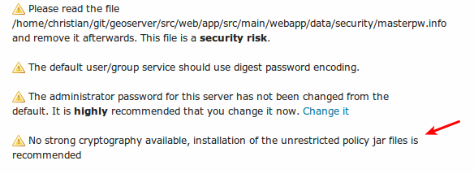

.. _production_java:

Java Considerations
===================

Use supported JRE
-----------------

GeoServer's speed depends a lot on the chosen Java Runtime Environment (JRE). The latest versions of GeoServer are tested with both Oracle JRE and OpenJDK. Implementations other than those tested may work correctly, but are generally not recommended.

Tested:

* Java 11 - GeoServer 2.15.x and above (OpenJDK tested)
* Java 8 - GeoServer 2.9.x and above (OpenJDK and Oracle JRE tested)
* Java 7 - GeoServer 2.6.x to GeoServer 2.8.x (OpenJDK and Oracle JRE tested)
* Java 6 - GeoServer 2.3.x to GeoServer 2.5.x (Oracle JRE tested)
* Java 5 - GeoServer 2.2.x and earlier (Sun JRE tested)

For best performance we recommend the use *Oracle JRE 8* (also known as JRE 1.8).

.. Further speed improvements can be released using `Marlin renderer <https://github.com/bourgesl/marlin-renderer>`__ alternate renderer.

As of GeoServer 2.0, a Java Runtime Environment (JRE) is sufficient to run GeoServer.  GeoServer no longer requires a Java Development Kit (JDK).

Running on Java 11
------------------

GeoServer 2.15 will run under Java 11 with no additional configuration on **Tomcat 9** or newer and **Jetty 9.4.12** or newer.

Running GeoServer under Java 11 on other Application Servers may require some additional configuration. Some Application Servers do not support Java 11 yet.

* **Wildfly 14** supports Java 11, with some additional configuration - in the run configuration, under VM arguments add:

      --add-modules=java.se

  Future WildFly releases should support Java 11 with no additional configuration.

* **GlassFish** does not currently Java 11, although the upcoming 5.0.1 release is expected to include support for it.

* **WebLogic** do not yet support Java 11.

 
GeoServer cleanup
`````````````````

Once the installation is complete, you may optionally remove the original JAI files from the GeoServer ``WEB-INF/lib`` folder::

   jai_core-x.y.z.jar
   jai_imageio-x.y.jar 
   jai_codec-x.y.z.jar
   

where ``x``, ``y``, and ``z`` refer to specific version numbers.

.. _java_policyfiles:

Installing Unlimited Strength Jurisdiction Policy Files
-------------------------------------------------------
These policy files are needed for unlimited cryptography. As an example, Java does not support AES
with a key length of 256 bit. Installing the policy files removes these restrictions.

Open JDK
````````

Since Open JDK is Open Source, the policy files are already installed.   

Oracle Java
```````````

The policy files are available at   

* `Java 8 JCE policy jars <http://www.oracle.com/technetwork/java/javase/downloads/jce8-download-2133166.html>`_ 
* `Java 7 JCE policy jars <http://www.oracle.com/technetwork/java/javase/downloads/jce-7-download-432124.html>`_
* `Java 6 JCE policy jars <http://www.oracle.com/technetwork/java/javase/downloads/jce-6-download-429243.html>`_

The download contains two files, **local_policy.jar** and  **US_export_policy.jar**. The default
versions of these two files are stored in JRE_HOME/lib/security. Replace these two files with the
versions from the download. 


Test if unlimited key length is available
"""""""""""""""""""""""""""""""""""""""""

Start or restart GeoServer and login as administrator. The annotated warning should have disappeared.



Additionally, the GeoServer log file should contain the following line::

   "Strong cryptography is available"

.. note::

   The replacement has to be done for each update of the Java runtime. 

IBM Java
````````

The policy files are available at

* `IBM JCE policy jars <https://www14.software.ibm.com/webapp/iwm/web/preLogin.do?source=jcesdk>`_ 

An IBM ID is needed to log in. The installation is identical to Oracle.

 
Outdated: install native JAI and ImageIO extensions
---------------------------------------------------

The `Java Advanced Imaging API <http://www.oracle.com/technetwork/java/javase/tech/jai-142803.html>`_ (JAI) is an advanced image processing library built by Oracle.  GeoServer uses JAI-EXT, a set
of replacement operations with bug fixes and NODATA support, for  all image processing. 

In case there is no interest in NODATA support, one can disable JAI-EXT and install the native JAI extensions to improve raster processing performance.

.. warning:: Users should take care that *JAI* native libraries remove support for NODATA pixels, provided instead by the pure Java JAI-EXT libraries.

Before installing native JAI, JAI-EXT can be disabled adding the following system variable to the JVM running GeoServer::

	-Dorg.geotools.coverage.jaiext.enabled=false

Native JAI and ImageIO extensions are available for:

+----------+-----------+-----------+
| System   | 32-bit    | 64-bit    |
+==========+===========+===========+
| Windows  | available |           |
+----------+-----------+-----------+
| Linux    | available | available |
+----------+-----------+-----------+
| Solaris  | available | available |
+----------+-----------+-----------+
| Max OSX  |           |           |  
+----------+-----------+-----------+

.. warning:: A system installations of JAI and ImageIO may conflict with the pure java copy of JAI and ImageIO included in your GeoServer ``WEB-INF/lib`` folder - producing "class cast exceptions" preventing your application server from starting GeoServer.
    
    * When installed as a "java extension" JAI and JAI ImageIO are unpacked into your JRE as both native code (in ``bin``) and jars (in ``ext/libs``). If you encounter this problem after installation of native the JAI and ImageIO extensions remove the pure java implementation from your GeoServer instances ``WEB-INF/lib`` folder::
        
        rm jai_core-*jar jai_imageio-*.jar jai_codec-*.jar

    * On OSX jars may be installed in ``~/Library/Java/Extensions``, we advise removing these jars if present as they are no longer maintained by Apple.
   
.. note:: Native ImageIO encoding may not always be the best choice, we recommend the built-in :ref:`PNGJ based encoder <JAI>` and :ref:`community_libjpeg-turbo` for png8 and jpeg encoding performance.
   
Installing native JAI on Windows
````````````````````````````````

#. Go to the `JAI download page <http://download.java.net/media/jai/builds/release/1_1_3/>`_ and download the Windows installer for version 1.1.3. At the time of writing only the 32 bit version of the installer is available, so if you are using a JDK, you will want to download `jai-1_1_3-lib-windows-i586-jdk.exe <http://download.java.net/media/jai/builds/release/1_1_3/jai-1_1_3-lib-windows-i586-jdk.exe>`_, and if you are using a JRE, you will want to download `jai-1_1_3-lib-windows-i586-jre.exe <http://download.java.net/media/jai/builds/release/1_1_3/jai-1_1_3-lib-windows-i586-jre.exe>`_.
#. Run the installer and point it to the JDK/JRE install that GeoServer will use to run.
#. Go to the `JAI Image I/O download page <http://download.java.net/media/jai-imageio/builds/release/1.1/>`_ and download the Windows installer for version 1.1. At the time of writing only the 32 bit version of the installer is available, so if you are using a JDK, you will want to download `jai_imageio-1_1-lib-windows-i586-jdk.exe <http://download.java.net/media/jai-imageio/builds/release/1.1/jai_imageio-1_1-lib-windows-i586-jdk.exe>`_, and if you are using a JRE, you will want to download `jai_imageio-1_1-lib-windows-i586-jre.exe <http://download.java.net/media/jai-imageio/builds/release/1.1/jai_imageio-1_1-lib-windows-i586-jre.exe>`_
#. Run the installer and point it to the JDK/JRE install that GeoServer will use to run.

.. note:: These installers are limited to allow adding native extensions to just one version of the JDK/JRE on your system.  If native extensions are needed on multiple versions, manually unpacking the extensions will be necessary.  See the section on :ref:`native_JAI_manual_install`.

.. note:: These installers are also only able to apply the extensions to the currently used JDK/JRE.  If native extensions are needed on a different JDK/JRE than that which is currently used, it will be necessary to uninstall the current one first, then run the setup program against the remaining JDK/JRE.

Installing native JAI on Linux
``````````````````````````````

#. Go to the `OpenGeo JAI download page <http://data.opengeo.org/suite/jai/>`_ and download the Linux installer for version 1.1.3, choosing the appropriate architecture:

   * `i586` for the 32 bit systems
   * `amd64` for the 64 bit ones (even if using Intel processors)

#. Copy the file into the directory containing the JDK/JRE and then run it.  For example, on an Ubuntu 32 bit system::
  
    $ sudo cp jai-1_1_3-lib-linux-i586-jdk.bin /usr/lib/jvm/java-6-sun
    $ cd /usr/lib/jvm/java-6-sun
    $ sudo sh jai-1_1_3-lib-linux-i586-jdk.bin
    # accept license 
    $ sudo rm jai-1_1_3-lib-linux-i586-jdk.bin
  
#. Go to the `OpenGeo JAI Image I/O Download page <http://data.opengeo.org/suite/jai/>`_ and download the Linux installer for version 1.1, choosing the appropriate architecture:

   * `i586` for the 32 bit systems
   * `amd64` for the 64 bit ones (even if using Intel processors)

#. Copy the file into the directory containing the JDK/JRE and then run it.  If you encounter difficulties, you may need to export the environment variable ``_POSIX2_VERSION=199209``. For example, on a Ubuntu 32 bit Linux system::
  
    $ sudo cp jai_imageio-1_1-lib-linux-i586-jdk.bin /usr/lib/jvm/java-6-sun
    $ cd /usr/lib/jvm/java-6-sun
    $ sudo su
    $ export _POSIX2_VERSION=199209
    $ sh jai_imageio-1_1-lib-linux-i586-jdk.bin
    # accept license
    $ rm ./jai_imageio-1_1-lib-linux-i586-jdk.bin
    $ exit

.. _native_JAI_manual_install:

Installing native JAI manually
``````````````````````````````

You can install the native JAI manually if you encounter problems using the above installers, or if you wish to install the native JAI for more than one JDK/JRE.

Please refer to the `GeoTools page on JAI installation <http://docs.geotools.org/latest/userguide/build/install/jdk.html#java-extensions-optional>`_ for details.