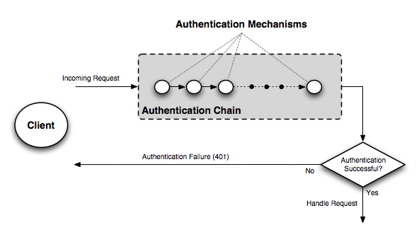

.. _security_auth_chain:

Authentication chain
====================

Understanding the **authentication chain** helps explain how GeoServer authentication works. The authentication chain processes requests and applies certain authentication mechanisms. Examples of authentication mechanisms include:

* **Username/password**—Performs authentication by looking up user information in an external user database
* **Browser cookie**—Performs authentication by recognizing previously sent browser cookies (also known as "Remember Me")
* **LDAP**—Performs authentication against an LDAP database
* **Anonymous**—Essentially performs no authentication and allows a request to proceed without any credentials

Multiple authentication mechanisms may be active within GeoServer at a given time. The following
figure illustrates the flow of a generic request.

   *Flow of a request through the authentication system*

Before dispatching a request to the appropriate service or handler, GeoServer first filters the request through the authentication chain. The request is passed to each mechanism in the chain in order, and each is given the chance to authenticate the request. If one of the mechanisms in the chain is able to successfully authenticate, the request moves to normal processing. Otherwise the request is not routed any further and an authorization error (usually a HTTP 401) is returned to the user.

Filter chain and provider chain
-------------------------------

In the case of GeoServer, the authentication chain is actually made up of two chains: a **filter chain**, which determine if further authentication of a request is required, and a **provider chain**, which performs the actual authentication.

.. figure:: images/auth_chain2.png
   :align: center

   *Detail of authentication chain, showing filter chain and provider chain*

The filter chain performs a variety of tasks, including:

* Gathering user credentials from a request, for example from Basic and Digest Authentication headers
* Handling events such as ending the session (logging out), or setting the "Remember Me" browser cookie
* Performing session integration, detecting existing sessions and creating new sessions if necessary
* Invoking the authentication provider chain to perform actual authentication

The filter chain is actually processed twice, before and after the request is handled. 

The provider chain is concerned solely with performing the underlying authentication of a request. It is invoked by the filter chain when a filter determines that authentication is required.

Filter chain by request type
-----------------------------

A different **filter chain** can be applied to each different type of request in GeoServer. This happens because the administrator can configure a list of different filter chains and a matching
rule for each of them. Only the first matching chain of the configured ordered list will be applied to any given request.

Matching rules can be applied to:
 * HTTP Method (GET, POST, etc.)
 * one or more ANT patterns for the path section of the request (e.g /wms/\*\*); if more than one pattern (comma delimited) is specified, any of them will match
 * an optional regular expression to match parameters on the query string, for one or more of the specified ANT pattern; if the path matches, also the query string is checked for matching; the regular expression can be specified after the ANT pattern, with a pipe (|) separator

ANT Patterns support the following wildcards:
 * \? matches one character
 * \* matches zero or more characters
 * \*\* matches zero or more 'directories' in a path
 
Query String regular expressions will match the full query string (^ and $ terminators are automatically appended), so to match only part of it, remember to prefix and postfix the expression with .\* (e.g. .\*request=getcapabilities.\*)
 
Examples of rules (ANT patterns and query string regular expressions)
^^^^^^^^^^^^^^^^^^^^^^^^^^^^^^^^^^^^^^^^^^^^^^^^^^^^^^^^^^^^^^^^^^^^^

.. list-table:: 
   :widths: 60 40 
   :header-rows: 1
   
   * - Pattern
     - Description
   * - /wms, /wms/**
     - simple ANT pattern
   * - /wms|.*request=GetMap.*
     - ANT pattern and querystring regex to match one parameter
   * - /wms|(?=.*request=getmap)(?=.*format=image/png).*
     - ANT pattern and querystring regex to match two parameters in any order
   * - /wms|(?=.*request=getmap)(?!.*format=image/png).*
     - ANT pattern and querystring regex to match one parameters and be sure another one is not matched

     
