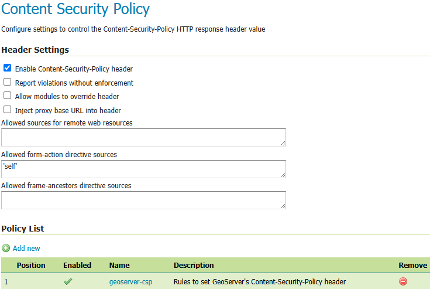

.. _security_csp:

Content Security Policy
=======================

The :guilabel:`Content Security Policy` page controls how GeoServer prepares the Content-Security-Policy
(CSP) HTTP response headers, used to mitigate cross-site scripting and clickjacking attacks.

Default Configuration
---------------------

The default CSP configuration is intended to support many GeoServer use cases and allow users to
securely run GeoServer without having to modify the configuration. It may be updated in future
releases to fix bugs, support new features or enhance security.

The default header value for most GeoServer requests will be::

    base-uri 'self'; form-action 'self'; default-src 'none'; child-src 'self'; connect-src 'self'; font-src 'self'; img-src 'self' data:; style-src 'self' 'unsafe-inline'; script-src 'self';, frame-ancestors 'self';

and the ``'unsafe-inline'`` and ``'unsafe-eval'`` sources will be added to the ``script-src``
directive only for specific requests that may require unsafe JavaScript. The default configuration
may be updated as necessary by the GeoServer developers.

.. note::
    While the ``'self'`` script source should be sufficient to prevent most reflected cross-site
    scripting, it does leave the possibility of stored cross-site scripting by administrators
    with permissions to upload static web files. It is possible that future work will further
    restrict the default policy to completely disable JavaScript for most requests. See the
    :ref:`tutorials_staticfiles` page for instructions to disable that feature if it is not needed.

The current CSP configuration is stored in the file :file:`csp.xml`, located in the ``security``
directory in the GeoServer data directory. The default CSP configuration will be stored in the
file :file:`csp_default.xml` in the same directory. It is important that administrators do **NOT**
modify :file:`csp_default.xml`. In order to detect when new GeoServer releases update the default
configuration, GeoServer will check the current default configuration against the configuration in
:file:`csp_default.xml`. If they are found to be different:

* :file:`csp.xml` will be updated with the policies from the new default configuration if they
  have not been changed from the old default configuration. Other settings will not be changed.
* :file:`csp_default.xml` will be updated with the new default configuration.

Configuring CSP
---------------

Navigate to :menuselection:`Data > Content Security Policy` to manage and configure the CSP header.

   CSP Configuration

Use the :guilabel:`Enable Content-Security-Policy header` checkbox to enable/disable this feature.
This setting will enable/disable the CSP set by Wicket or any other modules setting their own CSP
unless :guilabel:`Allow modules to override header` is set to `true`.

Use the :guilabel:`Report violations without enforcement` checkbox to switch the header name from
``Content-Security-Policy`` to ``Content-Security-Policy-Report-Only``. This will tell the browser
to report CSP violations without enforcing their effects to allow administrators and developers to
experiment with different policies. This setting will apply to the CSP set by Wicket or any other
modules setting their own CSP unless :guilabel:`Allow modules to override header` is set to `true`.

Use the :guilabel:`Allow modules to override header` checkbox to allow Wicket web pages and other
modules to completely overwrite the header that is set by this configuration. By default, when the
CSP header is set by another component, GeoServer will attempt to append any non-fetch directives
from the old header value that are not already in the new value. This is primarily intended to add
the ``form-action`` and ``frame-ancestors`` directives to Wicket's CSP header.

Use the :guilabel:`Inject proxy base URL into header` checkbox to inject the proxy base URL into
the ``form-action`` directive and all fetch directives that normally allow ``'self'``. This is only
necessary for certain use cases where web browsers are able to access a GeoServer host directly
rather than through the proxy and the HTML response contains absolute URLs to the proxy base URL.
This does not guarantee that other browser restrictions will not prevent the page from functioning.
Enabling this with a proxy base URL set to ``https://geoserver.org`` would change the header value
at the top of this page to::

    base-uri 'self'; form-action 'self' https://geoserver.org; default-src 'none'; child-src 'self' https://geoserver.org; connect-src 'self' https://geoserver.org; font-src 'self https://geoserver.org'; img-src 'self' https://geoserver.org data:; style-src 'self' https://geoserver.org 'unsafe-inline'; script-src 'self' https://geoserver.org;, frame-ancestors 'self';

Use the :guilabel:`Allowed sources for remote web resources` text field to add sources to the
``font-src``, ``img-src``, ``style-src``, and ``script-src`` directives for static web files (if
not disabled by system property) and for WMS GetFeatureInfo HTML output (if enabled by system
property). This is intended to make it easier to allow loading these resources from a CDN or any
other remote host. Only trusted hosts should be added here to prevent cross-site scripting
attacks. The ``geoserver.csp.remoteResources`` system property will override this field if it has
been set. Setting this to ``'self' https://geoserver.org`` would set the following header value for
an HTML file in the static files directory::

    base-uri 'self'; form-action 'self'; default-src 'none'; child-src 'self'; connect-src 'self'; font-src 'self' https://geoserver.org; img-src 'self' https://geoserver.org data:; style-src 'self' https://geoserver.org 'unsafe-inline'; script-src 'self' https://geoserver.org;, frame-ancestors 'self';

Use the :guilabel:`Allowed frame-ancestors directive sources` text field to control the sources of
the ``frame-ancestors`` directive. This is intended to make it easier for administrators to allow
specific remote hosts to load GeoServer content in frames. Only trusted hosts should be added
here to prevent clickjacking attacks. The ``geoserver.csp.frameAncestors`` system property will
override this field if it has been set. Setting this to ``'self' https://geoserver.org`` would
change the header value at the top of this page to::

    base-uri 'self'; form-action 'self'; default-src 'none'; child-src 'self'; connect-src 'self'; font-src 'self'; img-src 'self' data:; style-src 'self' 'unsafe-inline'; script-src 'self';, frame-ancestors 'self' https://geoserver.org;

Configuring Policies
--------------------

Each policy contains the rules and directives to set a single CSP header value. When there are CSP
directives from multiple policies, the directives will be concatenated into a single line using
commas rather than setting multiple Content-Security-Policy headers. If a value for a specific
directive is defined in multiple policies, web browsers will use the strictest value set for that
directive.

The button for adding policies can be found at the top of the :guilabel:`Policy List` table and a
policy can be edited by clicking on its name in the table or removed by clicking on the remove icon
at the end of the policy's row in the table. Policy positions can also be changed by using the
up/down arrows or by dragging and dropping the rule's row in the table.

.. figure:: images/csp-policy.png

   CSP Policy Configuration

* A unique name must be provided in the :guilabel:`Name` text field when adding a new policy.
* The :guilabel:`Description` text field provides an optional description to help administrators
  understand what the policy does.
* The :guilabel:`Enabled` checkbox will enable/disable the policy.

.. note::
    After saving a policy, make sure to save/apply the configuration.

Configuring Rules
-----------------

Each rule contains a filter to match against user requests and the CSP directives to add to the
header value for matching requests. Rules will be checked in order against incoming requests and
only the first matching rule in each policy will be applied. If no rule in a policy matches the
request, then no directives will be added to the CSP header from that policy. If the matching
rule has no directives defined, then preceding rules will be checked until the first rule is
found that has directives and no directives will be added if no such rule exists.

The button for adding rules can be found at the top of the :guilabel:`Rule List` table and a rule
can be edited by clicking on its name in the table or removed by clicking on the remove icon at the
end of the rule's row in the table. Rule positions can also be changed by using the up/down arrows
or by dragging and dropping the rule's row in the table.

.. figure:: images/csp-rule.png

   CSP Rule Configuration

* A name that is unique among the rules within the specific policy must be provided in the
  :guilabel:`Name` text field when adding a new rule.
* The :guilabel:`Description` text field provides an optional description to help administrators
  understand what the rule does.
* The :guilabel:`Enabled` checkbox will enable/disable the rule.
* The :guilabel:`Request Filter` text field contains the filter to apply to each user request to
  determine whether to add this rule's directives to the CSP header value. (see
  :ref:`security_csp_filters` below)
* The :guilabel:`Header Directives` text field contains the CSP directives to add to the header
  value when a request matches this rule's filter. (see :ref:`security_csp_directives` below)

.. note::
    After saving a rule, make sure to save the policy and then save/apply the configuration.

.. _security_csp_filters:

Request Filters
---------------

The filter contains a string of predicates concatenated with the string ``AND`` and the rule's
directives will be applied to a request only if all of the predicates match the request. There
are three types of predicates that can be used:

* PATH(regex): Returns true if the URL-decoded request path matches the regular expression. The
  regex will be tested against the path that is relative to GeoServer's context root and starting
  with a forward slash.
  Example: ``PATH(^/([^/]+/){0,2}wms/?$)``
* PARAM(key_regex,value_regex): Returns true if all query parameters with a URL-decoded key that
  match the key_regex have a URL-decoded value that match the value_regex. The value regex will be
  tested against an empty string if no query parameters matched the key regex.
  Example: ``PARAM((?i)^service$,(?i)^wms$)``
* PROP(key,value_regex): Returns true if the value for the property key matches the regex. The key
  is case-sensitive and must contain must contain the string ``GeoServer``, ``GeoTools``, or
  ``GeoWebCache`` anywhere in the key (case-insensitive). The regex will be tested against an empty
  string if the property is not set. This is primarily intended for the default configuration and
  may not be useful to administrators.
  Example: ``PROP(GEOSERVER_CONSOLE_DISABLED,(?i)^(?!true$).*$)``

.. note::
    The ``(?i)`` at the beginning of the regular expression will use case-insensitive matching and
    enclosing the pattern inside of the ``^$`` characters will match the entire string. See the
    `Regular Expressions Tutorial <https://docs.oracle.com/javase/tutorial/essential/regex/>`_ for
    more information about how to use Java regular expressions.

Leaving the filter blank will cause this rule to match all requests and should only be used on the
last rule in a policy since any additional rules would never be checked.

.. _security_csp_directives:

Header Directives
-----------------

.. warning::
    GeoServer gives administrators complete control over the CSP header directives and sources and
    does not attempt to parse or validate them so it is the administrator's responsibility to
    verify that the header is working as intended when modifying this field. See
    :ref:`security_csp_references` for detailed information about valid Content Security Policy
    header directives and sources.

Property keys can be used in the directives in the form ``${key}`` and they will be replaced with
the property's value before being written to the header. Property keys must contain ``GeoServer``,
``GeoTools``, or ``GeoWebCache`` (case-insensitive) and property values must not contain special
characters that are not allowed in valid CSP sources. Properties can be set either via Java system
property, command line argument (-D), environment variable or web.xml init parameter.
``geoserver.csp.remoteResources`` and ``geoserver.csp.frameAncestors`` are special property keys
that will use the value from their corresponding fields in the CSP configuration if they are not
defined as properties.

``proxy.base.url`` is a special property key that can be used to add the proxy base URL into the
header if the request was not sent through the proxy. It will automatically be injected into the
form-action and all fetch directives with a ``'self'`` source when the
:guilabel:`Inject proxy base URL into header` feature is enabled. Only the protocol, host and port
of the proxy base URL will be added to the header. The ``X-Forwarded-Proto``, ``X-Forwarded-Host``,
``X-Forwarded-Port``, ``Forwarded`` and ``Host`` HTTP request headers are used to determine whether
or not the original request was sent to the proxy. Ensure that the proxy server is properly setting
these headers if the proxy base URL is being included in requests through the proxy and that is not
the desired behavior.

.. note::
    Because the CSP is set so early in GeoServer's request handling, a current limitation is that
    it can not use proxy base URLs that are built from the HTTP request headers.

Leaving the directives blank will cause this rule to use the directives from the first preceding
rule with directives. No header value will be assigned if all preceding rules have no directives.
It does not matter whether a rule is enabled or disabled when searching preceding rules for
directives. The keyword ``NONE`` can be used to specify that no header value will be assigned to
requests that match this rule.

Fallback Directives
-------------------

When an administrator is directly editing the CSP configuration file or uploading it through the
REST Resources API, it is possible to create a file that GeoServer cannot parse. In these cases,
GeoServer will fall back to using very strict header directives until the configuration file is
fixed. The ``geoserver.csp.fallbackDirectives`` property can be set either via Java system
property, command line argument (-D), environment variable or web.xml init parameter to change the
fallback directives from the default value::

    base-uri 'none'; form-action 'none'; default-src 'none'; frame-ancestors 'none';

The keyword ``NONE`` can be used to specify that no header value will be assigned to rquests when
there are CSP configuration errors.

Testing
-------

The :guilabel:`Test Content Security Policy` form allows a URL to be checked, reporting the CSP
header value that would be set for a GET request to that URL. This form will test the current CSP
configuration in the page to allow administrators to verify the changes before saving them to the
configuration file.

Enter the URL to test in the :guilabel:`Test URL` text field and press the :guilabel:`Test` button
to perform the test. The :guilabel:`Content-Security-Policy header value` text field will contain
the CSP for the test URL with the string `NONE` being shown if no header would be set.

.. figure:: images/csp-test.png

   Test CSP with URL

.. _security_csp_references:

References
----------

See the following pages for details about CSP:

* `OWASP Cheat Sheet <https://cheatsheetseries.owasp.org/cheatsheets/Content_Security_Policy_Cheat_Sheet.html>`_
* `Mozilla Reference <https://developer.mozilla.org/en-US/docs/Web/HTTP/Headers/Content-Security-Policy>`_
* `Wicket Reference <https://nightlies.apache.org/wicket/guide/10.x/single.html#_content_security_policy_csp>`_
