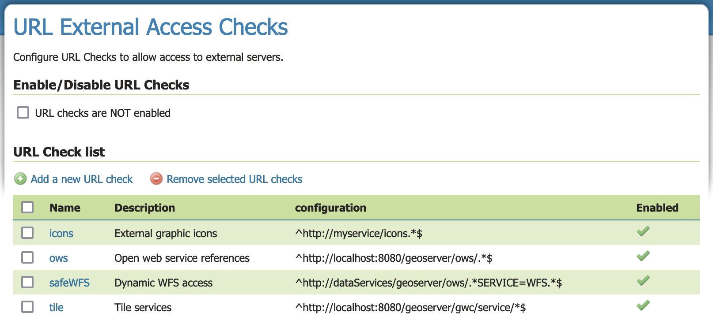
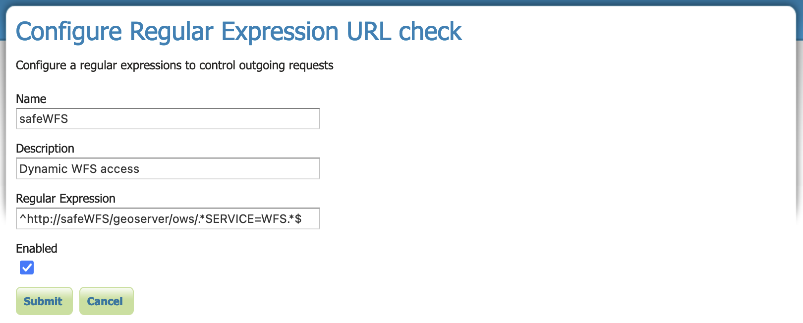
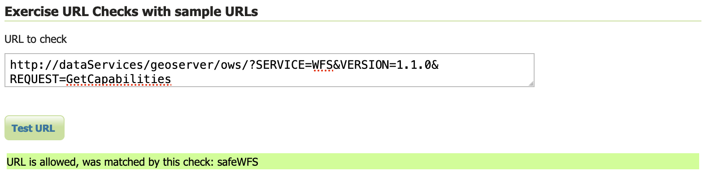

.. _security_urlchecks:

URL Checks
==========

The :guilabel:`URL External Access Checks` page controls the checks that are performed on user provided URLs that
GeoServer will use to access remote resources.

Currently, the checks are performed on the following functionality:

- WMS GetMap, GetFeatureInfo and GetLegendGraphic requests with remote SLD stylesheets (``sld`` parameter)
- Remote icons referenced by styles (access to icons in the data directory is always allowed)
- WMS GetMap and GetFeatureInfo requests in feature portrayal mode (``REMOTE_OWS`` and ``REMOTE_OWS_TYPE`` parameters)
- WPS remote inputs, either as GET or POST requests

Check this page for any additional remote service access checks added in the future.

Configuration of URL checks
---------------------------

Navigate to :menuselection:`Data > URL Checks` page to manage and configure URL Checks.

   URL Checks table

Use the :guilabel:`Enable/Disable URL Checks` enable this safety feature:

* When the :guilabel:`URL checks are enabled` checkbox is enabled, URL checks are performed to limit GeoServer access to remote resources as outlined above.
  
  Enabling URL checks is recommended to limit normal Open Web Service protocols interaction being used for Cross Site Scripting attacks.

* When checkbox disabled, :guilabel:`URL checks are NOT enabled`, GeoServer is provided unrestricted access to remote resources.
   
  Disabling URL Checks is not a secure or recommended setting.

Adding a regular expression based check
---------------------------------------

The buttons for adding and removing URL checks can be found at the top of the :guilabel:`URL Check list` table.

To add a URL Check, press the :guilabel:`Add new URL check` button. You will be prompted to enter URL check details (as described in :ref:`security_urlchecks_edit` below).

Removing a regular expression based check
-----------------------------------------

To remove a URL Check, select the checkbox next to one or more rows in the :guilabel:`URL Check list` table.
Press the :guilabel:`Remove selected URL checks` button to remove. You will be asked to confirm or cancel the removal. Pressing :guilabel:`OK` removes the selected URL Checks.

.. _security_urlchecks_edit:

Editing a URL Check
-------------------

Regular Expression URL checks can be configured, with the following parameters for each check:

.. list-table::
   :widths: 30 70 
   :header-rows: 1

   * - Field
     - Description
   * - Name
     - Name for the check, used to identify it in the list.
   * - Description
     - Description of the check, for later reference.
   * - Regular Expression
     - A regular expression used to match allowed URLs
   * - Enabled
     - Check box to enable or disable the check

   
   Configure Regular Expression URL check

Testing URL checks
------------------

The :guilabel:`Test URL Checks with external URL` form allows a URL to be checked, reporting if access is allowed or disallowed.

Test URL Checks form:

.. list-table::
   :widths: 30 70 
   :header-rows: 1

   * - Field
     - Description
   * - URL to check 
     - Supply URL of external resource to check if access is allowed

Press the :guilabel:`Test URL` button to perform the checks. If at least one URL Check matches the URL, it will be allowed and the test will indicate the URL Check permitting access. Otherwise it will be rejected and the test will indicate that no URL Check matched.

   
   Test URL Checks with external URL
   
Example RegEx Patterns
----------------------

The most common pattern allows matching a given host name to allow external graphics from a remote server. This pattern uses ``^`` to mark the start, the host URL, ``.*`` to match anything, and ``$`` to end - as shown in the in following pattern:

``^https://styles\.server\.net/.*$``

::

  https://styles.server.net/logo.png

To allow external graphics from a specific directory on a remote server:

``^https://styles\.server\.net/icons/.*$``

::

   https://styles.server.net/icons/forest.png

When working with external graphics making use of SVG parameters use ``(\?.*)?$`` to optionally allow any query parameters after ``?``:

``^https://styles\.server\.net/icons/.*(\?.*)?$``

:: 
   
   https://styles.server.net/icons/forest.png
   https://styles.server.net/icons/forest.svg?color=darkgreen

When obtaining content from an API ``\?.*`` is used (as there is no need to support relative paths). As an example ``/geoserver/ows\?`` is used below to access the GeoServer Open Web Service API:

``^https?://localhost:8080/geoserver/ows\?.*$``

::
   
   http://localhost:8080/geoserver/ows?service=WMS&version=1.3.0&request=GetCapabilities

To allow for GeoServer virtual web services ``(\w+/)?`` is used for optional workspace name:

``^https?://localhost:8080/geoserver/(\w+/)?ows\?.*$``

::

   http://localhost:8080/geoserver/ows?service=WMS&version=1.3.0&request=GetCapabilities
   http://localhost:8080/geoserver/ne/ows?service=WMS&version=1.3.0&request=GetCapabilities

To limit to Web Feature Service ``?.*SERVICE=WFS.*`` is used to restrict query parameter:

``^https?://localhost:8080/geoserver/(\w+/)?ows\?.*SERVICE=WFS.*?$``

::
   
   http://localhost:8080/geoserver/tiger/ows?SERVICE=WFS&VERSION=1.0.0&REQUEST=GetFeature&TYPENAME=giant_polygon

To allowing WMS ``REMOTE_OWS`` data access to an external GeoServer WFS service:

``^https://mapping\.server\.net/geoserver/(\w+/)?ows\?.*SERVICE=WFS.*$``

::

  https://mapping.server.net/geoserver/ows?SERVICE=WFS&VERSION=1.0.0&REQUEST=GetFeature&TYPENAME=roads

To allow external graphic access to a remote GeoServer icons:

``^https://mapping\.server\.net/geoserver/styles/.*(\?.*)?$``

::

   https://mapping.server.net/geoserver/styles/grass_fill.png
   https://mapping.server.net/geoserver/styles/ne/airport.svg?fill=gray

File paths can also be checked:

``^/var/opt/geoserver/data/.*$``

::
   
   /var/opt/geoserver/data/example.tiff

``^D:\\\\data\\.*$``

::
   
   D:\\data\example.tiff

.. note::

   The locations being checked are normalizedmaking it easier to write RegEx patterns:

   * URLs paths have been normalized to remove any redundant ``\.`` or ``\..`` paths have been removed
   * File URLs have been normalized so that ``file:/`` is represented as ``file:///``
   * File paths have been normalized using ``/`` on linux and ``\\`` on windows

.. note::

   Web sites are available to help define a valid Java regular expression pattern. These tools can be used to interpret, explain and test regular expressions. For example:

   * https://regex101.com/ (enable the Java 8 flavor)
   * https://www.freeformatter.com/java-regex-tester.html 