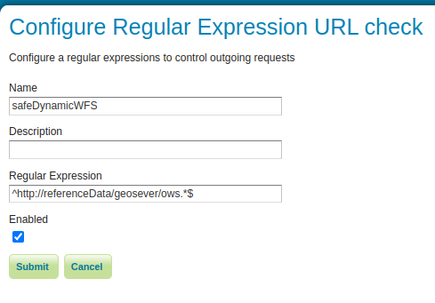

.. _security_urlchecks:

URL Checks
==========

The URL checks page controls the checks that are performed on user provided URLs that
GeoServer will use to access remote resources.

Currently, the checks are performed on the following functionality:

- WMS GetMap requests with remote SLD stylesheets (``sld``` parameter)
- Remote icons referenced by styles (access to icons in the data directory is always allowed)
- WMS GetMap in feature portrayal mode (``REMOTE_OWS`` and ``REMOTE_OWS_TYPE`` parameters)
- WPS remote inputs, either as GET or POST requests

More functionality might go under this kind of scrutiny in the future, check this page
for eventual updates.

Configuration of URL checks
---------------------------

The "URL checks" page under the Security section allows configuration of the URL checks.

.. figure:: images/urlchecks.png

   URL Checks page

The top check box allows to enable or disable the URL checks. If disabled, no URL checks
will be performed. This is not a secure setting, but could be used to upgrade existing 
applications where GeoServer is not directly exposed to the public internet, and the
requests are controlled by a front application validating all inputs.

The list of checks allows to add, remove and edit the checks.

Adding a regular expression based check
---------------------------------------

Currently, regular expression based checks can be configured, with the following parameters for each check:

- **Name**: a name for the check, used to identify it in the list.
- **Description**: a description of the check, for later reference.
- **Regular expression**: a regular expression to match the URL to check.
- **Enabled**: a check box to enable or disable the check.



   The regular expression based check

The most common URL patter type, allowing matches prefixed by a given host name, follows the following pattern:

``^https?://(www\.)?example\.com/.*$`` 

Numerous web site can help building a valid Java regular expression patter, interpret and explain it,
as well as test it. For example:

* https://regex101.com/ (enabled the Java 8 flavor)
* https://www.freeformatter.com/java-regex-tester.html 


Testing URL checks
------------------

The bottomg of the URL checks page contains a form to test the URL checks. The form allows to enter
a given URL, and will perform the checks on it, reporting the results.

If at least one URL check matches the URL, it will be allowed, otherwise it will be rejected and the
request will provide an exception report.