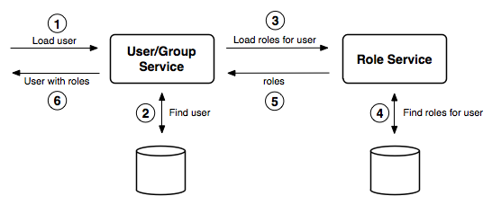

.. _security_rolesystem_interaction:

Interaction between user/group and role services
================================================

The following section describes the interaction between the :ref:`security_rolesystem_usergroupservices` and the :ref:`security_rolesystem_roleservices`.

Calculating the roles of a user
-------------------------------

The diagram below illustrates how a user/group service and a role service interact to calculate user roles.

   *User/group and role service interacting for role calculation*

On fetching an enabled user from a user/group service, the roles(s) assigned to that user must be identified. The identification procedure is:

#. Fetch all enabled groups for the user. If a group is disabled, it is discarded.
#. Fetch all roles associated with the user and add the roles to the result set.
#. For each enabled group the user is a member of, fetch all roles associated with the group and add the roles to the result set.
#. For each role in the result set, fetch all ancestor roles and add those roles to the result set.
#. Personalize each role in the result set as required.
#. If the result set contains the local admin role, add the role ``ROLE_ADMINISTRATOR``.
#. If the result set contains the local group admin role, add the role ``ROLE_GROUP_ADMIN``.

.. note::

   Role personalization looks for role parameters (key/value pairs) for each role and checks if the user properties (key/value pairs) contain an identical key. If any matches are found, the value of the role parameter is replaced by the value of the user property.

Authentication of user credentials
----------------------------------

A user/group service is primarily used during authentication. An authentication provider in the :ref:`security_auth_chain` may use a user/group service to authenticate user credentials. 

.. figure:: images/usergrouprole2.png
   :align: center

   *Using a a user/group service for authentication*

GeoServer defaults
------------------

The following diagram illustrates the default user/group service, role service, and authentication provider in GeoServer:

.. figure:: images/usergrouprole3.png
   :align: center

   *Default GeoServer security configuration*

Two authentication providers are configured—the *Root* provider and the *Username/password* provider. The *Root* provider authenticates for the GeoServer :ref:`security_root` and does not use a user/group service. The *Username/password* provider is the default provider and relays username and password credentials to a user/group service.

A single user/group service, which persist the user database as XML, is present. The database contains a single user named ``admin`` and no groups. Similarly, the role service persists the role database as XML. By default, this contains a single role named ``ADMIN``, which is associated with the ``admin`` user. The ``ADMIN`` role is mapped to the ``ROLE_ADMINISTRATOR`` role and as a result, the ``admin`` user is associated with system administrator role during role calculation.
