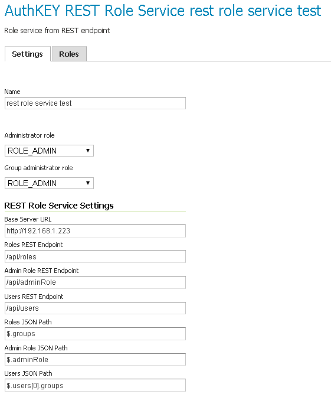

.. _security_rolesystem_roleservices:

Role services
=============

A **role service** provides the following information for roles:

* List of roles
* Calculation of role assignments for a given user
* Mapping of a role to the system role ``ROLE_ADMINISTRATOR``
* Mapping of a role to the system role ``ROLE_GROUP_ADMIN``

When a user/group service loads information about a user or a group, it delegates to the role service to determine which roles should be assigned to the user or group.  Unlike :ref:`security_rolesystem_usergroupservices`, only one role service is active at any given time.

By default, GeoServer supports two types of role services:

* XML—*(Default)* role service persisted as XML
* JDBC—Role service persisted in a database via JDBC

.. _security_rolesystem_mapping:

Mapping roles to system roles
-----------------------------

To assign the system role ``ROLE_ADMINISTRATOR`` to a user or to a group, a new role with a different name must be created and mapped to the ``ROLE_ADMINISTRATOR`` role. The same holds true for the system role ``ROLE_GROUP_ADMIN``. The mapping is stored in the service's ``config.xml`` file.

.. code-block:: xml

	<roleService>
	  <id>471ed59f:13915c479bc:-7ffc</id>
	  <name>default</name>
	  <className>org.geoserver.security.xml.XMLRoleService</className>
	  <fileName>roles.xml</fileName>
	  <checkInterval>10000</checkInterval>
	  <validating>true</validating>
	  <adminRoleName>ADMIN</adminRoleName>
	  <groupAdminRoleName>GROUP_ADMIN</groupAdminRoleName>
	</roleService>

In this example, a user or a group assigned to the role ``ADMIN`` is also assigned to the system role ``ROLE_ADMINISTRATOR``. The same holds true for ``GROUP_ADMIN`` and ``ROLE_GROUP_ADMIN``.

.. _security_rolesystem_rolexml:

XML role service
----------------

The XML role service persists the role database in an XML file. This is the default role service for GeoServer.
This service represents the user database as XML, and corresponds to this :download:`XML schema <schemas/roles.xsd>`. 

.. note:: 

   The XML role file, :file:`roles.xml`, is located in  the GeoServer data directory, ``security/role/<name>/roles.xml``, where ``<name>`` is the name of the role service.

The service is configured to map the local role ``ADMIN`` to the system role ``ROLE_ADMINISTRATOR``. Additionally, ``GROUP_ADMIN`` is mapped to ``ROLE_GROUP_ADMIN``. The mapping is stored the ``config.xml`` file of each role service. 

The following provides an illustration of the ``roles.xml`` that ships with the default GeoServer configuration:

.. code-block:: xml

   <roleRegistry version="1.0" xmlns="http://www.geoserver.org/security/roles">
     <roleList>
       <role id="ADMIN"/>
       <role id="GROUP_ADMIN"/>
     </roleList>
     <userList>
       <userRoles username="admin">
         <roleRef roleID="ADMIN"/>
       </userRoles>
     </userList>
     <groupList/>
   </roleRegistry>

This configuration contains two roles named ``ADMIN`` and ``GROUP_ADMIN``. The role ``ADMIN`` is assigned to the ``admin`` user. Since the ``ADMIN`` role is mapped to the system role ``ROLE_ADMINISTRATOR``, the role calculation assigns both roles to the ``admin`` user.

For further information, please refer to :ref:`configuring a role service <security_webadmin_roleservices>` in the :ref:`web_admin`.

.. _security_rolesystem_rolej2ee:

J2EE role service
-----------------

The J2EE role service parses roles from the ``WEB-INF/web.xml`` file. As a consequence, this service is a read only role service. 
Roles are extracted from the following XML elements: 

``<security-role>``
^^^^^^^^^^^^^^^^^^^

   .. code-block:: xml
   
      <security-role>
         <role-name>role1</role-name>
      </security-role>
      <security-role>
         <role-name>role2</role-name>
      </security-role>  
      <security-role>
         <role-name>employee</role-name>
      </security-role>
      
   Roles retrieved:
    
   * ``role1``
   * ``role2``
   * ``employee`` 

``<security-constraint>``
^^^^^^^^^^^^^^^^^^^^^^^^^

   .. code-block:: xml
   
       <security-constraint>
          <web-resource-collection>
              <web-resource-name>Protected Area</web-resource-name>
              <url-pattern>/jsp/security/protected/*</url-pattern>
              <http-method>PUT</http-method>
              <http-method>DELETE</http-method>
              <http-method>GET</http-method>
              <http-method>POST</http-method>
          </web-resource-collection>
          <auth-constraint>
              <role-name>role1</role-name>
              <role-name>employee</role-name>
          </auth-constraint>
      </security-constraint>
      
   Roles retrieved:
    
   * ``role1``
   * ``employee`` 
      

``<security-role-ref>``
^^^^^^^^^^^^^^^^^^^^^^^   
   
   .. code-block:: xml
      
       <security-role-ref>
           <role-name>MGR</role-name>
           <!-- role name used in code -->
           <role-link>employee</role-link>
         </security-role-ref>      
      

   Roles retrieved:
    
   * ``MGR``

.. _security_rolesystem_rolejdbc:

JDBC role service
-----------------

The JDBC role service persists the role database via JDBC, managing the role information in multiple tables. The role database schema is as follows:

.. list-table:: Table: roles
   :widths: 15 15 15 15 
   :header-rows: 1

   * - Field
     - Type
     - Null
     - Key
   * - name
     - varchar(64)
     - NO
     - PRI
   * - parent
     - varchar(64)
     - YES
     - 

.. list-table:: Table: role_props
   :widths: 15 15 15 15 
   :header-rows: 1

   * - Field
     - Type
     - Null
     - Key
   * - rolename
     - varchar(64)
     - NO
     - PRI
   * - propname
     - varchar(64)
     - NO
     - PRI
   * - propvalue
     - varchar(2048)
     - YES
     - 

.. list-table:: Table: user_roles
   :widths: 15 15 15 15 
   :header-rows: 1

   * - Field
     - Type
     - Null
     - Key
   * - username
     - varchar(128)
     - NO
     - PRI
   * - rolename
     - varchar(64)
     - NO
     - PRI

.. list-table:: Table: group_roles
   :widths: 15 15 15 15 
   :header-rows: 1

   * - Field
     - Type
     - Null
     - Key
   * - groupname
     - varchar(128)
     - NO
     - PRI
   * - rolename
     - varchar(64) 
     - NO
     - PRI

The ``roles`` table is the primary table and contains the list of roles.  Roles in GeoServer support inheritance, so a role may optionally have a link to a parent role. The ``role_props`` table maps additional properties to a role. (See the section on :ref:`security_rolesystem_roles` for more details.)  The ``user_roles`` table maps users to the roles they are assigned.  Similarly the ``group_roles`` table maps which groups have been assigned to which roles. 

The default GeoServer security configuration is:

.. list-table:: Table: roles
   :widths: 15 15 
   :header-rows: 1

   * - name
     - parent
   * - *Empty*
     - *Empty*

.. list-table:: Table: role_props
   :widths: 15 15 15
   :header-rows: 1

   * - rolename
     - propname
     - propvalue
   * - *Empty*
     - *Empty*
     - *Empty*

.. list-table:: Table: user_roles
   :widths: 15 15 
   :header-rows: 1

   * - username
     - rolename
   * - *Empty*
     - *Empty*

.. list-table:: Table: group_roles
   :widths: 15 15 
   :header-rows: 1

   * - groupname
     - rolename
   * - *Empty*
     - *Empty*

For further information, please refer to :ref:`configuring a role service <security_webadmin_roleservices>` in the :ref:`web_admin`.

LDAP role service
-----------------

The LDAP role service is a read only role service that maps groups from an LDAP repository to GeoServer roles.

Groups are extracted from a specific LDAP node, configured as the ``Groups search base``. A role is mapped for every matching group. The role will have a name that is built taking the Group common name (cn attribute), transformed to upper case and with a ``ROLE_`` prefix applied.

It is possible to filter extracted groups using an ``All groups filter`` (defaults to ``cn=*`` that basically extracts all nodes from the configured base). It is also possible to configure the filter for ``users to roles membership`` (defaults to member={0}).

A specific group can be assigned to the ``ROLE_ADMINISTRATOR`` and/or the ``ROLE_GROUP_ADMIN`` administrative roles.

Groups extraction can be done anonymously or using a given username/password if the LDAP repository requires it.

An example of configuration file (config.xml) for this type of role service is the following:

   .. code-block:: xml

        <org.geoserver.security.ldap.LDAPRoleServiceConfig>
          <id>-36dfbd50:1424687f3e0:-8000</id>
          <name>ldapacme</name>
          <className>org.geoserver.security.ldap.LDAPRoleService</className>
          <serverURL>ldap://127.0.0.1:10389/dc=acme,dc=org</serverURL>
          <groupSearchBase>ou=groups</groupSearchBase>
          <groupSearchFilter>member=uid={0},ou=people,dc=acme,dc=org</groupSearchFilter>
          <useTLS>false</useTLS>
          <bindBeforeGroupSearch>true</bindBeforeGroupSearch>
          <adminGroup>ROLE_ADMIN</adminGroup>
          <groupAdminGroup>ROLE_ADMIN</groupAdminGroup>
          <user>uid=bill,ou=people,dc=acme,dc=org</user>
          <password>hello</password>
          <allGroupsSearchFilter>cn=*</allGroupsSearchFilter>
        </org.geoserver.security.ldap.LDAPRoleServiceConfig>

For further information, please refer to :ref:`configuring a role service <security_webadmin_roleservices>` in the :ref:`web_admin`.

REST role service
-----------------

The REST role service is a read only role service that maps groups and associated users to roles from a remote REST web service.

The REST service **must** support JSON encoding.

Here is a listing of significant methods provided by the REST Role Service (based on the LDAP role service, which similarly has to make network calls to work):

.. list-table:: Table: roles
   :widths: 10 20 
   :header-rows: 1

   * - Method
     - Mandatory
   * - *getUserNamesForRole(roleName)*
     - N (implemented in LDAP, but I don’t see actual users of this method besides a utility method that nobody uses)
   * - *getRolesForUser(user)*
     - Y
   * - *getRolesForGroup(group)*
     - N
   * - *getRoles()*
     - Y (used by the UI)
   * - *getParentRole(role)*
     - N
   * - *getAdminRole()*
     - Y
   * - *getGroupAdminRole()*
     - Y
   * - *getRoleCount()*
     - Y (does not seem to be used much, we can trivially implement it from getRoles()

REST APIs
^^^^^^^^^

The following is an example of the REST API the role service may handle. The JSON and remote endpoints may differ; this is conifgurable via UI, allowing the REST role service to connect to a generci REST Service

From the above we could have the following REST API to talk to

``../api/roles``

Returns the full list of roles (no paging required, we assume it’s small). Example response:

.. code-block:: json

    {"groups":["r1","r2","r3"]}

``../api/adminrole``

Returns the role of the administrator (yes, just one, it’s strange…):

.. code-block:: json

    {"adminRole":["root"]}

``../api/users/<user>``

Returns the list of roles for a particular user. Example response:

.. code-block:: json

    {"users": [{"user":"u1", "groups":["r1","r2"]}]}

Configurable API
^^^^^^^^^^^^^^^^

The GeoServerRoleService talking to a remote service provides the following config parameters:

* Base URL for the remote service
* Configurable URLs for the various calls
* JSON paths to the properties that contain the list of roles, and the one admin role

The above can be configured via the :ref:`web_admin`. The figure below shows the REST role service options configured to be compatible with the sampe APIs above:

   *REST based role service configuration panel*