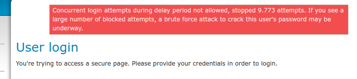
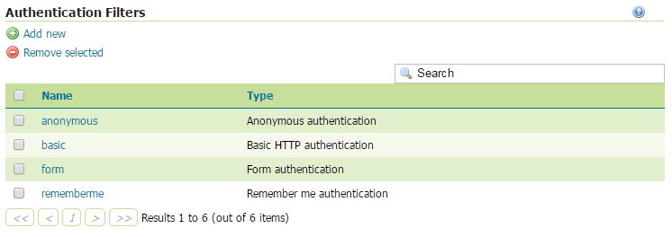
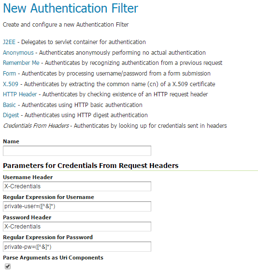
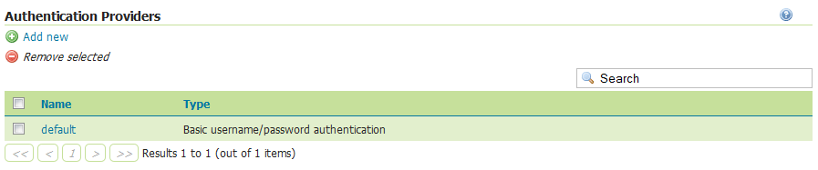
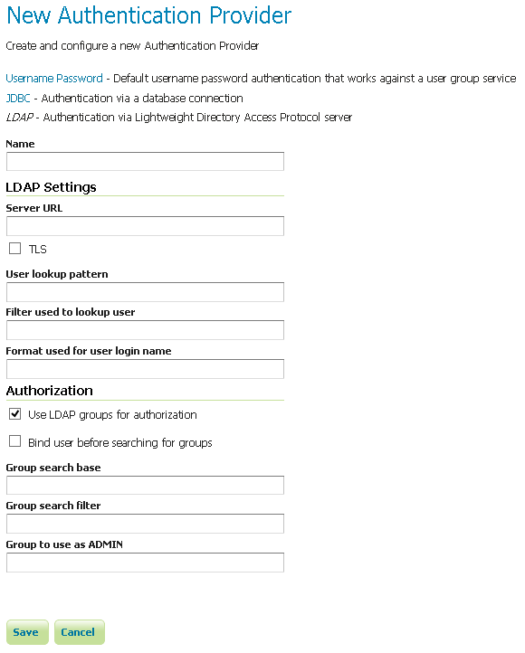
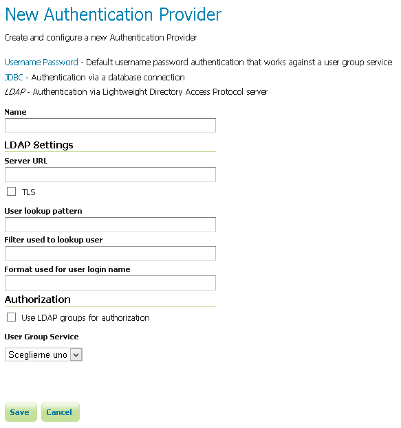
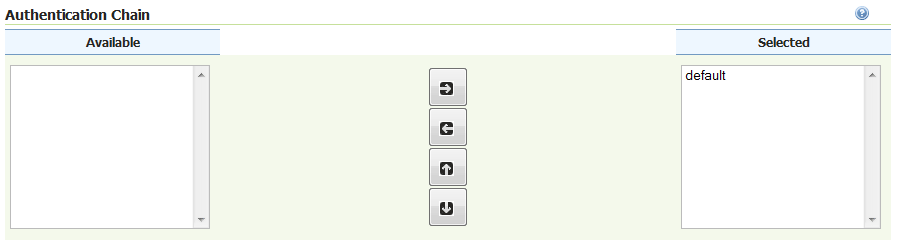

.. _security_webadmin_auth:

Authentication
==============

This page manages the authentication options, including authentication providers and the authentication chain.
   
Brute force attack prevention
-----------------------------

GeoServer ships with a delay based brute force attack prevention system.

.. figure:: images/auth_brute_force.png
   :align: center
   
   *Brute force attack prevention settings*

.. list-table:: 
   :widths: 40 60 
   :header-rows: 1

   * - Option
     - Description
   * - Enabled
     - Whether the brute force attack prevention is enabled. Defaults to true.
   * - Minimum delay on failed authentication (seconds)
     - Minimum number of seconds a failed login request will be made to wait before getting a response
   * - Maximum delay on failed authentication (seconds)
     - Maximum number of seconds a failed login request will be made to wait before getting a response
   * - Excluded network masks
     - Network masks identifying hosts that are excluded from brute force attack prevention. Can be empty, include specific IPs, or a list of network masks. 
       Defaults to 127.0.0.1, the localhost.
   * - Maximum number of threads blocked on failed login delay
     - Limits the number of threads that get delayed on failed login, should be set to a value less than the container's available response threads.
       
The mechanism works as follows:

* Each failed authentication request is made to wait between min and max seconds before getting an actual response back
* Each attempt to authenticate the same username in parallel fails immediately, regardless of whether the credentials were valid or not, with a message stating concurrent loging attempts are not allowed.

The first item slows down a single threaded attack to the point of making it ineffective (each failed attempt is logged
along with the IP attempting access), the second item breaks multi-threaded attacks ability to scale.
Login attempts are slowed down/blocked on all protocols, be either a OGC request, a REST call, or the UI.

A user trying to login from the user interface while another request is blocked waiting for the cool-down period to
expire will see a message like the following:

   
   *Error message for parallel user interface login*
  
A HTTP request (REST or OGC) will instead get an immediate 401 with a message like:

HTTP/1.1 401 User foo, 5896 concurrent login attempt(s) denied during the quiet period
  

A blessed set of IPs that can dodge the mechanism allows legit administrators to take control of the server even during
an attack. The system only trusts the actual requestor IP, ignoring "X-Forwarded-For" headers, as they can be easily spoofed
(this in turn requires the admin to access the system from a local network, without proxies in the middle, for the blessed
IP to be recognized).

The maximum number of threads blocked configuration allows to setup the system so that an attacker can mis-use the
system to simply block all service threads, by issuing requests with random user names (the system cannot determine
if a username is valid or not, none of the authentication mechanisms provides this information for security reasons).

Considerations on how to setup the system:

* A small delay is normally more than enough to stop a brute force attack, resist the temptation of setting high delay values
  as they might end up blocking too many legit account and trigger the max blocked threads mechanism
* Ensure that the execluded networks are well protected by other means
* Set the maximum number of blocked threads to a value large allow peak hour legit logins (e.g., early morning when
  all the users start working) while still leaving room for successful authentication requests
* A clustered/load balanced setup will not share the state of blocked logins, each host tracks its local login failures.

Authentication filters
----------------------

This section manages the Authentication Filters (adding, removing, and editing). Several authentication filters are configured by default (anonymous, basic, form, rememberme), but others can be added to the list.

   
   *List of authentication filters*

Anonymous access
~~~~~~~~~~~~~~~~

By default, GeoServer will allow anonymous access to the :ref:`web_admin`. Without authentication, users will still be able to view the :ref:`layerpreview`, capabilities documents, and basic GeoServer details. Anonymous access can by removing the :guilabel:`anonymous` authentication filter. If removed, anonymous users navigating to the GeoServer page will get an HTTP 401 status code, which typically results in a browser-based request for credentials.

Credentials From Headers filter
~~~~~~~~~~~~~~~~~~~~~~~~~~~~~~~

This filter allows gathering user credentials (username and password) from request headers in a flexible and configurable way.

   *Creating a new authentication filter fetching credentials from request headers*
   
   
.. list-table:: 
   :widths: 40 60 
   :header-rows: 1

   * - Option
     - Description
   * - Name
     - Name of the filter
   * - Username Header
     - Name of the Request Header containing the username
   * - Regular Expression for Username
     - Regular Expression used to extract the username from the related Header. Must define a group that will match the username.
   * - Password Header
     - Name of the Request Header containing the password
   * - Regular Expression for Password
     - Regular Expression used to extract the password from the related Header. Must define a group that will match the password.
   * - Parse Arguments as Uri Components
     - If checked username and password are uri deocded before being used as credentials

   
	 
Authentication providers
------------------------

This section manages the :ref:`security_auth_providers` (adding, removing, and editing). The default authentication provider uses basic :ref:`username/password authentication <security_auth_provider_userpasswd>`. :ref:`JDBC <security_auth_provider_jdbc>` and :ref:`LDAP <security_auth_provider_ldap>` authentication can also be used.

Click :guilabel:`Add new` to create a new provider. Click an existing provider to edit its parameters.

   *List of authentication providers*
   
Username/password provider
~~~~~~~~~~~~~~~~~~~~~~~~~~

The default new authentication provider uses a user/group service for authentication.

.. figure:: images/auth_userpass.png
   :align: center

   *Creating a new authentication provider with a username and password*

.. list-table:: 
   :widths: 40 60 
   :header-rows: 1

   * - Option
     - Description
   * - Name
     - Name of the provider
   * - User Group Service
     - Name of the user/group service associated with this provider. Can be any one of the active user/group services.

JDBC provider
~~~~~~~~~~~~~

The configuration options for the JDBC authentication provider are illustrated below.

.. figure:: images/auth_jdbc.png
   :align: center

   *Configuring the JDBC authentication provider*

.. list-table::
   :widths: 40 60
   :header-rows: 1

   * - Option
     - Description
   * - Name
     - Name of the JDBC connection in GeoServer
   * - User Group Service
     - Name of the user/group service to use to load user information after the user is authenticated
   * - Driver class name
     - JDBC driver to use for the database connection
   * - Connection URL
     - JDBC URL to use when creating the database connection

LDAP provider
~~~~~~~~~~~~~

The following illustration shows the configuration options for the LDAP authentication provider. The default option is to use LDAP groups for role assignment, but there is also an option to use a user/group service for role assignment. Depending on whether this option is selected, the page itself will have different options.

   *Configuring the LDAP authentication provider using LDAP groups for role assignment*

   *Configuring the LDAP authentication provider using user/group service for authentication*

.. list-table::
   :widths: 40 60
   :header-rows: 1

   * - Option
     - Description
   * - Name
     - Name of the LDAP connection in GeoServer
   * - Server URL
     - URL for the LDAP server connection. It must include the protocol, host, and port, as well as the "distinguished name" (DN) for the root of the LDAP tree.
   * - TLS
     - Enables a STARTTLS connection. (See the section on :ref:`security_auth_provider_ldap_secure`.)
   * - User DN pattern
     - Search pattern to use to match the DN of the user in the LDAP database. The pattern should contain the placeholder ``{0}`` which is injected with the ``uid`` of the user. Example: ``uid={0},ou=people``. The root DN specified as port of the *Server URL* is automatically appended.
   * - User Filter
     - LDAP Filter used to extract User data from LDAP database. Used alternatively to User DN pattern and combined with User Format to separate bind and user data extraction handling. Example: ``(userPrincipalName={0})``. Gets user data searching for a single record matching the filter. This may contain two placeholder values:
       ``{0}``, the full DN of the user, for example ``uid=bob,ou=people,dc=acme,dc=com``
       ``{1}``, the ``uid`` portion of the full DN, for example ``bob``.
   * - User Format
     - String formatter used to build username used for binding. Used alternatively to User DN pattern and combined with User Filter to separate bind and user data extraction handling. Example: ``{0}@domain``. Binds user with the username built applying the format.  This may contain one placeholder:
       ``{0}``, the username, for example ``bob``
   * - Use LDAP groups for authorization
     - Specifies whether to use LDAP groups for role assignment
   * - Bind before group search
     - Specifies whether to bind to LDAP server with the user credentials before doing group search
   * - Group search base
     - Relative name of the node in the tree to use as the base for LDAP groups. Example: ``ou=groups``. The root DN specified as port of the *Server URL* is automatically appended. Only applicable when the *Use LDAP groups for authorization( parameter is **checked**.
   * - Group search filter
     - Search pattern for locating the LDAP groups a user belongs to. This may contain two placeholder values:
       ``{0}``, the full DN of the user, for example ``uid=bob,ou=people,dc=acme,dc=com``
       ``{1}``, the ``uid`` portion of the full DN, for example ``bob``.
       Only applicable when the *Use LDAP groups for authorization( parameter is **checked**.
   * - Admin Group
     - Name of the group to be mapped to Administrator role (defaults to ADMINISTRATOR). Example: ``ADMIN``. Adds the role ROLE_ADMINISTRATOR if the user belongs to a group named ADMIN (case insensitive)
   * - Group Admin Group
     - Name of the group to be mapped to Group Administrator role (defaults to GROUP_ADMIN). Example: ``GROUPADMIN``. Adds the role ROLE_GROUP_ADMIN if the user belongs to a group named GROUPADMIN (case insensitive)     
   * - User Group Service
     - The user/group service to use for role assignment. Only applicable when the *Use LDAP groups for authorization* parameter is **cleared**.
   * - Enable Hierarchical groups search 
     - Specifies whether to use Hierarchical LDAP groups search for role assignment
   * - Max depth for hierarchical groups search 
     - Specifies the max group search depth level to use with Hierarchical LDAP groups search. Use ``-1`` for no limit. Only applicable when the *Enable Hierarchical groups search( parameter is **checked**.
   * - Nested group search filter
     - Search pattern for locating parent LDAP groups a group belongs to. This may contain two placeholder values:
     
       ``{0}``, the full DN of the user, for example ``cn=it,ou=groups,dc=acme,dc=com``
       
       ``{1}``, the ``cn`` portion of the full DN, for example ``it``.
       Only applicable when the *Enable Hierarchical groups search( parameter is **checked**.

Authentication chain
--------------------

This section selects the authentication chain. Currently, only one default authentication chain is available. For further information about the default chain, please refer to :ref:`security_auth_chain`.

   *Selecting the authentication chain*

