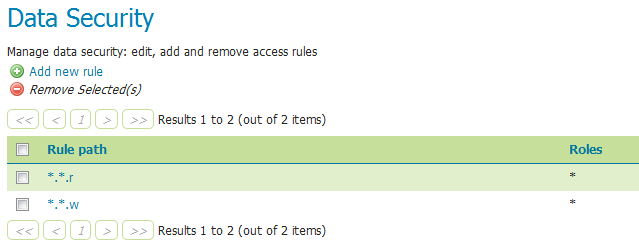
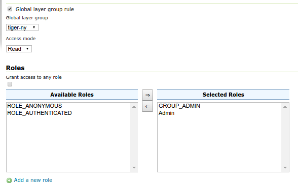
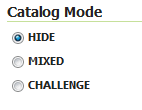
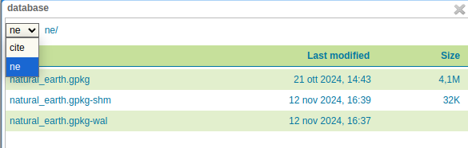

.. _security_webadmin_data:

Data
====

This section provides access to security settings related to data management and :ref:`security_layer`. Data access is granted to roles, and roles are granted to users and groups.

Rules
-----

There are two rules available by default, but they don't provide any restrictions on access by default. The first rule ``*.*.r``, applied to all roles, states that any operation in any resource in any workspace can be read. The second rule, ``*.*.w``, also applied to all roles, says the same for write access.

   *Rules for data access*

Clicking an existing rule will open it for editing, while clicking the :guilabel:`Add a new rule` link will create a new rule.

.. figure:: images/data_newrule.png
   :align: center

   *Creating a new rule*
   

   *Editing a layer group rule*
   

.. list-table:: 
   :widths: 40 60 
   :header-rows: 1

   * - Option
     - Description
   * - Global layer group rule
     - If checked, switches the editor to create/edit a rule about a global layer group (and will remove the layer configuration as a result)
   * - Workspace
     - Sets the allowed workspace for this rule. Options are ``*`` (all workspaces), or the name of each workspace.
   * - Layer and groups
     - Sets the allowed layer/groups for this rule. Options are ``*`` (all layers/groups in the chosen workspace), or the name of each layer in the above workspace. Will be disabled until the workspace is set.
   * - Access mode
     - Specifies whether the rule refers to either ``Read`` or ``Write`` mode
   * - Grant access to any role
     - If selected, the rule will apply to all roles, with no need to specify
   * - Role list
     - Full list of roles, including a list of roles to which the rule is associated. Association can be toggled here via the arrow buttons. This option is not applied if :guilabel:`Grant access to any role` is checked.
   * - Add a new role
     - Shortcut to adding a new role

Catalog Mode
------------

This mode configures how GeoServer will advertise secured layers and behave when a secured layer is accessed without the necessary privileges. There are three options:  :guilabel:`HIDE`, :guilabel:`MIXED`, and :guilabel:`CHALLENGE`. For further information on these options, please see the section on :ref:`security_layer`.

   *Catalog mode*

File sandbox
------------

The sandbox allows a GeoServer full administrator to limit file system access to workspace administrators.
In particular, both GUI and REST API will sandbox workspace administrators to ``<sandbox>/<workspace>``,
and prevent them from accessing files outside of it. For more information about how workspace administrators
can access the REST API, please see the section on :ref:`security_rest_workspace_admin`.

.. figure:: images/fs_sandbox.png
   :align: center

   *Filesystem sandbox*

This part of the page is not visible if the operating system administrator has established
a sandbox for the whole GeoServer instance, in which case even the GeoServer full administrators
will be limited in the configured sandbox and won't be able to change it.

When the sandbox is configured, the file system chooser will show the accessible directories as
the file system roots. E.g., if a sandbox has been set to `/var/lib/geoserver`, and the current
workspace administrator has access to both the `sf` and `ne` workspaces, the file system
chooser will look as follows:

   *File system chooser*

Any attempt to manually set a path outside of the sandbox will result in a validation error
and prevent the store from being saved (both from the UI and the REST API).

For more information please refer to :ref:`security_sandbox` for more details.