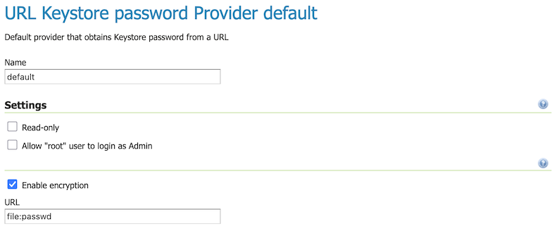

.. _security_webadmin_passwd:

Passwords
=========

This page configures the various options related to :ref:`security_passwd`, the :ref:`security_master_passwd`, and :ref:`security_passwd_policy`.

.. note:: User passwords may be changed in the Users dialog box accessed from the :ref:`security_webadmin_ugr` page.

.. _security_webadmin_masterpasswordprovider:

Keystore passwords
------------------

In GeoServer, encrypting and decrypting passwords involves the generation of secret shared keys, stored in a Java *keystore*. For more information see :ref:`security_passwd_keystore`.

Active keystore password provider
'''''''''''''''''''''''''''''''''

This option sets the active keystore password provider, via a list of all available keystore password providers.

.. figure:: images/passwd_activemaster.png

   Active keystore password provider

To change the keystore password click the :guilabel:`Change password` link.

.. figure:: images/passwd_changemaster.png

   Changing the keystore password

To view the current keystore password use the link :guilabel:`Keystore password forgotten?`. This link requires access to the REST API which is used to :ref:`view the current value <rest_security_keystore>` in your browser.

.. warning:: The file ``security/masterpw.info`` may be present from a GeoServer 2.27 or earlier update. This file is a security risk and shows up as a warning on the welcome page for administrators to address.

   The administrator should read this file, verify the :ref:`keystore password <rest_security_keystore>`, and then this file should be removed.

.. _security_webadmin_passwd_keystore:

Keystore Password Providers
'''''''''''''''''''''''''''

This section provides the options for adding, removing, and editing keystore password providers.

.. figure:: images/passwd_masterprovider.png

   Keystore password provider list

Use :guilabel:`Add new` and :guilabel:`Remove selected` to manage the list of keystore passowrd providers.

When creating or editing a **URL Keystore password Provider** the following settings are available.

   
   URL Keystore password Provider

The :guilabel:`Read-only` setting is used to indicate the URL location is used as the source only, and disables the ability to change the keystore password from GeoServer.

The :guilabel:`URL` indicates the location of the URL source used to obtain the Keystore password.

The :guilabel:`Enable encryption` setting offers the option to encrypt the password to/from the URL source.

The :guilabel:`Allow "root" user to login as Admin` setting is used to enable the :ref:`root account <security_root>`. 

.. note:: By default the login to Admin GUI and REST APIs with Keystore Password is disabled, this setting is only recommended as a temporary measure when adjusting the security subsystem (in case an administrator inadvertently disrupting normal authentication).

Password policies
-----------------

This section configures the various :ref:`security_passwd_policy` available to users in GeoServer.  New password policies can be added or renamed, and existing policies edited or removed.

By default there are two password policies in effect, ``default`` and ``root``.  The ``default`` password policy, intended for most GeoServer users, does not have any active password constraints.  The ``keystore`` password policy, intended for the :ref:`security_root`, specifies a **minimum password length of eight characters**.  Password policies are applied to users via the user/group service.

.. figure:: images/passwd_policies.png

   List of password policies

Clicking an existing policy enables editing, while clicking the :guilabel:`Add new` button will create a new password policy.

.. figure:: images/passwd_newpolicy.png

   Creating a new password policy
