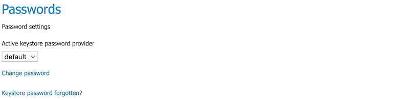
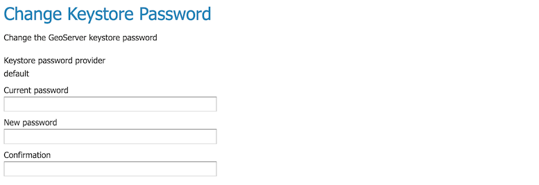
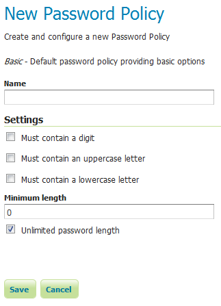

.. _security_webadmin_passwd:

Passwords
=========

This page configures the various options related to :ref:`security_passwd`, the :ref:`security_master_passwd`, and :ref:`security_passwd_policy`.

.. note:: User passwords may be changed in the Users dialog box accessed from the :ref:`security_webadmin_ugr` page.

.. _security_webadmin_masterpasswordprovider:

Active keystore password provider
---------------------------------

This option sets the active keystore password provider, via a list of all available keystore password providers.

   Active keystore password provider

To change the keystore password click the :guilabel:`Change password` link.

   Changing the keystore password

.. warning:: First thing to do as an Administrator of the System, would be to dump the Keystore Password generated by GeoServer, store it somewhere not accessible by anyone, and delete any ``security/masterpw.info`` or whatever file you used to dump the password in clear.

Keystore Password Providers
---------------------------

This section provides the options for adding, removing, and editing keystore password providers.

.. figure:: images/passwd_masterprovider.png

   Keystore password provider list

.. note:: By default the login to Admin GUI and REST APIs with Keystore Password is disabled. In order to enable it you will need to manually change the Keystore Password Provider ``config.xml``, usually located into ``security/masterpw/default/config.xml``, by adding the following statement::

    ``<loginEnabled>true</loginEnabled>``

Password policies
-----------------

This section configures the various :ref:`security_passwd_policy` available to users in GeoServer.  New password policies can be added or renamed, and existing policies edited or removed.

By default there are two password policies in effect, ``default`` and ``root``.  The ``default`` password policy, intended for most GeoServer users, does not have any active password constraints.  The ``keystore`` password policy, intended for the :ref:`security_root`, specifies a **minimum password length of eight characters**.  Password policies are applied to users via the user/group service.

.. figure:: images/passwd_policies.png

   List of password policies

Clicking an existing policy enables editing, while clicking the :guilabel:`Add new` button will create a new password policy.

   Creating a new password policy
