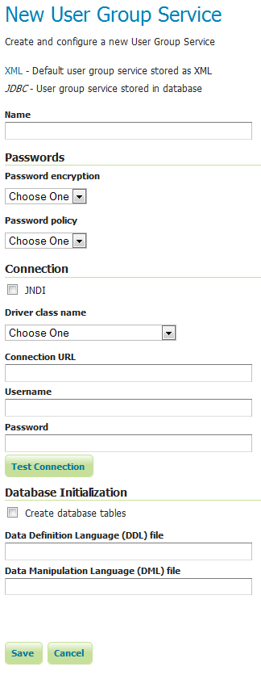
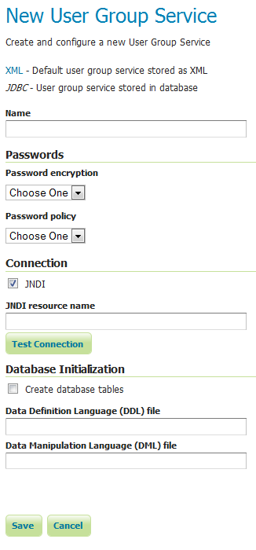
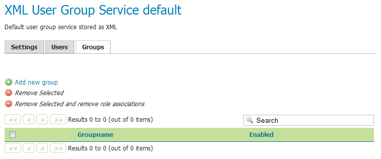
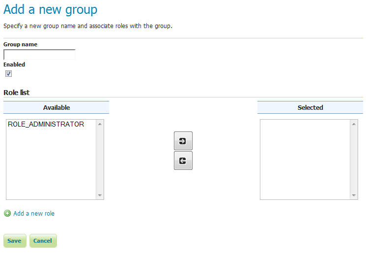
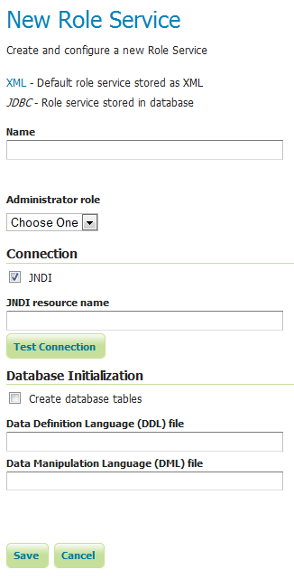
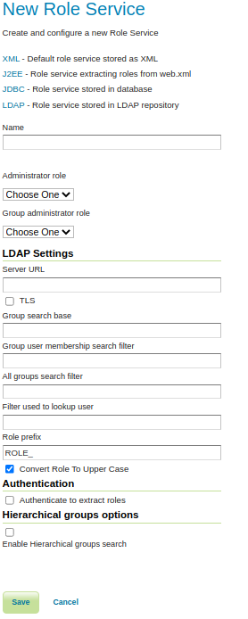
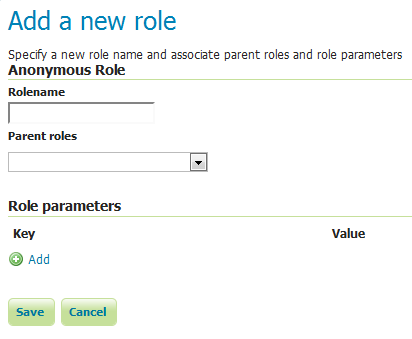

.. _security_webadmin_ugr:

Users, Groups, Roles
====================

This section provides the configuration options for :ref:`security_rolesystem_usergroupservices` and :ref:`security_rolesystem_roleservices`. In addition, users, groups, and roles themselves and can be added, edited, or removed. A great deal of configuration can be accomplished in this section and related pages.

.. _security_webadmin_usergroupservices:

User Group Services
-------------------

In this menu, user/group services can be added, removed, or edited. By default, there is one user/group service in GeoServer, which is :ref:`XML-based <security_rolesystem_usergroupxml>`. It is encrypted with :ref:`Weak PBE <security_passwd_encryption>` and uses the default :ref:`password policy <security_passwd_policy>`. It is also possible to have a user/group service based on :ref:`JDBC <security_rolesystem_usergroupjdbc>`, with or without JNDI.

.. figure:: images/ugr_usergroup.png
   :align: center

   *User/group services*

Clicking an existing user/group service will enable editing, while clicking the :guilabel:`Add new` link will configure a new user/group service.

There are three tabs for configuration:  Settings, Users, and Groups.

.. note:: When creating a new user/group service, the form filled out initially can be found under the Settings tab. 

Add new XML user/group service
------------------------------

To add a new XML user/group service, click the :guilabel:`Add new` link. XML is the default option. The following figure shows the configuration options for an XML user/group service.

.. figure:: images/ugr_ugxmlsettings.png
   :align: center

   *Adding an XML user/group service*

.. list-table:: 
   :widths: 40 60 
   :header-rows: 1

   * - Option
     - Description
   * - Name
     - The name of the user/group service
   * - Password encryption
     - Sets the type of :ref:`security_passwd_encryption`. Options are :guilabel:`Plain text`, :guilabel:`Weak PBE`, :guilabel:`Strong PBE`, and :guilabel:`Digest`.
   * - Password policy
     - Sets the :ref:`password policy <security_passwd_policy>`. Options are any active password policies as set in the :ref:`security_webadmin_passwd` section.
   * - XML filename
     - Name of the file that will contain the user and group information. Default is :file:`users.xml` in the ``security/usergroup/<name_of_usergroupservice>`` directory.
   * - Enable schema validation
     - If selected, forces schema validation to occur every time the XML file is read. This option is useful when editing the XML file by hand.
   * - File reload interval
     - Defines the frequency (in milliseconds) in which GeoServer will check for changes to the XML file. If the file is found to have been modified, GeoServer will recreate the user/group database based on the current state of the file. This value is meant to be set in cases where the XML file contents might change "out of process" and not directly through the web admin interface. The value is specified in milliseconds. A value of 0 disables any checking of the file.

Add new JDBC user/group service
-------------------------------

To add a new XML user/group service, click the :guilabel:`Add new` link, and then the :guilabel:`JDBC` option at the top of the following form. The following figure shows the configuration options for a JDBC user/group service.

   *Adding a user/group service via JDBC*

.. list-table::
   :widths: 40 60
   :header-rows: 1

   * - Option
     - Description
   * - Name
     - Name of the JDBC user/group service in GeoServer
   * - Password encryption
     - The method to used to :ref:`encrypt user passwords <security_passwd_encryption>`
   * - Password policy
     - The :ref:`policy <security_passwd_policy>` to use to enforce constraints on user passwords
   * - JNDI
     - When unchecked, specifies a direct connection to the database. When checked, specifies an existing connection located through :ref:`data_jndi`.
   * - Driver class name
     - JDBC driver to use for the database connection
   * - Connection URL
     - Specifies the JDBC URL to use when creating the database connection
   * - Username
     - Username to use when connecting to the database
   * - Password
     - Password to use when connecting to the database
   * - Create database tables
     - Specifies whether to create all the necessary tables in the underlying database
   * - Data Definition Language (DDL) file
     - Specifies a custom DDL file to use for creating tables in the underlying database, for cases where the default DDL statements fail on the given database. If left blank, internal defaults are used.
   * - Data Manipulation Language (DML) file
     - Specifies a custom DML file to use for accessing tables in the underlying database, for cases where the default DML statements fail on the given database. If left blank, internal defaults are used.

In addition to the parameters listed above, the following additional parameter will apply when the :ref:`data_jndi` flag is set.

   *Adding a user/group service via JDBC with JNDI*

.. list-table::
   :widths: 40 60
   :header-rows: 1

   * - Option
     - Description
   * - JNDI resource name
     - JNDI name used to locate the database connection.

Add new LDAP user/group service
-------------------------------

To add a new LDAP user/group service, click the :guilabel:`Add new` link, and then the :guilabel:`LDAP` option at the top of the following form. The following figure shows the configuration options for a LDAP user/group service.

.. figure:: images/ldap_group_service.png
   :align: center

   *Adding a user/group service via LDAP*

.. list-table::
   :widths: 40 60
   :header-rows: 1

   * - Option
     - Description
   * - Name
     - Name of the LDAP role service in GeoServer
   * - Password encryption
     - The method to used to :ref:`encrypt user passwords <security_passwd_encryption>`
   * - Password policy
     - The :ref:`policy <security_passwd_policy>` to use to enforce constraints on user passwords
   * - Server URL
     - URL for the LDAP server connection. It must include the protocol, host, and port, as well as the “distinguished name” (DN) for the root of the LDAP tree.
   * - TLS
     - Enables a STARTTLS connection. (See the section on :ref:`security_auth_provider_ldap_secure`.)
   * - Group search base
     - Relative name of the node in the tree to use as the base for LDAP groups. Example: ``ou=groups``. The root DN specified as port of the *Server URL* is automatically appended.
   * - Filter to search all groups
     - Sets the LDAP filter for search all groups available. Leave blank to derive from attribute.
   * - Filter to search group by name
     - Sets the LDAP filter for search a group by its name. Leave blank to derive from attribute.
   * - Attribute which contains the name of the group
     - Sets attribute containing the group name.  Leave blank to derive from name filter.
   * - Query format to retrieve the user/group mapping
     - Query format used for mapping user/group memberships.  Leave blank to derive from attribute.  This may contain some placeholder values:
     
       ``{0}``, the ``username`` of the user, for example ``bob``.
       
       ``{1}``, the  full DN of the user, for example ``uid=bob,ou=users``.
       
   * - Attribute name to retrieve the user/group mapping
     - Attribute name used for mapping user/group memberships.  Leave blank to derive from filter.
   * - User search base
     - LDAP search base for users.
   * - Filter to search all users
     - Sets the filter for search all available users.  Leave blank to derive from attribute.
   * - Filter to search user by name
     - Sets the filter format for search a user by its name.  Leave blank to derive from attribute.
   * - Attribute which contains the name of the user
     - Sets the attribute containing the name for users. Leave blank to derive from name filter.
   * - List of attributes to populate
     - Sets a comma separated list of attributes to populate on users.
   * - Authenticated onto the LDAP before querying
     - When checked all LDAP searches will be done in authenticated mode, using the credentials given with the *Username* and *Password* options
   * - Username
     - Username to use when connecting to the LDAP server. Only applicable when the *Authenticated onto the LDAP before querying* parameter is **checked**.
   * - Password
     - Password to use when connecting to the LDAP server. Only applicable when the *Authenticated onto the LDAP before querying* parameter is **checked**.
   * - Enable Hierarchical groups search
     - When checked all LDAP group searches will use hierarchical mode, retrieving LDAP parent groups too.
   * - Max depth for hierarchical groups search
     - Max depth number for hierarchical LDAP groups search, use -1 for infinite depth. Only applicable when the *Enable Hierarchical groups search* parameter is **checked**.
   * - Nested group search filter
     - LDAP search pattern for searching parent groups. Only applicable when the *Enable Hierarchical groups search* parameter is **checked**.

Edit user/group service
-----------------------

Once the new user/group service is added (either XML or JDBC), clicking on it in the list of user/group services will allow additional options to be specified, such as the users and groups associated with the service.

There are three tabs in the resulting menu: :guilabel:`Settings`, :guilabel:`Users`, and :guilabel:`Groups`. The Settings tab is identical to that found when creating the user/group service, while the others are described below.

The Users tab provides options to configure users in the user/group service.

.. figure:: images/ugr_ugusers.png
   :align: center

   *Users tab*

Clicking a username will allow its parameters to be changed, while clicking the :guilabel:`Add new` link will create a new user.

.. _security_webadmin_users:

Add user
~~~~~~~~

.. figure:: images/ugr_newuser.png
   :align: center

   *Creating or editing a user*

.. list-table::
   :widths: 40 60 
   :header-rows: 1

   * - Option
     - Description
   * - User name
     - The name of the user
   * - Enabled
     - When selected, will enable the user to authenticate
   * - Password
     - The password for this user. Existing passwords will be obscured when viewed.
   * - Confirm password
     - To set or change the password enter the password twice.
   * - User properties
     - Key/value pairs associated with the user. Used for associating additional information with the user.
   * - Group list
     - Full list of groups, including list of groups to which the user is a member. Membership can be toggled here via the arrow buttons.
   * - Add a new group
     - Shortcut to adding a new group. Also available in the Groups tab.
   * - Role list
     - Full list of roles, including a list of roles to which the user is associated. Association can be toggled here via the arrow buttons.
   * - Add a new role
     - Shortcut to adding a new role
   * - List of current roles for the user
     - List of current roles associated with the user. Click a role to enable editing.

The Groups tab provides configuration options for groups in this user/group service. There are options to add and remove a group, with an additional option to remove a group and the roles associated with that group.

   *Groups tab*

.. _security_webadmin_groups:

Add group
~~~~~~~~~

   *Creating or editing a group*

.. list-table::
   :widths: 40 60 
   :header-rows: 1

   * - Option
     - Description
   * - Group name
     - The name of the group
   * - Enabled
     - When selected the group will be active
   * - Role list
     - Full list of roles, including a list of roles to which the group is associated. Association can be toggled here via the arrow buttons.
   * - Add a new role
     - Shortcut to adding a new role

In this menu, user/group services can be added, removed, or edited. By default, there is one user/group service in GeoServer, which is :ref:`XML-based <security_rolesystem_usergroupxml>`. It is encrypted with :ref:`Weak PBE <security_passwd_encryption>` and uses the default :ref:`password policy <security_passwd_policy>`. It is also possible to have a user/group service based on :ref:`JDBC <security_rolesystem_usergroupjdbc>` with or without JNDI.

.. _security_webadmin_roleservices:

Role services
-------------

In this menu, role services can be added, removed, or edited. By default, the active role service in GeoServer is :ref:`XML-based <security_rolesystem_rolexml>`, but it is also possible to have a role service based on :ref:`JDBC <security_rolesystem_rolejdbc>`, with or without JNDI.

The Administrator role is called ``ROLE_ADMINISTRATOR``.

.. figure:: images/ugr_roleservices.png
   :align: center

   *Role services*

Clicking an existing role service will open it for editing, while clicking the :guilabel:`Add new` link will configure a new role service.

There are two pages for configuration:  Settings and Roles.

.. note:: When creating a new role service, the form filled out initially can be found under the Settings tab. 

Add new XML role service
------------------------

To add a new XML role service, click the :guilabel:`Add new` link. XML is the default option. The following figure shows the configuration options for an XML role service.

.. figure:: images/ugr_rolexmlsettings.png
   :align: center

   *Adding an XML role service*

.. list-table::
   :widths: 40 60 
   :header-rows: 1

   * - Option
     - Description
   * - Name
     - The name of the role service
   * - Administrator role
     - The name of the role that performs the administrator functions
   * - XML filename
     - Name of the file that will contain the role information. Default is :file:`roles.xml` in the ``security/role/<name_of_roleservice>`` directory.
   * - File reload interval
     - Defines the frequency (in milliseconds) in which GeoServer will check for changes to the XML file. If the file is found to have been modified, GeoServer will recreate the user/group database based on the current state of the file. This value is meant to be set in cases where the XML file contents might change "out of process" and not directly through the web admin interface. The value is specified in milliseconds. A value of 0 disables any checking of the file.

Add new JDBC role service
-------------------------

To add a new XML role service, click the :guilabel:`Add new` link, and then the :guilabel:`JDBC` option at the top of the following form. The following figure shows the configuration options for a JDBC role service.

.. figure:: images/ugr_rolejdbcsettings.png
   :align: center

   *Adding a role service via JDBC*

.. list-table::
   :widths: 40 60
   :header-rows: 1

   * - Option
     - Description
   * - Name
     - Name of the JDBC role service in GeoServer
   * - Administrator role
     - The name of the role that performs the administrator function
   * - JNDI
     - When unchecked, specifies a direct connection to the database. When checked, specifies an existing connection located through :ref:`data_jndi`.
   * - Driver class name
     - JDBC driver to use for the database connection
   * - Connection URL
     - Specifies the JDBC URL to use when creating the database connection
   * - Username
     - Username to use when connecting to the database
   * - Password
     - Password to use when connecting to the database
   * - Create database tables
     - Specifies whether to create all the necessary tables in the underlying database
   * - Data Definition Language (DDL) file
     - Specifies a custom DDL file to use for creating tables in the underlying database, for cases where the default DDL statements fail on the given database. If left blank, internal defaults are used.
   * - Data Manipulation Language (DML) file
     - Specifies a custom DML file to use for accessing tables in the underlying database, for cases where the default DML statements fail on the given database. If left blank, internal defaults are used.

In addition to the parameters listed above, the following additional parameter will apply when the :ref:`data_jndi` flag is set.

   *Adding a role service via JDBC with JNDI*

.. list-table::
   :widths: 40 60
   :header-rows: 1

   * - Option
     - Description
   * - JNDI resource name
     - JNDI name used to locate the database connection.
     
Add new LDAP role service
-------------------------

To add a new LDAP role service, click the :guilabel:`Add new` link, and then the :guilabel:`LDAP` option at the top of the following form. The following figure shows the configuration options for a LDAP role service.

   *Adding a role service via LDAP*

.. list-table::
   :widths: 40 60
   :header-rows: 1

   * - Option
     - Description
   * - Name
     - Name of the LDAP role service in GeoServer
   * - Administrator role
     - The name of the role that performs the administrator function
   * - Group administrator role
     - The name of the role that performs the group administrator function
   * - Server URL
     - URL for the LDAP server connection. It must include the protocol, host, and port, as well as the “distinguished name” (DN) for the root of the LDAP tree.
   * - TLS
     - Enables a STARTTLS connection. (See the section on :ref:`security_auth_provider_ldap_secure`.)
   * - Group search base
     - Relative name of the node in the tree to use as the base for LDAP groups. Example: ``ou=groups``. The root DN specified as port of the *Server URL* is automatically appended.
   * - Group user membership search filter
     - Search pattern for extracting users of a LDAP group a user belongs to. This may contain some placeholder values:
       ``{0}``, the ``username`` of the user, for example ``bob``.
       ``{1}``, the  full DN of the user, for example ``uid=bob,ou=users``. To use this placeholder, the *Filter used to lookup user* needs to be defined, so that the dn of a user can be extracted from its username.
   * - All groups search filter
     - Search pattern for locating the LDAP groups to be mapped to GeoServer roles inside the *Group search base* root node
   * - Filter used to lookup user. 
     - optional filter used to extract a user dn, to be used together with *Group user membership search filter* when the {1} placeholder is specified. This may contain a placeholder value:
       ``{0}``, the ``username`` of the user, for example ``bob``.
     
   * - Authenticate to extract roles
     - When checked all LDAP searches will be done in authenticated mode, using the credentials given with the *Username* and *Password* options
   * - Username
     - Username to use when connecting to the LDAP server. Only applicable when the *Authenticate to extract roles* parameter is **checked**.
   * - Password
     - Password to use when connecting to the LDAP server. Only applicable when the *Authenticate to extract roles* parameter is **checked**.
	 
   * - Enable Hierarchical groups search
     - When checked all LDAP group searches will use hierarchical mode, retrieving LDAP parent groups too.
   * - Max depth for hierarchical groups search
     - Max depth number for hierarchical LDAP groups search, use -1 for infinite depth. Only applicable when the *Enable Hierarchical groups search* parameter is **checked**.
   * - Nested group search filter
     - LDAP search pattern for searching parent groups. Only applicable when the *Enable Hierarchical groups search* parameter is **checked**.

Edit role service
-----------------

Once the new role service is added (either XML or JDBC), clicking it in the list of role services will allow the additional options to be specified, such as the roles associated with the service.

There are two tabs in the resulting menu: :guilabel:`Settings` and :guilabel:`Roles`. The Settings tab is identical to that found when creating the role service, while the Roles tab is described below.

.. figure:: images/ugr_roleroles.png
   :align: center

   *Roles tab*

Clicking a role will allow its parameters to be changed, while clicking the :guilabel:`Add new` link will create a new role.

.. _security_webadmin_roles:

Add role
~~~~~~~~

   *Creating or editing a role*

.. list-table::
   :widths: 40 60 
   :header-rows: 1

   * - Option
     - Description
   * - Role name
     - The name of role. Convention is uppercase, but is not required.
   * - Parent roles
     - The role that this role inherits. See the section on :ref:`security_rolesystem_roles` for more information on inheritance.
   * - Role parameters
     - Key/value pairs associated with the role. Used for associating additional information with the role.

