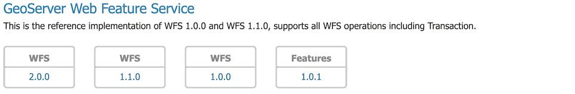
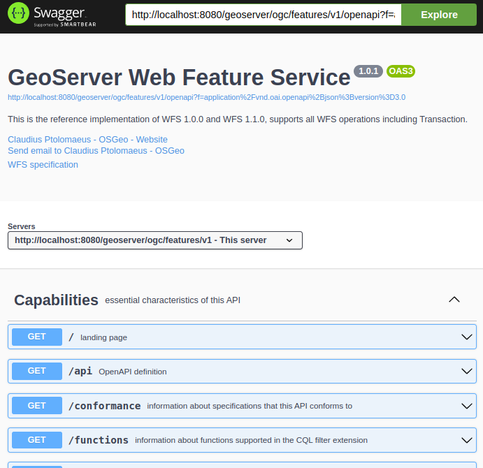
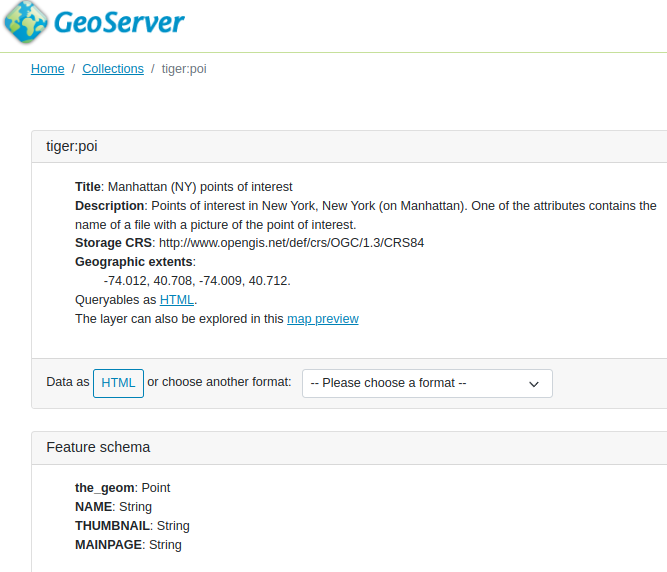
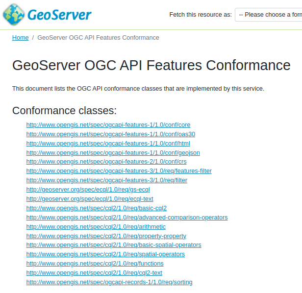
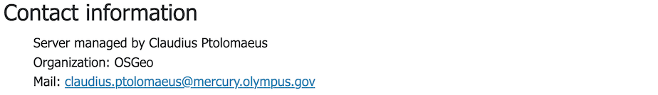

Using OGC API - Features service
--------------------------------

The OGC API Features Service is accessed via the :guilabel:`Features` version :guilabel:`1.0.1` link on the home page.

   
   GeoServer Welcome Page OGC API - Features

Capabilities
''''''''''''

The service is self described using:

* ``html``: A collection of web pages, with links for navigation between content (and that can be indexed by search engines for discoverability).

  .. figure:: img/features.png
 
     OGC API Features service

* `application/json`: A collection of :file:`json` documents, with reference between each document for programmatic access by web developers.

  .. code-block:: json
  
     {
       "title": "GeoServer Features service",
       "description": "This service delivers vector data in raw form, including both geometries and attributes.",
       "links": [
         {
           "href": "https://gs-main.geosolutionsgroup.com/geoserver/ogc/features/v1/?f=application%2Fjson",
           "rel": "self",
           "type": "application/json",
           "title": "This document"
         },
         {
           "href": "https://gs-main.geosolutionsgroup.com/geoserver/ogc/features/v1/?f=application%2Fx-yaml",
           "rel": "alternate",
           "type": "application/x-yaml",
           "title": "This document as application/x-yaml"
         },
         {
           "href": "https://gs-main.geosolutionsgroup.com/geoserver/ogc/features/v1/?f=text%2Fhtml",
           "rel": "alternate",
           "type": "text/html",
           "title": "This document as text/html"
         },

The service title and description are provided by the existing :ref:`wfs` settings.

Open API
''''''''

For programmatic access an `OpenAPI <https://www.openapis.org/>`__ description of the service is provided, that may be browsed as documentation, or used to generate a client to access the web services.

   
   OGC API Features OpenAPI Document

Collections
'''''''''''

The collection of feature types being published by the service.

Each collection entry is described using the layer details of title, description, geographic extent.

Data can be browsed as web pages, or downloaded in a range of formats such as :file:`GeoJSON` and :file:`GML` documents.

   
   Collection sf:roads download formats

Conformance
'''''''''''

Lists the operations this service can perform, each "conformance class" documents supported functionality. 

   OGC API - Features Conformance

Contact information
'''''''''''''''''''

Advertises contact information for the service.

   
   OGC API - Features Contact Information
   