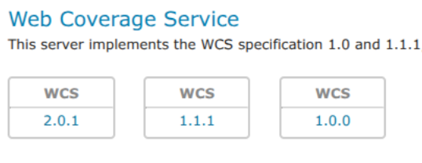

.. _wcs_install:

Installing the WCS 1.0 extension
=================================

GeoServer includes WCS 2.0 support in its core installation. However, WCS 1.0 support has been moved to an optional extension and must be installed separately if you need WCS 1.0.

To install the WCS 1.0 extension:

#. Navigate to the :website:`GeoServer download page <download>`.

#. Find the page that matches the exact version of GeoServer you are running.

   .. warning::  Be sure to match the version of the extension with that of GeoServer, otherwise errors will occur.

#. Download the WCS 1.0 extension:

   * |release| :download_extension:`wcs`
   * |version| :nightly_extension:`wcs`

   The download link for :guilabel:`WCS` will be in the :guilabel:`Extensions` section under :guilabel:`Other`.

#. Extract the files in this archive to the :file:`WEB-INF/lib` directory of your GeoServer installation.

#. Restart GeoServer.

After restarting, load the :ref:`web_admin`.  If the extension loaded properly, WCS 1.0 support will be available alongside the core WCS 2.0 functionality.  If you encounter any issues, check the logs for errors.

