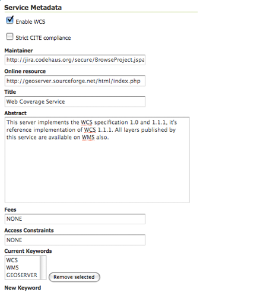

.. _services_webadmin_wcs:

WCS settings
============

This page details the configuration options for WCS in the web administration interface.

The Web Coverage Service (WCS) provides few options for changing coverage functionality. While various elements can be configured for WFS and WMS requests, WCS allows only metadata information to be edited. This metadata information, entitled :guilabel:`Service Metadata`, is common to WCS, WFS and WMS requests. 

   
   WCS Configuration page

.. _service_metadata:

Service Metadata
----------------

WCS, WFS, and WMS use common metadata definitions. These nine elements are described in the following table. Though these field types are the same regardless of service, their values are not shared. As such, parameter definitions below refer to the respective service. For example, "Enable" on the WFS Service page, enables WFS service requests and has no effect on WCS or WMS requests. 

.. list-table::
   :widths: 30 70
   :header-rows: 1
   
   * - Field
     - Description
   * - Enabled
     - Specifies whether the respective services--WCS, WFS or WMS--should be enabled or disabled. When disabled, the respective service requests will not be processed. 
   * - Strict CITE compliance
     - When selected, enforces strict OGC Compliance and Interoperability Testing Initiative (CITE) conformance. Recommended for use when running conformance tests.
   * - Maintainer
     - Name of the maintaining body 
   * - Online Resource
     - Defines the top-level HTTP URL of the service. Typically the Online Resource is the URL of the service "home page." (Required)|
   * - Title
     - A human-readable title to briefly identify this service in menus to clients (required)    
   * - Abstract
     - Provides a descriptive narrative with more information about the service 
   * - Fees
     - Indicates any fees imposed by the service provider for usage of the service. The keyword NONE is reserved to mean no fees and fits most cases.  
   * - Access Constraints
     - Describes any constraints imposed by the service provider on the service. The keyword NONE is reserved to indicate no access constraints are imposed and fits most cases.
   * - Keywords
     - List of short words associated with the service to aid in cataloging and searching 

