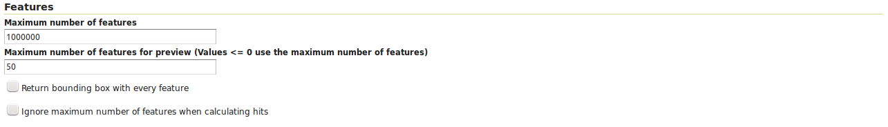
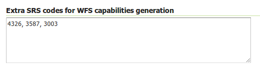
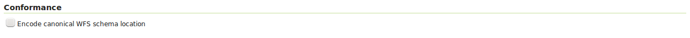
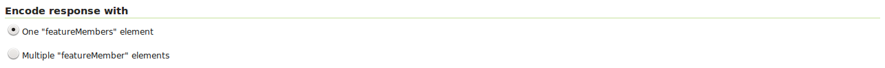
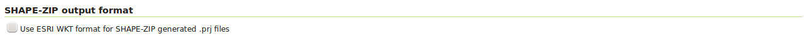
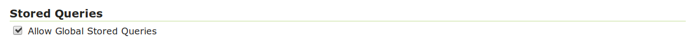

.. _services_webadmin_wfs:

WFS settings
============

This page details the configuration options for WFS in the web administration interface.

Service Metadata
----------------

See the section on :ref:`service_metadata`.   

Features
--------

   
   WFS configuration options - Features section

The `Open Geospatial Consortium <http://www.opengeospatial.org/>`_ (OGC) Web Feature Service (WFS) is a protocol for serving geographic features across the Web. Feature information that is encoded and transported using WFS includes both feature geometry and feature attribute values. Basic Web Feature Service (WFS) supports feature query and retrieval. Feature limits and bounding can be configured on the WFS page. 

**Maximum number of features** — Maximum number of features that a WFS GetFeature operation should generate, regardless of the actual number of query hits. A WFS request can potentially contain a large dataset that is impractical to download to a client, and/or too large for a client's renderer. Maximum feature limits are also available for feature types. The default number is 1000000.

**Maximum number of features for preview (Values <= 0 use the maximum number of features)** - Maximum number of features to use for layer previews. The default is 50 features.

**Return bounding box with every feature** — When creating the GetFeature GML output, adds an auto-calculated bounds element on each feature type. Not typically enabled, as including bounding box takes up extra bandwidth. 

**Ignore maximum number of features when calculating hits** - When calculating the total number of hits, ignore the Maximum number of features setting. This can be used to get the count of matching features, even if they would not be made available for download because they exceed the maximum count specified. On very large data sets, this can slow down the response.

Service Levels
--------------

.. figure:: img/services_WFS_servicelevel.png
   
   WFS configuration options - Service Level section

GeoServer is compliant with the full "Transactional Web Feature Server" (WFS-T) level of service as defined by the OGC. Specifying the WFS service level limits the capabilities of GeoServer while still remaining compliant. The WFS Service Level setting defines what WFS operations are "turned on". 

**Basic** — Basic service levels provides facilities for searching and retrieving feature data with the GetCapabilities, DescribeFeatureType and GetFeature operations. It is compliant with the OGC basic Web Feature Service. This is considered a READ-ONLY web feature service. 

**Transactional** — In addition to all basic WFS operations, transactional service level supports transaction requests. A transaction request facilitates the creation, deletion, and updating of geographic features in conformance with the OGC Transactional Web Feature Service (WFS-T). 

**Complete** — Includes LockFeature support to the suite of transactional level operations. LockFeature operations help resolve links between related resources by processing lock requests on one or more instances of a feature type. 

Configuring additional SRS
--------------------------

WFS 1.1.0 onwards adds the ability to reproject GetFeature output to a user specified target SRS. The list of applicable target SRS is defined on a feature type basis in the capabilities documents, and GeoServer allows reprojection to any supported SRS in its internal database. To declare that GeoServer would have to add 5000+ ``otherSRS/otherCRS`` elements per feature type, which is clearly impractical. As a result, no declaration is made by default.

A list of values to be declared in all feature types can be provided in the WFS administration panel, as a comma separated list of EPSG codes:

   
   WFS otherSRS/otherCRS configuration

The list will be used only for the capabilities document generation. It does not limit the actual target SRS usage in GetFeature requests.

GML
---

.. figure:: img/services_WFS_srsstyle.png
   
   WFS configuration options - GML sections

Geography Markup Language (GML) is the XML-based specification defined by the Open Geospatial Consortium (OGC) to express geographical features. GML serves as a modeling language for geographic systems as well as an open interchange format for geographic transactions on the Internet. 

The older GML standard, `GML 2 <http://portal.opengeospatial.org/files/?artifact_id=11339>`_ encodes geographic information, including both spatial and non-spatial properties. GML3 extends GML2 support to 3D shapes (surfaces and solids) as well as other advanced facilities. GML 3 is a modular superset of GML 2 that simplifies and minimizes the implementation size by allowing users to select out necessary parts. Additions in GML 3 include support for complex geometries, spatial and temporal reference systems, topology, units of measure, metadata, gridded data, and default styles for feature and coverage visualization. GML 3 is almost entirely backwards compatible with GML 2.

WFS 2.0.0 request return GML 3.2 as the default format, WFS 1.1.0 requests return GML 3 as the default format, and WFS 1.0.0 requests return GML 2 as the default format. For each of the GML formats supported by GeoServer, a different SRS format can be selected.

**EPSG Code** — Returns the typical EPSG number in the form ``EPSG:XXXX`` (e.g. ``EPSG:4326``). This formats the geographic coordinates in longitude/latitude (x/y) order. 

**OGC HTTP URL** — Returns a URL that identifies each EPSG code: ``http://www.opengis.net/gml/srs/epsg.xml#XXXX`` (e.g. ``http://www.opengis.net/gml/srs/epsg.xml#4326``). This formats the geographic coordinates in longitude/latitude (x/y) order.  This format is the default GML 2 SRS convention.

**OGC Experimental URN** - Returns a URN that identifies each EPSG code: ``urn:x-ogc:def:crs:EPSG:XXXX`` (e.g. ``urn:x-ogc:def:crs:EPSG:4326``). This format was the original GML 3 SRS convention.

**OGC URN** — (WFS 1.1.1 only) Returns the colon delimited SRS formatting: ``urn:ogc:def:crs:EPSG::XXXX`` (e.g ``urn:ogc:def:crs:EPSG::4326``). This is the revised GML 3 SRS convention, and is the default for GML 3.2. This formats data in the traditional axis order for geographic and cartographic systems—latitude/longitude (y/x).

**OGC HTTP URI** - Returns a URI that identifies each EPSG code: ``http://www.opengis.net/def/crs/EPSG/0/XXXX`` (e.g. ``http://www.opengis.net/def/crs/EPSG/0/4326``). 

For each GML type, there is also an "Override GML Attributes" checkbox. Selecting this (checking the checkbox) will cause attributes to be redefined in the application schema.

Conformance
-----------

   
   WFS configuration options - Conformance section

Selecting the :guilabel:`Encode canonical WFS schema location` checkbox modifies the WFS responses to include the canonical schema locations in the ``xsi:schemaLocation`` attribute, instead of
using the default schema locations on the local GeoServer. Note that turning this option on may result in the client not being able to validate the WFS response, depending on network
configuration.

Encode response with
--------------------

   
   WFS configuration options - Encode response with
   
The :guilabel:`Encode response with` radio button group has two selection - :guilabel:`One "featureMembers" element` (the default) or :guilabel:`Multiple "featureMember" elements`. This switches the WFS 1.1.0 encoding accordingly. Use of multiple ``featureMember`` elements may be required for Application Schema referencing.

SHAPE-ZIP output format 
-----------------------

   
   WFS configuration options - Encode response with
   
Selecting the :guilabel:`Use ESRI WKT format for SHAPE-ZIP generated .prj files` checkbox modifies how projections are encoded in the Shapefile zip output format. If this checkbox
is not selected, OGC WKT format will be used. If this checkbox is selected, ESRI WKT format will be used.

Note: this requires an ``esri.properties`` file to be provided in the ``user_projections`` subdirectory of the GeoServer data directory. This may be obtained from the GeoTools EPSG extension.

Stored Queries
--------------

Selecting the :guilabel:`Allow Global Stored Queries` checkbox determines if global stored queries will included for usage in workspace virtual services, or not. When disabled, only stored queries created inside the workspace will be visible.

Override GML 3.2 MIME type
--------------------------

The default MIME used for GML 3.2 encoded responses is ``application/gml+xml; version=3.2`` which is the MIME type mandated by OGC WFS 2.0 specification. This MIME type is not identified as XML by most common clients like browsers. 

Option :guilabel:`Override MIME Type` allows the selection of the MIME type that should be used for the responses encoded in GML 3.2.  

.. figure:: img/services_WFS_mimetype.png

The available MIME types are: ``application/gml+xml; version=3.2``, ``text/xml; subtype=gml/3.2`` and ``text/xml``. 

Configure XML Entity Expansion limit on WFS XML readers
-------------------------------------------------------

By default WFS XML readers sets Entity Expansion limit to 100, but it can be configured via the ``org.geoserver.wfs.xml.entityExpansionLimit`` system property / web.xml init parameter / Environment variable.

For example on command line we can adjust adding parameter:

    -Dorg.geoserver.wfs.xml.entityExpansionLimit=50
	
Or in Tomcat properties file (``{TOMCAT_HOME}/conf/catalina.properties``) adding the line:

    org.geoserver.wfs.xml.entityExpansionLimit=50