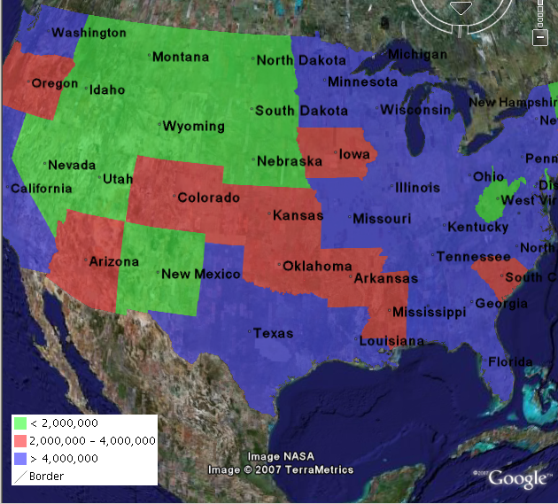

.. _ge_feature_kml_legends:

KML Legends 
===========

WMS includes a ``GetLegendGraphic`` operation which allows a WMS client to obtain a legend graphic from the server for a particular layer. Combining the legend with KML overlays allows the legend to be viewed inside Google Earth.

To get GeoServer to include a legend with the KML output, append ``legend=true`` to the KML reflector request. For example::

   http://localhost:8080/geoserver/wms/kml?layers=topp:states&legend=true

The resulting Google Earth output looks like this:

