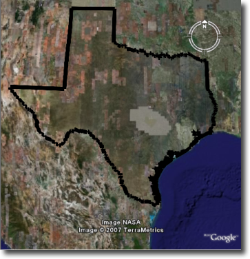
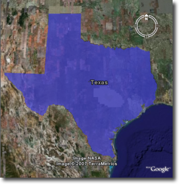
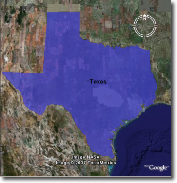

.. _google-earth-kml-styling:

KML Styling
===========

Introduction
------------

Keyhole Markup Langauge (KML), when created and output by GeoServer, is styled using `Styled Layer Descriptors <http://en.wikipedia.org/wiki/Styled_Layer_Descriptor>`_ (SLD). This is the same approach used to style standard WMS output formats, but is a bit different from how Google Earth is normally styled, behaving more like Cascading Style Sheets (CSS). The style of the map is specified in the SLD file as a series of rules, and then the data matching those rules is styled appropriately in the KML output. For those unfamiliar with SLD, a good place to start is the :ref:`sld_intro`. The remainder of this guide contains information about how to construct SLD documents in order to impact the look of KML produced by GeoServer.

Contents
````````

   :ref:`kml-styling-basic`

   :ref:`kml-styling-sld-hand`
   
   :ref:`kml-styling-sld-structure` 

   :ref:`kml-styling-points`

   :ref:`kml-styling-lines`

   :ref:`kml-styling-polygons`

   :ref:`kml-styling-text-labels`

   :ref:`kml-styling-descriptions`


.. _kml-styling-basic:

SLD Generation from CSS
-----------------------

The CSS extension provides the facility to generate SLD files using a lightweight "Cascading Style Sheet" syntax. The CSS GUI provides a live map preview as you are editing your style in addition to an attribute reference for the current layer.

The generated styles will work seamlessly with KML output from GeoServer.


.. _kml-styling-sld-hand:

Creating SLD by hand
--------------------

One can edit the SLD files directly instead of using the CSS extension.  For the most complete exploration of editing SLDs see the :ref:`styling` section.  The examples below show how some of the basic styles show up in Google Earth.


.. _kml-styling-sld-structure:

SLD Structure
-------------


The following is a skeleton of a SLD document. It can be used as a base on which to expand upon to create more interesting and complicated styles.

.. code-block:: xml 
   
   <StyledLayerDescriptor version="1.0.0"
      xsi:schemaLocation="http://www.opengis.net/sld StyledLayerDescriptor.xsd"
      xmlns="http://www.opengis.net/sld"
      xmlns:ogc="http://www.opengis.net/ogc"
      xmlns:xlink="http://www.w3.org/1999/xlink"
      xmlns:xsi="http://www.w3.org/2001/XMLSchema-instance">
      <NamedLayer>
         <Name>Default Line</Name>
         <UserStyle>
            <Title>My Style</Title>
            <Abstract>A style</Abstract>
            <FeatureTypeStyle>
               <Rule>
			         
                     <!-- symbolizers go here -->
					 
               </Rule>
            </FeatureTypeStyle>
         </UserStyle>
      </NamedLayer>
   </StyledLayerDescriptor>

*Figure 3: Basic SLD structure*

In order to test the code snippets in this document, create an SLD with the content as shown in Figure 3, and then add the specific code you wish to test in the space that says ``<!-- symbolizers go here -->``. To view, edit, or add SLD files to GeoServer, navigate to **Config** -> **Data** -> **Styles**.

.. _kml-styling-points:

Points
------

In SLD, styles for points are specified via a PointSymbolizer. An empty PointSymbolizer element will result in a default KML style:

.. code-block:: xml 

   <PointSymbolizer>
   </PointSymbolizer>
   
.. figure:: pointDefault.png
   :align: center

   *Figure 4: Default point*

Three aspects of points that can be specified are *color*, *opacity*, and the *icon*.

Point Color
```````````

The color of a point is specified with a ``CssParameter`` element and a ``fill`` attribute. The color is specified as a six digit hexadecimal code.

.. code-block:: xml 

   <PointSymbolizer>
      <Graphic>
         <Mark>
            <Fill>
               <CssParameter name="fill">#ff0000</CssParameter>
            </Fill>
         </Mark>
      </Graphic>
   </PointSymbolizer>

.. figure:: pointColor.png
   :align: center   
   
   *Figure 5: Setting the point color (#ff0000 = 100% red)*

Point Opacity
`````````````

The opacity of a point is specified with a CssParameter element and a ``fill-opacity`` attribute. The opacity is specified as a floating point number between **0** and **1**, with 0 being completely transparent, and 1 being completely opaque.

.. code-block:: xml 

   <PointSymbolizer>
      <Graphic>
         <Mark>
            <Fill>
               <CssParameter name="fill-opacity">0.5</CssParameter>
            </Fill>
         </Mark>
      </Graphic>
   </PointSymbolizer>

.. figure:: pointOpacity.png
   :align: center   

   *Figure 6: Setting the point opacity (0.5 = 50% opaque)*

Point Icon
``````````

An icon different from the default can be specified with the ``ExternalGraphic`` element:

.. code-block:: xml 

   <PointSymbolizer>
      <Graphic>
         <ExternalGraphic>
            <OnlineResource xlink:type="simple"
               xlink:href="http://maps.google.com/mapfiles/kml/pal3/icon55.png"/>
            <Format>image/png</Format>
         </ExternalGraphic>
      </Graphic>
   </PointSymbolizer>

.. figure:: pointCustomIcon.png
   :align: center      

   *Figure 7: A custom icon for points*

In Figure 7, the custom icon is specified as a remote URL. It is also possible to place the graphic in the GeoServer ``styles`` directory, and then specify the filename only:

.. code-block:: xml 

   <PointSymbolizer>
      <Graphic>
         <ExternalGraphic>
            <OnlineResource xlink:type="simple" xlink:href="icon55.png"/>
            <Format>image/png</Format>
         </ExternalGraphic>
      </Graphic>
   </PointSymbolizer>

*Figure 8: Specifying a local file for a graphic point*

.. _kml-styling-lines:

Lines
-----

Styles for lines are specified via a ``LineSymbolizer``. An empty ``LineSymbolizer`` element will result in a default KML style:

.. code-block:: xml 

   <LineSymbolizer>
   </LineSymbolizer>

.. figure:: lineDefault.png
   :align: center       
   
   *Figure 9: Default line*

The aspects of the resulting line which can be specified via a ``LineSymbolizer`` are *color*, *width*, and *opacity*.

Line Color
``````````

The color of a line is specified with a ``CssParameter`` element and a ``stroke`` attribute. The color is specified as a six digit hexadecimal code.

.. code-block:: xml 

   <LineSymbolizer>
      <Stroke>
         <CssParameter name="stroke">#ff0000</CssParameter>
      </Stroke>
   </LineSymbolizer>

.. figure:: lineColor.png
   :align: center     
   
   *Figure 10: Line rendered with color #ff0000 (100% red)*

Line Width
``````````

The width of a line is specified with a ``CssParameter`` element and a ``stroke-width`` attribute. The width is specified as an integer (in pixels):

.. code-block:: xml 

   <LineSymbolizer>
      <Stroke>
         <CssParameter name="stroke-width">5</CssParameter>
      </Stroke>
   </LineSymbolizer>

.. figure:: lineWidth.png
   :align: center    
   
   *Figure 11: Line rendered with a width of five (5) pixels*

Line Opacity
````````````

The opacity of a line is specified with a ``CssParameter`` element and a ``fill-opacity`` attribute. The opacity is specified as a floating point number between **0** and **1**, with 0 being completely transparent, and 1 being completely opaque.

.. code-block:: xml 

   <LineSymbolizer>
      <Stroke>
         <CssParameter name="stroke-opacity">0.5</CssParameter>
      </Stroke>
   </LineSymbolizer>
   
.. figure:: lineOpacity.png
   :align: center     

   *Figure 12: A line rendered with 50% opacity*

.. _kml-styling-polygons:

Polygons
--------

Styles for polygons are specified via a ``PolygonSymbolizer``. An empty ``PolygonSymbolizer`` element will result in a default KML style:

.. code-block:: xml 

   <PolygonSymbolizer>
   </PolygonSymbolizer>

Polygons have more options for styling than points and lines, as polygons have both an inside ("fill") and an outline ("stroke"). The aspects of polygons that can be specified via a ``PolygonSymbolizer`` are *stroke color*, *stroke width*, *stroke opacity*, *fill color*, and *fill opacity*.

Polygon Stroke Color
````````````````````

The outline color of a polygon is specified with a ``CssParameter`` element and ``stroke`` attribute inside of a ``Stroke`` element. The color is specified as a 6 digit hexadecimal code:

.. code-block:: xml 

   <PolygonSymbolizer>
      <Stroke>
         <CssParameter name="stroke">#0000FF</CssParameter>
      </Stroke>
   </PolygonSymbolizer>

.. figure:: polygonOutlineColor.png
   :align: center      
   
   *Figure 13: Outline of a polygon (#0000FF or 100% blue)*

Polygon Stroke Width
````````````````````

The outline width of a polygon is specified with a ``CssParameter`` element and ``stroke-width`` attribute inside of a ``Stroke`` element. The width is specified as an integer.

.. code-block:: xml 

   <PolygonSymbolizer>
      <Stroke>
         <CssParameter name="stroke-width">5</CssParameter>
      </Stroke>
   </PolygonSymbolizer>


   
*Figure 14: Polygon with stroke width of five (5) pixels*

Polygon Stroke Opacity
``````````````````````

The stroke opacity of a polygon is specified with a ``CssParameter`` element and ``stroke`` attribute inside of a ``Stroke`` element. The opacity is specified as a floating point number between **0** and **1**, with 0 being completely transparent, and 1 being completely opaque.

.. code-block:: xml 

   <PolygonSymbolizer>
      <Stroke>
         <CssParameter name="stroke-opacity">0.5</CssParameter>
      </Stroke>
   </PolygonSymbolizer>

.. figure:: polygonOutlineOpacity.png
   :align: center     
   
   *Figure 15: Polygon stroke opacity of 0.5 (50% opaque)*

Polygon Fill Color
``````````````````

The fill color of a polygon is specified with a ``CssParameter`` element and ``fill`` attribute inside of a ``Fill`` element. The color is specified as a six digit hexadecimal code:

.. code-block:: xml 

   <PolygonSymbolizer>
      <Fill>
         <CssParameter name="fill">#0000FF</CssParameter>
      </Fill>
   </PolygonSymbolizer>

.. figure:: polygonFillColor.png
   :align: center    

   *Figure 16: Polygon fill color of #0000FF (100% blue)*

Polygon Fill Opacity
````````````````````

The fill opacity of a polygon is specified with a ``CssParameter`` element and ``fill-opacity`` attribute inside of a ``Fill`` element. The opacity is specified as a floating point number between **0** and **1**, with 0 being completely transparent, and 1 being completely opaque.

.. code-block:: xml 

   <PolygonSymbolizer>
      <Fill>
         <CssParameter name="fill-opacity">0.5</CssParameter>
      </Fill>
   </PolygonSymbolizer>

.. figure:: polygonFillOpacity.png
   :align: center    
   
   *Figure 17: Polygon fill opacity of 0.5 (50% opaque)*

.. _kml-styling-text-labels:

Text Labels
-----------

There are two ways to specify a label for a feature in Google Earth. The first is with Freemarker templates (LINK?), and the second is with a ``TextSymbolizer``. Templates take precedence over symbolizers.

Freemarker Templates
````````````````````

Specifying labels via a Freemarker template involves creating a special text file called ``title.ftl`` and placing it into the ``workspaces/<ws name>/<datastore name>/<feature type name>`` directory (inside the GeoServer data directory) for the dataset to be labeled. For example, to create a template to label the ``states`` dataset by state name one would create the file here:  ``<data_dir>/workspaces/topp/states_shapefile/states/title.ftl``. The content of the file would be:

.. code-block:: none

   ${STATE_NAME.value}


   
   *Figure 18: Using a Freemarker template to display the value of STATE_NAME*

For more information on Placemark Templates, please see our full tutorial (LINK FORTHCOMING).

TextSymbolizer
``````````````

In SLD labels are specified with the Label element of a ``TextSymbolizer``.  (Note the ``ogc:`` prefix on the ``PropertyName`` element.)

.. code-block:: xml 

   <TextSymbolizer>
      <Label>
         <ogc:PropertyName>STATE_NAME</ogc:PropertyName>
      </Label>
   </TextSymbolizer>


   
   *Figure 19: Using a TextSymbolizer to display the value of STATE_NAME*

The aspects of the resulting label which can be specified via a ``TextSymbolizer`` are *color* and *opacity*.

TextSymbolizer Color
````````````````````

The color of a label is specified with a ``CssParameter`` element and ``fill`` attribute inside of a ``Fill`` element. The color is specified as a six digit hexadecimal code:

.. code-block:: xml 

   <TextSymbolizer>
      <Label>
         <ogc:PropertyName>STATE_NAME</ogc:PropertyName>
      </Label>
      <Fill>
         <CssParameter name="fill">#000000</CssParameter>
      </Fill>
   </TextSymbolizer>


   
   *Figure 20: TextSymbolizer with black text color (#000000)*

TextSymbolizer Opacity
``````````````````````

The opacity of a label is specified with a ``CssParameter`` element and ``fill-opacity`` attribute inside of a ``Fill`` element. The opacity is specified as a floating point number between **0** and **1**, with 0 being completely transparent, and 1 being completely opaque.

.. code-block:: xml 

   <TextSymbolizer>
      <Label>
         <ogc:PropertyName>STATE_NAME</ogc:PropertyName>
      </Label>
      <Fill>
         <CssParameter name="fill-opacity">0.5</CssParameter>
      </Fill>
   </TextSymbolizer>

.. figure:: labelOpacity.png
   :align: center
   
   *Figure 21: TextSymbolizer with opacity 0.5 (50% opaque)*

.. _kml-styling-descriptions:

Descriptions
------------

When working with KML, each feature is linked to a description, accessible when the feature is clicked on. By default, GeoServer creates a list of all the attributes and values for the particular feature.

.. figure:: descriptionDefault.png
   :align: center
   
   *Figure 22: Default description for a feature*

It is possible to modify this default behavior. Much like with featureType titles, which are edited by creating a ``title.ftl`` template, a custom description can be used by creating template called ``description.ftl`` and placing it into the feature type directory (inside the GeoServer data directory) for the dataset. For instance, to create a template to provide a description for the states dataset, one would create the file: ``<data_dir>/workspaces/topp/states_shapefile/states/description.ftl``. As an example, if the content of the description template is:

.. code-block:: none

   This is the state of ${STATE_NAME.value}.

The resultant description will look like this:

.. figure:: descriptionTemplate.png
   :align: center
   
   *Figure 23: A custom description*

It is also possible to create one description template for all featureTypes in a given namespace. To do this, create a ``description.ftl`` file as above, and save it as ``<data_dir>/templates/<workspace>/description.ftl``. Please note that if a description template is created for a specific featureType that also has an associated namespace description template, the featureType template (i.e. the most specific template) will take priority.

One can also create more complex descriptions using a combination of HTML and the attributes of the data. A full tutorial on how to use templates to create descriptions is available in our page on KML Placemark Templates.  (LINK?)


:ref:`kml-styling-basic`
:ref:`kml-styling-sld-structure` 
:ref:`kml-styling-points`
:ref:`kml-styling-lines`
:ref:`kml-styling-polygons`
:ref:`kml-styling-text-labels`
:ref:`kml-styling-descriptions`
