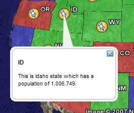

.. _getutorial_kmlplacemark:

KML Placemark Templates
=======================

Introduction
````````````

In KML a "Placemark" is used to mark a position on a map, often visualized with a yellow push pin. A placemark can have a "description" which allows one to attach information to it. Placemark descriptions are nothing more then an HTML snippet and can contain anything we want it to.

By default GeoServer produces placemark descriptions which are HTML tables describing all the attributes available for a particular feature in a dataset. In the following image we see the placemark description for the feature representing Idaho state:

.. figure:: default.jpg
   :align: center

   *The default placemark*

This is great, but what about if one wanted some other sort of information to be conveyed in the description. Or perhaps one does not want to show all the attributes of the dataset. The answer is Templates!!

A template is more or less a way to create some output.

Getting Started
```````````````

First let us get set up. To complete the tutorial you will need the following:

* A GeoServer install
* A text editor

And thats it. For this tutorial we will assume that GeoServer is running the same configuration ( data directory ) that it does out of the box.

Hello World
```````````
Ok, time to get to creating our first template. We will start off an extremely simple template which, you guessed it, creates the placemark description "Hello World!". So lets go.

1. Using the text editor of your choice start a new file called ``description.ftl``
2. Add the following content to the file::

	Hello World!

3. Save the file in the ``workspaces/topp/states_shapefile/states`` directory of your "data directory". The data directory is the location of all the GeoServer configuration files. It is normally pointed to by the environment variable ``GEOSERVER_DATA_DIR``.
4. Start GeoServer is it is not already running.

And thats it. We can now test out our template by adding the following network link in google earth::

	http://localhost:8080/geoserver/wms/kml?layers=states

And voila. Your first template

	.. figure:: helloworld.png
	   :align: center

	   *Hello World template.*
	
**Refreshing Templates**: One nice aspect of templates is that they are read upon every request. So one can simply edit the template in place and have it picked up by GeoServer as soon as the file is saved. So when after editing and saving a template simply "Refresh" the network link in Google Earth to have the new content picked up.

	.. figure:: refresh.png
	   :align: center

	   *Refresh Template*
	
As stated before template descriptions are nothing more than html. Play around with ``description.ftl`` and add some of your own html. Some examples you may want to try:

1. A simple link to the homepage of your organization::

	Provided by the <a href="http://topp.openplans.org">The Open Planning Project</a>.
	
Homepage of Topp

	.. figure:: topplink.png
	   :align: center

	   *Homepage of Topp*
	
2. The logo of your organization::

	
	
Logo of Topp

	.. figure:: topplogo.png
	   :align: center

	   *Logo of Topp*
	
The possibilities are endless. Now this is all great and everything but these examples are some what lacking in that the content is static. In the next section we will create more realistic template which actually access some the attributes of our data set.	

Data Content
````````````

The real power of templates is the ability to easily access content, in the case of features this content is the attributes of features.In a KML placemark description template, there are a number of "template variables" available.

* The variable "fid", which corresponds to the id of the feature
* The variable "typeName", which corresponds to the name of the type of the feature
*  A sequence of variables corresponding to feature attributes, each named the same name as the attribute

So with this knowledge in hand let us come up with some more examples:

Simple fid/typename access::

	This is feature ${fid} of type ${typeName}.
	
This is a feature of 3.1 of type states.

.. figure:: fid.png
   :align: center

   *FID*

Access to the values of two attributes named ``STATE_NAME``, and ``PERSONS``::

	This is ${STATE_NAME.value} state which has a population of ${PERSONS.value}.
	
ID This is Idaho state which has a population of 1.006.749.



   *Attributes*

Attribute Variables
```````````````````
A feature attribute a "complex object" which is made up of three parts:

#. **A value**, given as a default string representation of the actual attribute value feasible to be used directly
#. **A rawValue**, being the actual value of the attribute, to allow for more specialized customization (for example, ``${attribute.value?string("Enabled", "Disabled")}`` for custom representations of boolean attributes, etc).
#. **A type**, each of which is accessible via ``${<attribute_name>.name}``, ``${<attribute_name>.value}, ${<attribute_name>.rawValue}``, ``${<attribute_name>.type}`` respectively. The other variables: fid, and typeName and are "simple objects" which are available directly.

WMS Demo Example
````````````````
We will base our final example off the "WMS Example" demo which ships with GeoServer. To check out the demo visit http://localhost:8080/geoserver/popup_map/index.html in your web browser.

You will notice that hovering the mouse over one of the points on the map displays an image specific to that point. Let us replicate this with a KML placemark description.

1. In the ``featureTypes/DS_poi_poi`` directory of the geoserver data directory create the following template::

	
	
2. Add the following network link in Google Earth::

	http://localhost:8080/geoserver/wms/kml?layers=tiger:poi
	
Poi.4

.. figure:: wmsexample.png
   :align: center

   *WMS Example*


	


