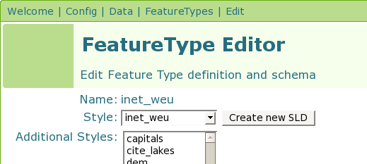
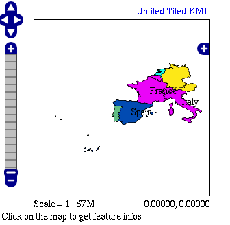

.. _tutorials_time:

Time
====

.. warning:: The screenshots on this tutorial have not yet been updated for the 2.0.x user interface.  But most all the rest of the information should be valid, and the user interface is roughly the same, but a bit more easy to use.

Getting Started
---------------
For this tutorial we will using a Shapefile which contains information about the number of Internet users in the countries of Western Europe for a rang of years.

#. Download and unzip :download:`inet_weu.zip`
#. Configure GeoServer to serve the Shapefile ``inet_weu.zip``. (A tutorial is available :ref:`shapefile_quickstart`.)
#. Add the SLD ":download:`inet_weu.sld` to GeoServer. ( A tutorial is available for :ref:`styling`)
#. Set the style of the feature type added in step 2 to the style added in step 3



   *Style*
   
Checking the Setup
------------------

If all is configured properly you should be able to navigate to http://localhost:8080/geoserver/wms/kml?layers=topp:inet_weu&format=openlayers&bbox=-33.780,26.266,21.005,56.427 and see the following map:


   
   *Setup*
   
Creating the Template
---------------------
Next we will create a template which allows us to specify the temporal aspects of the dataset. The schema of our dataset looks like:

.. list-table::
   :widths: 30 70  

   * - INET_P100n
     - Number of internet users per 100 people
   * - NAME
     - Name of country 
   * - RPT_YEAR
     - Year 
   * - Geometry
     - Polygon representing the country 
     
The temporal attribute is ``RPT_YEAR`` and is the one that matters to us. Ok, time to create the template.

1. In your text editor of choice, create a new text file called ``time.ftl``.
2. Add the following text:

.. code-block:: html

  ${RPT_YEAR.value?date('yyyy')}

3. Save the file to the ``<GEOSERVER_DATA_DIR>/workspaces/topp/inet_weu_shapefile/inet_weu`` directory. Where ``<GEOSERVER_DATA_DIR>`` is the location of the "data directory" of your GeoServer installation. Usually pointed to via the ``GEOSERVER_DATA_DIR`` environment variable.

See the ref:`references` section for more information about specifying a date format.

Trying it Out
-------------
Ok time to try it out.

1. Navigate to http://localhost:8080/geoserver/wms/kml?layers=inet_weu&legend=true. This should cause Google Earth to open.

.. figure:: try1.png
   :align: center
   
   *Google Earth*

2. In Google Earth, adjust the time bar so that it captures a time interval that is approximately 1 year wide

.. figure:: try2.png
   :align: center
   
   *Google Earth Time Bar*
   
3. Slide the time bar forward in time and notice how the polygon colors change

.. figure:: try3.png
   :align: center
   
   *Sliding the Time Bar*

.. _references:

References
----------

Specifying a Date Format
````````````````````````
When setting up a time template for your own dataset the most important issue is the format of your temporal data. It may or may not be in a format in which GeoServer can read directly. You can check if the date/time format can be used directly by GeoServer by using the following time template.  This is an example time template file (time.ftl) file without explicit formatting.

.. code-block:: html

  ${DATETIME_ATTRIBUTE_NAME.value}

While GeoServer will try its best to parse the data there are cases in which your data is in a format which it cannot parse. When this occurs it is necessary to explicitly specify the format. Luckily Freemarker provides us with functionality to do just this.

Consider the date time ``12:30 on January 01, 2007`` specified in the following format: ``01?01%2007&12$30!00``. When creating the template we need to explicitly tell Freemarker the format the date time is in with the datetime function.  This is an example time template file (time.ftl) file with explicit formatting: ::

  ${DATETIME_ATTRIBUTE_NAME.value?datetime("M?d%y&H:m:s")}

The process is similar for dates (no time). The date ``01?01%2007`` would be specified in a template with explicit formatting:

.. code-block:: html

  ${DATETIME_ATTRIBUTE_NAME.value?date("M?d%y")}

So when must you specify the date format in this manner? The following table illustrates the :guilabel:`date` formats that GeoServer can understand.  Note that the '-' character can be one of any of the following characters: '/' (forward slash), ' ' (space), '.' (period), ',' (comma) 

.. list-table::
   :widths: 30 30 
   
   * - **Date Format**
     - **Example**
   * - yyyy-MM-dd 
     - 2007-06-20 
   * - yyyy-MMM-dd 
     - 2007-Jun-20 
   * - MM-dd-yyyy 
     - 06-20-2007 
   * - MMM-dd-yyyy 
     - Jun-20-2007 
   * - dd-MM-yyyy 
     - 20-06-2007 
   * - dd-MMM-yyyy 
     - 20-Jun-2007 
     

The set of :guilabel:`date time` formats which GeoServer can be understand is formed by appending the timestamp formats ``hh:mm`` and ``hh:mm:ss`` to the entries in the above table:
     
.. list-table::
   :widths: 30 30
   
   * - **DateTime Format**
     - **Example**
   * - yyyy-MM-dd hh:mm  
     - 2007-06-20 12:30  
   * - yyyy-MMM-dd hh:mm  
     - 2007-Jun-20 12:30  
   * - yyyy-MM-dd hh:mm:ss  
     - 2007-06-20 12:30:00 
   * - yyyy-MMM-dd hh:mm:ss 
     - 2007-Jun-20 12:30:00 

.. warning:: **Setting the Timezone**

    Be aware that the KML output for :guilabel:`date time` formats will reflect the timezone of the java virtual machine, which can be set using the user.timezone parameter in the startup script. For example, the following command starts GeoServer using the Coordinated Universal Time (UTC) timezone.
            
        ``exec "$_RUNJAVA" -DGEOSERVER_DATA_DIR="$GEOSERVER_DATA_DIR"``
            ``-Djava.awt.headless=true -DSTOP.PORT=8079``
            ``-Duser.timezone=UTC``
            ``-DSTOP.KEY=geoserver -jar start.jar``

    If the timezone is not set, it will default to the timezone of the operating system.
        
        
Specifying a Date Range
```````````````````````
In the above example a single time stamp is output for the dataset. GeoServer also supports specifying date ranges via a template. The syntax for ranges is:

.. code-block: html
  
    <begin>||<end>

Where begin is the first date in the range, end is the last date in the range, and || is the delimiter between the two. As an example:

.. code-block: html

    01/01/2007||06/01/2007

Would the date range starting at ``January 1, 2007`` and ending ``June 1, 2007``. Date ranges can also be open ended:

.. code-block: html

    ||06/01/2007
    06/01/2007||
    
The first date specifies a date range where the beginning is open-ended. The second specifies a date range where the end is open-ended.
     
     
     
     
     
     
     
     
     
     
     
     


