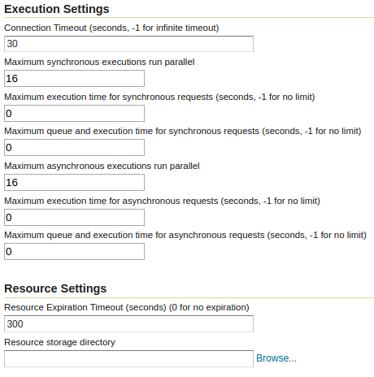

.. _webadmin_wps:

WPS Service page
=================

The Web Processing Service (WPS) page supports the basic metadata for the service, as well as 
service specific settings  

Service Metadata
----------------

The service metadata section is common among all services. See the section on :ref:`service_metadata`.

.. figure:: images/metadata.png
   :align: center
   
Execution and resource management options
-----------------------------------------

   
Execution settings:

  * *Connection timeout*: the number of seconds the WPS will wait before giving up on a remote HTTP connection used to retrieve complex inputs
  * *Maximum synchronous executions run parallel*: the maximum number of synchronous processes that will run in parallel at a given time. The others will be queued. 
  * *Maximum execution time for synchronous requests*: the maximum time a synchronous process is allowed executing. Processes running in synchronous mode will have to complete execution within the set time limit, or they will be dismissed automatically. These requests have the client waiting for a response on a HTTP connection, so choose a relatively short time (e.g., 60 seconds) 
  * *Maximum queue and execution time for synchronous requests*: the maximum time a process is allowed in the queue and executing. Processes running in synchronous mode will have to complete within the set time limit, or they will be dismissed automatically. These requests have the client waiting for a response on a HTTP connection, so choose a relatively short time (e.g., 60 seconds) 
  * *Maximum asynchronous executions run parallel*: the maximum number of asynchronous processes that will run in parallel at a given time. The others will be queued
  * *Maximum execution time for asynchronous requests*: the maximum time an asysynchronous process is allowed executing. Processes running in asynchronous mode will have to complete within the set time limit, or they will be dismissed automatically
  * *Maximum queue and execution time for asynchronous requests*: the maximum time an asysynchronous process is allowed in the queue and executing. Processes running in asynchronous mode will have to complete within the set time limit, or they will be dismissed automatically

Resource settings:

  * *Resource expiration timeout*: number of seconds the result of a asynchronous execution will be kept available on disk for user to retrieve. Once this time is expired these resources will be eligible for clearing (which happens at regular intervals).
  * *Resource storage directory*: where on disk the input, temporary and output resources associated to a certain process will be kept. By default it will be the ``temp/wps`` directory inside the GeoServer data directory
  
Process status page
-------------------

The process status page, available in the "About & Status" section, reports about running, and recently
completed, processes:

.. figure:: images/statuspage.png
   :align: center
   
The table contains several information bits:

* *S/A*: synchronous or asynchronous execution
* *Node*: the name of the machine running the process (important in a clustered environment)
* *User*: user that started the execution
* *Process name*: the main process being run (chained processes will not appear in this table)
* *Created*: when the process got created
* *Phase*: the current phase in the process lifecycle
* *Progress*: current progress
* *Task*: what the process is actually doing at the moment

In GeoServer there are the following execution phases:

* *QUEUED*: the process is waiting to be executed
* *RUNNING*: the process is either retriving and parsing the inputs, computing the results, or writing them out
* *FAILED*: the process execution terminated with a failure
* *SUCCESS*: the process execution terminated with a success
* *DISMISSING*: the process execution is being dismissed, depending on the process nature this might take some time, or be instantaneous

All executions listed in the table can be selected, and then dismissed using the "Dismiss selected processes" link  at the top of the table.
Unlike the "Dismiss" vendor operation this UI allows to also dismiss synchronous processes.
Once the process dismissal is complete, the process execution will disappear from the table (in accordance with the WPS specification).

Completed processes can also be dismissed, this will cause all on disk resources associated to the processe to be removed
immediately, instead of waiting for the regular time based expiration.
