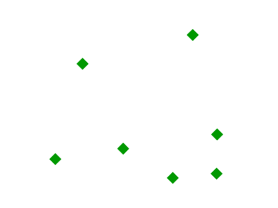
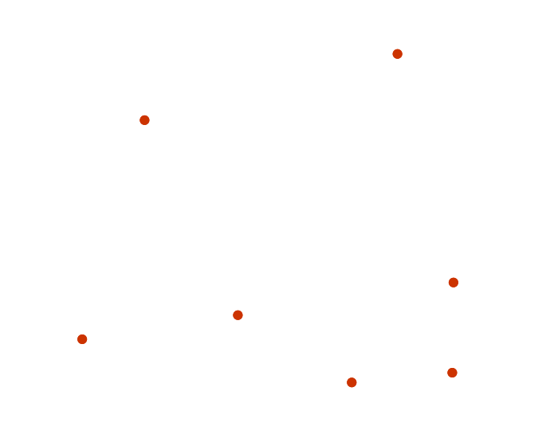

.. _css_cookbook_points:

Points
======

While points are seemingly the simplest type of shape, possessing only position and no other dimensions, there are many different ways that a point can be styled in CSS.

.. _css_cookbook_points_attributes:

Example points layer
--------------------

The :download:`points layer <../../sld/cookbook/artifacts/sld_cookbook_point.zip>` used for the examples below contains name and population information for the major cities of a fictional country. For reference, the attribute table for the points in this layer is included below.

.. list-table::
   :widths: 30 40 30

   * - **fid** (Feature ID)
     - **name** (City name)
     - **pop** (Population)
   * - point.1
     - Borfin
     - 157860
   * - point.2
     - Supox City
     - 578231
   * - point.3
     - Ruckis
     - 98159
   * - point.4
     - Thisland
     - 34879
   * - point.5
     - Synopolis
     - 24567
   * - point.6
     - San Glissando
     - 76024
   * - point.7
     - Detrania
     - 205609

:download:`Download the points shapefile <../../sld/cookbook/artifacts/sld_cookbook_point.zip>`

.. _css_cookbook_points_simplepoint:

Simple point
------------

This example specifies points be styled as red circles with a diameter of 6 pixels.

.. figure:: ../../sld/cookbook/images/point_simplepoint.png
   :align: center

   *Simple point*
   
Code
~~~~

.. code-block:: scss
   :linenos: 

    * { 
      mark: symbol(circle); 
      mark-size: 6px;
      :mark {
        fill: red;
      }
    }

Details
~~~~~~~

There are two rules in this CSS, the outer one matches all features, and asks them to be depicted with a circular mark, 6 pixels wide. The nested rule uses a symbol selector, ``:mark``, which selects all marks, and allows to specify how to fill the contents of the circle, in this case, with a solid red fill (a stand alone fill property would have been interpreted as the request to fill all polygons in the input with solid red instead).

.. _css_cookbook_points_simplepointwithstroke:

Simple point with stroke
------------------------

This example adds a stroke (or border) around the :ref:`css_cookbook_points_simplepoint`, with the stroke colored black and given a thickness of 2 pixels.

.. figure:: ../../sld/cookbook/images/point_simplepointwithstroke.png
   :align: center

   *Simple point with stroke*

Code
~~~~

.. code-block:: scss
   :linenos: 

    * { 
      mark: symbol(circle); 
      mark-size: 6px;
      :mark {
        fill: red;
        stroke: black;
        stroke-width: 2px;
      }
    }

Details
~~~~~~~

This example is similar to the :ref:`css_cookbook_points_simplepoint` example, in this case a stroke and a stroke width have been specified in the mark selector in order to apply them to the circle symbols.

Rotated square
--------------

This example creates a square instead of a circle, colors it green, sizes it to 12 pixels, and rotates it by 45 degrees.

   *Rotated square*

Code
~~~~

.. code-block:: scss
   :linenos: 

    * { 
      mark: symbol(square); 
      mark-size: 12px;
      mark-rotation: 45;
      :mark {
        fill: #009900;
      }
    }

Details
~~~~~~~

In this example, **line 2** sets the shape to be a square, with **line 6** setting the color to a dark green (``#009900``).  **Line 3** sets the size of the square to be 12 pixels, and **line 4** set the rotation is to 45 degrees.

Transparent triangle
--------------------

This example draws a triangle, creates a black stroke identical to the :ref:`css_cookbook_points_simplepointwithstroke` example, and sets the fill of the triangle to 20% opacity (mostly transparent).

.. figure:: ../../sld/cookbook/images/point_transparenttriangle.png
   :align: center

   *Transparent triangle*

Code
~~~~   

.. code-block:: scss
   :linenos:

    * { 
      mark: symbol(triangle); 
      mark-size: 12;
      :mark {
        fill: #009900;
        fill-opacity: 0.2;
        stroke: black;
        stroke-width : 2px;
      }
    }

Details
~~~~~~~

In this example, **line 2** once again sets the shape, in this case to a triangle, where **line 3** sets the mark size to 12 pixels.  **Line 5** sets the fill color to a dark green (``#009900``) and **line 6** sets the opacity to 0.2 (20% opaque).  An opacity value of 1 means that the shape is drawn 100% opaque, while an opacity value of 0 means that the shape is drawn 0% opaque, or completely transparent.  The value of 0.2 (20% opaque) means that the fill of the points partially takes on the color and style of whatever is drawn beneath it.  In this example, since the background is white, the dark green looks lighter.  Were the points imposed on a dark background, the resulting color would be darker.  **Line 8** set the stroke color to black and width to 2 pixels.

Point as graphic
----------------

This example styles each point as a graphic instead of as a simple shape.

.. figure:: ../../sld/cookbook/images/point_pointasgraphic.png
   :align: center

   *Point as graphic*

Code
~~~~

.. code-block:: scss
   :linenos:

    * { 
      mark: url(smileyface.png); 
      mark-mime: "image/png";
    }

Details
~~~~~~~

This style uses a graphic instead of a simple shape to render the points.  **Line 2** sets the path and file name of the graphic, while **line 3** indicates the format (MIME type) of the graphic (image/png). In this example, the graphic is contained in the same directory as the SLD, so no path information is necessary,  although a full URL could be used if desired. 

.. figure:: ../../sld/cookbook/images/smileyface.png
   :align: center

   *Graphic used for points*

.. _css_cookbook_points_pointwithdefaultlabel:

Point with default label
------------------------

This example shows a text label on the :ref:`css_cookbook_points_simplepoint` that displays the "name" attribute of the point. This is how a label will be displayed in the absence of any other customization.

.. figure:: ../../sld/cookbook/images/point_pointwithdefaultlabel.png
   :align: center

   *Point with default label*

Code
~~~~

.. code-block:: scss
   :linenos:

    * { 
      mark: symbol(circle);
      mark-size: 6px;
      label: [name];
      font-fill: black;
      :mark {
        fill: red;
      }
    }

Details
~~~~~~~

This style is quite similar to the :ref:`css_cookbook_points_simplepoint`, but two new properties have been added to specify the labelling options. **Line 4** indicates that the label contents come from the "name" attribute (anything in square brackets is a CQL expression, the attribute name being the simplest case) while **Line 5** sets the label color to black.

.. _css_cookbook_points_pointwithstyledlabel:

Point with styled label
-----------------------

This example improves the label style from the :ref:`css_cookbook_points_pointwithdefaultlabel` example by centering the label above the point and providing a different font name and size.

.. figure:: ../../sld/cookbook/images/point_pointwithstyledlabel.png
   :align: center

   *Point with styled label*

Code
~~~~   

.. code-block:: scss 
   :linenos:

    * { 
      mark: symbol(circle);
      mark-size: 6px;
      label: [name];
      font-fill: black;
      font-family: Arial;
      font-size: 12;
      font-weight: bold;
      label-anchor: 0.5 0;
      label-offset: 0 5;
      :mark {
        fill: red;
      }

    }

Details
~~~~~~~

This example expands on :ref:`css_cookbook_points_pointwithdefaultlabel` and specifies the font attributes, in particular, the text is Aria, bold, 12px wide. Moreover, the label is moved on top of the point, by specifying an anchor of ``0.5 0``, which sets the point to be centered (0.5) horizontally axis and bottom aligned (0.0) vertically with the label, and an offset which moves the label 5 pixels up vertically.

The result is a centered bold label placed slightly above each point.

Point with rotated label
------------------------

This example builds on the previous example, :ref:`css_cookbook_points_pointwithstyledlabel`, by rotating the label by 45 degrees, positioning the labels farther away from the points, and changing the color of the label to purple.

.. figure:: ../../sld/cookbook/images/point_pointwithrotatedlabel.png
   :align: center

   *Point with rotated label*

Code
~~~~

.. code-block:: scss
   :linenos:

    * { 
      mark: symbol(circle);
      mark-size: 6px;
      label: [name];
      font-fill: #990099;
      font-family: Arial;
      font-size: 12;
      font-weight: bold;
      label-anchor: 0.5 0;
      label-offset: 0 25;
      label-rotation: -45;
      :mark {
        fill: red;
      }
    }

Details
~~~~~~~

This example is similar to the :ref:`css_cookbook_points_pointwithstyledlabel`, but there are three important differences.  **Line 10** specifies 25 pixels of vertical displacement.  **Line 11** specifies a rotation of "-45" or 45 degrees counter-clockwise.  (Rotation values increase clockwise, which is why the value is negative.)  Finally, **line 5** sets the font color to be a shade of purple (``#99099``).

Note that the displacement takes effect before the rotation during rendering, so in this example, the 25 pixel vertical displacement is itself rotated 45 degrees.

Attribute-based point
---------------------

This example alters the size of the symbol based on the value of the population ("pop") attribute.  

.. figure:: ../../sld/cookbook/images/point_attributebasedpoint.png
   :align: center

   *Attribute-based point*
   
Code
~~~~

.. code-block:: scss
   :linenos:

    * {
      mark: symbol(circle);
      :mark {
        fill: #0033CC;
      };
      [pop < 50000] {
        mark-size: 8;
      };
      [pop >= 50000] [pop < 100000] {
        mark-size: 12;
      };
      [pop >= 100000] {
        mark-size: 16;
      }
    }

    

Details
~~~~~~~
   
.. note:: Refer to the :ref:`css_cookbook_points_attributes` to see the attributes for this data.  This example has eschewed labels in order to simplify the style, but you can refer to the example :ref:`css_cookbook_points_pointwithstyledlabel` to see which attributes correspond to which points.

This style shows how the basic mark setup (red circle, default size) can be overridden via cascading/nesting, changing the size depending on the pop attribute value, with smaller values yielding a smaller circle, and larger values yielding a larger circle.

The three rules are designed as follows:

.. list-table::
   :widths: 20 30 30 20

   * - **Rule order**
     - **Rule name**
     - **Population** ("pop")
     - **Size**
   * - 1
     - SmallPop
     - Less than 50,000
     - 8
   * - 2
     - MediumPop
     - 50,000 to 100,000
     - 12
   * - 3
     - LargePop
     - Greater than 100,000
     - 16

The result of this style is that cities with larger populations have larger points. In particular, the rule at **Line 6** matches all features whose "pop" attribute is less than 50000, the rule at **Line 9** matches all features whose "pop" attribute is between 50000 and 100000 (mind the space between the two predicates, it is equivalent to and AND, if we had used a comma it would have been an OR instead), while the rule at **Line 12** matches all features with more than 100000 inhabitants.

Zoom-based point
----------------

This example alters the style of the points at different zoom levels.

   *Zoom-based point: Zoomed in*

.. figure:: ../../sld/cookbook/images/point_zoombasedpointmedium.png
   :align: center
   
   *Zoom-based point: Partially zoomed*

.. figure:: ../../sld/cookbook/images/point_zoombasedpointsmall.png
   :align: center
   
   *Zoom-based point: Zoomed out*

   
Code
~~~~

.. code-block:: scss 
   :linenos:

    * {
      mark: symbol(circle);
    }

    :mark {
      fill: #CC3300;
    }

    [@sd < 16M] {
      mark-size: 12;
    }

    [@sd > 16M] [@sd < 32M] {
      mark-size: 8;
    }

    [@sd > 32M] {
      mark-size: 4;
    }

Details
~~~~~~~

It is often desirable to make shapes larger at higher zoom levels when creating a natural-looking map.  This example styles the points to vary in size based on the zoom level (or more accurately, scale denominator).  Scale denominators refer to the scale of the map.  A scale denominator of 10,000 means the map has a scale of 1:10,000 in the units of the map projection.

.. note:: Determining the appropriate scale denominators (zoom levels) to use is beyond the scope of this example.

This style contains three rules matching the scale.  The three rules are designed as follows:

.. list-table::
   :widths: 25 25 25 25 

   * - **Rule order**
     - **Rule name**
     - **Scale denominator**
     - **Point size**
   * - 1
     - Large
     - 1:16,000,000 or less
     - 12
   * - 2
     - Medium
     - 1:16,000,000 to 1:32,000,000
     - 8
   * - 3
     - Small
     - Greater than 1:32,000,000
     - 4

The order of these rules does not matter since the scales denominated in each rule do not overlap.

The rules use the "@sd" pseudo-attribute, which refers to the current scale denominator, and which can be compared using the '<' and '>' operators only (using any other operator or function will result in errors). 

The result of this style is that points are drawn larger as one zooms in and smaller as one zooms out. 

While this example uses on purpose cascading to show a different possible setup, the same style could be written as:

.. code-block:: scss 
   :linenos:

    * {
      mark: symbol(circle);
      :mark {
        fill: #CC3300;
      };
      [@sd < 16M] {
        mark-size: 12;
      };
      [@sd > 16M] [@sd < 32M] {
        mark-size: 8;
      };
      [@sd > 32M] {
        mark-size: 4;
      }
    }
