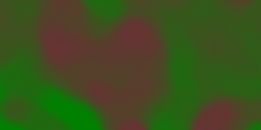
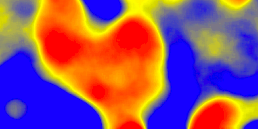

.. _css_cookbook_rasters:

Rasters
=======

Rasters are geographic data displayed in a grid.  They are similar to image files such as PNG files, except that instead of each point containing visual information, each point contains geographic information in numerical form.  Rasters can be thought of as a georeferenced table of numerical values.

One example of a raster is a Digital Elevation Model (DEM) layer, which has elevation data encoded numerically at each georeferenced data point.

Example raster
--------------

The :download:`raster layer <../../sld/cookbook/artifacts/sld_cookbook_raster.zip>` that is used in the examples below contains elevation data for a fictional world.  The data is stored in EPSG:4326 (longitude/latitude) and has a data range from 70 to 256.  If rendered in grayscale, where minimum values are colored black and maximum values are colored white, the raster would look like this:

.. figure:: ../../sld/cookbook/images/raster.png
   :align: center

   *Raster file as rendered in grayscale*

:download:`Download the raster file <../../sld/cookbook/artifacts/sld_cookbook_raster.zip>`

.. _css_cookbook_raster_twocolorgradient:

Two-color gradient
------------------

This example shows a two-color style with green at lower elevations and brown at higher elevations.

   *Two-color gradient*

Code
~~~~

.. code-block:: css
   :linenos:

    * {
      raster-channels: auto;
      raster-color-map: 
                        color-map-entry(#008000, 70)
                        color-map-entry(#663333, 256);
    }

Details
~~~~~~~

There is a single rule which applies a color map to the raster data.

The "raster-channels" attribute activates raster symbolization, the "auto" value is indicates that we are going to use the default choice of bands to symbolize the output (either gray or RBG/RGBA depending on the input data). There is also the possibility of providing a band name or a list of band names in case we want to choose specific bands out of a multiband input, e.g., "1" or "1 3 7".

The "raster-color-map" attribute builds a smooth gradient between two colors corresponding to two elevation values.  Each "color-map-entry" represents one entry or anchor in the gradient:

  * The first argument is the color
  * The second argument is the value at which we anchor the color
  * An optional third argument could specify the opacity of the pixels, as a value between 0 (fully transparent) and 1 (fully opaque). The default, when not specified, is 1, fully opaque.

**Line 4** sets the lower value of 70, which is styled a opaque dark green (``#008000``), and **line 5** sets the upper value of 256, which is styled a opaque dark brown (``#663333``).  All data values in between these two quantities will be linearly interpolated:  a value of 163 (the midpoint between 70 and 256) will be colored as the midpoint between the two colors (in this case approximately ``#335717``, a muddy green).

Transparent gradient
--------------------

This example creates the same two-color gradient as in the :ref:`sld_cookbook_raster_twocolorgradient` as in the example above but makes the entire layer mostly transparent by setting a 30% opacity.

.. figure:: ../../sld/cookbook/images/raster_transparentgradient.png
   :align: center

   *Transparent gradient*

Code
~~~~

.. code-block:: css
   :linenos:

    * {
      raster-channels: auto;
      raster-opacity: 0.3;
      raster-color-map: color-map-entry(#008000, 70)
                        color-map-entry(#663333, 256);
    }

Details
~~~~~~~

This example is similar to the :ref:`sld_cookbook_raster_twocolorgradient` example save for the addition of **line 3**, which sets the opacity of the layer to 0.3 (or 30% opaque).  An opacity value of 1 means that the shape is drawn 100% opaque, while an opacity value of 0 means that the shape is rendered as completely transparent.  The value of 0.3 means that the the raster partially takes on the color and style of whatever is drawn beneath it.  Since the background is white in this example, the colors generated from the "raster-color-map" look lighter, but were the raster imposed on a dark background the resulting colors would be darker.

Brightness and contrast
-----------------------

This example normalizes the color output and then increases the brightness by a factor of 2.

.. figure:: ../../sld/cookbook/images/raster_brightnessandcontrast.png
   :align: center

   *Brightness and contrast*
 
Code
~~~~

.. code-block:: css
   :linenos:

        * {
          raster-channels: auto;
          raster-contrast-enhancement: normalize;
          raster-gamma: 0.5;
          raster-color-map: color-map-entry(#008000, 70)
                            color-map-entry(#663333, 256);
        }

Details
~~~~~~~

This example is similar to the :ref:`sld_cookbook_raster_twocolorgradient`, save for the addition of the contrast enhancement and gamma attributes on **lines 3-4**. **Line 3** normalizes the output by increasing the contrast to its maximum extent. **Line 4** then adjusts the brightness by a factor of 0.5. Since values less than 1 make the output brighter, a value of 0.5 makes the output twice as bright.

Three-color gradient
--------------------

This example creates a three-color gradient in primary colors.  In addition, we want to avoid displaying data outside of the chosen range, leading some data not to be rendered at all.

   *Three-color gradient*

Code
~~~~

.. code-block:: css
   :linenos:

        * {
          raster-channels: auto;
          raster-color-map: 
                            color-map-entry(black, 150, 0)
                            color-map-entry(blue, 150)
                            color-map-entry(yellow, 200)
                            color-map-entry(red, 250)
                            color-map-entry(black, 250, 0)
        }

Details
~~~~~~~

This example creates a three-color gradient, with two extra rules to make ranges of color disappear. The color map behavior is such that any value below the lowest entry gets the same color as that entry, and any value above the last entry gets the same color as the last entry, while everything in between is linearly interpolated (all values must be provided from lower to higher).
**Line 4** associates value 150 and below with a transparent color (0 opacity, that is, fully transparent), and so does **line 8**, which makes transparent every value above 250.
The lines in the middle create a gradient going from blue, to yellow, to red.

Alpha channel
-------------

This example creates an "alpha channel" effect such that higher values are increasingly transparent.

.. figure:: ../../sld/cookbook/images/raster_alphachannel.png
   :align: center

   *Alpha channel*

Code
~~~~

.. code-block:: css
   :linenos:

        * {
          raster-channels: auto;
          raster-color-map: color-map-entry(#008000, 70)
                            color-map-entry(#663333, 256, 0);
        }

Details
~~~~~~~

An alpha channel is another way of referring to variable transparency.  Much like how a gradient maps values to colors, each entry in a "raster-color-map" can have a value for opacity (with the default being 1.0 or completely opaque).

In this example, there is a "raster-color-map" with two entries: **line 3** specifies the lower bound of 70 be colored dark green (``#008000``), while **line 4** specifies the upper bound of 256 also be colored dark green but with an opacity value of 0. This means that values of 256 will be rendered at 0% opacity (entirely transparent). Just like the gradient color, the opacity is also linearly interpolated such that a value of 163 (the midpoint between 70 and 256) is rendered at 50% opacity.

Discrete colors
---------------

This example shows a gradient that is not linearly interpolated but instead has values mapped precisely to one of three specific colors.

.. figure:: ../../sld/cookbook/images/raster_discretecolors.png
   :align: center

   *Discrete colors*

Code
~~~~

.. code-block:: css
   :linenos:

        * {
          raster-channels: auto;
          raster-color-map-type: intervals;
          raster-color-map: color-map-entry(#008000, 150)
                            color-map-entry(#663333, 256);
        }

Details
~~~~~~~

Sometimes color bands in discrete steps are more appropriate than a color gradient. The "raster-color-map-type: intervals" attribute sets the display to output discrete colors instead of a gradient. The values in each entry correspond to the upper bound for the color
band such that colors are mapped to values less than the value of one entry but greater than or equal to the next lower entry. For example, **line 4** colors all values less than 150 to dark green (``#008000``) and **line 5** colors all values less than 256 but greater than or equal to 150 to dark brown (``#663333``).

Many color gradient
-------------------

This example shows a gradient interpolated across eight different colors.

.. figure:: ../../sld/cookbook/images/raster_manycolorgradient.png
   :align: center

   *Many color gradient*

Code
~~~~

.. code-block:: css
   :linenos:

        * {
          raster-channels: auto;
          raster-color-map: 
                  color-map-entry(black, 95)
                  color-map-entry(blue, 110)
                  color-map-entry(green, 135)
                  color-map-entry(red, 160)
                  color-map-entry(purple, 185)
                  color-map-entry(yellow, 210)
                  color-map-entry(cyan, 235)
                  color-map-entry(white, 256)
        }

Details
~~~~~~~

This example is similar to the previous ones, and creates a color gradient between 8 colors as reported in the following table

.. list-table::
   :widths: 15 25 30 

   * - **Entry number**
     - **Value**
     - **Color**
   * - 1
     - 95
     - Black
   * - 2
     - 110
     - Blue
   * - 3
     - 135
     - Green
   * - 4
     - 160
     - Red
   * - 5
     - 185
     - Purple
   * - 6
     - 210
     - Yellow
   * - 7
     - 235
     - Cyan
   * - 8
     - 256
     - White

