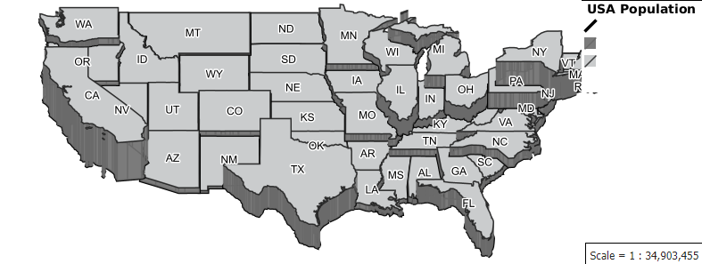

.. _css_example_extrude:

Example of 2.5D extrusion
==================================

Extruding a geometry
-----------------------------------

In this example, a 2.5D style is applied to the US States Population default layer. To achieve the 2.5D look two styling components need to work together, named ``isometric`` for the extrusion effect, and ``offset`` to add a rooftop or top surface. In order to draw states with a larger population on top, a ``sort-by`` using the ``PERSONS`` field was added. Also note that the same z-order was given to maintain the draw order of each state.

The ``flat mode`` directive was used to ensure that cascading is not applied. This enables the style to treat each CSS rule the same as an SLD rule which means rules can overlay on-top of each other with later rules being drawn first.

The extrusion part of the CSS produces the darker grey areas. The isometric function (see :doc:`/filter/function_reference`) was used to give the extrusion effect based on the US state's population size.

The last step was to add an offset to the geometry producing the lighter grey areas as a top surface. The extrusion above works on each state from the ground up based on the population size. It is therefore necessary to offset the geometry in the Y axis with the same height used for the geometry extrusion. This adds the geometry at the top of the extrusion giving the effect of a top surface.

.. code-block:: css

	@mode "Flat";
	/* EXTRUDING THE POLYGON */
	* {
	  fill: #7B7B7B;
	  fill-geometry: [isometric(the_geom, PERSONS/8M)];
	  stroke: #636363;
	  stroke-geometry: [isometric(the_geom, PERSONS/8M)];
	  stroke-opacity:0.7;
	  sort-by: PERSONS;  
	  z-index:0;
	}
	/* ADDING TOP SURFACE */
	* {
	  fill-geometry: [offset(the_geom, 0, PERSONS/8M)];
	  stroke-geometry: [offset(the_geom, 0, PERSONS/8M)];
	  fill: #CACCCD;
	  stroke: #000000;
	  stroke-opacity: 0.7;
	  sort-by: PERSONS;
	  z-index:0;
	  label: [STATE_ABBR];
	  font-family: 'Dialog';
	  font-weight: 'Bold';
	  halo-color: white;
	  halo-radius: 1;
	}

Footnote
^^^^^^^^
Using the population size to sort the rendering order causes some states (e.g. New York) to almost entirely overlay another state (in this case, Pennsylvania.) A better implementation might be to add a field containing the x value of the centroid and use this field in the sort-by clause in descending order i.e. (sort-by: centroid_x D).
