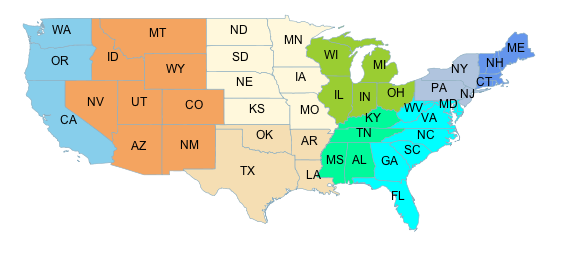
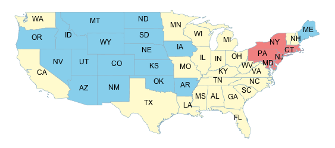
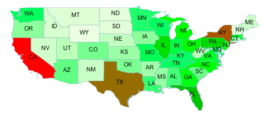

.. _css_examples_transformation:

Using transformation functions
==============================

The transformation functions supported described in SLD and described in the :ref:`equivalent SLD chapter <transformation_func>` 
are also available in CSS, the following shows examples of how they can be used.

Recode
------

The ``Recode`` filter function transforms a set of discrete values for an attribute into another set of values, 
by applying a *(input, output)* mapping onto the values of the variable/expression that is provided
as the first input of the function.

Consider a chloropleth map of the US states dataset 
using the fill color to indicate the topographic regions for the states.  
The dataset has an attribute ``SUB_REGION`` containing the region code for each state.
The ``Recode`` function is used to map each region code into a different color.

.. note::
  It is to be noted that the following example specifies colors as hex string as opposed to native
  CSS color names, this is because the function syntax is expressed in CQL, which does not have
  support for native CSS color names.

.. code-block:: css

    * { 
      fill: [recode(strTrim(SUB_REGION),
             'N Eng', '#6495ED',
             'Mid Atl', '#B0C4DE',
             'S Atl', '#00FFFF',
             'E N Cen', '#9ACD32',
             'E S Cen', '#00FA9A',
             'W N Cen', '#FFF8DC',
             'W S Cen', '#F5DEB3',
             'Mtn', '#F4A460',
             'Pacific', '#87CEEB')];
      stroke: lightgrey;
      label: [STATE_ABBR];
      font-family: 'Arial';
      font-fill: black;
      label-anchor: 0.5 0.5;
    }
    

Categorize
----------

The ``Categorize`` filter function transforms a continuous-valued attribute
into a set of discrete values by assiging ranges of values and turning them
into a color, size, width, opacity, etc.

In the following example a coropleth map is build associating a color to the state population density
in the ranges [ <= 20], [20 - 100], and [ > 100].

.. code-block:: css

    * { 
      fill: [categorize(
             PERSONS / LAND_KM,
             '#87CEEB',
             20,
             '#FFFACD',
             100,
             '#F08080')];
      stroke : lightgrey;
      label: [STATE_ABBR];
      font-family: 'Arial';
      font-fill: black;
      label-anchor: 0.5 0.5; 
    }
    

    
Interpolate
-----------

The ``Interpolate`` filter function transforms a continuous-valued attribute
into another continuous range of values by applying piecewise interpolation.

The result will work for numeric values such as size, width, opacity
when operating in ``numeric`` **interpolation method** (the default), and for colors when working in ``color`` mode.

The type of curve fitting the specified points can be either ``linear`` (the default), ``cubic`` or ``cosine``, 
these values are known as the **interpolation mode**.

Both the interpolation method and mode are optional, and if provided, they are added at the end of the
input list.

In the following example the state population is mapped to a continuous color scale in a rather
compact way using the interpolate function:

.. code-block:: css

    * { 
      fill: [Interpolate(
             PERSONS,
             0, '#FEFEEE',
             9000000, '#00FF00',
             23000000, '#FF0000',
             'color',
             'linear')];
      stroke : lightgrey;
      label: [STATE_ABBR];
      font-family: 'Arial';
      font-fill: black;
      label-anchor: 0.5 0.5; 
    }

