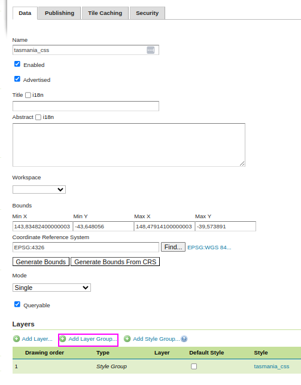

.. _css_multilayer:

Multiple layers in the same CSS
===============================

As most of the examples in this documentation show, styling is typically done on a single layer.
When the style is associated to a layer, the first UserStyle found in the style sheet is used.

However, it's also possible to create a style with multiple layers, and then use the "style group"
functionality to create a layer group with the layers mentioned in the style. 

For example, a style duplicating the Tasmania sample layer group could look like this (usage of
the ``Flat`` mode is recommended):

.. code-block:: scss
    
    @mode 'Flat';
    
    topp:tasmania_state_boundaries {
      fill: #66FF66;
      stroke: black;
    }
    
    topp:tasmania_water_bodies {
      fill: #4040C0;
      stroke: black;
    }
    
    topp:tasmania_roads {
      stroke: #AA3333;
      stroke-width: 2;
    }
    
    topp:tasmania_cities {
      mark: symbol(circle);
      mark-size: 6;
      :mark {
        fill: white;
        stroke: black;
        stroke-width: 2;
      }
    }

The style can be previewed while editing by enabling the "preview as style group" option in the style editor.

.. figure:: images/tasmania.png
    
The style group can then be used to form a layer group, by using the "add as style group" link in the
layer group editor:

