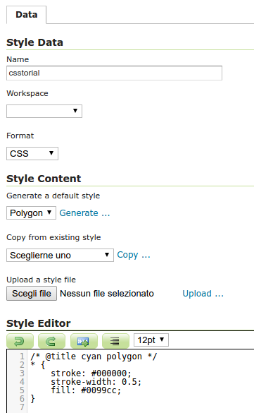
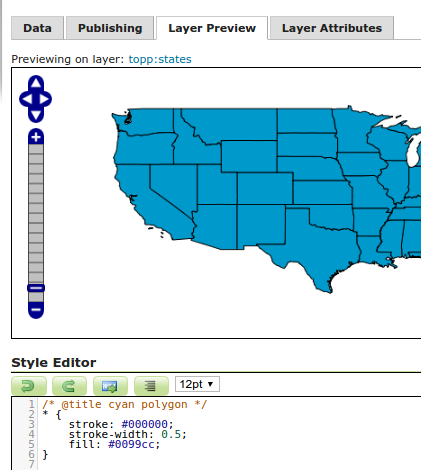
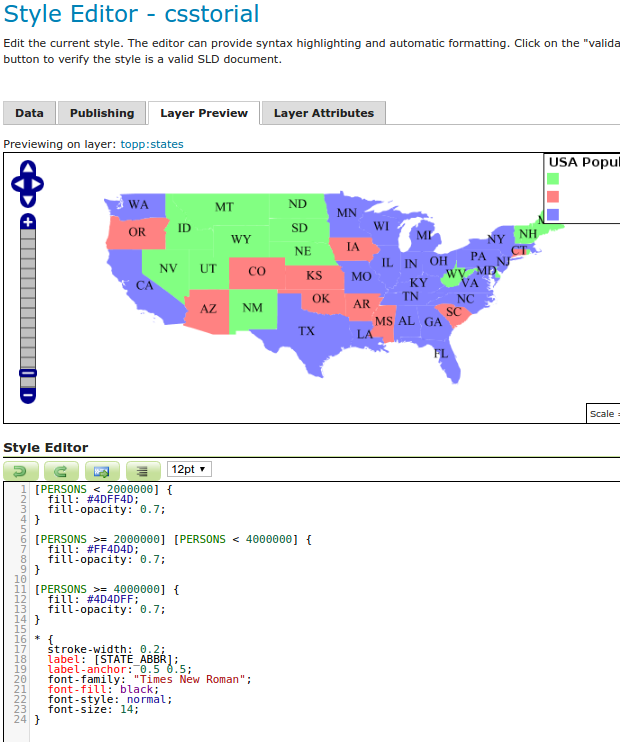
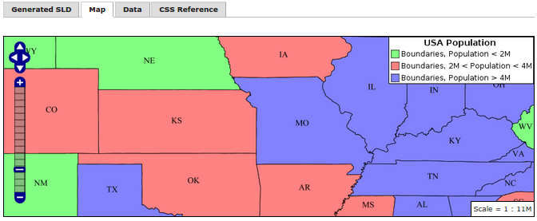

.. _css_tutorial:

Tutorial: Styling data with CSS
===============================

This tutorial will show using CSS to style a layer, along with the equivalent SLD code.

To use this tutorial, you will need the :ref:`CSS extension <css_install>` as well as the ``states`` layer from the `default GeoServer configuration <https://github.com/geoserver/geoserver/tree/master/data/release/data/shapefiles>`_.

Creating a style for the states layer
-------------------------------------

.. highlight:: xml

The SLD file for the default ``states`` layer looks like this::

    <?xml version="1.0" encoding="ISO-8859-1"?>
    <StyledLayerDescriptor
      version="1.0.0"
      xmlns="http://www.opengis.net/sld" 
      xmlns:ogc="http://www.opengis.net/ogc"
      xmlns:xlink="http://www.w3.org/1999/xlink"
      xmlns:xsi="http://www.w3.org/2001/XMLSchema-instance"
      xmlns:gml="http://www.opengis.net/gml"
      xsi:schemaLocation="http://www.opengis.net/sld
        http://schemas.opengis.net/sld/1.0.0/StyledLayerDescriptor.xsd
    ">
      <NamedLayer>
        <Name>USA states population</Name>
        <UserStyle>
          <Name>population</Name>
          <Title>Population in the United States</Title>
          <Abstract>A sample filter that filters the United States into three
            categories of population, drawn in different colors</Abstract>
          <FeatureTypeStyle>
            <Rule>
              <Title>&lt; 2M</Title>
              <ogc:Filter>
                <ogc:PropertyIsLessThan>
                 <ogc:PropertyName>PERSONS</ogc:PropertyName>
                 <ogc:Literal>2000000</ogc:Literal>
                </ogc:PropertyIsLessThan>
              </ogc:Filter>
              <PolygonSymbolizer>
                 <Fill>
                    <!-- CssParameters allowed are fill (the color) and fill-opacity -->
                    <CssParameter name="fill">#4DFF4D</CssParameter>
                    <CssParameter name="fill-opacity">0.7</CssParameter>
                 </Fill>     
              </PolygonSymbolizer>
            </Rule>
            <Rule>
              <Title>2M - 4M</Title>
              <ogc:Filter>
                <ogc:PropertyIsBetween>
                  <ogc:PropertyName>PERSONS</ogc:PropertyName>
                  <ogc:LowerBoundary>
                    <ogc:Literal>2000000</ogc:Literal>
                  </ogc:LowerBoundary>
                  <ogc:UpperBoundary>
                    <ogc:Literal>4000000</ogc:Literal>
                  </ogc:UpperBoundary>
                </ogc:PropertyIsBetween>
              </ogc:Filter>
              <PolygonSymbolizer>
                 <Fill>
                    <!-- CssParameters allowed are fill (the color) and fill-opacity -->
                    <CssParameter name="fill">#FF4D4D</CssParameter>
                    <CssParameter name="fill-opacity">0.7</CssParameter>
                 </Fill>     
              </PolygonSymbolizer>
            </Rule>
            <Rule>
              <Title>&gt; 4M</Title>
              <!-- like a linesymbolizer but with a fill too -->
              <ogc:Filter>
                <ogc:PropertyIsGreaterThan>
                 <ogc:PropertyName>PERSONS</ogc:PropertyName>
                 <ogc:Literal>4000000</ogc:Literal>
                </ogc:PropertyIsGreaterThan>
              </ogc:Filter>
              <PolygonSymbolizer>
                 <Fill>
                    <!-- CssParameters allowed are fill (the color) and fill-opacity -->
                    <CssParameter name="fill">#4D4DFF</CssParameter>
                    <CssParameter name="fill-opacity">0.7</CssParameter>
                 </Fill>     
              </PolygonSymbolizer>
            </Rule>
            <Rule>
              <Title>Boundary</Title>
              <LineSymbolizer>
                <Stroke>
                  <CssParameter name="stroke-width">0.2</CssParameter>
                </Stroke>
              </LineSymbolizer>
              <TextSymbolizer>
                <Label>
                  <ogc:PropertyName>STATE_ABBR</ogc:PropertyName>
                </Label>
                
                  <CssParameter name="font-family">Times New Roman</CssParameter>
                  <CssParameter name="font-style">Normal</CssParameter>
                  <CssParameter name="font-size">14</CssParameter>
                
                <LabelPlacement>
                  <PointPlacement>
                    <AnchorPoint>
                      <AnchorPointX>0.5</AnchorPointX>
                      <AnchorPointY>0.5</AnchorPointY>
                    </AnchorPoint>
                  </PointPlacement>
                </LabelPlacement>
              </TextSymbolizer>
            </Rule>
         </FeatureTypeStyle>
        </UserStyle>
        </NamedLayer>
    </StyledLayerDescriptor>

Now, let's start on a CSS file that accomplishes the same thing. 

First, got to the styles page and click on :guilabel:`Add a new style` link to start a new style. In the "New style" page, do the following:

* Name the new style anything you'd like, such as ``csstutorial``
* Choose ``CSS`` as the format
* In the :guilabel:`Generate a default style` dropdown choose ``Polygon`` and click on :guilabel:`Generate...`

   Creating a new CSS style
    

.. highlight:: css
    
This creates an example style with a source similar to this one (the colors may differ)::

    /* @title cyan polygon */
    * {
        stroke: #000000;
        stroke-width: 0.5;
        fill: #0099cc;
    }

This demonstrates the basic elements of a CSS style:

A **selector** that identifies some part of the data to style. Here, the selector is ``*``, indicating that all data should use the style properties.

**Properties** inside curly braces (``{}``) which specify how the affected features should be styled. Properties consist of name/value pairs separated by colons (``:``).

We can also see the basics for styling a polygon (``fill``), and its outline (``stroke``).

.. seealso:: 

    The :ref:`css_filters` and :ref:`css_properties` pages provide more information about the options available in CSS styles.

.. highlight:: xml

Before moving on, let's save the style and preview it with the states layer:

* Click on "Apply" to save the layer and enable the style preview
* Now on the "Style Editor page", switch to the "layer preview" tab and click on the "previewing on layer" link, then choose the "states" layer in the dialog
* The style editor should now show the states layer filled and stroked

   Previewing the CSS style with the state layer

Let's use these basics to start translating the states style. The first rule in the SLD applies to states where the ``PERSONS`` field is less than two million::

    <Rule>
      <Title>&lt; 2M</Title>
      <ogc:Filter>
        <ogc:PropertyIsLessThan>
         <ogc:PropertyName>PERSONS</ogc:PropertyName>
         <ogc:Literal>2000000</ogc:Literal>
        </ogc:PropertyIsLessThan>
      </ogc:Filter>
      <PolygonSymbolizer>
         <Fill>
            <!-- CssParameters allowed are fill (the color) and fill-opacity -->
            <CssParameter name="fill">#4DFF4D</CssParameter>
            <CssParameter name="fill-opacity">0.7</CssParameter>
         </Fill>     
      </PolygonSymbolizer>
    </Rule>

.. highlight:: css

Using a :doc:`CQL</tutorials/cql/cql_tutorial>`-based selector, and copying the names and values of the CssParameters over, we get::

    [PERSONS < 2000000] {
      fill: #4DFF4D;
      fill-opacity: 0.7;
    }

.. highlight:: xml

For the second style, we have a ``PropertyIsBetween`` filter, which doesn't directly translate to CSS::

    <Rule>
      <Title>2M - 4M</Title>
      <ogc:Filter>
        <ogc:PropertyIsBetween>
          <ogc:PropertyName>PERSONS</ogc:PropertyName>
          <ogc:LowerBoundary>
            <ogc:Literal>2000000</ogc:Literal>
          </ogc:LowerBoundary>
          <ogc:UpperBoundary>
            <ogc:Literal>4000000</ogc:Literal>
          </ogc:UpperBoundary>
        </ogc:PropertyIsBetween>
      </ogc:Filter>
      <PolygonSymbolizer>
         <Fill>
            <!-- CssParameters allowed are fill (the color) and fill-opacity -->
            <CssParameter name="fill">#FF4D4D</CssParameter>
            <CssParameter name="fill-opacity">0.7</CssParameter>
         </Fill>     
      </PolygonSymbolizer>
    </Rule>

.. highlight:: css

However, ``PropertyIsBetween`` can easily be replaced by a combination of two comparison selectors. In CSS, you can apply multiple selectors to a rule by simply placing them one after the other. Selectors separated by only whitespace must all be satisfied for a style to apply. Multiple such groups can be attached to a rule by separating them with commas (``,``). If a feature matches any of the comma-separated groups for a rule then that style is applied. Thus, the CSS equivalent of the second rule is::

    [PERSONS >= 2000000] [PERSONS < 4000000] {
      fill: #FF4D4D;
      fill-opacity: 0.7;
    }

The third rule can be handled in much the same manner as the first::

    [PERSONS >= 4000000] {
      fill: #4D4DFF;
      fill-opacity: 0.7;
    }

.. highlight:: xml

The fourth and final rule is a bit different. It applies a label and outline to all the states::

    <Rule>
      <Title>Boundary</Title>
      <LineSymbolizer>
        <Stroke>
          <CssParameter name="stroke-width">0.2</CssParameter>
        </Stroke>
      </LineSymbolizer>
      <TextSymbolizer>
        <Label>
          <ogc:PropertyName>STATE_ABBR</ogc:PropertyName>
        </Label>
        
          <CssParameter name="font-family">Times New Roman</CssParameter>
          <CssParameter name="font-style">Normal</CssParameter>
          <CssParameter name="font-size">14</CssParameter>
        
        <LabelPlacement>
          <PointPlacement>
            <AnchorPoint>
              <AnchorPointX>0.5</AnchorPointX>
              <AnchorPointY>0.5</AnchorPointY>
            </AnchorPoint>
          </PointPlacement>
        </LabelPlacement>
      </TextSymbolizer>
    </Rule>

.. highlight:: scss

This introduces the idea of rendering an extracted value (``STATE_ABBR``) directly into the map, unlike all of the rules thus far. For this, you can use a CQL expression wrapped in square braces (``[]``) as the value of a CSS property. It is also necessary to surround values containing whitespace, such as ``Times New Roman``, with single- or double-quotes (``"``, ``'``). With these details in mind, let's write the rule::

    * {
      stroke-width: 0.2;
      label: [STATE_ABBR];
      label-anchor: 0.5 0.5;
      font-family: "Times New Roman";
      font-fill: black;
      font-style: normal;
      font-size: 14;
    }

Putting it all together, you should now have a style that looks like::

    [PERSONS < 2000000] {
      fill: #4DFF4D;
      fill-opacity: 0.7;
    }
    
    [PERSONS >= 2000000] [PERSONS < 4000000] {
      fill: #FF4D4D;
      fill-opacity: 0.7;
    }
    
    [PERSONS >= 4000000] {
      fill: #4D4DFF;
      fill-opacity: 0.7;
    }

    * {
      stroke-width: 0.2;
      label: [STATE_ABBR];
      label-anchor: 0.5 0.5;
      font-family: "Times New Roman";
      font-fill: black;
      font-style: normal;
      font-size: 14;
    }

Click the :guilabel:`Apply` button at the bottom of the form to save your changes.

   CSS style applied to the ``states`` layer

You will see that the borders are missing! In the GeoServer CSS module, each type of symbolizer has a "key" property which controls whether it is applied. Without these "key" properties, subordinate properties are ignored. These "key" properties are:

* **fill**, which controls whether or not Polygon fills are applied. This specified the color or graphic to use for the fill.
* **stroke**, which controls whether or not Line and Polygon outline strokes are applied. This specifies the color (or graphic fill) of the stroke.
* **mark**, which controls whether or not point markers are drawn. This identifies a Well-Known Mark or image URL to use.
* **label**, which controls whether or not to draw labels on the map. This identifies the text to use for labeling the map, usually as a CQL expression. 
* **halo-radius**, which controls whether or not to draw a halo around labels. This specifies how large such halos should be.

.. seealso:: 

    The :ref:`css_properties` page for information about the other properties.

Since we don't specify a ``stroke`` color, no stroke is applied. Let's add it, replacing the final rule so that it will now look like this::

    * {
      stroke: black;
      stroke-width: 0.2;
      label: [STATE_ABBR];
      label-anchor: 0.5 0.5;
      font-family: "Times New Roman";
      font-fill: black;
      font-style: normal;
      font-size: 14;
    }

.. figure:: images/tutorial_border.png

   Border added to style

Refining the style
------------------

Removing duplicated properties
^^^^^^^^^^^^^^^^^^^^^^^^^^^^^^

The style that we have right now is only 23 lines, a nice improvement over the 103 lines of XML that we started with. However, we are still repeating the ``fill-opacity`` attribute everywhere.

We can move it into the ``*`` rule and have it applied everywhere. This works because the GeoServer CSS module emulates *cascading*: While SLD uses a "painter's model" where each rule is processed independently, a cascading style allows you to provide general style properties and override only specific properties for particular features.

This brings the style down to only 21 lines::

    [PERSONS < 2000000] {
      fill: #4DFF4D;
    }
    
    [PERSONS > 2000000] [PERSONS < 4000000] {
      fill: #FF4D4D;
    }
    
    [PERSONS > 4000000] {
      fill: #4D4DFF;
    }

    * {
      fill-opacity: 0.7;
      stroke-width: 0.2;
      label: [STATE_ABBR];
      label-anchor: 0.5 0.5;
      font-family: "Times New Roman";
      font-fill: black;
      font-style: normal;
      font-size: 14;
    }

Scale-dependent styles
^^^^^^^^^^^^^^^^^^^^^^

The labels for this style are nice, but at lower zoom levels they seem a little crowded. We can easily move the labels to a rule that doesn't activate until the scale denominator is below 2000000. We do want to keep the stroke and fill-opacity at all zoom levels, so we can separate them from the label properties.

Keep the following properties in the main (``*``) rule::

    * {
      fill-opacity: 0.7;
      stroke-width: 0.2;
    }

Remove all the rest, moving them into a new rule::

    [@sd < 20M] {
      label: [STATE_ABBR];
      label-anchor: 0.5 0.5;
      font-family: "Times New Roman";
      font-fill: black;
      font-style: normal;
      font-size: 14;
    }

Setting titles for the legend
^^^^^^^^^^^^^^^^^^^^^^^^^^^^^

So far, we haven't set titles for any of the style rules. This doesn't really cause any problems while viewing maps, but GeoServer uses the title in auto-generating legend graphics. Without the titles, GeoServer falls back on the names, which in the CSS module are generated from the filters for each rule. Titles are not normally a part of CSS, so GeoServer looks for them in specially formatted comments before each rule. We can add titles like this::

    /* @title Population < 2M */
    [PERSONS < 2000000] {
    
      ...

    /* @title 2M < Population < 4M */
    [PERSONS > 2000000] [PERSONS < 4000000] {

      ...
    
    /* @title Population > 4M */
    [PERSONS > 4000000] {

      ...

    /* @title Boundaries */
    * {

      ...

Because of the way that CSS is translated to SLD, each SLD rule is a combination of several CSS rules. This is handled by combining the titles with the word "with". If the title is omitted for a rule, then it is simply not included in the SLD output.

The final CSS should looks like this::

    /* @title Population < 2M */
    [PERSONS < 2000000] {
      fill: #4DFF4D;
      fill-opacity: 0.7;
    }
    
    /* @title 2M < Population < 4M */
    [PERSONS >= 2000000] [PERSONS < 4000000] {
      fill: #FF4D4D;
      fill-opacity: 0.7;
    }
    
    /* @title Population > 4M */
    [PERSONS >= 4000000] {
      fill: #4D4DFF;
      fill-opacity: 0.7;
    }
    
    
    /* @title Boundaries */
    * {
      stroke: black;
      stroke-width: 0.2;
      fill-opacity: 0.7;
    }
    
    [@sd < 20M] {
      label: [STATE_ABBR];
      label-anchor: 0.5 0.5;
      font-family: "Times New Roman";
      font-fill: black;
      font-style: normal;
      font-size: 14;
    }

   Final style with rule names

Applying rule nesting
^^^^^^^^^^^^^^^^^^^^^

As a final variation, the style can be made more compact by leveraging rule nesting::

  * {
    stroke: black;
    stroke-width: 0.2;
    fill-opacity: 0.7;
  
    /* @title Population < 2M */
    [PERSONS < 2000000] {
      fill: #4DFF4D;
    };
    /* @title 2M < Population < 4M */
    [PERSONS >= 2000000] [PERSONS < 4000000] {
      fill: #FF4D4D;
    };
    /* @title Population > 4M */
    [PERSONS >= 4000000] {
      fill: #4D4DFF;
    };
    
    /* Labelling */
    [@sd < 20M] {
      label: [STATE_ABBR];
      label-anchor: 0.5 0.5;
      font-family: "Times New Roman";
      font-fill: black;
      font-style: normal;
      font-size: 14;
    }   
  }

CSS Workshop
^^^^^^^^^^^^

For more details, visit the next section, the `CSS workshop <../workshop/index.html>`_. This workshop has been used in the past for classroom settings to teach the CSS extension and has been ported to the user documentation.