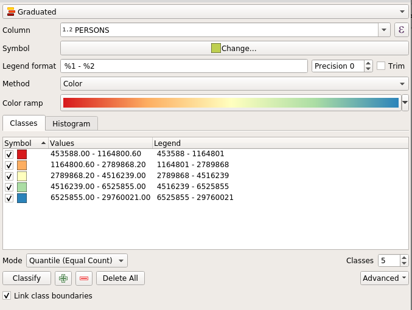
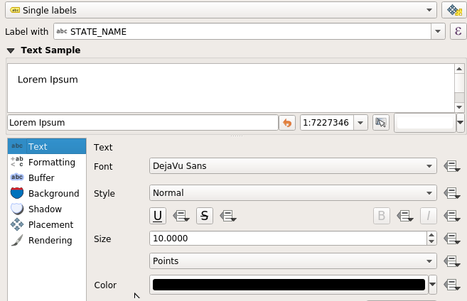
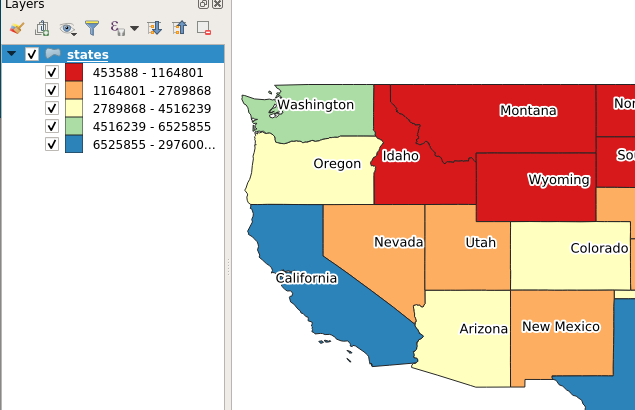
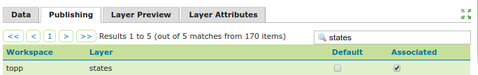
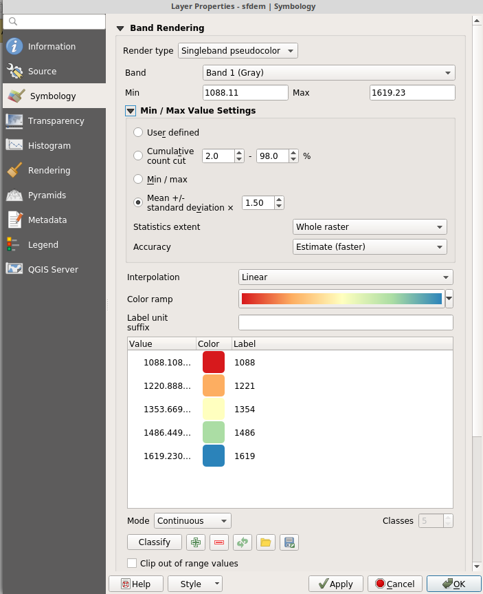
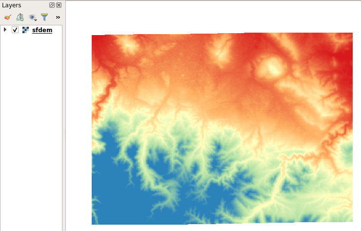
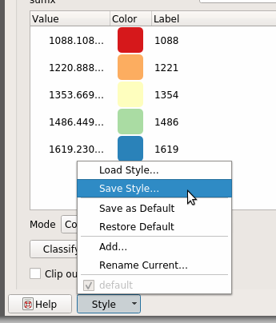
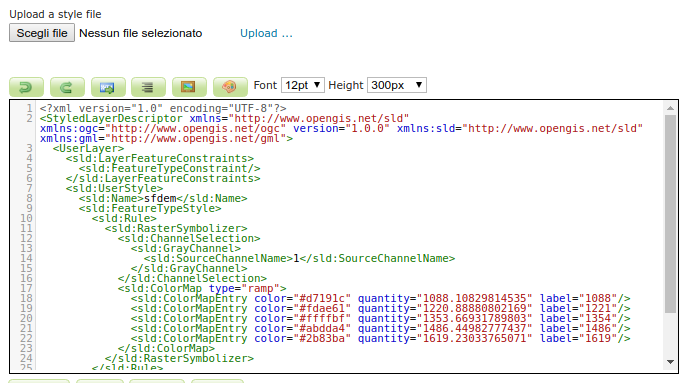

.. _qgis:

Generating SLD styles with QGIS 
===============================

QGIS includes a sophisticated style editor with many map rendering possibilities. Styles generated
with QGIS can then be exported (with limitations) to SLD for usage with GeoServer.

QGIS style exporting abilities have been evolving over time, as a reference:

* For vector data QGIS exports SLD 1.1 styles that can be read by GeoServer. In order to get
  the suitable results it's important to use QGIS 3.0 or newer, and GeoServer 2.13.x or newer.
* Raster data styling export is new in QGIS 3.5 (yet to be released at the time of writing, with
  a possible backport to 3.4 under discussion). This new version exports SLD 1.0 styles with
  vendor extensions to support constrast streching that most recent GeoServer versions support
  properly. For older QGIS versions limited export functionality is available using the SLD4Raster plugin.

For the export it is advised to use the "Save As" functionality available in the style dialog,
as indicated below in this guide. Other plugins exist that streamline the export process, but they
may ruin the style trying to adapt it to older GeoServer versions (e.g., translating it
down to SLD 1.0 by simple text processing means), or rewrite it entirely.

.. warning:: Despite the progress in the last years, it is known that not all QGIS rendering 
   options are supported by SLD and/or by GeoServer (e.g. shapeburst symbology), 
   and that support for exporting some parts  is simply missing (e.g.. expression based symbology is
   supported in SLD, but QGIS won't export it). If you are interested, both projects would welcome 
   sponsoring to improve the situation.

Exporting vector symbology
--------------------------

This is a step by step guide to style a GeoServer demo layer, "sfdem".

- Open QGIS (minimum version 3.0)
- Load the ``states.shp`` dataset from the GeoServer data directory, ``<GEOSERVER_DATA_DIR>/data/shapefiles/states.shp``
- Double click the layer to open the properties dialog and switch to the "Symbology" section
- Choose a "Graduated" rendering, on the "PERSONS" column, and click on "Classify" button to generate 
  1.5 standard deviations, select the "spectral" color ramp, switch mode to "Quantile" and finally
  and click on the "Classify" button to generate a 5 classes map, as shown in figure.

   *QGIS vector styling*

- Switch to the "Labels" tab, choose "Single labels", label with the "STATE NAME" attribute and
  choose your preferred text rendering options, as shown in figure

   *QGIS labelling*

- The layer should render as follows:

   *QGIS raster styling*

- Go back At the dialog bottom, choose "Style" and then "Save Style..."

.. figure:: images/qgis-vector-saveas.png
   :align: center

   *Export using Save As...*

- Choose export in the SLD format, placing the file in the desired location

.. figure:: images/qgis-choose-format.png
   :align: center

   *Choosing export format...*

- Go in GeoServer, create a new style, use the "Upload a new style" dialog to choose the exported
  file, and click on "upload"

.. figure:: images/gs-vector-upload.png
   :align: center

   *Uploading style in GeoServer...*

- Click on "Apply", then "Layer preview", "Preview on Layer" and choose "topp:states" to verify 
  proper rendering

.. figure:: images/gs-vector-preview.png
   :align: center

   *Previewing style in GeoServer...*

- Eventually switch to the "Publishing" tab, search for "states", and check on "Default",
  or "Associated" to associate the style with the layer permanently.

   *Associating style in GeoServer...*

Exporting raster symbology
--------------------------

This is a step by step guide to style a GeoServer demo layer, "sfdem".

- Open QGIS (minimum version 3.5)
- Load the ``sfdem.tif`` raster from the GeoServer data directory, ``<GEOSERVER_DATA_DIR>/data/sf/sfdem.tif``
- Double click the layer to open the properties dialog and switch to the "Symbology" section
- Choose a "Singleband pseudocolor" rendering, use a "mean +/- standard deviation" filtering using
  1.5 standard deviations, and generate a 5 classes interpolated map, as shown in figure.

   *QGIS raster styling*

- The layer should render as follows:

   *QGIS raster styling*

- Go back At the dialog bottom, choose "Style" and then "Save Style..."

   *Export using Save As...*

- Choose export in the SLD format, placing the file in the desired location

.. figure:: images/qgis-choose-format.png
   :align: center

   *Choosing export format...*

- Go in GeoServer, create a new style, use the "Upload a new style" dialog to choose the exported
  file, and click on "upload"

   *Uploading style in GeoServer...*

- Click on "Apply", then "Layer preview", "Preview on Layer" and choose "sfdem" to verify 
  proper rendering

.. figure:: images/gs-raster-preview.png
   :align: center

   *Previewing style in GeoServer...*

- Eventually switch to the "Publishing" tab, search for "sfdem", and check on "Default",
  or "Associated" to associate the style with the layer permanently.

.. figure:: images/gs-raster-associate.png
   :align: center

   *Associating style in GeoServer...*
