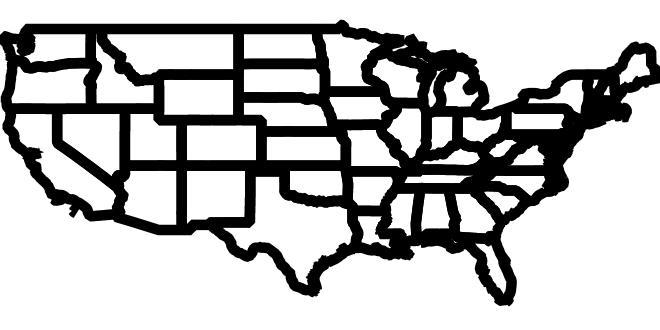

.. _composite_blend:

Color compositing and color blending
=====================================

Starting with GeoServer 2.7 it is possible to perform color blending and compositing, either between
feature type styles, or by associating blending operations with each symbolizer.

GeoServer implements most of the color compositing and blending modes suggested by the `SVG compositing
and blending level 1 specification <http://www.w3.org/TR/compositing-1/>`_.
Either set of operations allows one to control how two overlapping layers/symbols are merged 
together to form a final map (As opposed to the normal behaviour of just stacking images on top of each other).

In this section we are going to use the "source" and "destination" terms:

* *source* is the image currently being painted on top of the map
* *destination* is the current map contents, the background that the source image is being painted onto.

In this documentation two sources and two destination images are going to be used:

Destinations (backgrounds):

.. list-table::
   :widths: 50 50
   :header-rows: 1
   
   * - Destination1
     - Destination2
   * - .. figure:: composite-images/bkg.png
     - .. figure:: composite-images/bkg2.png
     
Sources (foregrounds):

.. list-table::
   :widths: 50 50
   :header-rows: 1
   
   * - Source1
     - Source2
   * - .. figure:: composite-images/map.png
     - .. figure:: composite-images/map2.png

Alpha Compositing modes
-----------------------

Alpha compositing controls how two image are merged together by using the alpha levels of the two.
Basically, if the operation has an alpha level of 1 (the simplest case) each pixel will come from
either the source, or the destination, or none, depending on the alpha value of pixels in the source
and destination. No color mixing is being performed, only pure geometric selection.

Here is a list of supported operations, with an explanation and visual examples. Each of the titles
values is one key that you can use in the SLD (syntax to be described later on).

copy
....

Not much of interest, only the source will be present in the output.

.. list-table::
   :widths: 50 50
   :header-rows: 1
   
   * - Example1
     - Exampe2
   * - .. figure:: composite-images/blend1-copy.png
     - .. figure:: composite-images/blend2-copy.png

destination
...........

Not much of interest, only the destination will be present in the output

.. list-table::
   :widths: 50 50
   :header-rows: 1
   
   * - Example1
     - Exampe2
   * - .. figure:: composite-images/blend1-destination.png
     - .. figure:: composite-images/blend2-destination.png

source-over
...........

Normal drawing, the source is painted above the destination, and the destination is visible
where the source is transparent.

.. list-table::
   :widths: 50 50
   :header-rows: 1
   
   * - Example1
     - Exampe2
   * - .. figure:: composite-images/blend1-source-over.png
     - .. figure:: composite-images/blend2-source-over.png
     
destination-over
................

The opposite of normal drawing, the source is painted below the destination, and is visible
only when the destination is transparent. 

.. list-table::
   :widths: 50 50
   :header-rows: 1
   
   * - Example1
     - Exampe2
   * - .. figure:: composite-images/blend1-destination-over.png
     - .. figure:: composite-images/blend2-destination-over.png
     
source-in
.........

The source is visible only when overlapping some non transparent pixel of the destination. This
effectively allows the background map to act as a mask for the layer/feature being painted.

.. list-table::
   :widths: 50 50
   :header-rows: 1
   
   * - Example1
     - Exampe2
   * - .. figure:: composite-images/blend1-source-in.png
     - .. figure:: composite-images/blend2-source-in.png

destination-in
..............

The destination is retained only when overlapping some non transparent pixel in the source. 
This effectively allows to cut the background map using the current layer/feature as a mask.

.. list-table::
   :widths: 50 50
   :header-rows: 1
   
   * - Example1
     - Exampe2
   * - .. figure:: composite-images/blend1-destination-in.png
     - .. figure:: composite-images/blend2-destination-in.png

source-out
...........

The source is retained only in areas where the destination is transparent. This is basically
a reverse mask, compared to source-in.

.. list-table::
   :widths: 50 50
   :header-rows: 1
   
   * - Example1
     - Exampe2
   * - .. figure:: composite-images/blend1-source-out.png
     - .. figure:: composite-images/blend2-source-out.png
     
destination-out
...............

The destination is retained only in areas where the destination is transparent. This is basically
a reverse mask, compared to destination-in.

.. list-table::
   :widths: 50 50
   :header-rows: 1
   
   * - Example1
     - Exampe2
   * - .. figure:: composite-images/blend1-destination-out.png
     - .. figure:: composite-images/blend2-destination-out.png

source-atop
...........

The destination is painted fully, the source only where it intersects the destination. 

.. list-table::
   :widths: 50 50
   :header-rows: 1
   
   * - Example1
     - Exampe2
   * - .. figure:: composite-images/blend1-source-atop.png
     - .. figure:: composite-images/blend2-source-atop.png
     
destination-atop
................

The destination is painted fully, the destination only where it intersects the source. 

.. list-table::
   :widths: 50 50
   :header-rows: 1
   
   * - Example1
     - Exampe2
   * - .. figure:: composite-images/blend1-destination-atop.png
     - .. figure:: composite-images/blend2-destination-atop.png

xor
...

"Exclusive or" mode, each pixel is painted only if either the source or the destination is not
blank, but not when both are not blank. 

.. list-table::
   :widths: 50 50
   :header-rows: 1
   
   * - Example1
     - Exampe2
   * - .. figure:: composite-images/blend1-xor.png
     - .. figure:: composite-images/blend2-xor.png

Color blending modes
--------------------

Blending modes mix the colors of source and destination in various ways. Each pixel in the result
will be some sort of combination between the source and destination pixels.

Each title is a key that you can use in the SLD (syntax to be described later on).

multiply
........

The source color is multiplied by the destination color and replaces the destination.
The resulting color is always at least as dark as either the source or destination color. Multiplying any color with black results in black. Multiplying any color with white preserves the original color.

.. list-table::
   :widths: 50 50
   :header-rows: 1
   
   * - Example1
     - Exampe2
   * - .. figure:: composite-images/blend1-multiply.png
     - .. figure:: composite-images/blend2-multiply.png

screen
......

Multiplies the complements of the source and destination color values, then complements the result.
The result color is always at least as light as either of the two constituent colors. Screening any color with white produces white; screening with black leaves the original color unchanged. The effect is similar to projecting multiple photographic slides simultaneously onto a single screen.

.. list-table::
   :widths: 50 50
   :header-rows: 1
   
   * - Example1
     - Exampe2
   * - .. figure:: composite-images/blend1-screen.png
     - .. figure:: composite-images/blend2-screen.png

overlay
........

Multiplies or screens the colors, depending on the destination color value.
Source colors overlay the destination while preserving its highlights and shadows. The backdrop color is not replaced but is mixed with the source color to reflect the lightness or darkness of the backdrop.

.. list-table::
   :widths: 50 50
   :header-rows: 1
   
   * - Example1
     - Exampe2
   * - .. figure:: composite-images/blend1-overlay.png
     - .. figure:: composite-images/blend2-overlay.png

darken
......

Selects the darker of the destination and source colors.
The destination is replaced with the source where the source is darker; otherwise, it is left unchanged.

.. list-table::
   :widths: 50 50
   :header-rows: 1
   
   * - Example1
     - Exampe2
   * - .. figure:: composite-images/blend1-darken.png
     - .. figure:: composite-images/blend2-darken.png

lighten
.......

Selects the lighter of the destination and source colors.
The destination is replaced with the source where the source is lighter; otherwise, it is left unchanged.

.. list-table::
   :widths: 50 50
   :header-rows: 1
   
   * - Example1
     - Exampe2
   * - .. figure:: composite-images/blend1-lighten.png
     - .. figure:: composite-images/blend2-lighten.png

color-dodge
...........

Brightens the destination color to reflect the source color. Painting with black produces no changes.

.. list-table::
   :widths: 50 50
   :header-rows: 1
   
   * - Example1
     - Exampe2
   * - .. figure:: composite-images/blend1-color-dodge.png
     - .. figure:: composite-images/blend2-color-dodge.png

color-burn
..........

Darkens the destination color to reflect the source color. Painting with white produces no change.

.. list-table::
   :widths: 50 50
   :header-rows: 1
   
   * - Example1
     - Exampe2
   * - .. figure:: composite-images/blend1-color-burn.png
     - .. figure:: composite-images/blend2-color-burn.png

hard-light
..........

Multiplies or screens the colors, depending on the source color value. The effect is similar to shining a harsh spotlight on the destination.

.. list-table::
   :widths: 50 50
   :header-rows: 1
   
   * - Example1
     - Exampe2
   * - .. figure:: composite-images/blend1-hard-light.png
     - .. figure:: composite-images/blend2-hard-light.png

soft-light
..........

Darkens or lightens the colors, depending on the source color value. The effect is similar to shining a diffused spotlight on the destination.

.. list-table::
   :widths: 50 50
   :header-rows: 1
   
   * - Example1
     - Exampe2
   * - .. figure:: composite-images/blend1-soft-light.png
     - .. figure:: composite-images/blend2-soft-light.png

difference
..........

Subtracts the darker of the two constituent colors from the lighter color.
Painting with white inverts the destination color; painting with black produces no change.

.. list-table::
   :widths: 50 50
   :header-rows: 1
   
   * - Example1
     - Exampe2
   * - .. figure:: composite-images/blend1-difference.png
     - .. figure:: composite-images/blend2-difference.png

exclusion
.........

Produces an effect similar to that of the difference mode but lower in contrast. Painting with white inverts the destination color; painting with black produces no change

.. list-table::
   :widths: 50 50
   :header-rows: 1
   
   * - Example1
     - Exampe2
   * - .. figure:: composite-images/blend1-exclusion.png
     - .. figure:: composite-images/blend2-exclusion.png

Specifying compositing and blending in SLD
------------------------------------------

Both compositing and blending can be specified in SLD by adding the following VendorOption to
either the end of a Symbolizer, or to the end of a FeatureTypeStyle:

.. code-block:: xml

   <VendorOption name="composite">multiply</VendorOption>        

In case a custom opacity is desired, it can be added after the operation name:

.. code-block:: xml

   <VendorOption name="composite">multiply, 0.5</VendorOption>

.. warning:: Blending against symbolizers causes exceptions inside the JDK when using OpenJDK, the issue is known to 
             the OpenJDK developers, but currently not being worked on: https://bugs.openjdk.java.net/browse/JDK-8048782 .
             
             Tests against Oracle JDK 8 or even Oracle JDK 7 show no issue. 
             
             One way to keep on using OpenJDK along with symbolizer specific composite modes is to install in it 
             the `Marlin renderer <https://github.com/bourgesl/marlin-renderer>`_
             which replaces the OpenJDK core renderer, and does not suffer from the same issue (and it's faster, too).

Specifically for FeatureTypeStyle an additional vendor option can be added to control compositing groups:

.. code-block:: xml

   <VendorOption name="composite-base">true</VendorOption>

When performing compositing we have seen we always have a source (the FeatureTypeStyle being merged into
the map) and a destination (the map).
Normally the destination is the full stack of previous FeatureTypeStyle and layers painted before the
current one. This can be limiting for two reasons:

* It limits the usefulness of alpha-composite masking operations
* It breaks the WMS model, where the client can decide freely how to stack layers (the desired 
  compositing effects will be achieved only when a certain stack of layers is used)
  
By setting a FeatureTypeStyle as a "composite base" instead, the rendering engine will use that
feature type style as the destination, and will compose all subsequent FeatureTypeStyle/Layer on top 
of it, until another base is found.
Once the full set of layers against a base is composed, then the base itself will be composed against
the next set of composed layers, using its own compositing operator, if present.

Let's consider the following example:

.. figure:: composite-images/stacking.png

In this example, the first two layers are painted on top of each other, forming "Merge1".

The third layer is a composite base, as such it won't be merged on top of the already drawn map immediately,
but it will be painted to an off-screen buffer, and layer 4 and 5 will be painted/composited on top of it.
Once that happens, "Merge2" is ready, and gets painted on top of "Merge1"

The next layer is another base, so "Base2" will be again painted to an off-screen buffer, and layer 7
and 8 will be painted/composited on top of it, forming Merge3.
Once Merge3 is ready, it will be painted/composited on top of the already fused Merge1/Merge2, 
generating the final map.

A compositing and blending example
-----------------------------------

Let's say we want to draw topp:states so that the polygons are not filled with the population keyed
colors, but only an inner border inside the polygon should appear, leaving the internal fully transparent.

Using alpha-blending, this can be achived by creating a mask around the state borders with a thick
stroke, and then using a "destination-in" alpha compositing.

.. code-block:: xml

    <?xml version="1.0" encoding="ISO-8859-1"?>
    <StyledLayerDescriptor version="1.0.0" xmlns="http://www.opengis.net/sld" xmlns:ogc="http://www.opengis.net/ogc"
                           xmlns:xlink="http://www.w3.org/1999/xlink" xmlns:xsi="http://www.w3.org/2001/XMLSchema-instance" xmlns:gml="http://www.opengis.net/gml"
                           xsi:schemaLocation="http://www.opengis.net/sld">
      <NamedLayer>
        <Name>USA states population</Name>
        <UserStyle>
          <Name>population</Name>
          <Title>Population in the United States</Title>
          <Abstract>A sample filter that filters the United States into three
            categories of population, drawn in different colors</Abstract>
          <FeatureTypeStyle>
            <!-- Usual states rules, skipped for brevity -->
          </FeatureTypeStyle>
          <FeatureTypeStyle>
            <Rule>
              <LineSymbolizer>
                <Stroke>
                  <CssParameter name="stroke-width">10</CssParameter>
                  <CssParameter name="stroke">#000000</CssParameter>
                </Stroke>
              </LineSymbolizer>
            </Rule>
            <VendorOption name="composite">destination-in</VendorOption>
          </FeatureTypeStyle>
          <FeatureTypeStyle>
            <!-- The black border and labels rules, skipped for brevity -->
          </FeatureTypeStyle>
        </UserStyle>
      </NamedLayer>
    </StyledLayerDescriptor>

Visually, this is the destination:

.. figure:: composite-images/states.png

This is the source (the mask):

And this is the result of the composition:

.. figure:: composite-images/states-border-composite.png

Now, what happens if someone makes a WMS call in which the Natural Earth background is set as
the first layer, and states with the above style, as the second? The following:

.. figure:: composite-images/ne-states-border-composite1.png

The backdrop with the DEM and bathymetry is hardly visible, because it has been cut by the mask.
This is not what we want to achieve, and shows the risks of using alpha compositing without care
in a WMS setting.

In order to achieve the desired result no matter how the client composes the request, the 
first FeatureTypeStyle painting the polygon needs to be set as a compositing base, ensuring
the mask is only going to be applied to it.

Here is the full resulting style, also adding a multiply blend to the base to ensure a nice
visual transparency effect on the border lines:

.. code-block:: xml

    <?xml version="1.0" encoding="ISO-8859-1"?>
    <StyledLayerDescriptor version="1.0.0" xmlns="http://www.opengis.net/sld" xmlns:ogc="http://www.opengis.net/ogc"
                           xmlns:xlink="http://www.w3.org/1999/xlink" xmlns:xsi="http://www.w3.org/2001/XMLSchema-instance" xmlns:gml="http://www.opengis.net/gml"
                           xsi:schemaLocation="http://www.opengis.net/sld">
      <NamedLayer>
        <Name>USA states population</Name>
        <UserStyle>
          <Name>population</Name>
          <Title>Population in the United States</Title>
          <Abstract>A sample filter that filters the United States into three
            categories of population, drawn in different colors</Abstract>
          <FeatureTypeStyle>
            <Rule>
              <Name>test</Name>
              <Title>&lt; 2M</Title>
              <ogc:Filter>
                <ogc:PropertyIsLessThan>
                  <ogc:PropertyName>PERSONS</ogc:PropertyName>
                  <ogc:Literal>2000000</ogc:Literal>
                </ogc:PropertyIsLessThan>
              </ogc:Filter>
              <PolygonSymbolizer>
                <Fill>
                  <!-- CssParameters allowed are fill (the color) and fill-opacity -->
                  <CssParameter name="fill">#4DFF4D</CssParameter>
                  <CssParameter name="fill-opacity">0.7</CssParameter>
                </Fill>     
              </PolygonSymbolizer>
            </Rule>
            <Rule>
              <Title>2M - 4M</Title>
              <ogc:Filter>
                <ogc:PropertyIsBetween>
                  <ogc:PropertyName>PERSONS</ogc:PropertyName>
                  <ogc:LowerBoundary>
                    <ogc:Literal>2000000</ogc:Literal>
                  </ogc:LowerBoundary>
                  <ogc:UpperBoundary>
                    <ogc:Literal>4000000</ogc:Literal>
                  </ogc:UpperBoundary>
                </ogc:PropertyIsBetween>
              </ogc:Filter>
              <PolygonSymbolizer>
                <Fill>
                  <!-- CssParameters allowed are fill (the color) and fill-opacity -->
                  <CssParameter name="fill">#FF4D4D</CssParameter>
                  <CssParameter name="fill-opacity">0.7</CssParameter>
                </Fill>     
              </PolygonSymbolizer>
            </Rule>
            <Rule>
              <Title>&gt; 4M</Title>
              <!-- like a linesymbolizer but with a fill too -->
              <ogc:Filter>
                <ogc:PropertyIsGreaterThan>
                  <ogc:PropertyName>PERSONS</ogc:PropertyName>
                  <ogc:Literal>4000000</ogc:Literal>
                </ogc:PropertyIsGreaterThan>
              </ogc:Filter>
              <PolygonSymbolizer>
                <Fill>
                  <!-- CssParameters allowed are fill (the color) and fill-opacity -->
                  <CssParameter name="fill">#4D4DFF</CssParameter>
                  <CssParameter name="fill-opacity">0.7</CssParameter>
                </Fill>     
              </PolygonSymbolizer>
            </Rule>
            <VendorOption name="composite">multiply</VendorOption>
            <VendorOption name="composite-base">true</VendorOption>
          </FeatureTypeStyle>
          <FeatureTypeStyle>
            <Rule>
              <LineSymbolizer>
                <Stroke>
                  <CssParameter name="stroke-width">10</CssParameter>
                  <CssParameter name="stroke">#000000</CssParameter>
                </Stroke>
              </LineSymbolizer>
            </Rule>
            <VendorOption name="composite">destination-in</VendorOption>
          </FeatureTypeStyle>
          <FeatureTypeStyle>
            <Rule>
              <Title>Boundary</Title>
              <LineSymbolizer>
                <Stroke>
                  <CssParameter name="stroke-width">0.2</CssParameter>
                </Stroke>
              </LineSymbolizer>
              <TextSymbolizer>
                <Label>
                  <ogc:PropertyName>STATE_ABBR</ogc:PropertyName>
                </Label>
                
                  <CssParameter name="font-family">Times New Roman</CssParameter>
                  <CssParameter name="font-style">Normal</CssParameter>
                  <CssParameter name="font-size">18</CssParameter>
                
                <LabelPlacement>
                  <PointPlacement>
                    <AnchorPoint>
                      <AnchorPointX>0.5</AnchorPointX>
                      <AnchorPointY>0.5</AnchorPointY>
                    </AnchorPoint>
                  </PointPlacement>
                </LabelPlacement>
                <VendorOption name="partials">false</VendorOption>
              </TextSymbolizer>
            </Rule>
          </FeatureTypeStyle>
        </UserStyle>
      </NamedLayer>
    </StyledLayerDescriptor>

And here is the result:

.. figure:: composite-images/ne-states-border-composite2.jpg

.. figure:: composite-images/ne-states-border-composite3.jpg
