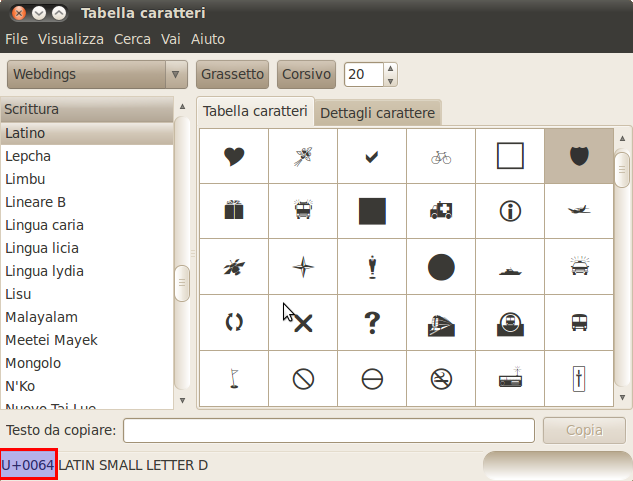

.. _pointsymbols:

Point symbology in GeoServer
============================

Point symbology is supported via the SLD ``Graphic`` element. 
This element can appear directly in a :ref:`sld_reference_pointsymbolizer`. 
It also can be used in a :ref:`sld_reference_linesymbolizer` ``GraphicStroke`` to repeat symbols along lines 
and in a :ref:`sld_reference_polygonsymbolizer` ``GraphicFill`` to fill polygons with tiled and repeated symbols. 

``Graphic`` contains either a ``Mark`` or an ``ExternalGraphic`` element. 
**Marks** are predefined vector symbols whose stroke and fill are defined by the SLD itself.  
**External Graphics** are external files (such as PNG images or SVG graphics) 
that contain the shape and color information defining how to render a symbol.

In standard SLD the ``Mark`` and ``ExternalGraphic`` names are fixed strings.  
GeoServer extends this by providing `dynamic symbolizers`, 
which allow defining symbol names on a per-feature basis by embedding CQL expressions in them. 

Marks
-----

GeoServer supports the standard ``Mark`` symbols, plus an user-expandable set of extended symbols.
The symbol names are specified in the ``WellKnownName`` element.

See also the :ref:`sld_reference_pointsymbolizer` reference for further details, as well as the examples in the :ref:`sld_cookbook_points` Cookbook section. 

Standard symbols
~~~~~~~~~~~~~~~~

The SLD specification mandates the support of the following symbols:

.. list-table::
   :widths: 20 80
   
   * - **Name**
     - **Description**
   * - ``square``
     - A square
   * - ``circle``
     - A circle
   * - ``triangle``
     - A triangle pointing up
   * - ``star``
     - five-pointed star
   * - ``cross``
     - A square cross with space around (not suitable for hatch fills)
   * - ``x``
     - A square X with space around (not suitable for hatch fills)

Shape symbols
~~~~~~~~~~~~~

The shape symbols set adds extra symbols that are not part of the basic set.  
They are prefixed by ``shape://``

.. list-table::
   :widths: 20 80
   
   * - **Name**
     - **Description**
   * - ``shape://vertline``
     - A vertical line (suitable for hatch fills or to make railroad symbols)
   * - ``shape://horline``
     - A horizontal line (suitable for hatch fills)
   * - ``shape://slash`` 
     - A diagonal line leaning forwards like the "slash" keyboard symbol (suitable for diagonal hatches)
   * - ``shape://backslash``
     - Same as ``shape://slash``, but oriented in the opposite direction
   * - ``shape://dot``
     - A very small circle with space around
   * - ``shape://plus``
     - A + symbol, without space around (suitable for cross-hatch fills)
   * - ``shape://times``
     - A "X" symbol, without space around (suitable for cross-hatch fills)
   * - ``shape://oarrow``
     - An open arrow symbol (triangle without one side, suitable for placing arrows at the end of lines)
   * - ``shape://carrow``
     - An closed arrow symbol (closed triangle, suitable for placing arrows at the end of lines)

TTF marks
~~~~~~~~~~~~~

It is possible to create a mark using glyphs from any decorative or symbolic True Type Font, such as Wingdings, WebDings, or the many symbol fonts available on the internet.
The syntax for specifying this is::
   
   ttf://<fontname>#<hexcode>

where ``fontname`` is the full name of a TTF font available to GeoServer, and ``hexcode`` is the hexadecimal code of the symbol. 
To get the hex code of a symbol, use the "Char Map" utility available in most operating systems (Windows and Gnome on Linux both have one).

For example, to use the "shield" symbol contained in WebDings, the Gnome ``charmap`` reports the symbol hex code as shown:

   *Selecting a symbol hex code in the Gnome char map*

The SLD to use the shield glyph as a symbol is:

.. code-block:: xml 
   :linenos: 
 
    <PointSymbolizer>
        <Graphic>
          <Mark>
            <WellKnownName>ttf://Webdings#0x0064</WellKnownName>
            <Fill>
              <CssParameter name="fill">#AAAAAA</CssParameter>
            </Fill>
            <Stroke/>
          </Mark>
        <Size>16</Size>
      </Graphic>
    </PointSymbolizer>

This results in the following map display:

.. figure:: images/shields.png
   :align: center

   *Shield symbols rendered on the map*

Extending the Mark subsytem using Java
~~~~~~~~~~~~~~~~~~~~~~~~~~~~~~~~~~~~~~

The Mark subsystem is user-extensible.  
To do this using Java code, implement the ``MarkFactory`` interface and declare the implementation in the ``META-INF/services/org.geotools.renderer.style.MarkFactory`` file.

For further information see the Javadoc of the GeoTools `MarkFactory <http://svn.osgeo.org/geotools/trunk/modules/library/render/src/main/java/org/geotools/renderer/style/MarkFactory.java>`_, 
along with the following example code:
   
   * The `factory SPI registration file <http://svn.osgeo.org/geotools/trunk/modules/library/render/src/main/resources/META-INF/services/org.geotools.renderer.style.MarkFactory>`_
   * The `TTFMarkFactory <http://svn.osgeo.org/geotools/trunk/modules/library/render/src/main/java/org/geotools/renderer/style/TTFMarkFactory.java>`_ implementation
   * The `ShapeMarkFactory <http://svn.osgeo.org/geotools/trunk/modules/library/render/src/main/java/org/geotools/renderer/style/ShapeMarkFactory.java>`_ implementation  
   
External Graphics
-----------------

``ExternalGraphic`` is the other way to define point symbology. 
Unlike marks, external graphics are used as-is, so the specification is somewhat simpler.
The element content specifies a graphic ``OnlineResource`` using a URL or file path, and the graphic ``Format`` using a MIME type:  

.. code-block:: xml 
   :linenos: 
 
    <PointSymbolizer>
        <Graphic>
           <ExternalGraphic>
              <OnlineResource xlink:type="simple" xlink:href="http://mywebsite.com/pointsymbol.png" />
              <Format>image/png</Format>
           </ExternalGraphic>
        </Graphic>
    </PointSymbolizer>

As with ``Mark``, a ``Size`` element can be optionally specified.  
When using images as graphic symbols it is better to avoid resizing, as that may blur their appearance.  
Use images at their native resolution by omitting the ``Size`` element.
In contrast, for SVG graphics specifying a ``Size`` is recommended.
SVG files are a vector-based format describing both shape and color,  
so they scale cleanly to any size.

If the path of the symbol file is relative,  
the file is looked for under ``$GEOSERVER_DATA_DIR/styles``.  
For example:

.. code-block:: xml 
   :linenos: 

    <PointSymbolizer>
      <Graphic>
        <ExternalGraphic>
          <OnlineResource xlink:type="simple" xlink:href="burg02.svg" />
          <Format>image/svg+xml</Format>
        </ExternalGraphic>
        <Size>20</Size>
      </Graphic>
    </PointSymbolizer>

In this example an SVG graphic is being used, so the size is specified explicitly. 

Dynamic symbolizers
-------------------

In standard SLD, the ``Mark/WellKnowName`` element and the ``ExternalGraphic/OnlineResource/@xlink:href`` attribute are fixed strings.  
This means they have the same value for all rendered features.
When the symbols to be displayed vary depending on feature attributes this restriction leads to very verbose styling, as a separate ``Rule`` and ``Symbolizer`` must be used for each different symbol.

GeoServer improves this by allowing CQL expressions to be embedded inside the content of both ``WellKnownName`` and ``OnlineResource/@xlink:href``.
When the name of the symbols to be used can be derived from the feature attribute values, this provides much more compact styling. 

The simplest form of expression is a single attribute name, such as ``${STATE_ABBR}``.
For example, suppose we want to display the flags of the US states using symbols whose file names match the state name.
The following style specifies the flag symbols using a single rule:

.. code-block:: xml 
   :linenos: 
   
   <ExternalGraphic>
      <OnlineResource xlink:type="simple" xlink:href="http://mysite.com/tn_${STATE_ABBR}.jpg"/>
      <Format>image/jpeg</Format>
   </ExternalGraphic>
   
If manipulation of the attribute values is required a full CQL expression can be specified. 
CQL expressions can be embedded in a ``WellKnownName`` string or an ``href`` URL by using the syntax::
	
  ${<cql expression>}

For example, if the values in the ``STATE_ABBR`` attribute are uppercase but the URL requires a lowercase name, the CQL ``strToLowerCase`` function can be used:

.. code-block:: xml 
   :linenos: 

   <ExternalGraphic>
      <OnlineResource xlink:type="simple"
      xlink:href="http://mysite.com/tn_${strToLowerCase(STATE_ABBR)}.jpg" />
      <Format>image/jpeg</Format>
   </ExternalGraphic>
   

