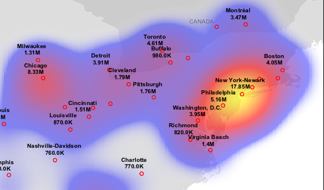

.. _rendering_transform:

Rendering Transformations
=========================

**Rendering Transformations** allow processing to be carried out 
on datasets within the GeoServer rendering pipeline.
A typical transformation computes aggregated or derived data from the input data,
and may also transform data from one format into another 
(e.g. from vector to raster or raster to vector).
This allows various useful visualization effects to be obtained, such as:

* displaying point datasets as interpolated surfaces
* displaying contours derived from raster datasets 
* displaying dense point datasets as point clusters

Rendering transformations are invoked by adding special ``<Transformation>`` elements to SLD styles. 
Tranformations are usually provided with parameters to control the appearance of the output.
The styling rules and symbolizers in the SLD are applied to the result
of the transformation to produce the final layer rendering.

Rendering transformations are implemented using the same mechanism as :ref:`wps_processes`.
They can thus also be executed via the WPS protocol, if required.

This section is a general guide to rendering transformation usage in GeoServer. 
For details of input, parameters, and output for any specific 
rendering transformation, refer to its own documentation.

Installation
------------

Using Rendering Transformations requires the WPS extension to be installed. See :ref:`wps_install`.

Usage
-----

Rendering Transformations are invoked by adding the ``<Transformation>`` element 
to a ``<FeastureTypeStyle>`` element in an SLD document.
This element specifies the name of the transformation process, 
and usually also includes values for the process parameters controlling the operation of the transformation.

The transformation element syntax leverages the OGC Filter function syntax. 
The content of the transformation element is a function with the name of the transformation process.
Transformation processes can accept any number of named parameters.
Each parameter's name and value are supplied via another function ``<ogc:Function name="parameter">``.
The first argument to this function is a literal giving the name of the parameter.
The optional second argument provides the value for the parameter.
As with any filter function argument, it may be supplied in several ways:

* As a literal value
* As a computed expression
* As an SLD environment variable, whose actual value is supplied in the WMS request
  (see :ref:`sld_variable_substitution`).
* As a predefined SLD environment variable (which allows obtaining values 
  for the current request such as output image width and height).
  
The order of the named parameters is not significant.

Most rendering transformations take as input a dataset to be transformed.
This is supplied via a special named parameter which does not have a value specified in the SLD.
The name of the parameter is determined by the particular transformation being run.
When the transformation is executed, the dataset it is being applied to
is passed via this parameter.
The input dataset is determined by the same query mechanism as used for all WMS requests,
and can thus be filtered and reprojected as necessary.

For rendering transformations which take as input a featuretype (vector dataset)
and convert it to a raster dataset, in order to pass SLD validation
the SLD needs to mention the geometry column of the input dataset, 
even though it is not used.  
This is done by specifying the column name in the symbolizer ``<Geometry>`` element.

The output of the rendering transformation is styled using the symbolizers 
appropriate to its format: 
  :ref:`sld_reference_pointsymbolizer`, :ref:`sld_reference_linesymbolizer`, :ref:`sld_reference_polygonsymbolizer`, 
and :ref:`sld_reference_textsymbolizer` for vector data, 
and :ref:`sld_reference_rastersymbolizer` for raster coverage data.

Notes
^^^^^

* Rendering transformations may not work correctly in tiled mode, 
  unless they have been specifically written to accomodate it.
  
Example
-------

The following SLD invokes a Heatmap rendering transformation
to compute a heatmap surface as a raster coverage.
The SLD is designed to be applied to any featuretype with point geometries
and an attribute ``pop2000`` supplying a weight for the points
(in this case, a dataset of world urban areas).
The output is styled using a color ramp across the output data value range [0 .. 1].

.. code-block:: xml
   :linenos:
   
      <?xml version="1.0" encoding="ISO-8859-1"?>
      <StyledLayerDescriptor version="1.0.0" 
          xsi:schemaLocation="http://www.opengis.net/sld StyledLayerDescriptor.xsd" 
          xmlns="http://www.opengis.net/sld" 
          xmlns:ogc="http://www.opengis.net/ogc" 
          xmlns:xlink="http://www.w3.org/1999/xlink" 
          xmlns:xsi="http://www.w3.org/2001/XMLSchema-instance">
        <NamedLayer>
          <Name>Heatmap</Name>
          <UserStyle>
            <Title>Heatmap</Title>
            <Abstract>A heatmap surface showing population density</Abstract>
            <FeatureTypeStyle>
              <Transformation>
                <ogc:Function name="gs:Heatmap">
                  <ogc:Function name="parameter">
                    <ogc:Literal>data</ogc:Literal>
                  </ogc:Function>
                  <ogc:Function name="parameter">
                    <ogc:Literal>weightAttr</ogc:Literal>
                    <ogc:Literal>pop2000</ogc:Literal>
                  </ogc:Function>
                  <ogc:Function name="parameter">
                    <ogc:Literal>radiusPixels</ogc:Literal>
                    <ogc:Function name="env">
                      <ogc:Literal>radius</ogc:Literal>
                      <ogc:Literal>100</ogc:Literal>
                    </ogc:Function>
                  </ogc:Function>
                  <ogc:Function name="parameter">
                    <ogc:Literal>pixelsPerCell</ogc:Literal>
                    <ogc:Literal>10</ogc:Literal>
                  </ogc:Function>
                  <ogc:Function name="parameter">
                    <ogc:Literal>outputBBOX</ogc:Literal>
                    <ogc:Function name="env">
                      <ogc:Literal>wms_bbox</ogc:Literal>
                    </ogc:Function>
                  </ogc:Function>
                  <ogc:Function name="parameter">
                    <ogc:Literal>outputWidth</ogc:Literal>
                    <ogc:Function name="env">
                      <ogc:Literal>wms_width</ogc:Literal>
                    </ogc:Function>
                  </ogc:Function>
                  <ogc:Function name="parameter">
                    <ogc:Literal>outputHeight</ogc:Literal>
                    <ogc:Function name="env">
                      <ogc:Literal>wms_height</ogc:Literal>
                    </ogc:Function>
                  </ogc:Function>
                </ogc:Function>
              </Transformation>
             <Rule>
               <RasterSymbolizer>
               <!-- specify geometry column of input FT to pass SLD validation, although not used -->
                 <Geometry><ogc:PropertyName>the_geom</ogc:PropertyName></Geometry>
                 <Opacity>0.6</Opacity>
                 <ColorMap type="ramp" >
                   <ColorMapEntry color="#FFFFFF" quantity="0" label="nodata" opacity="0"/>
                   <ColorMapEntry color="#FFFFFF" quantity="0.02" label="nodata" opacity="0"/>
                   <ColorMapEntry color="#4444FF" quantity=".1" label="nodata"/>
                   <ColorMapEntry color="#FF0000" quantity=".5" label="values" />
                   <ColorMapEntry color="#FFFF00" quantity="1.0" label="values" />
                 </ColorMap>
               </RasterSymbolizer>
              </Rule>
            </FeatureTypeStyle>
          </UserStyle>
        </NamedLayer>
       </StyledLayerDescriptor>

Key aspects of the SLD are:
       
* **Lines 14-15** define the rendering transformation, using the process ``gs:Heatmap``.
* **Lines 16-18** supply the input data parameter, named ``data`` in this process.
* **Lines 19-22** supply a value for the process's ``weightAttr`` parameter, 
  which specifies the input attribute providing a weight for each data point.
* **Lines 23-29** supply the value for the ``radiusPixels`` parameter,
  which controls the "spread" of the heatmap around each point.
  In this SLD the value of this parameter may be supplied by a SLD substitution variable
  called ``radius``, with a default value of ``100`` pixels.
* **Lines 30-33** supply the ``pixelsPerCell`` parameter,
  which controls the resolution at which the heatmap raster is computed.
* **Lines 34-38** supply the ``outputBBOX`` parameter, 
  which is given the value of the standard SLD environment variable ``wms_bbox``.
* **Lines 40-45** supply the ``outputWidth`` parameter, 
  which is given the value of the standard SLD environment variable ``wms_width``.
* **Lines 46-52** supply the ``outputHeight`` parameter, 
  which is given the value of the standard SLD environment variable ``wms_height``.
* **Lines 55-70** specify a ``RasterSymbolizer`` with which to style 
  the computed raster surface.
  The symbolizer contains a ramped color map for the data range [0..1].
* **Line 58** specifies the geometry attribute of the input featuretype, 
  which is necessary to pass SLD validation.

This transformation styles a layer to produce a heatmap surface 
for the data in the current view extent, as shown in the map image below.
(The map image also shows the original input data points 
styled by another SLD operating on the original vector data,
as well as a base map layer.)

  
  
