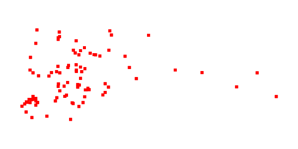

.. _sld_parameter_substitution:

Parameter substitution in SLD
=============================

Parameter substitution in SLD is a GeoServer specific functionality (starting from version 2.0.2) allowing to pass down parameter values from the WMS request into an SLD style, allowing to dynamically change colors, fonts, sizes and filter thresholds dynamically.

The parameters are specified on ``GetMap`` requests using the ``env`` parameter::

  ...&env=paramName:value;otherParam=otherValue&... 

and can be accessed from the SLD using the ``env`` function. In the simplest form the ``env`` function will retrieve the value of a specific parameter:
   
.. code-block:: xml 
   
   <ogc:Function name="env">
      <ogc:Literal>size</ogc:Literal>
   </ogc:Function>       
   
Alternatively a default value can be provided, to be used if the parameter value was not provided along with the ``GetMap`` request:

.. code-block:: xml 
   
   <ogc:Function name="env">
      <ogc:Literal>size</ogc:Literal>
      <ogc:Literal>6</ogc:Literal>
   </ogc:Function>  
   
   
The function can be called in any place where an OGC expression is used, so for example ``CSSParameter``, sizes and offsets, and filter themselves. The SLD parser accepts it even in some places where an expression is not formally accepted, as the mark well known names.
   
A working example
-----------------     
 
The following symbolizer has been parametrized in three places, every time with fall backs (full SLD is also available):

.. code-block:: xml

          <PointSymbolizer>
            <Graphic>
              <Mark>
                <WellKnownName><ogc:Function name="env">
                      <ogc:Literal>name</ogc:Literal>
                      <ogc:Literal>square</ogc:Literal>
                   </ogc:Function>
                </WellKnownName>
                <Fill>
                  <CssParameter name="fill">
                    #<ogc:Function name="env">
                      <ogc:Literal>color</ogc:Literal>
                      <ogc:Literal>FF0000</ogc:Literal>
                   </ogc:Function>
                  </CssParameter>
                </Fill>
              </Mark>
              <Size>
                 <ogc:Function name="env">
                    <ogc:Literal>size</ogc:Literal>
                    <ogc:Literal>6</ogc:Literal>
                 </ogc:Function>
              </Size>
            </Graphic>
          </PointSymbolizer>
          
:download:`Download the full SLD style <artifacts/parpoint.sld>`

The SLD renders the sample ``sf:bugsites`` as follows when no parameter is provided in the request:

   *Default rendering* 

If the request is changed to include the following parameter::
  
   env=color:00FF00;name:triangle;size:12
   
the result will be instead:

.. figure:: images/triangles.png

   *Rendering with parameters* 
