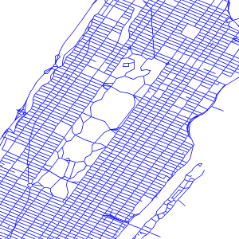

.. _unit_of_measure:

Specifying symbolizers sizes in ground units
=============================================

The SLD 1.0 specification allows the specification of sizes in just one unit: pixels.

The Symbology Encoding 1.1 specification instead allows to use also meters and feet, as ground units, so that the size of the symbolizers changes on the screen as one zooms in and out.

GeoServer supports the ``uom`` attribute just as specified in SE 1.1 in its extended SLD 1.0 support:

.. code-block:: xml

	<?xml version="1.0" encoding="ISO-8859-1"?>
	<StyledLayerDescriptor version="1.0.0" xmlns="http://www.opengis.net/sld" xmlns:ogc="http://www.opengis.net/ogc"
	  xmlns:xlink="http://www.w3.org/1999/xlink" xmlns:xsi="http://www.w3.org/2001/XMLSchema-instance">
	  <NamedLayer>
	    <Name>5m blue line</Name>
	    <UserStyle>
	      <Title>tm blue line</Title>
	      <Abstract>Default line style, 5m wide blue</Abstract>
	
	      <FeatureTypeStyle>
	        <Rule>
	          <Title>Blue Line, 5m large</Title>
	          <LineSymbolizer uom="http://www.opengeospatial.org/se/units/metre">
	            <Stroke>
	              <CssParameter name="stroke">#0000FF</CssParameter>
	              <CssParameter name="stroke-width">5</CssParameter>
	            </Stroke>
	          </LineSymbolizer>
	        </Rule>
	
	      </FeatureTypeStyle>
	    </UserStyle>
	  </NamedLayer>
	</StyledLayerDescriptor>

Applying the style to ``tiger:tiger_roads`` and zooming in we get:

.. figure:: images/roads_uom2.png
.. figure:: images/roads_uom3.png
   
The unit of measure supported are the same specified in the SE 1.1 specification::

   http://www.opengeospatial.org/se/units/metre
   http://www.opengeospatial.org/se/units/foot
   http://www.opengeospatial.org/se/units/pixel

This extended feature is officially supported starting with GeoServer 2.1.0, but it's already available in GeoServer 2.0.3 if the administrator starts the java virtual with the ``-DenableDpiUomRescaling=true`` system variable specification.