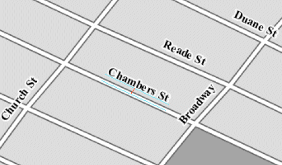

.. _sld_reference_labeling:

Labeling
========

This section discusses the details of controlling label placement
via the standard SLD options.
It also describes a number of GeoServer enhanced options for label placement 
that provide better cartographic output.

LabelPlacement
--------------

The SLD specification defines two alternative 
label placement strategies which can be used in the ``<LabelPlacement>`` element:

* ``<PointPlacement>`` places labels at a single point
* ``<LinePlacement>`` places labels along a line

PointPlacement
--------------

When ``<PointPlacement>`` is used the geometry is labelled at a single **label point**.
For lines, this point lies at the middle of the visible portion of the line.
For polygons, the point is the centroid of the visible portion of the polygon. 
The position of the label relative to the label point can be controlled by the following
sub-elements:

.. list-table::
   :widths: 30 70 

   * - **Element** 
     - **Description**
   * - ``<AnchorPoint>``
     - This is relative to the LABEL. Using this you can do things such as center the label on top of the point, have the label to the left of the point, or have the label centered under the point.
   * - ``<Displacement>``
     - Offsets the label from the anchor point by a given number pixels in X and Y.
   * - ``<Rotation>``
     - Rotates the label clockwise by a given number of degrees.
 	
The best way to explain these options is with examples.

	
AnchorPoint
^^^^^^^^^^^

The anchor point determines where the label is placed relative to the label point.

.. code-block:: xml 

    <AnchorPoint>
       <AnchorPointX>
       0.5
       </AnchorPointX>
       <AnchorPointY>
       0.5
       </AnchorPointY>
    </AnchorPoint>
    
The anchor point values  are specified relative to the bounding box of the label. 
The bottom left of the box is (0, 0), the top left is (1, 1), and the middle is (0.5, 0.5).
The (X,Y) location of the anchor point inside the label's bounding box is placed at the label point.

.. figure:: img/label_bbox.png
   :align: center

The following examples show how changing the anchor point affects the position of labels:

.. figure:: img/point_x0y0_5.png	

*X=0, Y=0.5 - (default) places the label to the right of the label point* 	

.. figure:: img/point_x0_5y0_5.png

*X=0.5, Y=0.5 - places the centre of the label at the label point*

.. figure:: img/point_x15y0_5.png

*X=1, Y=0.5 - places the label to the left of the label point*	

.. figure:: img/point_x0_5y0.png

*X=0.5, Y=0 - places the label horizontally centred above the label point*

Displacement
^^^^^^^^^^^^

Displacement allows fine control of the placement of the label.
The displacement values offset the location of the label 
from the anchor point
by a specified number of pixels.
The element syntax is:

.. code-block:: xml 

   <Displacement>
     <DisplacementX>
        10
     </DisplacementX>
     <DisplacementY>
         0
     </DisplacementY>
   </Displacement>

Examples:

.. figure:: img/point_x0y0_5_displacex10.png
   :align: center
	
*Displacement of X=10 pixels (compare with default anchor point of (X=0, Y=0.5) shown above)*	

.. figure:: img/point_x0y1_displacey10.png
   :align: center

*Displacement of Y=-10 pixels (compare with anchor point (X= 0.5, Y=1.0) - not shown)*

Rotation
^^^^^^^^

The optional ``<Rotation>`` element specifies that labels should be rotated clockwise by a given number of degrees

.. code-block:: xml
  
  <Rotation>
    45
  </Rotation>

The examples below show how the rotation interacts with anchor points and displacements.
  
.. figure:: img/rot1.png

*45 degree rotation* 	

.. figure:: img/rot2.png

*45 degree rotation with anchor point (X=0.5, Y=0.5)*
	
.. figure:: img/rot3.png
	
*45 degree rotation with 40-pixel X displacement* 	

.. figure:: img/rot4.png

*45 degree rotation with 40-pixel Y displacement with anchor point (X=0.5, Y=0.5)*

LinePlacement
-------------

To label linear features (such as a road or river), the ``<LinePlacement>`` element can be specified. 
This indicates that the styler should determine the best placement and rotation for the labels 
along the lines. 

The LinePlacement element provides one optional sub-element, ``<PerpendicularOffset>``.

PerpendicularOffset
^^^^^^^^^^^^^^^^^^^

The optional ``<PerpendicularOffset>`` element allows you to position a label above or below a line.
(This is similiar to the ``<DisplacementY>`` for label points described above.)
The displacement value is specified in pixels.  
A positive value displaces upwards, a negative value downwards.

.. code-block:: xml 

  <LabelPlacement>
    <LinePlacement>
      <PerpendicularOffset>
         10
      </PerpendicularOffset>	       
    </LinePlacement>
  </LabelPlacement>

Examples:

.. figure:: img/lp_1.png
	
*PerpendicularOffset = 0 (default)*	

*PerpendicularOffset = 10*

Composing labels from multiple attributes
-----------------------------------------

The ``<Label>`` element in TextSymbolizer is said to be mixed, that is, its content can be a mixture of plain text and OGC Expressions. The mix gets interepreted as a concatenation, this means you can leverage it to get complex labels out of multiple attributes.

For example, if you want both a state name and its abbreviation to appear in a label, you can do the following:

.. code-block:: xml 

  <Label>
    <ogc:PropertyName>STATE_NAME</ogc:PropertyName> (<ogc:PropertyName>STATE_ABBR</ogc:PropertyName>)
  </Label>

and you'll get a label such as **Texas (TX)**.

If you need to add extra white space or newline, you'll stumble into an xml oddity.  The whitespace handling in the Label element is following a XML mandated rule called "collapse", in which all leading and trailing whitespaces have to be removed, whilst all whitespaces (and newlines) in the middle of the xml element are collapsed into a single whitespace.

So, what if you need to insert a newline or a sequence of two or more spaces between your property names? Enter CDATA. CDATA is a special XML section that has to be returned to the interpreter as-is, without following any whitespace handling rule.
So, for example, if you wanted to have the state abbreviation sitting on the next line you'd use the following:

.. code-block:: xml 

  <Label>
    <ogc:PropertyName>STATE_NAME</ogc:PropertyName><![CDATA[
  ]]>(<ogc:PropertyName>STATE_ABBR</ogc:PropertyName>)
  </Label>

Geoserver Enhanced Options
-----------------------------------

GeoServer provides a number of label styling options as extensions to the SLD specification.
Using these options gives more control over how the map looks, 
since the SLD standard isn't expressive enough to provide all the options one might want.

These options are specified as subelements of ``<TextSymbolizer>``.

.. _labeling_priority:

Priority Labeling 
^^^^^^^^^^^^^^^^^

The optional ``<Priority>`` element allows specifying label priority based on 
an attribute of a dataset. 
This allows controlling how conflicts (overlaps) between feature labels
are resolved during rendering.
The content of the ``<Priority>`` element is a *Filter Expression* 
to retrieve or calculate a priority value for each feature.

.. note:: **Standard SLD Conflict Resolution**

  If the ``<Priority>`` element is not present, then standard SLD label conflict resolution is used.
  Under this strategy, in a group of conflicting labels the label to display is chosen essentially at random.

For example, take the following dataset of cities::

   City Name   | population
   ------------+------------
   Yonkers     |     197,818
   Jersey City |     237,681
   Newark      |     280,123
   New York    |   8,107,916

.. figure:: img/priority_all.png
   :align: center

*City locations (large scale map)*

Most people know where New York City is, but don't know where Yonkers is. 
Thus we want to give the label "New York" priority so it will be visible when in conflict with (overlapping) "Yonkers".
To do this we include the following code in the ``<TextSymbolizer>``:

.. code-block:: xml 

  <Priority>
      <PropertyName>population</PropertyName>
  </Priority>
  
This ensures that at small scales New York is labeled in preference to the less populated cities: 

.. figure:: img/priority_some.png
   :align: center

*City locations (small scale map)*
   
Without priority labeling, Yonkers could be labeled in preference to New York, 
making it difficult to interpret the map.
At scales showing many features, 
priority labeling is essential to ensure that larger cities are more visible than smaller cities.

.. figure:: img/priority_lots.png
   :align: center

.. _labeling_group:

Grouping Features
^^^^^^^^^^^^^^^^^

The ``group`` option allows displaying a single label for multiple features
in a logical group.

.. code-block:: xml
 
  <VendorOption name="group">yes</VendorOption>

Grouping works by collecting all features with the same label text, 
then choosing a representative geometry for the group,
according to the following rules:

.. list-table::
   :widths: 20 80 

   * - **Geometry** 
     - **Label Point**
   * - Point Set
     - The first point inside the view rectangle is used.
   * - Line Set
     - Lines are joined together, clipped to the view rectangle, and the longest path is used.
   * - Polygon Set
     - Polygons are clipped to the view rectangle, and the largest polygon is used.

If desired the labeller can be forced to label every element in a group by specifying the :ref:`labeling_all_group` option.
     
.. warning::  
   Be careful that the labels truly indicate features that should be grouped together. 
   For example, grouping on city name alone might end up creating a group
   containing both Paris (France) and Paris (Texas).

Road data is a classic example to show why grouping is useful.  
It is usually desirable to display only a single label for all of "Main Street", 
not a label for every block of "Main Street."

When the ``group`` option is off (the default), grouping is not performed and every block feature is labeled 
(subject to label deconfliction):

.. figure:: img/group_not.png
   :align: center

When the ``group`` option is used, geometries with the same label are grouped together 
and the label position is determined from the entire group.
This produces a much less cluttered map:

.. figure:: img/group_yes.png
   :align: center

.. _labeling_space_around:

Overlapping and Separating Labels (<VendorOption name="spaceAround">)
^^^^^^^^^^^^^^^^^^^^^^^^^^^^^^^^^^^^^^^^^^^^^^^^^^^^^^^^^^^^^^^^^^^^^

By default GeoServer will not render labels "on top of each other". 
By using the ``spaceAround`` option you can either allow labels to overlap,
or add extra space around labels.
The value supplied for the option is a positive or negative size in pixels.

.. code-block:: xml
 
  <VendorOption name="spaceAround">10</VendorOption>

Using the default value of 0, the bounding box of a label cannot overlap the bounding box of another label:

.. figure:: img/space_0.png
   :align: center

With a negative spaceAround value, overlapping is allowed:

.. figure:: img/space_neg.png
   :align: center

With a positive ``spaceAround`` value of 10, each label will be 20 pixels apart from each other:

.. figure:: img/space_10.png
   :align: center

Positive ``spaceAround`` values actually provide twice the space that you might expect. 
This is because you can specify a spaceAround for one label as 5, and for another label (in another TextSymbolizer) as 3. 
The total distance between them will be 8. 
Two labels in the first symbolizer ("5") will each be 5 pixels apart from each other, for a total of 10 pixels.

.. note:: **Interaction between values in different TextSymbolizers**

  You can have multiple TextSymbolizers in your SLD file, each with a different spaceAround option. This will normally do what you would think if all your spaceAround options are >=0. If you have negative values ('allow overlap') then these labels can overlap labels that you've said should not be overlapping. If you dont like this behavior, its not too difficult to change - feel free to submit a patch!

.. _labeling_follow_line:

followLine
^^^^^^^^^^

The ``followLine`` option forces a label to follow the curve of the line. To use this option add the following to the ``<TextSymbolizer>``.

.. code-block:: xml
  
  <VendorOption name="followLine">true</VendorOption>  

It is required to use ``<LinePlacement>`` along with this option to ensure that labels are placd along lines:

.. code-block:: xml

  <LabelPlacement>
    <LinePlacement/>
  </LabelPlacement>

.. _labeling_max_displacement:

maxDisplacement
^^^^^^^^^^^^^^^

The ``maxDisplacement`` option controls the displacement of the label along a line. 
Normally GeoServer labels a line at its center point only, provided the location is not occupied by another label, and not label it at all otherwise. 
When this option is enabled the labeller will attempt to avoid conflict by using an alternate location within **maxDisplacement** pixels from the pre-computed label point.

If used in conjunction with :ref:`labeling_repeat`, the value for ``maxDisplacement`` should always be **lower** than the value for ``repeat``.

.. code-block:: xml

  <VendorOption name="maxDisplacement">10</VendorOption> 

.. _labeling_repeat:

repeat
^^^^^^

The ``repeat`` option determines how often GeoServer labels a line. 
Normally GeoServer labels each line only once, regardless of length. 
Specifying a positive value for this option makes the labeller attempt to draw the label every **repeat** pixels.

.. code-block:: xml

  <VendorOption name="repeat">100</VendorOption>

.. _labeling_all_group:

labelAllGroup
^^^^^^^^^^^^^

The ``labelAllGroup`` option can be used in conjunction with the ``group`` option (see :ref:`labeling_group`).
It causes *all* of the disjoint paths in a line group to be labeled, not just the longest one.

.. code-block:: xml

  <VendorOption name="labelAllGroup">true</VendorOption>

.. _labeling_max_angle_delta:

maxAngleDelta
^^^^^^^^^^^^^

When used in conjunction with :ref:`labeling_follow_line`, the ``maxAngleDelta`` option sets the maximum angle, in degrees, between two subsequent characters in a curved label. Large angles create either visually disconnected words or overlapping characters. It is advised not to use angles larger than 30.

.. code-block:: xml

  <VendorOption name="maxAngleDelta">15</VendorOption>

.. _labeling_autowrap:

autoWrap
^^^^^^^^

The ``autoWrap`` option wraps labels when they exceed the given value, given in pixels. Make sure to give a dimension wide enough to accommodate the longest word other wise this option will split words over multiple lines.

.. code-block:: xml

  <VendorOption name="autoWrap">50</VendorOption>

.. _labeling_force_left_to_right:

forceLeftToRight
^^^^^^^^^^^^^^^^

The labeller always tries to draw labels so that they can be read, meaning the label does not always follow the line orientation, but sometimes it's flipped 180° instead to allow for normal reading. This may get in the way if the label is a directional arrow, and you're trying to show one way directions (assuming the geometry is oriented along the one way, and that you have a flag to discern one ways from streets with both circulations).

The ``forceLeftToRight`` option can be set to ``false`` to disable label flipping, making the label always follow the inherent orientation of the line being labelled:

.. code-block:: xml

  <VendorOption name="forceLeftToRight">false</VendorOption>

.. _labeling_conflict_resolution:

conflictResolution
^^^^^^^^^^^^^^^^^^

By default labels are subject to **conflict resolution**, meaning the renderer will not allow any label to overlap with a label that has been already drawn. 
Setting the ``conflictResolution`` option to ``false`` causes this label to bypass conflict resolution.
This means the label will be drawn even if it overlaps with other labels, and other labels drawn after it may overlap it.

.. code-block:: xml

  <VendorOption name="conflictResolution">false</VendorOption>

.. _labeling_goodness_of_fit:

Goodness of Fit
^^^^^^^^^^^^^^^

Geoserver will remove labels if they are a particularly bad fit for the geometry they are labeling.

.. list-table::
   :widths: 30 70 

   * - **Geometry** 
     - **Goodness of Fit Algorithm**
   * - Point
     - Always returns 1.0 since the label is at the point
   * - Line
     - Always returns 1.0 since the label is always placed on the line.
   * - Polygon
     - The label is sampled approximately at every letter. The distance from these points to the polygon is determined and each sample votes based on how close it is to the polygon. (see LabelCacheDefault#goodnessOfFit())

The default value is 0.5, but it can be modified using:

.. code-block:: xml

  <VendorOption name="goodnessOfFit">0.3</VendorOption>
  
Polygon alignment
^^^^^^^^^^^^^^^^^

GeoServer normally tries to place horizontal labels within a polygon, and give up in case the label position is busy or if the label does not fit enough in the polygon. This options allows GeoServer to try alternate rotations for the labels.

.. code-block:: xml

  <VendorOption name="polygonAlign">mbr</VendorOption>

.. list-table::
   :widths: 30 70 

   * - **Option** 
     - **Description**
   * - manual
     - The default value, only the rotation manually specified in the ``<Rotation>`` tag will be used
   * - ortho
     - If the label does not fit horizontally and the polygon is taller than wider the vertical alignement will also be tried
   * - mbr
     - If the label does not fit horizontally the minimum bounding rectangle will be computed and a label aligned to it will be tried out as well
     
     
     