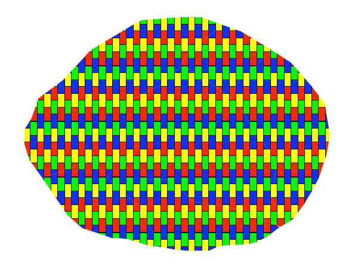
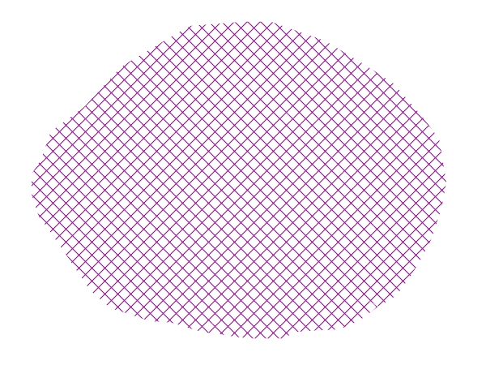
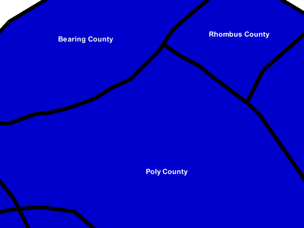
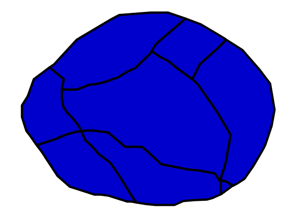
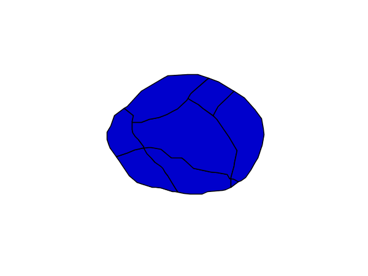

.. _sld_cookbook_polygons:

Polygons
========

Polygons are two dimensional shapes that contain both an outer edge (or "stroke") and an inside (or "fill").  A polygon can be thought of as an irregularly-shaped point and is styled in similar ways to points.

.. warning:: The code examples shown on this page are **not the full SLD code**, as they omit the SLD header and footer information for the sake of brevity.  Please use the links to download the full SLD for each example.

.. _sld_cookbook_polygons_attributes:

Example polygons layer
----------------------

The :download:`polygons layer <artifacts/sld_cookbook_polygon.zip>` used below contains county information for a fictional country. For reference, the attribute table for the polygons is included below.

.. list-table::
   :widths: 30 40 30

   * - **fid** (Feature ID)
     - **name** (County name)
     - **pop** (Population)
   * - polygon.1
     - Irony County
     - 412234
   * - polygon.2
     - Tracker County
     - 235421
   * - polygon.3
     - Dracula County
     - 135022
   * - polygon.4
     - Poly County
     - 1567879
   * - polygon.5
     - Bearing County
     - 201989
   * - polygon.6
     - Monte Cristo County
     - 152734
   * - polygon.7
     - Massive County
     - 67123
   * - polygon.8
     - Rhombus County
     - 198029

:download:`Download the polygons shapefile <artifacts/sld_cookbook_polygon.zip>`

.. _sld_cookbook_polygons_simplepolygon:

Simple polygon
--------------

This example shows a polygon filled in blue.

.. figure:: images/polygon_simplepolygon.png
   :align: center

   *Simple polygon*

Code
~~~~

:download:`View and download the full "Simple polygon" SLD <artifacts/polygon_simplepolygon.sld>`

.. code-block:: xml 
   :linenos:

      <FeatureTypeStyle>
        <Rule>
          <PolygonSymbolizer>
            <Fill>
              <CssParameter name="fill">#000080</CssParameter>
            </Fill>
          </PolygonSymbolizer>
        </Rule>
      </FeatureTypeStyle>

Details
~~~~~~~

There is one ``<Rule>`` in one ``<FeatureTypeStyle>`` for this style, which is the simplest possible situation.  (All subsequent examples will share this characteristic unless otherwise specified.)  Styling polygons is accomplished via the ``<PolygonSymbolizer>`` (**lines 3-7**). **Line 5** specifies dark blue (``#000080``) as the polygon's fill color.

.. note::  The light-colored borders around the polygons in the figure are artifacts of the renderer caused by the polygons being adjacent. There is no border in this style.

.. _sld_cookbook_polygons_simplepolygonwithstroke:

Simple polygon with stroke
--------------------------

This example adds a 2 pixel white stroke to the :ref:`sld_cookbook_polygons_simplepolygon` example.

.. figure:: images/polygon_simplepolygonwithstroke.png
   :align: center

   *Simple polygon with stroke*

Code
~~~~

:download:`View and download the full "Simple polygon with stroke" SLD <artifacts/polygon_simplepolygonwithstroke.sld>`

.. code-block:: xml 
   :linenos:

      <FeatureTypeStyle>
        <Rule>
          <PolygonSymbolizer>
            <Fill>
              <CssParameter name="fill">#000080</CssParameter>
            </Fill>
            <Stroke>
              <CssParameter name="stroke">#FFFFFF</CssParameter>
              <CssParameter name="stroke-width">2</CssParameter>
            </Stroke>
          </PolygonSymbolizer>
        </Rule>
      </FeatureTypeStyle>

Details
~~~~~~~

This example is similar to the :ref:`sld_cookbook_polygons_simplepolygon` example above, with the addition of the ``<Stroke>`` tag (**lines 7-10**).  **Line 8** sets the color of stroke to white (``#FFFFFF``) and **line 9** sets the width of the stroke to 2 pixels.

Transparent polygon
-------------------

This example builds on the :ref:`sld_cookbook_polygons_simplepolygonwithstroke` example and makes the fill partially transparent by setting the opacity to 50%.

.. figure:: images/polygon_transparentpolygon.png
   :align: center

   *Transparent polygon*

Code
~~~~

:download:`View and download the full "Transparent polygon" SLD <artifacts/polygon_transparentpolygon.sld>`

.. code-block:: xml 
   :linenos:

      <FeatureTypeStyle>
        <Rule>
          <PolygonSymbolizer>
            <Fill>
              <CssParameter name="fill">#000080</CssParameter>
              <CssParameter name="fill-opacity">0.5</CssParameter>
            </Fill>
            <Stroke>
              <CssParameter name="stroke">#FFFFFF</CssParameter>
              <CssParameter name="stroke-width">2</CssParameter>
            </Stroke>
          </PolygonSymbolizer>
        </Rule>
      </FeatureTypeStyle>

Details
~~~~~~~

This example is similar to the :ref:`sld_cookbook_polygons_simplepolygonwithstroke` example, save for defining the fill's opacity in **line 6**. The value of 0.5 results in partially transparent fill that is 50% opaque.  An opacity value of 1 would draw the fill as 100% opaque, while an opacity value of 0 would result in a completely transparent (0% opaque) fill.  In this example, since the background is white, the dark blue looks lighter.  Were the points imposed on a dark background, the resulting color would be darker.

.. _sld_cookbook_polygons_offset:

Offset inner lines
------------------

Shows how to draw inner buffer lines inside a polygon.

.. figure:: images/polygon_offset.png
   :align: center

   *Offset buffer*

Code
~~~~

:download:`View and download the full "Inner offset lines" SLD <artifacts/polygon_offset.sld>`

.. code-block:: xml 
   :linenos:

      <FeatureTypeStyle>
        <Rule>
          <PolygonSymbolizer>
            <Stroke>
              <CssParameter name="stroke">#000000</CssParameter>
              <CssParameter name="stroke-width">2</CssParameter> 
            </Stroke>
          </PolygonSymbolizer>
          <LineSymbolizer>
            <Stroke>
              <CssParameter name="stroke">#AAAAAA</CssParameter>
              <CssParameter name="stroke-width">3</CssParameter>
            </Stroke>
            <PerpendicularOffset>-2</PerpendicularOffset>
          </LineSymbolizer>
        </Rule>
      </FeatureTypeStyle>

Details
~~~~~~~

This example is similar to the :ref:`sld_cookbook_polygons_simplepolygonwithstroke` example, save 
for defining adding a ``<LineSymbolizer>>`` at **line 9**, where a light gray (**line 11**) 
3 pixels wide (**line 12**) line is drawn as a inner buffer inside the polygon.
**Line 14** controls the buffering distance, setting a inner buffer of 2 pixels.   

.. _sld_cookbook_polygons_graphicfill:

Graphic fill
------------

This example fills the polygons with a tiled graphic.

   *Graphic fill*

Code
~~~~

:download:`View and download the full "Graphic fill" SLD <artifacts/polygon_graphicfill.sld>`

.. code-block:: xml 
   :linenos:

      <FeatureTypeStyle>
        <Rule>
          <PolygonSymbolizer>
            <Fill>
              <GraphicFill>
                <Graphic>
                  <ExternalGraphic>
                    <OnlineResource
                      xlink:type="simple"
                      xlink:href="colorblocks.png" />
                    <Format>image/png</Format>
                  </ExternalGraphic>
                <Size>93</Size>
                </Graphic>
              </GraphicFill>
            </Fill>
          </PolygonSymbolizer>
        </Rule>
      </FeatureTypeStyle>

Details
~~~~~~~

This style fills the polygon with a tiled graphic. This is known as an ``<ExternalGraphic>`` in SLD, to distinguish it from commonly-used shapes such as squares and circles that are "internal" to the renderer. **Lines 7-12** specify details for the graphic, with **line 10** setting the path and file name of the graphic and **line 11** indicating the file format (MIME type) of the graphic (``image/png``).  Although a full URL could be specified if desired, no path information is necessary in **line 11** because this graphic is contained in the same directory as the SLD. **Line 13** determines the height of the displayed graphic in pixels; if the value differs from the height of the graphic then it will be scaled accordingly while preserving the aspect ratio.

.. figure:: images/colorblocks.png
   :align: center

   *Graphic used for fill*

Hatching fill
-------------

This example fills the polygons with a hatching pattern.

.. note:: This example leverages an SLD extension in GeoServer.  Hatching is not part of the standard SLD 1.0 specification.

   *Hatching fill*

Code
~~~~

:download:`View and download the full "Hatching fill" SLD <artifacts/polygon_hatchingfill.sld>`

.. code-block:: xml 
   :linenos:

      <FeatureTypeStyle>
        <Rule>
          <PolygonSymbolizer>
            <Fill>
              <GraphicFill>
                <Graphic>
                  <Mark>
                    <WellKnownName>shape://times</WellKnownName>
                    <Stroke>
                      <CssParameter name="stroke">#990099</CssParameter>
                      <CssParameter name="stroke-width">1</CssParameter>
                    </Stroke>
                  </Mark>
                  <Size>16</Size>
                </Graphic>
              </GraphicFill>
            </Fill>
          </PolygonSymbolizer>
        </Rule>
      </FeatureTypeStyle>

Details
~~~~~~~

In this example, there is a ``<GraphicFill>`` tag as in the :ref:`sld_cookbook_polygons_graphicfill` example, but a ``<Mark>`` (**lines 7-13**) is used instead of an ``<ExternalGraphic>``. **Line 8** specifies a "times" symbol (an "x") be tiled throughout the polygon. **Line 10** sets the color to purple (``#990099``), **line 11** sets the width of the hatches to 1 pixel, and **line 14** sets the size of the tile to 16 pixels. Because hatch tiles are always square, the ``<Size>`` sets both the width and the height.

.. _sld_cookbook_polygons_polygonwithdefaultlabel:

Polygon with default label
--------------------------

This example shows a text label on the polygon.  In the absence of any other customization, this is how a label will be displayed.

.. figure:: images/polygon_polygonwithdefaultlabel.png
   :align: center

   *Polygon with default label*

Code
~~~~

:download:`View and download the full "Polygon with default label" SLD <artifacts/polygon_polygonwithdefaultlabel.sld>`

.. code-block:: xml 
   :linenos:

      <FeatureTypeStyle>
        <Rule>
          <PolygonSymbolizer>
            <Fill>
              <CssParameter name="fill">#40FF40</CssParameter>
            </Fill>
            <Stroke>
              <CssParameter name="stroke">#FFFFFF</CssParameter>
              <CssParameter name="stroke-width">2</CssParameter>
            </Stroke>
          </PolygonSymbolizer>        
          <TextSymbolizer>
            <Label>
              <ogc:PropertyName>name</ogc:PropertyName>
            </Label>            
          </TextSymbolizer>
        </Rule>
      </FeatureTypeStyle>

Details
~~~~~~~

In this example there is a ``<PolygonSymbolizer>`` and a ``<TextSymbolizer>``.  **Lines 3-11** comprise the ``<PolygonSymbolizer>``.  The fill of the polygon is set on **line 5** to a light green (``#40FF40``) while the stroke of the polygon is set on **lines 8-9** to white (``#FFFFFF``) with a thickness of 2 pixels. The label is set in the ``<TextSymbolizer>`` on **lines 12-16**, with **line 14** determining what text to display, in this case the value of the "name" attribute.  (Refer to the attribute table in the :ref:`sld_cookbook_polygons_attributes` section if necessary.)  All other details about the label are set to the renderer default, which here is Times New Roman font, font color black, and font size of 10 pixels.

Label halo
----------

This example alters the look of the :ref:`sld_cookbook_polygons_polygonwithdefaultlabel` by adding a white halo to the label.

.. figure:: images/polygon_labelhalo.png
   :align: center

   *Label halo*

Code
~~~~

:download:`View and download the full "Label halo" SLD <artifacts/polygon_labelhalo.sld>`

.. code-block:: xml 
   :linenos:

      <FeatureTypeStyle>
        <Rule>
          <PolygonSymbolizer>
            <Fill>
              <CssParameter name="fill">#40FF40</CssParameter>
            </Fill>
            <Stroke>
              <CssParameter name="stroke">#FFFFFF</CssParameter>
              <CssParameter name="stroke-width">2</CssParameter>
            </Stroke>
          </PolygonSymbolizer>        
          <TextSymbolizer>
            <Label>
              <ogc:PropertyName>name</ogc:PropertyName>
            </Label>
            <Halo>
              <Radius>3</Radius>
              <Fill>
                <CssParameter name="fill">#FFFFFF</CssParameter>
              </Fill>
            </Halo>
          </TextSymbolizer>
        </Rule>
      </FeatureTypeStyle>

Details
~~~~~~~

This example is similar to the :ref:`sld_cookbook_polygons_polygonwithdefaultlabel`, with the addition of a halo around the labels on **lines 16-21**.  A halo creates a color buffer around the label to improve label legibility.  **Line 17** sets the radius of the halo, extending the halo 3 pixels around the edge of the label, and **line 19** sets the color of the halo to white (``#FFFFFF``). Since halos are most useful when set to a sharp contrast relative to the text color, this example uses a white halo around black text to ensure optimum readability.

.. _sld_cookbook_polygons_polygonwithstyledlabel:

Polygon with styled label
-------------------------

This example improves the label style from the :ref:`sld_cookbook_polygons_polygonwithdefaultlabel` example by centering the label on the polygon, specifying a different font name and size, and setting additional label placement optimizations.

.. note:: The label placement optimizations discussed below (the ``<VendorOption>`` tags) are SLD extensions that are custom to GeoServer.  They are not part of the SLD 1.0 specification.

.. figure:: images/polygon_polygonwithstyledlabel.png
   :align: center

   *Polygon with styled label*

Code
~~~~

:download:`View and download the full "Polygon with styled label" SLD <artifacts/polygon_polygonwithstyledlabel.sld>`

.. code-block:: xml 
   :linenos:

      <FeatureTypeStyle>
        <Rule>
          <PolygonSymbolizer>
            <Fill>
              <CssParameter name="fill">#40FF40</CssParameter>
            </Fill>
            <Stroke>
              <CssParameter name="stroke">#FFFFFF</CssParameter>
              <CssParameter name="stroke-width">2</CssParameter>
            </Stroke>
          </PolygonSymbolizer>        
          <TextSymbolizer>
            <Label>
              <ogc:PropertyName>name</ogc:PropertyName>
            </Label>
            
              <CssParameter name="font-family">Arial</CssParameter>
              <CssParameter name="font-size">11</CssParameter>
              <CssParameter name="font-style">normal</CssParameter>
              <CssParameter name="font-weight">bold</CssParameter>
            
            <LabelPlacement>
              <PointPlacement>
                <AnchorPoint>
                  <AnchorPointX>0.5</AnchorPointX>
                  <AnchorPointY>0.5</AnchorPointY>
                </AnchorPoint>
              </PointPlacement>
            </LabelPlacement>
            <Fill>
              <CssParameter name="fill">#000000</CssParameter>
            </Fill>
            <VendorOption name="autoWrap">60</VendorOption>
            <VendorOption name="maxDisplacement">150</VendorOption>
          </TextSymbolizer>
        </Rule>
      </FeatureTypeStyle>

Details
~~~~~~~

This example is similar to the :ref:`sld_cookbook_polygons_polygonwithdefaultlabel` example, with additional styling options within the ``<TextSymbolizer>`` on lines **12-35**. **Lines 16-21** set the font styling. **Line 17** sets the font family to be Arial, **line 18** sets the font size to 11 pixels, **line 19** sets the font style to "normal" (as opposed to "italic" or "oblique"), and **line 20** sets the font weight to "bold" (as opposed to "normal").

The ``<LabelPlacement>`` tag on **lines 22-29** affects where the label is placed relative to the centroid of the polygon. **Line 21** centers the label by positioning it 50% (or 0.5) of the way horizontally along the centroid of the polygon. **Line 22** centers the label vertically in exactly the same way.

Finally, there are two added touches for label placement optimization: **line 33** ensures that long labels are split across multiple lines by setting line wrapping on the labels to 60 pixels, and **line 34** allows the label to be displaced by up to 150 pixels. This ensures that labels are compacted and less likely to spill over polygon boundaries. Notice little Massive County in the corner, whose label is now displayed." 

Attribute-based polygon
-----------------------

This example styles the polygons differently based on the "pop" (Population) attribute.

.. figure:: images/polygon_attributebasedpolygon.png
   :align: center

   *Attribute-based polygon*

Code
~~~~

:download:`View and download the full "Attribute-based polygon" SLD <artifacts/polygon_attributebasedpolygon.sld>`

.. code-block:: xml 
   :linenos:

      <FeatureTypeStyle>
        <Rule>
          <Name>SmallPop</Name>
          <Title>Less Than 200,000</Title>
          <ogc:Filter>
            <ogc:PropertyIsLessThan>
              <ogc:PropertyName>pop</ogc:PropertyName>
              <ogc:Literal>200000</ogc:Literal>
            </ogc:PropertyIsLessThan>
          </ogc:Filter>
          <PolygonSymbolizer>
            <Fill>
              <CssParameter name="fill">#66FF66</CssParameter>
            </Fill>
          </PolygonSymbolizer>
        </Rule>
        <Rule>
          <Name>MediumPop</Name>
          <Title>200,000 to 500,000</Title>
          <ogc:Filter>
            <ogc:And>
              <ogc:PropertyIsGreaterThanOrEqualTo>
                <ogc:PropertyName>pop</ogc:PropertyName>
                <ogc:Literal>200000</ogc:Literal>
              </ogc:PropertyIsGreaterThanOrEqualTo>
              <ogc:PropertyIsLessThan>
                <ogc:PropertyName>pop</ogc:PropertyName>
                <ogc:Literal>500000</ogc:Literal>
              </ogc:PropertyIsLessThan>
            </ogc:And>
          </ogc:Filter>
          <PolygonSymbolizer>
            <Fill>
              <CssParameter name="fill">#33CC33</CssParameter>
            </Fill>
          </PolygonSymbolizer>
        </Rule>
        <Rule>
          <Name>LargePop</Name>
          <Title>Greater Than 500,000</Title>
          <ogc:Filter>
            <ogc:PropertyIsGreaterThan>
              <ogc:PropertyName>pop</ogc:PropertyName>
              <ogc:Literal>500000</ogc:Literal>
            </ogc:PropertyIsGreaterThan>
          </ogc:Filter>
          <PolygonSymbolizer>
            <Fill>
              <CssParameter name="fill">#009900</CssParameter>
            </Fill>
          </PolygonSymbolizer>
        </Rule>
      </FeatureTypeStyle>

Details
~~~~~~~

.. note:: Refer to the :ref:`sld_cookbook_polygons_attributes` to see the attributes for the layer.  This example has eschewed labels in order to simplify the style, but you can refer to the example :ref:`sld_cookbook_polygons_polygonwithstyledlabel` to see which attributes correspond to which polygons.

Each polygon in our fictional country has a population that is represented by the population ("pop") attribute. This style contains three rules that alter the fill based on the value of "pop" attribute, with smaller values yielding a lighter color and larger values yielding a darker color.

The three rules are designed as follows:

.. list-table::
   :widths: 20 20 30 30

   * - **Rule order**
     - **Rule name**
     - **Population** ("pop")
     - **Color**
   * - 1
     - SmallPop
     - Less than 200,000
     - ``#66FF66``
   * - 2
     - MediumPop
     - 200,000 to 500,000
     - ``#33CC33``
   * - 3
     - LargePop
     - Greater than 500,000
     - ``#009900``

The order of the rules does not matter in this case, since each shape is only rendered by a single rule.

The first rule, on **lines 2-16**, specifies the styling of polygons whose population attribute is less than 200,000.  **Lines 5-10** set this filter, with **lines 6-9** setting the "less than" filter, **line 7** denoting the attribute ("pop"), and **line 8** the value of 200,000.  The color of the polygon fill is set to a light green (``#66FF66``) on **line 13**.

The second rule, on **lines 17-37**, is similar, specifying a style for polygons whose population attribute is greater than or equal to 200,000 but less than 500,000.  The filter is set on **lines 20-31**.  This filter is longer than in the first rule because two criteria need to be specified instead of one: a "greater than or equal to" and a "less than" filter.  Notice the ``And`` on **line 21** and **line 30**.  This mandates that both filters need to be true for the rule to be applicable.  The color of the polygon fill is set to a medium green on (``#33CC33``) on **line 34**.

The third rule, on **lines 38-52**, specifies a style for polygons whose population attribute is greater than or equal to 500,000.  The filter is set on **lines 41-46**.  The color of the polygon fill is the only other difference in this rule, which is set to a dark green (``#009900``) on **line 49**.

Zoom-based polygon
------------------

This example alters the style of the polygon at different zoom levels.

   *Zoom-based polygon: Zoomed in*

   *Zoom-based polygon: Partially zoomed*

   *Zoom-based polygon: Zoomed out*

Code
~~~~

:download:`View and download the full "Zoom-based polygon" SLD <artifacts/polygon_zoombasedpolygon.sld>`

.. code-block:: xml 
   :linenos:

      <FeatureTypeStyle>
        <Rule>
          <Name>Large</Name>
          <MaxScaleDenominator>100000000</MaxScaleDenominator>
          <PolygonSymbolizer>
            <Fill>
              <CssParameter name="fill">#0000CC</CssParameter>
            </Fill>
            <Stroke>
              <CssParameter name="stroke">#000000</CssParameter>
              <CssParameter name="stroke-width">7</CssParameter>
            </Stroke>
          </PolygonSymbolizer>
          <TextSymbolizer>
            <Label>
              <ogc:PropertyName>name</ogc:PropertyName>
            </Label>  
            
              <CssParameter name="font-family">Arial</CssParameter>
              <CssParameter name="font-size">14</CssParameter>
              <CssParameter name="font-style">normal</CssParameter>
              <CssParameter name="font-weight">bold</CssParameter>
            
            <LabelPlacement>
              <PointPlacement>
                <AnchorPoint>
                  <AnchorPointX>0.5</AnchorPointX>
                  <AnchorPointY>0.5</AnchorPointY>
                </AnchorPoint>
              </PointPlacement>
            </LabelPlacement>
            <Fill>
              <CssParameter name="fill">#FFFFFF</CssParameter>
            </Fill>
          </TextSymbolizer>
        </Rule>
        <Rule>
          <Name>Medium</Name>
          <MinScaleDenominator>100000000</MinScaleDenominator>
          <MaxScaleDenominator>200000000</MaxScaleDenominator>
          <PolygonSymbolizer>
            <Fill>
              <CssParameter name="fill">#0000CC</CssParameter>
            </Fill>
            <Stroke>
              <CssParameter name="stroke">#000000</CssParameter>
              <CssParameter name="stroke-width">4</CssParameter>
            </Stroke>
          </PolygonSymbolizer>
        </Rule>
        <Rule>
          <Name>Small</Name>
          <MinScaleDenominator>200000000</MinScaleDenominator>
          <PolygonSymbolizer>
            <Fill>
              <CssParameter name="fill">#0000CC</CssParameter>
            </Fill>
            <Stroke>
              <CssParameter name="stroke">#000000</CssParameter>
              <CssParameter name="stroke-width">1</CssParameter>
            </Stroke>
          </PolygonSymbolizer>
        </Rule>
      </FeatureTypeStyle>

Details
~~~~~~~

It is often desirable to make shapes larger at higher zoom levels when creating a natural-looking map. This example varies the thickness of the lines according to the zoom level. Polygons already do this by nature of being two dimensional, but another way to adjust styling of polygons based on zoom level is to adjust the thickness of the stroke (to be larger as the map is zoomed in) or to limit labels to only certain zoom levels. This is ensures that the size and quantity of strokes and labels remains legible and doesn't overshadow the polygons themselves.

Zoom levels (or more accurately, scale denominators) refer to the scale of the map. A scale denominator of 10,000 means the map has a scale of 1:10,000 in the units of the map projection.

.. note:: Determining the appropriate scale denominators (zoom levels) to use is beyond the scope of this example.

This style contains three rules, defined as follows:

.. list-table::
   :widths: 15 15 40 15 15

   * - **Rule order**
     - **Rule name**
     - **Scale denominator**
     - **Stroke width**
     - **Label display?**
   * - 1
     - Large
     - 1:100,000,000 or less
     - 7
     - Yes
   * - 2
     - Medium
     - 1:100,000,000 to 1:200,000,000
     - 4
     - No
   * - 3
     - Small
     - Greater than 1:200,000,000
     - 2
     - No

The first rule, on **lines 2-36**, is for the smallest scale denominator, corresponding to when the view is "zoomed in".  The scale rule is set on **line 40** such that the rule will apply only where the scale denominator is 100,000,000 or less. **Line 7** defines the fill as blue (``#0000CC``).  Note that the fill is kept constant across all rules regardless of the scale denominator.  As in the :ref:`sld_cookbook_polygons_polygonwithdefaultlabel` or :ref:`sld_cookbook_polygons_polygonwithstyledlabel` examples, the rule also contains a ``<TextSymbolizer>`` at **lines 14-35** for drawing a text label on top of the polygon.  **Lines 19-22** set the font information to be Arial, 14 pixels, and bold with no italics.  The label is centered both horizontally and vertically along the centroid of the polygon on by setting ``<AnchorPointX>`` and ``<AnchorPointY>`` to both be 0.5 (or 50%) on **lines 27-28**.  Finally, the color of the font is set to white (``#FFFFFF``) in **line 33**.

The second rule, on **lines 37-50**, is for the intermediate scale denominators, corresponding to when the view is "partially zoomed".  The scale rules on **lines 39-40** set the rule such that it will apply to any map with a scale denominator between 100,000,000 and 200,000,000.  (The ``<MinScaleDenominator>`` is inclusive and the ``<MaxScaleDenominator>`` is exclusive, so a zoom level of exactly 200,000,000 would *not* apply here.)  Aside from the scale, there are two differences between this rule and the first: the width of the stroke is set to 4 pixels on **line 47** and a ``<TextSymbolizer>`` is not present so that no labels will be displayed.

The third rule, on **lines 51-63**, is for the largest scale denominator, corresponding to when the map is "zoomed out".  The scale rule is set on **line 53** such that the rule will apply to any map with a scale denominator of 200,000,000 or greater. Again, the only differences between this rule and the others are the width of the lines, which is set to 1 pixel on **line 60**, and the absence of a ``<TextSymbolizer>`` so that no labels will be displayed.

The resulting style produces a polygon stroke that gets larger as one zooms in and labels that only display when zoomed in to a sufficient level.